<!-- Development > Job types > Data Services -->

## 21. Data Services

### Data Services introduction

**Data Services** allow deploying/publishing data or exposing a data transformation in the form of REST API. The logic of the service is implemented using a **CloverDX** graph which has a full access to HTTP context of the rest call: incoming data, request parameters and headers. Service can respond with data, response HTTP headers and status codes. All of this is in direct control of the service developer.

Data Services are optimized to respond with JSON and XML payloads which are the most common in REST, but developers may use arbitrary response payload formats as well.

Some scenarios where Data Service can be helpful:

- Create a REST API as a 'wrapper' for a legacy system that lacks API, while using **CloverDX** logic to retrieve data from the system’s underlying database structures;
- Create a single collection endpoint. Clients can upload data to the REST endpoint, while **CloverDX** logic validates incoming data and stores it to a database or broadcasts it to other systems.
- Creating a backend REST service for a JavaScript framework like React, AngularJS or JQuery library. Under Ajax web development techniques, the JavaScript in frontend requests data asynchronously from RESTful backend services, typically responding with JSON payloads which are easy to parse and process in JavaScript.

**Data Service** is available since **CloverETL 4.7.0-M1**.

### Architecture

Data Services are **self-contained**; the full service definition is stored in a single file carrying `.rjob` extension.

The service definition is composed of graph logic implementing the service and the configuration of its REST endpoint.

By default, the files reside in the `${PROJECT}/data-service` subdirectory.

Data Services support HTTP methods: GET, POST, PUT, PATCH and DELETE.

### Development
> [!TIP]
> If you’re interested in learning more about this subject, we offer the [Building APIs course](https://academy.cloverdx.com/courses/building-data-apis) in our CloverDX Academy.

#### Data Service job editor

Data Service editor contains three tabs (located at the bottom section of the editor):

- [Endpoint configuration](data-service.md#endpoint-configuration): configuration of service endpoint, service deployment controls;
- [Data Service REST job logic](data-service.md#data-service-rest-job-logic): logic of the service, implemented as a **CloverDX** graph;
- Source: XML source code of the job logic and endpoint configuration.

##### Endpoint configuration

Contains configuration of the REST endpoint: job name, URL, HTTP methods that this endpoint will respond to, and a category.

When connected to a Server sandbox, the Endpoint Configuration shows the current status of service deployment. The service will respond to incoming requests only when it is in the **published** state.

Data Service jobs can be published directly from Designer if connected to a Server sandbox.

**Designer** will attempt to redeploy the service whenever the job or the endpoint configuration is changed. The redeployment happens when you save changes in the job; however, the deployment may fail if the configuration is invalid.

Due to potential failures, the automatic redeployment of the service is useful mostly during development, when changes to the jobs are frequent and you want to quickly test the service behavior. In production environment, it is recommended to upload the service `.rjob` files to the Server sandbox and deploy the service using **CloverDX Server** management console instead. This way, you can make sure it has been deployed correctly.

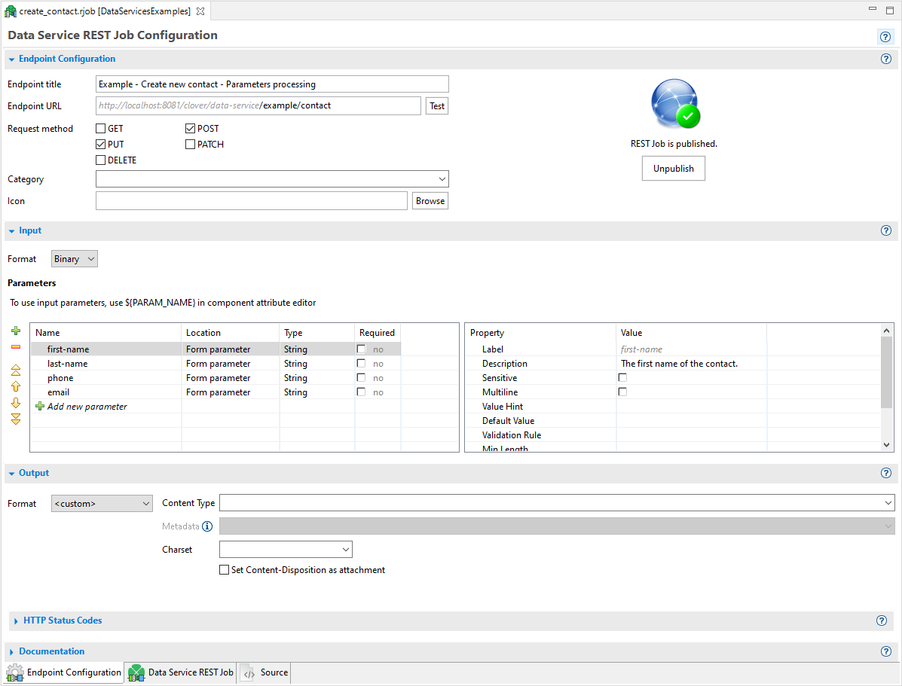
*Figure 183. Main .rjob editor*

| Endpoint configuration |  |
| --- | --- |
| Endpoint name | Title of a job. It should be a human-readable title. Displayed in a documentation and user interface. |
| Endpoint URL | A URL of a REST job endpoint where it listens for connections. The grayed part cannot be changed. It is automatically derived from a CloverDX Server URL and (optionally) sandbox specific prefix. The prefix can be defined by a sandbox level property "data_service_base_path". See [Execution properties](../operations/sandboxes.md#execution-properties) for its description and usage.  The URL may contain a specification of path parameters using a `{param_name}` syntax.  **Since version 5.1** you can use regular expressions for matching path parameters in URLs, for example: use `{param_name:.+}`(e.g. `{filename:.+}`) for the parameter to accept any character.  **Note:** unless you use the regular expression above, parameters are not matched if the value contains `/` (slash). |
| Request method | The list of HTTP methods this endpoint will respond to.  If client uses an HTTP method unsupported by the endpoint, they receive a response code: 404 - Not found. |
| Category | The category is used in the Data Apps catalog to group related services. Only published services with the Data App feature enabled are visible in the catalog. |
| Icon | The image referenced by this optional parameter is used in Data Apps catalog for better orientation in the list of all available Data Apps. |

 

| Input |  |
| --- | --- |
| **Specification of request body format.** |  |
| Format | Expected format of request body. Binary, String or JSON.  JSON is the default for newly created REST jobs since 5.12.  "Binary" streams the request body in chunks for further processing with an arbitrary reader component.  "String" returns the whole request body as a single string.  "JSON" parses the request body as a JSON document into a variant data field for further processing with CTL functions. |
| **Specification of input HTTP parameters.** |  |
| Name | Name of the parameter |
| Location | Path parameter or Query parameter |
| Type | The type of data accepted by this parameter. Type conversion happens automatically if there is an edge connected to the Parameters output port of the Rest Job Input component. See [Input and Output components](data-service.md#input-and-output-components). |
| Required | Data Service job automatically validates the presence of required parameters. If any of the required parameters are missing, the result is Invalid request. |
| Label | The label used in Data App form. |
| Description | Human-readable description of the parameter. Will be displayed in a service documentation. |
| Sensitive | Marking the parameter sensitive will cause the value of the parameter to be redacted from logs. |
| Value Hint | Placeholder text used in the Data App form. |
| Default Value | Default value of the parameter. It is not used if parameter is marked as required. |
| Values | The specific property for the enumeration parameter.  Defines static values of the parameter. |
| Dynamic Values | The specific property for the enumeration parameter.  The endpoint of a Data Service from which the values will be obtained when the Data App form renders during the app load. The obtained values will overwrite the ones from the Values property. The endpoint must support the GET method and it must be hosted on the same server as the Data App. If the sandbox is connected to the server, a list of published Data Services is offered. The response of the endpoint must be a JSON.  The example of two possible JSON formats:   ```json [     {         "value": "v1",         "label": "Label 1"     },     {         "value": "v2",         "hint": ""     } ] ```   or   ```json {     "customMetadataName": [         {             "value": "v1",             "label": "Label 1"         },         {             "value": "v2",             "hint": ""         },         {             "value": "v3",             "label": "Label 3",             "hint": ""         }     ] } ```   The `value` field is required, `label` is optional, other fields are skipped.  The endpoints with SSL configuration should be defined this way: `{HTTPS_connector_name}:/{endpoint}`.  An example of endpoint with SSL configuration: `httpsConnector:/data_service_endpoint`.  An example of endpoint without SSL configuration: `/data_service_endpoint`. |

 

| Output |  |
| --- | --- |
| **Specification of a response format and HTTP status codes. See the Generating response content section for more details about the output.** |  |
| Format | One of data formats for automatic serialization (JSON, XML, CSV), “Custom” for [Custom serialization](data-service.md#custom-serialization) or "File" for [Using static file as response](data-service.md#using-static-file-as-response). |
| JSON-specific settings | Additional settings for JSON payloads, affecting the formatting; can be used to simplify the parsing of the response on the consumer side for typical payloads:  **Do not write metadata name** causes the JSON formatter to omit the top-level object and only send an anonymous array instead. Use this option when your REST response contains only one type of record (metadata), i.e. when you connected edge to only single port on the response component.  **Do not write top level array** omits the top-level array and generates only a single object. Enable this option for services that return only single output record. The graph will fail, if the option is enabled and multiple output records arrive.  Both options simplify the output and make it easier to parse. |
| Default Response | HTTP status code and reason phrase. *Success* is returned after the job finishes, *Invalid Request* is returned in the case of a missing required parameter, *Error* is returned in the case of any other failure.  Default success status code is 200. It is recommended to use more specific status codes based on the functionality of your job. For example 201 - Created, 202 - Accepted or 204 - No content.  Error responses are described in section [Exceptions and Error Handling](data-service.md#exceptions-and-error-handling).  Note: Using the [setResponseStatus](http-ctl2.html#id_ctl2_setresponsestatus) CTL function in any of the job’s components overrides the default response status code with a code specified in the function. |
| Response example | Displayed after clicking on the link “Show response example”.  Shows an artificial example response and how it is affected when additional JSON formatting options are enabled. |

 

| Documentation |
| --- |
| Documentation elements do not have any effect on the job functionality. **Description** and **Example endpoint output** are included in the generated service documentation to help consumers use your REST endpoint.  **Example endpoint output** is currently just a placeholder and is not reflected in the service documentation. |

###### Data Service REST Job Logic

Data Service REST Job tab displays the data transformation logic used to implement your service. The logic can use any of the **CloverDX** data transformation components as well as subgraphs.

###### LIMITATIONS

- It is not possible to access an HTTP request or service response from a subgraph, i.e. a subgraph cannot be used as a direct reader or writer in job logic. However, it can be used as a transforming component anywhere in the flow.
- Similarly, if you use Jobflow components like **ExecuteGraph** or **ExecuteJobflow** to launch a separate graph, the HTTP context will not be passed to the spawned child job.

#### Anatomy of Data Service jobs

| [Input and Output components](data-service.md#input-and-output-components) |
| --- |
| [HTTP request payload](data-service.md#http-request-payload) |
| [HTTP request parameters](data-service.md#http-request-parameters) |
| [HTTP headers](data-service.md#http-headers) |
| [HTTP response](data-service.md#http-response) |
| [Multiple edges](data-service.md#multiple-edges) |
| [HTTP status code and headers](data-service.md#http-status-code-and-headers) |

##### Input and Output components

The visually larger **Input** and **Output** components represent service’s HTTP request and response. You should place your service logic in between the two components.

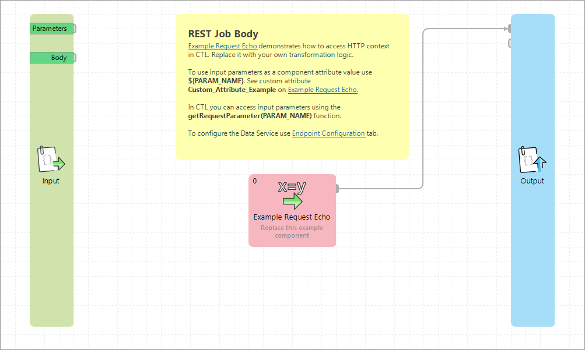

Input and Output are two special components of Data Service REST job. Their attribute editors allow alternative access to the REST endpoint input and output configuration eliminating the need to switch to the Endpoint Configuration tab.

The Input component can provide you with a binary stream of input data, or the whole request body as a string, or parse the payload as JSON into a variant data field.

If there is an edge connected to the parameters port, the Rest Job parameters are automatically parsed and converted to appropriate CTL2 types. Otherwise, conversion has to be done manually using the available conversion functions. See [CTL2 data types](language-reference-ctl2.md#data-types-in-ctl2) and [Conversion functions](conversion-functions-ctl2.md).

If the component reading the request body is in the lowest phase of the job, the same as the Input component, then the data can be read before the whole request body arrives. This is useful when the request body has a larger size and/or the network connection is slow. If the component reading the request body is not in the lowest phase of the job then the whole request body will be read and cached by the input component.

If you connect any edge to a port on the Output component, all records flowing through this edge will be used as a response payload. Before sending, the records are automatically serialized using one of the automatic serialization formats (JSON, XML or CSV) according to Endpoint Configuration.

For detailed information about data serialization, see the Generating response content section.

##### HTTP request payload

The execution of Data Service logic is triggered automatically by an HTTP request incoming to the service endpoint. The contents of an HTTP request can be accessed using CTL functions. Request payload and request parameters are also accessible in component attributes.

Payload incoming in the request can be accessed in three ways. One is by direct reading of an input stream using **request:body** as an input file URL of a reader component. If the request contains HTTP multipart message (e.g. multiple attachments), you can access individual payloads using **request:part:[part_name]** in the reader file URL.

Payload can also be accessed using the CTL function [getRequestBody](http-ctl2.html#id_ctl2_getrequestbody). The function however returns whole payload as string, so it is **not** recommended to use it for large payloads that may not fit into the memory.

**Note:** Payload stream can only be accessed once when accessed via **request:body** or **request:part:[part_name]**. A second attempt to parse the stream will cause a failure. By using the `getRequestBody()` CTL function, you may access the payload repeatedly, as the function will store the payload.

The third option is to connect an edge to the "Body" output port of the [REST Job Input component](data-service.md#input-and-output-components). The metadata of the edge will be automatically set depending on the selected [Input format](data-service.md#data-service-input-format):

- Binary: Streams the request body in chunks. Connect an arbitrary reader component and set the URL to `port:$0.body:stream`.
- String: Returns the whole request body as a single string.
- JSON: Parses the whole body as a JSON document into a
  [variant](language-reference-ctl2.md#variant) data field for processing with CTL functions. If the JSON payload doesn’t fit into memory, use
  [JSONExtract](jsonextract.md) with **request:body** URL instead.

###### Compatibility

Since CloverDX 5.12.0, "JSON" is pre-selected as the request body format for newly created Data Service REST Jobs. REST Jobs created in previous versions are not affected and will keep using the "Binary" request body format.

##### HTTP request parameters

Any HTTP request parameters will be automatically resolved as regular graph parameters. Use the standard **${PARAM}** notation when using them in component attributes or in your graph logic.

In the case of a name conflict, i.e. having both a regular graph parameter and an HTTP request parameter with identical name, use the request prefix to explicitly reference an HTTP request parameter, e.g. **${request.PARAM}**.

Parameters can also be accessed in CTL code using the [getRequestParameter](http-ctl2.html#id_ctl2_getrequestparameter) function. For multivalue parameters, use the [getRequestParameters(param_name)](http-ctl2.html#id_ctl2_getrequestparameters) function which returns a list of values.

###### Using the parameters

There are two approaches to use the parameters in Data Services: you can use the parameters values as data to be processed or as the configuration of the job.
Parameter values as configuration
If you intend to use a parameter value as a variable part of a graph configuration, use graph parameters directly in the attributes of components (e.g. File URL), in condition of the Filter component or in the CTL code.
Parameter values as data
If you intend to use parameter values as data to be processed, connect an edge to output port of the **RestJobInput** component and process records in the same way as you know from **CloverDX** graphs.

##### HTTP headers

HTTP headers can be accessed using the [getRequestHeader](http-ctl2.html#id_ctl2_getrequestheader) function. For multivalue headers, use the [*getRequestHeaders(header_name)*](http-ctl2.html#id_ctl2_getrequestheaders) function which returns a list of values for the given header.

Certain standard and commonly-used HTTP headers such as Content-Type or Encoding have dedicated convenience CTL functions: [getRequestEncoding](http-ctl2.html#id_ctl2_getrequestencoding) or [getRequestContentType](http-ctl2.html#id_ctl2_getrequestcontenttype).

For the full list of CTL functions providing access to HTTP request, see CTL [*function reference*](http-ctl2.html).

##### HTTP response

Data Service REST jobs come with automatic serialization into data formats commonly used with REST services: JSON, XML and CSV. (To use a different format or override automatic serialization, see [Custom serialization](data-service.md#custom-serialization).)

Records flowing through any edge connected to a port on the Output component in REST Job will be automatically serialized.

When a CSV serialization format is used, only one Output port can be connected, as all data must use the same metadata. If your graph logic has multiple edges, route all records into a single edge first before serialization, e.g. using the [SimpleGather](simplegather.md), [Concatenate](concatenate.md) or [Merge](merge.md) components.

Data Service automatically sets a Content-type response header based on a serialization format configured for the endpoint. The header is set to the following values:

- *application/json* for JSON serialization;
- *application/xml* for XML serialization;
- *text/csv* for CSV serialization;
- *application/octet-stream* for custom serialization (we recommend you override this).

JSON output format handles metadata with a single [variant](language-reference-ctl2.md#variant) data field in a special way. When there is just one incoming edge with one field of type variant, its content is converted to JSON and sent as the response, ignoring the configuration options below. This makes it easy to build your response as a variant and send it to the output, or to modify the request payload. See the "Processing JSON payload" example in Data Service Examples on the Server.

In other cases, there are additional options available for JSON serialization. These are included to simplify response parsing on the consumer side for common JSON responses:

Possible JSON configurations are:

| Settings | Example | Note |
| --- | --- | --- |
| Output format: JSON  No additional settings. | ```json {   "Books" : [ {     "Title" : "Moby Dick",     "Year" : 1851   }, {     "Title" : "Don Quixote",     "Year" : 1605   } ] } ``` | Example assumes two incoming data records (shown in pipe-delimited format here):   ``` Title \| Year Moby Dick \| 1851 Don Quixote \| 1605 ```   Notice the top-level JSON object named *books*. The object name is identical to metadata on the output edge.  Names of JSON attributes are derived from field names in record metadata.  The array under the top-level object allows sending arbitrary number of records, while preserving valid JSON structure. |
| Output format: JSON  with **Do not write metadata** enabled. | ```json {   "Title" : "Moby Dick",   "Year" : 1851 }, {   "Title" : "Don Quixote",   "Year" : 1605 } ] ``` | Omits the top-level JSON object.  Useful when a service returns only one single type of record, i.e. when only a single Output port is connected. |
| Output format: JSON.  with **Do not write metadata** enabled,  as well as **Do not write top level array** enabled. | ```json {   "Title" : "Moby Dick",   "Year" : 1851 } ``` | Skips the top level array. Returned JSON contains a single object with **CloverDX** record fields as attributes.  Can be used only for a single record produced on a single port.  Use this settings for services returning only a single record.  If enabled and multiple records arrive on the output edge, the Data Service execution terminates with an exception. |

##### Multiple Edges

If multiple ports on the Output component are connected to, the data from edges is concatenated (into a valid JSON or XML document) after serialization. Serialized data is appended to the response in increasing port order, i.e. all records from port 0 are serialized first, all records from port 1 are appended next, then port 2, etc.

| Edges | JSON output |
| --- | --- |
| Output format: JSON  Port 0 - Books:   ``` Title \| Year Moby Dick \| 1851 Don Quixote \| 1605 ```   Port 1 - Movies:   ``` Movie \| Director \| Revenue Blade Runner \| Ridley Scott \| 33.8 Terminator \| James Cameron \| 78.3 Kill Bill \| Quentin Tarantino \| 333.1 ``` | ```json {   "Books" : [ {     "Title" : "Moby Dick",     "Year" : 1851   }, {     "Title" : "Don Quixote",     "Year" : 1605   } ],   "Movies" : [ {     "Movie" : "Blade Runner",     "Director" : "Ridley Scott",     "Revenue" : 33.8   }, {     "Movie" : "Terminator",     "Director" : "James Cameron",     "Revenue" : 78.3   },  {     "Movie" : "Kill Bill",     "Director" : "Quentin Tarantino",     "Revenue" : 333.1   }  ] } ``` |

##### HTTP status code and headers

The service automatically sets HTTP response codes. Both default response codes and reason phrase are shown and can be modified in the Endpoint Configuration tab.

You can alternatively set your own - usually more granular - response status codes via CTL code anywhere in any of the job components via the [setResponseStatus](http-ctl2.html#id_ctl2_setresponsestatus) function.

Additional response headers can be set, or the default ones overridden, using [setResponseHeader](http-ctl2.html#id_ctl2_setresponseheader). It is possible to overwrite the value of the same header multiple times in the job as the final HTTP response (including headers) is transferred to the client only after all of job’s components have finished running.

#### Execution steps of Data Service jobs

The job logic is executed in several steps that you can use to your advantage when handling errors or implementing more complex logic.

Assuming automatic serialization, the steps are executed sequentially, the next step in sequence is executed only if the previous step has finished successfully:

1. Validate an incoming HTTP request and check if required parameters are present. Resolve graph parameters using incoming HTTP parameters.
2. Start job logic in order to process request payload and generate response payload, set an HTTP status code and headers.
3. Build an HTTP response, set the final HTTP status code, headers, serialize response payload and transfer the HTTP response back to the caller.

#### Exceptions and error handling

Data Service job automatically validates required parameters, if any. In the case of a missing required parameter (status code 400 by default), it returns a status code and reason phrase specified for *Invalid request*.

Any other failure during graph execution results in an error response - status code 500 by default and *"Job execution failed"*.

You can override default status codes for predefined states: *Success*, *Invalid request* or *Error state* in Endpoint Configuration.

It is also possible to use more specific status codes to provide more precise information about the error, if needed. In such a case, use the **setResponseStatus()** CTL function. Status code specified using the CTL function will override status codes defined in Endpoint Configuration.

If you want to fail fast and in a controlled fashion while returning your on HTTP response code and message, use **setResponseStatus(code, message)**, then terminate the processing using a standard **raiseError()** function.

Data Service generates built-in error status codes for various infrastructure problems.

If your consumers have difficulty connecting to your Data Service endpoints, i.e. you suspect they are not accessible or published correctly, check your application server access.log. For Tomcat, this is located at `${TOMCAT_HOME}/logs/localhost_access_log`.

#### Testing

| [Testing service logic in Designer](data-service.md#testing-service-logic-in-designer) |
| --- |
| [Testing services deployed on Server](data-service.md#testing-services-deployed-on-server) |

##### Testing service logic in Designer

You may want to test your service logic iteratively as you develop it in **CloverDX Designer**. It is possible to launch the logic and simulate an incoming request without publishing the logic to **CloverDX Server**.

Under **Run** ****Run Configurations…​** ****CloverDX Data Service REST Job** you can set incoming HTTP parameters, HTTP headers as well as request payload.

After executing the service, the HTTP response including the serialized payload will be shown in the job execution log, so you can inspect it in the Console window.

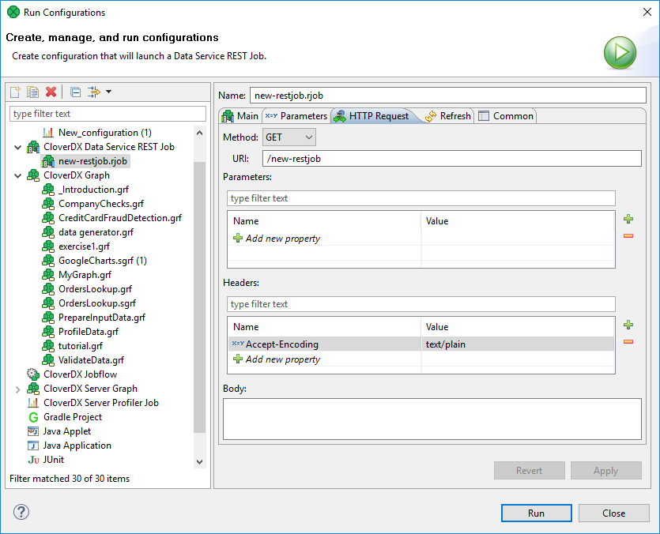
*Figure 184. Run configuration of Data Services*

The result of the test run can be seen in console in **Designer**.

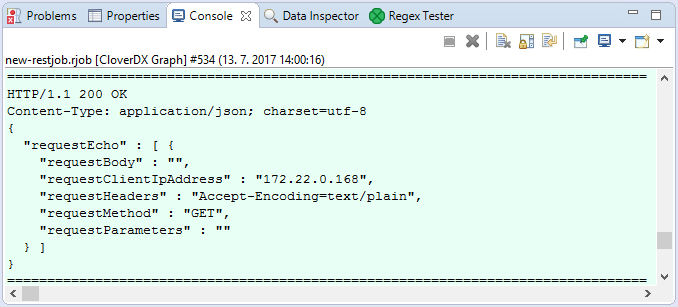
*Figure 185. Data Service test result in console*

##### Testing services deployed on Server

Once deployed, the service endpoint starts receiving requests so you can invoke it directly.
> [!IMPORTANT]
> Note that there is no ‘simulation’ mode available, incoming request will execute the live logic of the service.

###### From generated documentation

The automatically generated documentation of the service contains a **Try it out** button, which shows the web UI to test the service and will reflect required parameters and after invocation will parse the response and show all headers and status code returned.

If you want to simplify testing of the service for your endpoint consumers, it is advisable to include example input payloads or combination of parameters in the Documentation section of your service.

###### Testing using curl or wget

For quick and dirty tests, you can invoke the endpoint using `curl` or `wget` utilities.

The auto-generated documentation actually displays the correct curl command-line syntax after you test it using the **Try it out** button.
> [!NOTE]
> If you use `wget` to query the Data Service and the Data Services requires authentication, you can realize that two queries have been performed: the first one without credentials and second with credentials. Therefore, you can see one success and one failure in the list of Data Services in server console.

### Publishing/unpublishing Data Services

#### Publishing Data Services

Data Service can be deployed from **Designer** and from Server UI.

To publish the Data Service, open the Data Service file in **Designer**, switch to **Endpoint Configuration** tab and click the **Publish** button.

Deploying from Server UI is described in the [Using Data Services](../operations/data-services.md#using-data-services) chapter.

#### Publishing multiple Data Services at once

You can deploy multiple Data Services at once. Select the `.rjob` files or directories in **Project Explorer**. Right click to open the context menu and select **Data Services** ****Publish Data Services**.

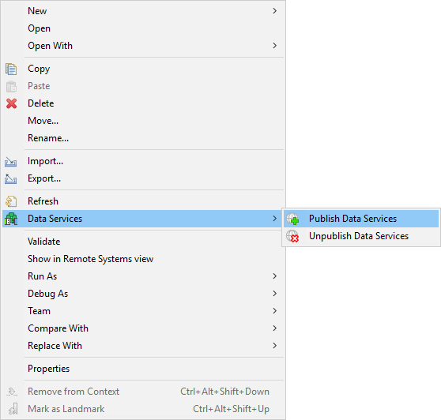
*Figure 186. Publishing multiple Data Services at once*

This option is available only in Server projects. It is not available in local projects.

You can publish only Data Services from one sandbox at once.

#### Unpublishing Data Services

Data Service can be undeployed from **Designer** and from **Server** UI.

To undeploy Data Service, open the Data Service file in **Designer**, switch to **Endpoint Configuration** tab and click the **Unpublish** button.

#### Unpublishing multiple Data Services at once

You can undeploy multiple Data Services at once. Select the `.rjob` files or directories in **Project Explorer**. Right click to open the context menu and select **Data Services** ****Unpublish Data Services**.

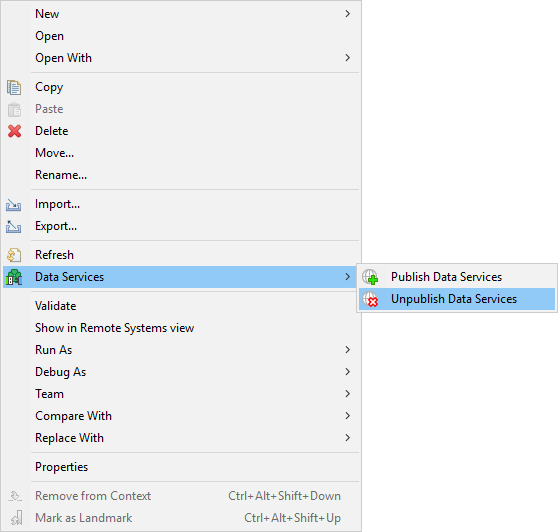
*Figure 187. Unpublishing multiple Data Services at once*

This option is available only in Server projects. It is not available in local projects.

You can unpublish only Data Services from one sandbox at once.

#### Auto-generated documentation and Swagger/OpenAPI definition

Once a Data Service job is deployed to **CloverDX Server**, we automatically generate a documentation for the endpoint using the information from Endpoint Configuration.

The documentation is generated using an informal, but popular, Swagger / OpenAPI format.

The documentation is automatically published together with the HTTP endpoint of your service, so you can easily share it with your endpoint consumers by simply providing them with a link to it.

We also generate a Swagger definition file for the service, that can be used by endpoint consumers to generate client code for consuming your API.

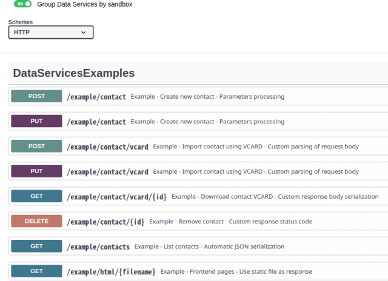
*Figure 188. Endpoint documentation catalog*

### Use cases

#### Creating REST APIs

Data Services can be used to implement REST APIs for integration with third-party tools. JSON is a common format for REST API payloads. If you set the Input Format to "JSON", it will be automatically parsed into a [variant](language-reference-ctl2.md#variant) data field and sent to the "Body" output port of the Input component.

You can process the variant with CTL functions. See the template of a newly created REST job for an example.

#### Custom serialization

If you want to use a different format or override automatic serialization, you can select *custom* as an output format.

In that case, do not connect any edge to Output. Use any writer component with file URL **response:body**.

We recommend you additionally set a Content-Type to match the serialization format you are returning in the payload. You can set it in Data Service Output configuration or using the [setResponseContentType](http-ctl2.html#id_ctl2_setresponsecontenttype) CTL function. Using the CTL function will override the value set in Output configuration.

Automatic serialization is performed after all components in job logic have finished their execution. This is necessary so that the correct HTTP error code can be determined in case of any exception during processing.

If you need to start streaming output before all components finish, use custom serialization with own writer component in the job body. Do note however, that during exception in processing or serialization, the client may receive only partial response. You can use standard graph phases to start your serialization in a separate phase, only after all data has been successfully prepared.

Setting **Format** of the Output to *custom*:

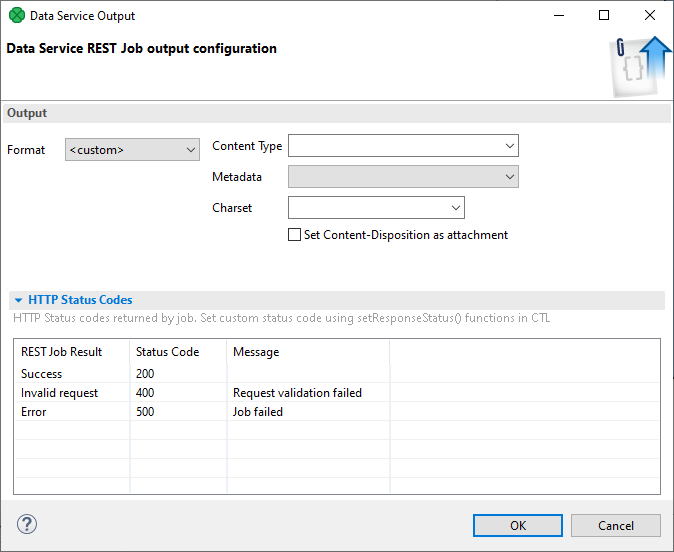
*Figure 189. Data Service output format set to custom*

Here you can select the **Content Type** and **Charset** of the file. If you want to label the file as 'available for download', check the **Set Content-Disposition as attachment** option. Alternatively, you can set these options using CTL functions [setResponseContentType](http-ctl2.html#id_ctl2_setresponsecontenttype), [setResponseEncoding](http-ctl2.html#id_ctl2_setresponseencoding) and [addResponseHeader](http-ctl2.html#id_ctl2_addresponseheader) or [setResponseHeader](http-ctl2.html#id_ctl2_setresponseheader) for setting **Content-Disposition** header in the HTTP response. If the metadata is available for the file and the file is of type CSV select it in **Metadata** field. It will be used in the result preview.

#### Using static file as response

Using a temporary, static file to create an output content can be useful in a number of cases, for example:

- when a complicated file is created, which cannot be streamed (e.g. Excel with multiple sheets);
- when reusing an existing graph which already produces a file;
- for quick mocking of a service with a sample output in a file - the consumer is able to use the service without implementing the service body.

In the cases above, the content of the file can then be used as a response body without the need to use a combination of reader and writer components. Using this configuration, the response is not streamed, i.e. reading of the static file and writing its content to the response body doesn’t start until after all components in the data service’s body finish.

In such a case, set the **Format** of the Output to *file*:

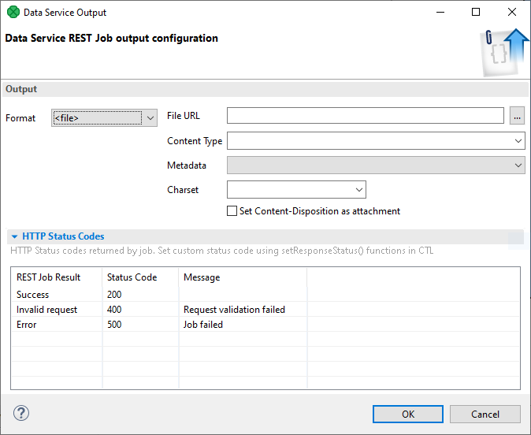
*Figure 190. Data Service output format set to file*

Then specify the file you want to stream by setting **File URL**. **CloverDX Designer** attempts to automatically select the **Content Type** based on the file extension. If the type is not recognized, select it manually. Next, choose the **Charset** of the file. Then, check the **Set Content-Disposition as attachment** option if you want to label the file as 'available for download'. If the metadata is available for the file and the file is of type CSV select it in **Metadata** field. It will be used in the result preview.

**A similar function in streaming mode**, i.e. continuously writing data into response body without storing the file on disk, can be achieved by setting the **File URL** attribute of the writer in the data services’s body to **response:body**. Additionally, if you want to label the file as 'available for download', you must specify the **Content-Disposition** header in the HTTP response using a CTL2 function [addResponseHeader](http-ctl2.html#id_ctl2_addresponseheader) or [setResponseHeader](http-ctl2.html#id_ctl2_setresponseheader).

#### Sending a file generated by .rjob

Data Services can serve a data file that was just created by the `.rjob` logic. For example, you can create a spreadsheet, save it into a file and send the file back to the user as a result of the transformation.

To return the generated file, write data into a temporary file in the same way as you do in an ordinary graph. In the **Output** component, set **Format** to file and enter the location of the generated file.

When you are saving the data to a temporary file, use `${RUN_ID}` parameter as a part of file name to avoid overwriting the file by the `.rjob` serving the parallel query. E.g. use `${DATATMP_DIR}/result-${RUN_ID}.xlsx` as a filename.

#### Publishing a static file

Data Services allow you to publish a single static file on a specific URL.

To publish the file, set **Format** in the **Output** component to **<file>** and enter the **File URL**. The program sets **Content Type** depending on the file, you can change it if you need a different one.

#### Using CTL2 functions in Data Services

There are specific CTL functions designed to deal with Data Service input and output. See [Data Service HTTP library functions](http-ctl2.html).

#### Data Service that receives a file or text in Body part

Data Services allows the user to receive a file or a text in body part of an HTTP request and process it. The data is received using HTTP methods POST or PUT. Do not use the GET method to send a file to Data Service.

To read the body from request, drag an edge out of the **body** port of the **Input** component. A dialog to select a component will open. Select a reader from the list. The reader will appear in the graph pane and its **File URL** will be set to read data from the input port.

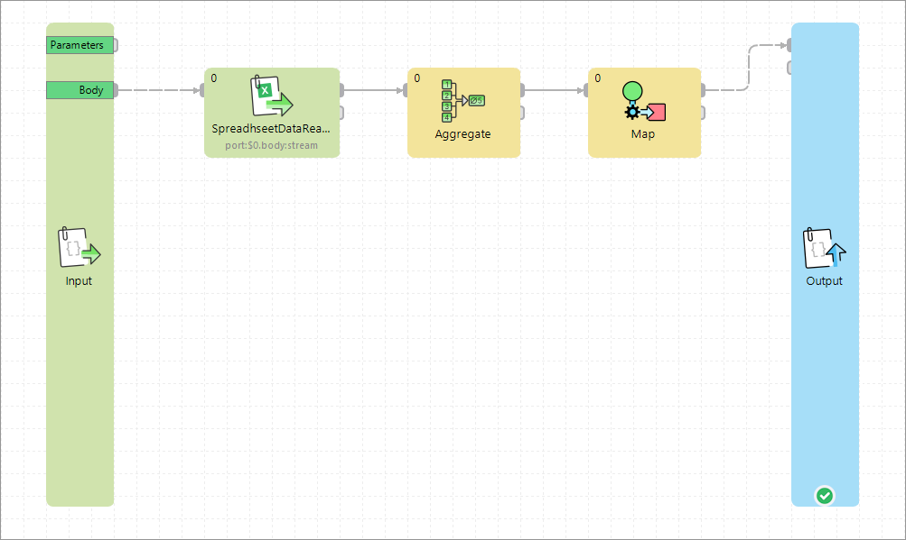
*Figure 191. Reading body content from the port of Input component*

The input edge of the reader has metadata that is propagated out of the **Input** component. By default, the metadata is fixed and it has one **byte** metadata field. The size of the field is 1,024B. If the file is bigger, the data is split into several records.

You can also set your own metadata to this edge. This metadata do not have to be fixed - it can be delimited or mixed - but it should contain one **byte** (or **cbyte**) or **string** metadata field. This field cannot be a list or a map. If you use mixed or delimited metadata, the whole body is conveyed in a single field of one record.

The rest of processing can be designed in the same way as an ordinary graph.

To test it, you can send a file to Data Service with `curl`.

```bash
curl -T fileName.xlsx URL
```

If your Data Service requires login, do not forget to provide credentials.

```bash
curl -T fileName.xlsx --user user:password URL
```

#### Converting graph to Data Service

##### Converting graph to Data Service in server projects

You can convert a graph to Data Service rest job. This option is available only in server projects and you can convert only one graph at once.

To convert a graph to Data Service, right click the `.grf` file in **Project Explorer** and select the **Convert Graph to Data Service** option.

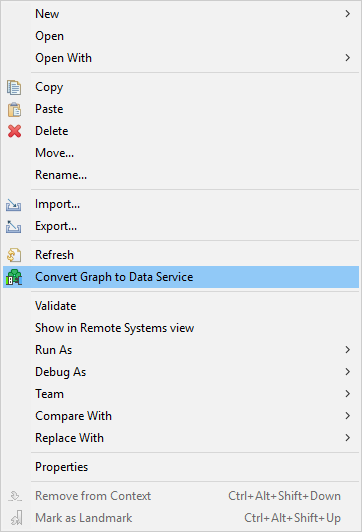
*Figure 192. Convert graph to Data Service*

A new `.rjob` file will be created in the `data-service` directory. The selected `.grf` file is left untouched.

##### Converting graph to Data Service in local projects

You can convert a graph to Data Service even if you are not in a server project.

In main menu, select **File** ****Export**. Expand the **CloverDX** category and select **Convert graph to Data Service REST job**.

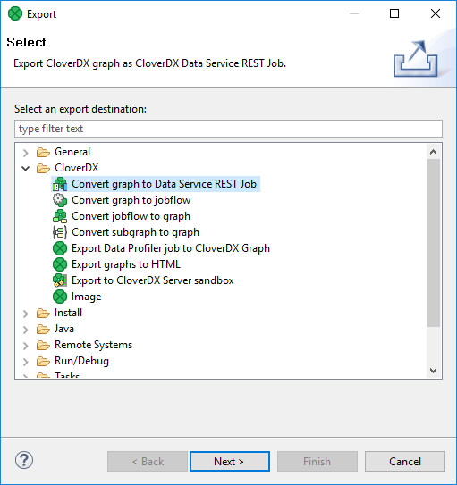
*Figure 193. Export to Data Service REST job - I.*

Select the graph to be converted.

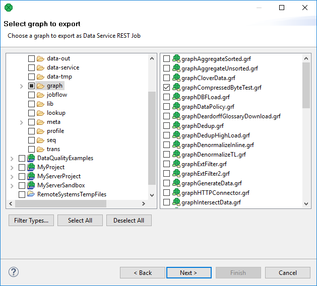
*Figure 194. Export to Data Service REST job - II.*

And set the name and location of the new Data Service.

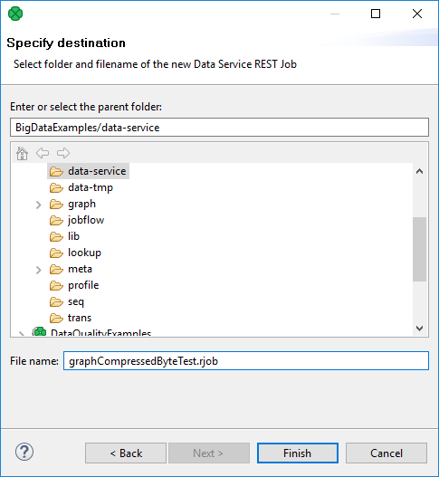
*Figure 195. Export to Data Service REST job - III.*

#### Troubleshooting

##### Server returns error code 404

Check that the Data Service has been published: In **Designer**, open the Data Service job and switch to the **Endpoint Configuration** tab.

##### Server returns error code 500

In **CloverDX Server Console**, check **Executions history**. Find the job and see the log in **Log file** tab.

Have all required parameters been sent to the server? If there is a required parameter that has not been received, the server returns 500.

##### Server Returns Error Code 503

Check that the Data Service job is enabled. You can do it in **Server** on Data Services tab.

### Example

In this example, we will demonstrate how to create a Data Service that returns the message converted to upper case. The web service will be available on `http://www.example.com/clover/data-service/message`

#### Solution

##### Creating Data Service

Create a new Data Service REST Job. Right click the **data-service** directory in the project. **New** ****Other**. **CloverDX** ****Data Service REST Job** Enter the file name `message` and click **Finish**.

Remove other components except **Input** and **Output**.

Insert the [GetJobInput](getjobinput.md) component: Press Shift+Space and choose the component.

Connect **GetJobInput** and **Output** with an edge.

Assign metadata to the edge. The metadata should contain one `string` field.

In **GetJobInput**, update the transformation to contain the following mapping:

```ctl
function integer transform() {
    string text = getRequestParameter("text");
    string upperText = upperCase(text);
    setResponseBody(upperText);

    return ALL;
}
```

In **Output** set **Format** to custom.

###### Publishing the Web Service

To publish the web service, switch to **Endpoint Configuration**. Set **Endpoint URL**.

Check **request methods**`GET` and `POST`.

Click **Publish**.

###### Verifying functionality

To check that the service works, query the Data Service, e.g. with `wget` (or `curl`). You can also use [HTTPConnector](httpconnector.html).

```bash
wget --user clover --password clover "http://example.org/clover/data-service/message?text=Hello" -O file.txt
```

The Data Service will return `HELLO`. See the content of `file.txt` file.

### Data Apps development

**Data Apps** allow publishing a data integration job and its functionality as an application with a simple web-based user interface.

Each Data App is backed by a Data Service which implements the logic. The user interface is generated based on the input and output of this Data Service job.

#### Creating new Data App

To create a new Data App and make it available for others, a Data Service has to be published on the CloverDX Server. Each published Data Service has a working preview of the Data App embedded into the Server Console UI under the Data App tab of the detail view. In order to make the Data App available for use outside the Server Console, you need to enable the Data App feature for the given Data Service. Data App can be enabled either through the action available in the context menu options or at the header of the Data App tab in the detail view.

The configuration of the Data Service also affects the Data App. Input elements are generated for each parameter based on their type in the order they are defined in the Data Service job. See the table below for more info about what kind of widget is generated for which type of parameter.

| Parameter type | Widget in Data App | Example screenshot |
| --- | --- | --- |
| String | A simple text box for a string value. | 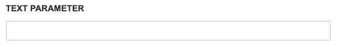 |
| Date | Text box with a calendar widget. Accepts values in YYYY-MM-DD HH:mm:ss format.  The time portion is optional. For more information see the Date Input section.  Date input widget accepts the following formats:  - YYYY-MM-DD - YYYY-MM-DD HH:mm - YYYY-MM-DD HH:mm:ss - YYYY-MM-DD HH:mm:ss.SSS  The date input converts the inserted values to ISO 8601 format in the Time zone of the CloverDX Server. Example: if the server time zone is +03:00 and the user selects the value '2019-05-05 05:05' then the value '2019-05-05T05:05:00.000+03:00' is sent to the Data Service. | 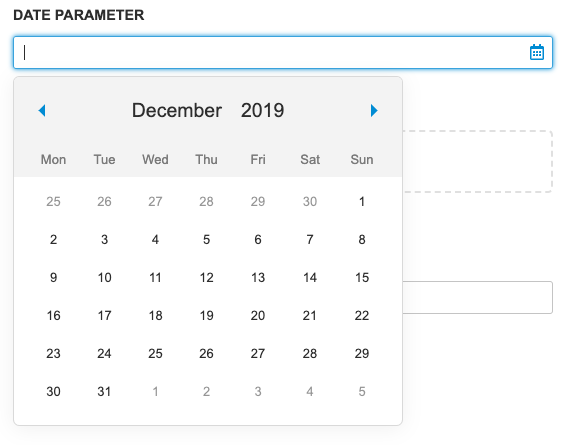 |
| Binary or Text File | File widget with browse and drag-and-drop functionality.  Note: CloverDX version 5.5 does not distinguish Binary or Text files. Both types should be processed using request:part:[name] URL. Different type name is reserved for upcoming versions. | 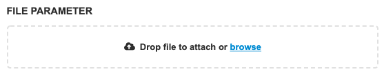 |
| Enumeration | Selection widget with predefined values.  Can be configured to accept custom values. In that case, the value can be entered into the text box. | 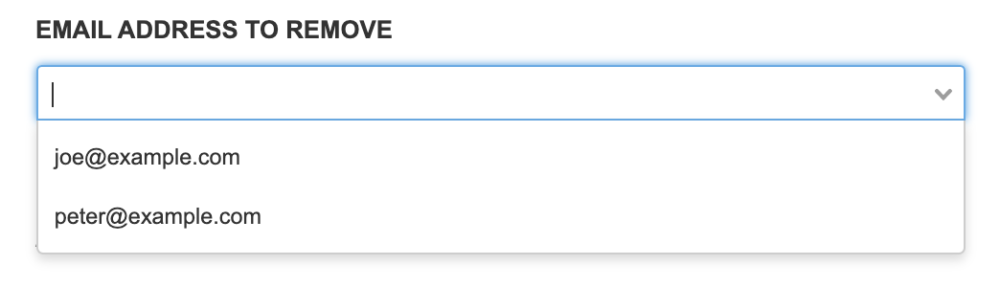 |
| Boolean | Simple checkbox.  The checkbox is not marked as required, but its value is always sent. |  |
| Integer | Simple text field.  Value is validated on submit. | 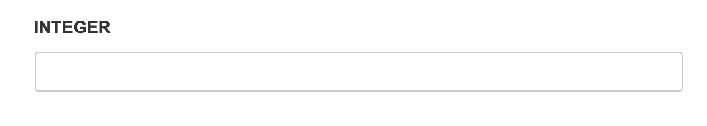 |
| Long | Simple text field.  Value is validated on submit. | 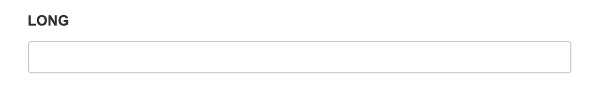 |
| Number | Simple text field.  Value is validated on submit. | 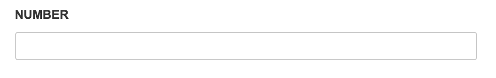 |
| Decimal | Simple text field.  Value is validated on submit. | 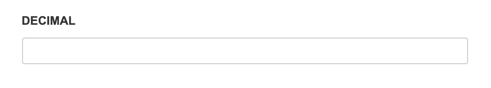 |

#### Validation

Validation of the Rest Job parameter values can be achieved in Data Apps by setting the appropriate properties in CloverDX Designer. The following types of Rest Job parameters have validation options:

- Number
- Integer
- Long
- Decimal
- String
- Enumeration - if custom values are allowed

##### Numeric types

For all numeric types, two rules can be set, the minimum and maximum accepted value. For the decimal type, the length and scale can also be set.

##### String validation

String parameters have four types of validations available, that can be applied at the same time:

- The minimum and the maximum length for the string.
- Regular expression.
- A predefined validation rule.

| Rule Name | Description |
| --- | --- |
| Email address | The value has to be a valid email address. |
| URL | The value has to be a valid URL. |
| Digits only | The value may only contain digits. |
| Letters only | The value may only contain upper and lower case letters. |

#### Customizing Data Apps

You can inject JavaScript code to every Data App to change the behavior or style of the frontend. An example of this can be found in Data Service Examples. See [Data Services examples](../operations/data-services.md#built-in-data-service-examples). To inject JavaScript code into a Data App form, create a JavaScript file in the sandbox, then set the **Path to injected JS file** property in the Rest Job’s properties. The property should contain a path to the JavaScript file relative to the sandbox root folder.

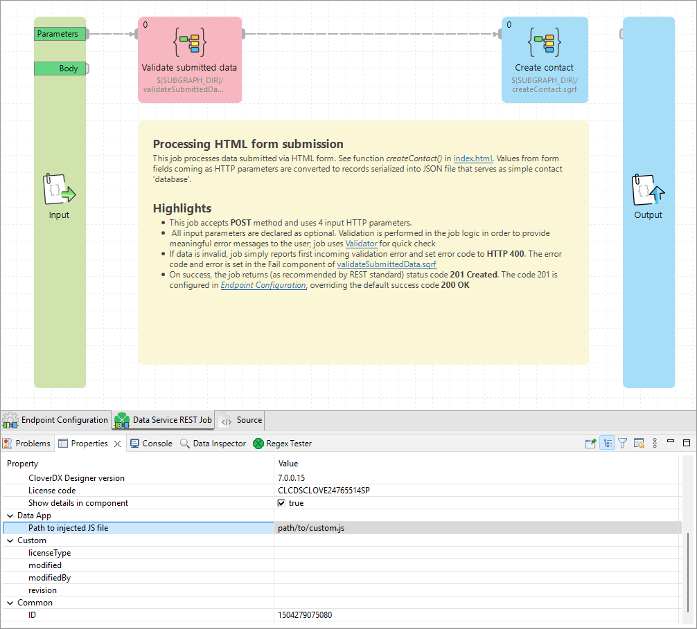
*Figure 196. Path to injected JavaScript file property*

Functions defined in the JavaScript file are added to the global scope of the browser, meaning they are added to the window object and can leak into other Data Apps. Event listeners registered may also cause memory leak issues, it’s always a good practice to remove these event listeners. To avoid leaking functions or memory, clean up the global scope using the `cleanupHook` function. If this function exists in the global scope, it will be called by the Data App before leaving the Data App form. This function itself is then cleaned up automatically. To execute some action before the Data App form is submitted, you can define a function with the name `beforeSubmitHook`. If this function exists in the global scope when running the Data App it is executed and its return value is checked. If the function returns a truthy value the Data App form is submitted, otherwise, the submission is interrupted. The usage of both these functions is demonstrated in the [Data Services examples](../operations/data-services.md#built-in-data-service-examples).

##### Setting input values from JavaScript

The values of the form can be set programmatically using JavaScript, with one caveat, that after setting the value to the input field an input event needs to be dispatched so that the Data App can detect the value change. For boolean types, a checkbox is rendered in that case the change event must be fired.

```javascript
// Select the input element, the id is calculated as name of parameter + '_input'
const inputElement = document.getElementById('parameter1_input');
// Set the new value
inputElement.value = "New Value";
// Fire input event so the Data App can detect the change
inputElement.dispatchEvent(new Event("input"));

// For checkboxes the checked attribute can be set
const checkbox = document.getElementById('booleanParameter_input');
checkbox.checked = true;
// For checkboxes change event needs to be fired
checkbox.dispatchEvent(new Event("change"));
```

##### Setting Enum selection options from JavaScript

For enumeration typed Rest Job parameters a select widget is rendered. It is possible to add selection options to this widget. For each widget there is a hidden input field where the values can be set, same as for other input fields an input event must be dispatched.

```javascript
// Hidden component where values for the enum can be set.
const hidden = document.getElementById('Email_input_values');

// Define options
const emails = [
    {
        label: "John",
        value: "john@example.com",
    },
    {
        label: "Peter",
        value: "peter@example.com",
    },
];

// Set input value as string.
hidden.value = JSON.stringify(emails);
// Fire input event so Data Apps can detect the changes.
hidden.dispatchEvent(new Event("input"));
```

###### Setting Enum selection options with other Data Service

When you are creating your Data App in the **CloverDX Designer**, you can set an endpoint of a Data Service to the [Dynamic Values property](../developer/data-service.md#endpoint-configuration). Before the Data App is rendered the Data Service is executed and the obtained values can be selected in the enum selection options.

#### How-tos

##### How to process an input file

Data App allows using files as an input of data processing.

In such a case, create an input parameter with the type "Binary file" or "Text file". (Both file parameters work similarly; different types are reserved for later use). Once you create such a parameter, Data Service jobs expect a multipart request.

File sent as a multipart is available for reader components using **request:part:[name]** notation. For example, the parameter named `reportFile` is available via the URL **request:part:reportFile**.

The Data App form will then contain a file input widget to upload file for each such parameter.

| 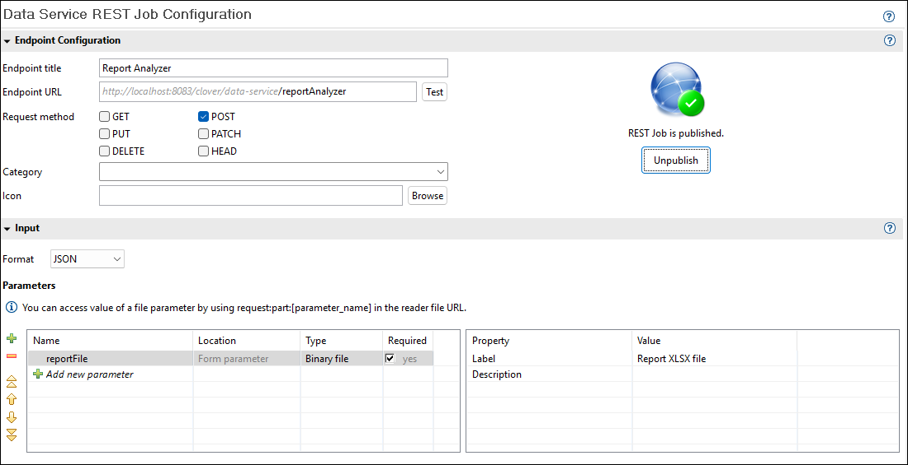 | 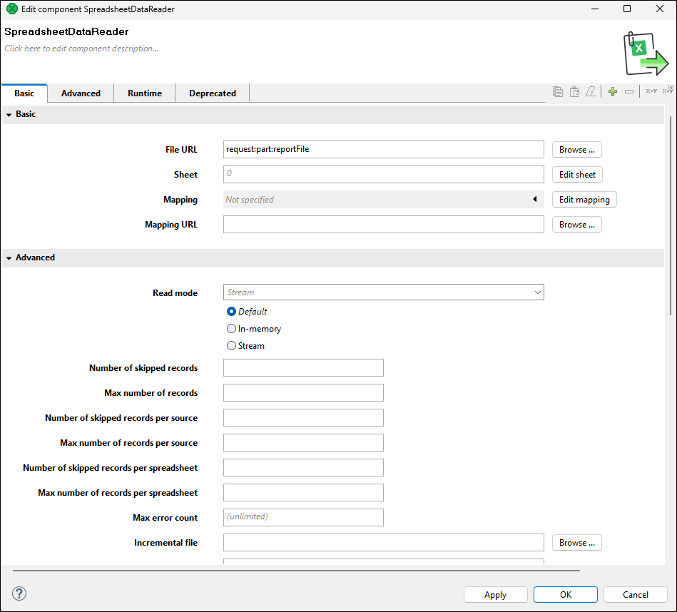 | 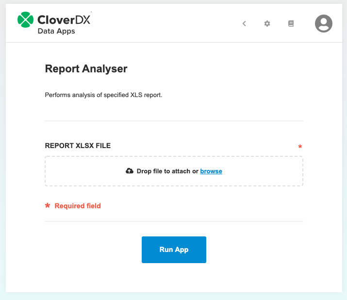 |
| --- | --- | --- |

##### How to identify the invocation of Data Service from Data App

When executing a Data Service as a Data App, the request will contain HTTP request header `X-CLOVER-DATA-APP` with the value `true`.

Since calling the REST API from other sources doesn’t set the header you also have to handle the cases where the header is missing. The following code snippet sets the response message based on how the Data Service was called - whether as an App or as an API.

```ctl
setResponseContentType("text/plain");
string header = getRequestHeader("X-CLOVER-DATA-APP");
boolean isDataApp = false;

if (header != null) {
    isDataApp = str2bool(header);
}

if (isDataApp) {
    setResponseBody("Service was called from Data App");
} else {
    setResponseBody("Service was not called from Data App");
}
```

##### How to produce a file download as a response

In order to create a file download as a response, edit the configuration of the Data Service output, set format to '<file>', then fill in the File URL and Content-type fields then check **Set Content-Disposition as attachment** checkbox.

With this configuration, a successful execution of the Data App will offer a file download on the response page.

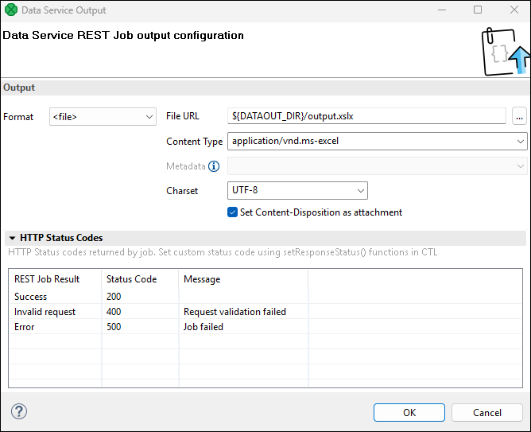
*Figure 197. Data App file result*

##### How to get additional information for apps called from Data Manager

Starting with CloverDX 7.4, it is possible to connect Data Apps to data sets in Data Manager (see [Connected Data Apps](../user/data-manager-introduction.md#connected-data-apps) for more details). In those cases, it may be useful to know that the Data App was called from the Data Manager rather than from App Catalog.

To help with this, the App will receive two extra HTTP headers that can help you understand how it was called:

- `X-Clover-Data-Set-Code`: this header provides a code of the data set from which the app was called. If not present, the app was not called from Data Manager.
- `X-Clover-Data-Set-Batch-Key`: this header provides batch key in case batching is enabled for given data set and the app was called from a specific batch. This header will not be present when batching is not enabled on given data set.

##### Automatically refreshing Data Manager’s data set

Running Data Apps can make changes to multiple data sets. When the Data App is called from a toolbar (i.e., when it is configured as [Connected Data Apps](../user/data-manager-introduction.md#connected-data-apps) in given data set) you may want to notify Data Manager that a data set has been changed so that it can offer refresh to the user.

To send such notification to the Data Manager, you can use [`addDataSetReloadNotification`](http-ctl2.html#id_ctl2_adddatasetreloadnotification) CTL function. This function can be called at any time during the app execution (even multiple times). You can also call this function with multiple data set names to send notification about multiple data sets – the user will be able to refresh any of them if they have it open.

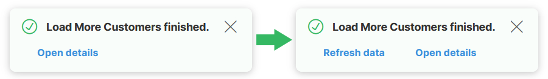
*Figure 198. Comparison showing a notification about Data App success without the refresh notification (left) and with the refresh notification (right).*

The above refresh notification was created simply by calling the `addDataSetReloadNotification` at the end of the job in a success component:

```ctl
//#CTL2

function integer transform() {
    // Notify DM that the data set changed so that it can offer refresh notification.
    addDataSetReloadNotification("Customers");

    return ALL;
}
```
