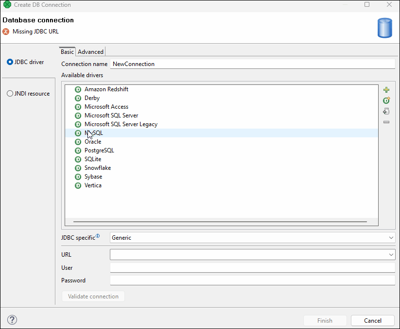
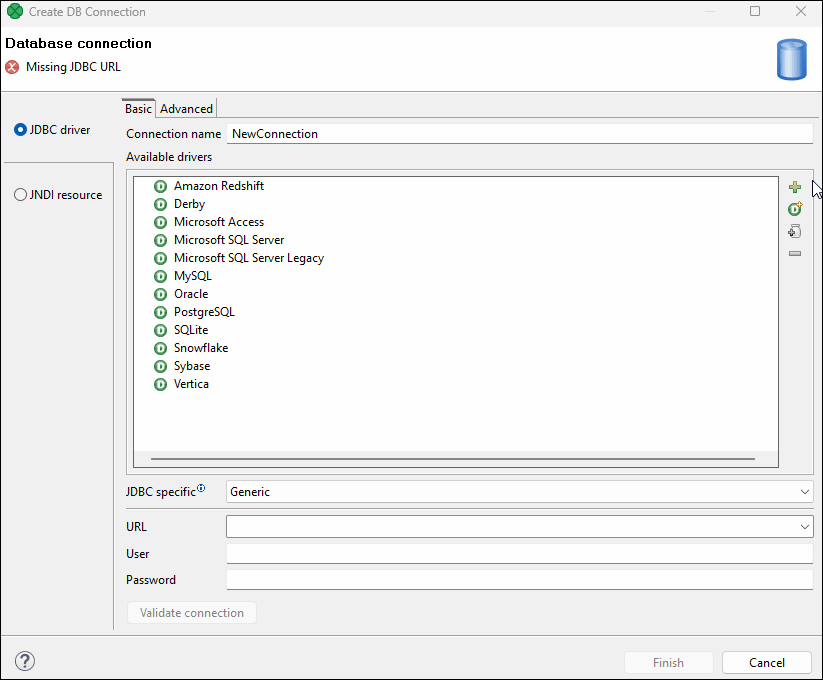
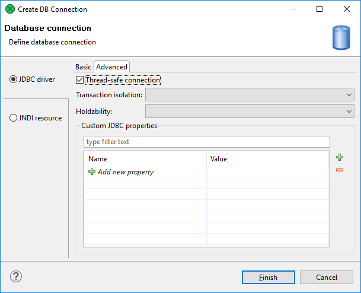
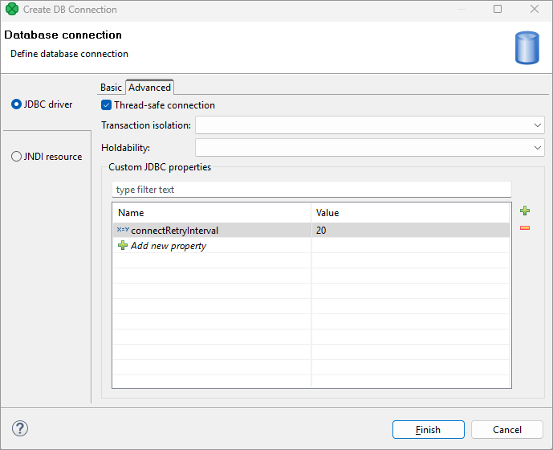
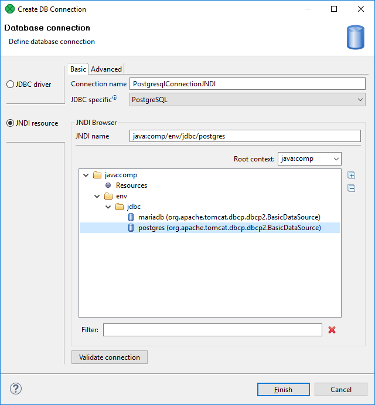
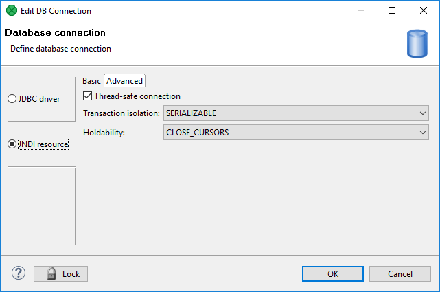
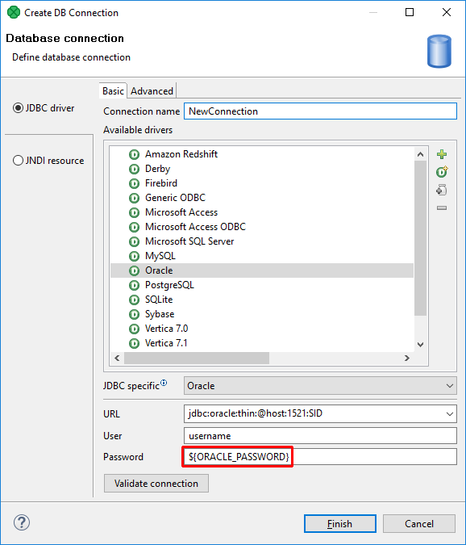
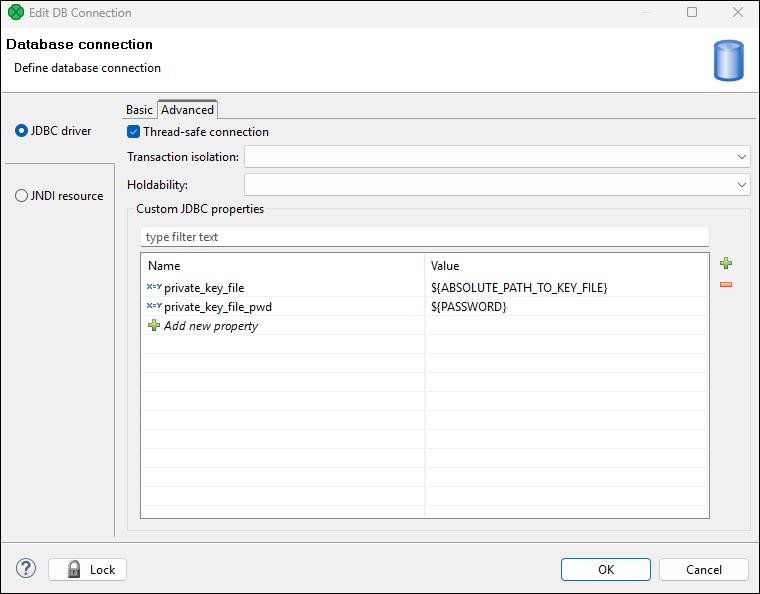
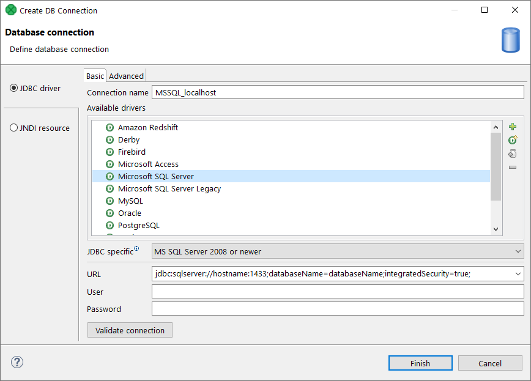
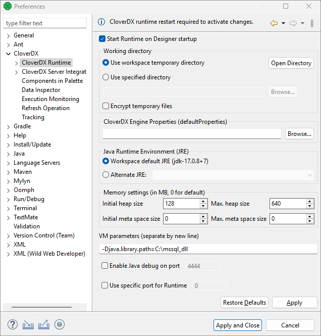

<!-- Development > Job elements > Connections > Database connections -->

### Database connections
> [!TIP]
> If you’re interested in learning more about this subject, we offer the [Databases course](https://academy.cloverdx.com/courses/database) in our CloverDX Academy.

A database connection lets you access database data sources. With a database connection, you can read data from database tables, perform SQL queries, or insert records into database tables. These actions are taken by the components using a database connection.

There are two ways of accessing a database:

- Using a JDBC driver.
- Using a client on your computer that connects to a database located on a server by means of a client utility. This approach is used in [bulk loaders](writers.md).

Each database connection requires a JDBC driver. JDBC drivers for commonly used databases are included in **CloverDX Designer**.
> [!NOTE]
> When using database connections in a **CloverDX Server** project, all database connectivity is performed server-side. One of the benefits is that database servers accessible from **CloverDX Server** can be also used from within **CloverDX Designer**.

Database connections can be [*internal*](database-connections.md#internal-database-connections) or [*external (shared)*](database-connections.md#external-shared-database-connections). An internal database connection can be converted to external and vice versa.

**Database connection properties** dialog is described in [Database connection properties](database-connections.md#database-connection-properties).

Access passwords can be encrypted. See [Encryption of access password](database-connections.md#encryption-of-access-password).

A database connection can serve as a resource for creating metadata. See [Browsing database and extracting metadata from database tables](database-connections.md#browsing-database-and-extracting-metadata-from-database-tables).

Remember that you can also create a database table directly from metadata. See [Create database table from metadata](metadata-merge.md#creating-database-table-from-metadata-and-database-connection).

#### Internal database connections

| [Creating internal database connections](database-connections.md#creating-internal-database-connections) |
| --- |
| [Externalizing internal database connections](database-connections.md#externalizing-internal-database-connections) |
| [Exporting internal database connections](database-connections.md#exporting-internal-database-connections) |

Internal database connections are part of a graph, they are contained in it and can be seen in its source tab.

##### Creating internal database connections

To create an internal database connection, right-click **Connections** in the **Outline** pane and select **Connections** ****Create DB connection**.

You can also open the dialog by selecting some DB connection item in the **Outline** pane and pressing Enter.

For detailed information about how a database connection should be created and configured, see [Database connection properties](database-connections.md#database-connection-properties).

When all attributes of the connection have been set, you can validate your connection by clicking the **Validate connection** button.

To create the internal database connection, click **Finish**. The new internal database connection is a part of the graph.

##### Externalizing internal database connections

Each internal database connection can be externalized, i.e. converted to the external one. Thus, you would be able to use the same database connection for more graphs, i.e. more graphs would share the connection.

You can externalize an internal connection by right-clicking the internal connection item in the **Outline** pane and selecting **Externalize connection** from the context menu. A new window will open. The dialog offers the `conn` folder of your project as the location for this new external (shared) connection configuration file.

A configuration file name is created from the database connection name; however, it can be changed. Click **OK** to finish externalization.

When an internal connection is converted to an external (shared) connection, it disappears from the **Connections** group in the **Outline** pane. The newly created external connection configuration file then appears in its place, as well as in the project’s `conn` subfolder in the **Project Explorer** pane.

###### Externalizing multiple connections

You can externalize multiple internal connection items at once.

To do this, select them in the **Outline** pane. Right-click and select **Externalize connection** from the context menu. A new window will open in which the `conn` folder of your project will be offered as the location for the first of the selected internal connection items. Finally, click **OK**.

The same window will open for each of the selected connection items until they are all externalized. The name of any configuration file can be changed. If you want or if the file with the same name already exists, you can change the offered name of any connection configuration file.

You can choose adjacent connection items when you press Shift and move the **Down Cursor** or the **Up Cursor** key. If you want to choose non-adjacent items, use Ctrl+Click at each of the desired connection items instead.

The same is valid for both the database and JMS connections.

After that, the internal file disappears from the **Outline** pane connections folder; but at the same location, a newly created configuration file appears.

The same configuration file appears in the `conn` subfolder in the **Project Explorer** pane.

##### Exporting internal database connections

Exporting is similar to externalizing an internal database connection. You create a connection configuration file that is outside the graph in the same way as an externalized connection, but such a file is no longer linked to the original graph. Subsequently, you can use such a file in other graphs as an external (shared) connection configuration file as mentioned in the previous sections.

You can export an internal database connection into an external (shared) one by right-clicking one of the internal database connection items in the **Outline** pane and selecting **Export connection** from the context menu. The `conn` folder of the corresponding project will be offered for the newly created external file. The name of the file can be changed. Click **Finish** to create the file.

After that, the **Outline** pane connection folder remains the same, but in the `conn` folder in the **Project Explorer** pane, the newly created connection configuration file appears.

You can even export more selected internal database connections in a similar way as it is described in the previous section about externalizing.

#### External (shared) database connections

| [Creating external (shared) database connections](database-connections.md#creating-external-shared-database-connections) |
| --- |
| [Linking external (shared) database connections](database-connections.md#linking-external-shared-database-connections) |
| [Internalizing external (shared) database connections](database-connections.md#internalizing-external-shared-database-connections) |

External (shared) database connections are stored outside graphs, allowing them to be used across multiple graphs.

Only the connection configuration is shared. If two graphs use the same external (shared) connection, they use the same connection configuration, but each of them has its independent database connection.

The best practice is to place external (shared) connections into the `conn` directory.

##### Creating external (shared) database connections

To create external database connections, see [Externalizing internal database connections](database-connections.md#externalizing-internal-database-connections).

##### Linking external (shared) database connections

External (shared) database connections can be linked to each graph in which they should be used.

Right-click either the **Connections** group or any of its items. Select **Connections** ****Link DB connection** from the context menu. A **File URL** dialog displaying the project content will open. Expand the `conn` folder and select the desired connection configuration file from all the files contained.

###### Linking multiple connections

You can even link multiple external (shared) connection configuration files at once.

Right-click either the **Connections** group or any of its items and select **Connections** ****Link DB connection** from the context menu. Then, a **File URL** dialog displaying the project content will open. Expand the `conn` folder in this dialog and select the desired connection configuration files from all the files contained.

You can select adjacent file items when you press Shift and move the **Down Cursor** or the **Up Cursor** key. If you want to select non-adjacent items, use Ctrl+Click at each of the desired file items instead.

The same is valid for both the database and JMS connections.

##### Internalizing external (shared) database connections

Any linked external (shared) connection can be converted into an internal connection. The connection becomes a part of the graph, but the external configuration file does not disappear. In such a case, you would see the connection structure in the graph itself.

You can convert any external (shared) connection configuration file into an internal connection by right-clicking the linked external (shared) connection item in the **Outline** pane and using **Internalize connection** from the context menu.

###### Internalizing multiple connections

You can even internalize multiple linked external (shared) connection configuration files at once.

To do this, select the desired linked external (shared) connection items in the **Outline** pane. You can select adjacent items when you press Shift and move the **Down Cursor** or the **Up Cursor** key. If you want to select non-adjacent items, use Ctrl+Click at each of the desired items instead.

After that, the selected linked external (shared) connection items disappear from the **Outline** pane **Connections** group; but at the same location, newly created internal connection items appear.

However, the original external (shared) connection configuration files will remain in the `conn` subfolder as can be seen in the **Project Explorer** pane.

The same is valid for both the database and JMS connections.

#### Database connection properties

The **Database connection** dialog allows you to configure various settings for a database connection. You can select a JDBC driver from the provided list or add your own, choose an existing JNDI resource, set up authentication credentials, define the transaction isolation level, and more.

The dialog consists of two tabs:

- **Basic**, where you can configure essential [JDBC](database-connections.md#jdbc-driver) or [JNDI](database-connections.md#jndi-resource) connection details.
- **Advanced**, where you can set additional configuration options for [JDBC](database-connections.md#advanced-properties-of-jdbc-driver) or [JNDI](database-connections.md#advanced-properties).

##### JDBC driver

| [Basic properties of JDBC driver](database-connections.md#basic-properties-of-jdbc-driver) |
| --- |
| [Advanced properties of JDBC driver](database-connections.md#advanced-properties-of-jdbc-driver) |

The dialog consists of two tabs: **Basic properties** and **Advanced properties**.

##### Basic properties of JDBC driver

In the **Basic** tab, select one of the built-in drivers or [add your own driver](database-connections.md#adding-jdbc-drivers-and-jars). The built-in drivers support the following databases:

| Built-in drivers |
| --- |
| **Amazon Redshift** |
| **Derby** |
| [**Microsoft Access**](database-connections.md#microsoft-access) |
| **Microsoft SQL Server** (for **Microsoft SQL Server 2008 or newer**) [[1]](database-connections.md#db-connections-fn01)[[2]](database-connections.md#db-connections-fn02)[[3]](database-connections.md#db-connections-fn03) |
| **Microsoft SQL Server Legacy** (for **MS SQL Server 2000-2005**) [[1]](database-connections.md#db-connections-fn01) |
| **MySQL** |
| **Oracle** |
| **PostgreSQL** |
| **SQLite** |
| [**Snowflake**](database-connections.md#snowflake-connection)[[4]](database-connections.md#db-connections-fn04) |
| **Sybase** |
| **Vertica** |

| 1 | Since CloverDX version 5.10.0, Microsoft SQL Server uses the Microsoft JDBC Driver library. The former driver (using the jTDS library) has been renamed to *Microsoft SQL Server Legacy*. We strongly recommend switching to the *Microsoft SQL Server JDBC driver* instead of *Microsoft SQL Server Legacy jTDS* driver. The jTDS driver stopped being developed more than 10 years ago and can cause unexpected behavior or performance issues. |
| --- | --- |

| 2 | Since CloverDX version 6.4, the bundled Microsoft SQL Server JDBC driver enforces encryption by default. For more information, refer to our Knowledge base article [here](https://support1.cloverdx.com/hc/en-us/articles/15176283550236-Microsoft-SQL-JDBC-driver-now-enforces-encryption-by-default). |
| --- | --- |

| 3 | For instructions on configuring Windows authentication, refer to [Microsoft SQL Server Windows authentication](database-connections.md#microsoft-sql-server-windows-authentication). |
| --- | --- |

| 4 | Snowflake connections must be configured to use **key-pair authentication** instead of password-based authentication. See [Snowflake connection](database-connections.md#snowflake-connection) for more information. |
| --- | --- |
> [!NOTE]
> These JDBC drivers are bundled with CloverDX and are regularly updated in new releases. To check the exact version of a JDBC driver in your installation, navigate to the following directories, depending on the project type:
>
> - Local projects: `[CloverDX Designer install directory\plugins\com.cloveretl.gui_<version number>\lib\plugins\org.jetel.jdbc\lib`.
> - Server projects: `[CloverDX Server install directory]\webapps\clover\WEB-INF\plugins\org.jetel.jdbc\lib`.

After selecting a driver, the driver defaults are populated:

- **JDBC specific**: refers to settings within CloverDX that handle the subtle differences between database systems that standard JDBC drivers don’t address, ensuring compatibility by tailoring SQL commands, like the presence of a semicolon, through pre-defined configurations for various databases, thus providing more reliable connections than a generic approach. These pre-populated configurations are optimized for the selected bundled driver, but users can change them and experiment with different options if necessary, allowing for flexible adjustments to achieve optimal database connectivity.
- **URL**: the default basic connection URL is pre-populated.

*Figure 246. Database connection properties dialog*

After selecting a driver and modifying the URL, type your **user** name, and **password** (the password can be encrypted using [Secure graph parameters](parameters.md#secure-graph-parameters)).

You can validate the connection by using the **Validate connection** button.
> [!NOTE]
> When validating a database connection in a local project, the validation runs from your local machine. In a Server project, it runs from the connected CloverDX Server environment.

Before saving the connection, you can name your connection by changing the **Connection name** at the top.

###### Adding JDBC drivers and jars

If the desired JDBC driver is not listed, or you want to add a newer or older driver version, perform the following steps:

1. Download the desired driver (needs to be JDBC type 3 or higher).
2. Copy it over to your project’s `lib` folder.
3. Open the **Database connection** dialog and click the **Load driver from JAR** button  on the right side of the dialog.
4. Locate the driver file and confirm your selection.
5. The installed driver will appear in the list of drivers. If the driver includes multiple classes, multiple records appear.
6. Click on the desired record and choose an appropriate [JDBC specific](database-connections.md#db-connection-jdbc-specific) type and populate the connection URL and credentials.

*Figure 247. Adding custom driver*

If necessary, you can also add another JAR file to the driver classpath by selecting the driver record and using the **Add JAR to driver classpath** button. For example, some databases may need their license to be added as well as the driver.

You can remove a driver from the list by selecting the driver record and clicking the **Remove selected** button .

##### Advanced properties of JDBC driver

| [Thread-safe connection](database-connections.md#thread-safe-connection) |
| --- |
| [Transaction isolation](database-connections.md#transaction-isolation) |
| [Holdability](database-connections.md#holdability) |

In addition to the **Basic** tab described above, the **Database connection** dialog also offers the **Advanced** tab.

*Figure 248. Advanced tab of the Database connection dialog*

If you switch to this tab, you can specify additional properties for the selected connection:

###### Thread-safe connection

By default, it is enabled. In this default setting, each thread gets its own connection to prevent problems when more components communicate with the same database simultaneously (through the same connection object which is not thread-safe).

###### Transaction isolation

Allows to specify the transaction isolation level. More details can be found here: [Interface Connection](http://docs.oracle.com/javase/8/docs/api/java/sql/Connection.html). Possible values of this attribute are:

- `0` (`TRANSACTION_NONE`).
  A constant indicating that transactions are not supported.
- `1` (`TRANSACTION_READ_UNCOMMITTED`).
  A constant indicating that dirty reads, non-repeatable reads, and phantom reads can occur. This level allows a row changed by one transaction to be read by another transaction before any changes in that row have been committed (a "dirty read"). If any of the changes are rolled back, the second transaction will have retrieved an invalid row.
  This is the default value for **DB2**, **EXASolution**, **Informix**, **MySQL**, **MS SQL Server 2008 or newer**, **MS SQL Server 2000-2005**, **PostgreSQL**, and **SQLite** specifics.
  This value is also used as default when **JDBC specific** called **Generic** is used.
- `2` (`TRANSACTION_READ_COMMITTED`).
  A constant indicating that dirty reads are prevented; non-repeatable reads and phantom reads can occur. This level only prohibits a transaction from reading a row with uncommitted changes in it.
  This is the default value for **Oracle**, **Sybase**, and **Vertica** specifics.
- `4` (`TRANSACTION_REPEATABLE_READ`).
  A constant indicating that dirty reads and non-repeatable reads are prevented; phantom reads can occur. This level prohibits a transaction from reading a row with uncommitted changes in it, and it also prohibits a situation where one transaction reads a row, a second transaction alters the row and the first transaction rereads the row, getting different values the second time (a "non-repeatable read").
- `8` (`TRANSACTION_SERIALIZABLE`).
  A constant indicating that dirty reads, non-repeatable reads, and phantom reads are prevented. This level includes the prohibitions in `TRANSACTION_REPEATABLE_READ` and further prohibits a situation where one transaction reads all rows that satisfy a `where` condition, a second transaction inserts a row that satisfies the `where` condition, and the first transaction rereads for the same condition, retrieving the additional "phantom" row in the second read.

###### Holdability

Allows to specify holdability of `ResultSet` objects created using the `Connection`. More details can be found here: [Interface ResultSet](http://docs.oracle.com/javase/8/docs/api/java/sql/ResultSet.html). Possible options are the following:

- `1` (`HOLD_CURSORS_OVER_COMMIT`).
  The constant indicating that `ResultSet` objects should not be closed when the method `Connection.commit` is called.
  This is the default value for **Informix** and **MS SQL Server 2008 or newer** specifics.
- `2` (`CLOSE_CURSORS_AT_COMMIT`).
  The constant indicating that `ResultSet` objects should be closed when the method `Connection.commit` is called.
  This is the default value for **DB2**, **MS SQL Server 2000-2005**, **MySQL**, **Oracle**, **PostgreSQL**, **SQLite**, **Sybase**, and **Vertica** specifics.
  This value is also used as default when **JDBC specific** called **Generic** is used.

###### Custom JDBC properties

If you want to add any custom properties, add the property names and their values in the grid below.

*Figure 249. Custom JDBC properties*

##### JNDI resource

In the **JNDI resource** tab, you can create a connection from an existing JNDI resource.

JNDI is a configuration used to obtain a connection from a JNDI-bound data source. A data source generates database connections from a connection pool, which is defined at the application server level.

###### Basic properties

To create a database connection, specify the **Connection name** and choose the database JNDI resource from the tree view. If there are too many resources, you can use the **Filter** field to limit your search.
> [!NOTE]
> If you have configured a JNDI resource but cannot see it in the list, there can be a problem with configuration (e.g. typo or bad password) or the database might refuse the resource to connect due to a limit on connections. You can enter the **JNDI Name** and use the connection to see the cause.

**Connection name** is a user-defined name of the database connection.

**JDBC specific** is described in the [JDBC driver](database-connections.md#jdbc-driver) section.

**JNDI name** is the name of a JNDI data source. If you choose a particular JNDI data source from the tree view below, the JNDI name is filled in.

**Root context** allows you to choose the root context of a JNDI resource. You can choose one of the pre-filled values: **java:comp**, **java:comp/env** and **<empty>**, or you can add your own value: click the combo, type the value, and press Enter.

*Figure 250. JNDI resource - Basic tab*

###### Advanced properties

The advanced tab of JNDI resource has the same configurable items as the Advanced tab of JDBC driver. See [Advanced properties of JDBC driver](database-connections.md#advanced-properties-of-jdbc-driver).

*Figure 251. JNDI resource - Basic tab*

#### Encryption of access password

**CloverDX** supports encryption of passwords.

##### Why encryption?

If you do not encrypt your access password, it remains stored and visible in the configuration file (shared connection) or in the graph itself (internal connection).

Unless you are the only person with an access to your graph and computer, we recommend to encrypt it, since the password allows access to the database in question.

In case you give someone any of your graphs, you do not have to give them the access password to the whole database. This is why it is possible to encrypt your access password. Without this option, you would be at great risk of an intrusion into your database or of some other damage caused by unauthorized access.

##### Encrypting the database passwords

To encrypt a database password use **Secure parameters**. (See [Secure Graph Parameters](parameters.md#secure-graph-parameters)). Store the password in the parameter and use the parameter in the connection dialog instead of the password.

*Figure 252. Using password from secure graph parameter*

If you would like to return to your access password, you can do it by typing the password into the **Database connection** dialog and clicking **OK**.

#### Browsing database and extracting metadata from database tables

As you can see in [Externalizing internal database connections](database-connections.md#externalizing-internal-database-connections) and [Internalizing external (shared) database connections](database-connections.md#internalizing-external-shared-database-connections)), in both cases, the context menu contains two interesting items: **Browse database** and **New metadata**. These give you an opportunity to browse a database (if your connection is valid) and/or extract metadata from some selected database table. Such metadata will be internal only, but you can later externalize and/or export them.
> [!IMPORTANT]
> Remember that you can also create a database table directly from metadata. See [Create database table from metadata](metadata-merge.md#creating-database-table-from-metadata-and-database-connection).

#### Snowflake connection

You can connect to Snowflake in the same way as to any other SQL database using a [DB connection](database-connections.md) with the bundled Snowflake JDBC driver.
> [!CAUTION]
> Note that Snowflake is [discontinuing password-based authentication](https://docs.snowflake.com/en/user-guide/security-mfa-rollout). All Snowflake connections in CloverDX jobs must be configured to use **key-pair authentication** instead. For setup instructions, see [Key-pair authentication](database-connections.md#key-pair-authentication).

This section contains information about working with date-time data types that is common to [DatabaseReader](dbinputtable.md), [DatabaseWriter](dboutputtable.md) and [SnowflakeBulkWriter](snowflakebulkwriter.md).

##### Date/Time data types in Snowflake

Working with dates and time zones can be challenging. As a quick rule before going into details, always specify the **Format** of *date* data fields in your metadata, see [Date and time format](metadata-records-and-fields.md#date-and-time-format). Also setting the [Session time zone](database-connections.md#session-time-zone) on the connection to match your local time zone may help.

There are five different [Snowflake data types](https://docs.snowflake.com/en/sql-reference/data-types-datetime.html#data-types) and two time zones ([session TZ](database-connections.md#session-time-zone) and [local TZ](database-connections.md#local-time-zone)) that affect the results.

| Snowflake type | Description | Time zone |
| --- | --- | --- |
| DATE | A date without a time component. | local |
| TIME | Wallclock time without a date. |  |
| TIMESTAMP_NTZ | Date and time without a time zone. Saved as the wallclock date-time in the session time zone. The time zone itself is not stored. | session |
| TIMESTAMP_TZ | Date and time with a time zone. The session time zone is stored as a part of the value and used for reading. |  |
| TIMESTAMP_LTZ | Written in the local time zone, but the time zone is not stored. The current time zone is always used for reading. | local |

All of these Snowflake types map to just one data type in CloverDX metadata: date.

An important property of the *date* data type is its **Format**. It provides a hint on how to interpret the data while reading or writing them to the database.

If the Format contains only a date part, it maps to the DATE type. If it contains only a time part, we consider it a TIME. And if it contains both, we treat it as a TIMESTAMP.

For example, "yyyy-MM-dd" or "dd/MM/yyyy" are DATE formats, "HH:mm:ss" is a TIME format, and "dd.MM.yyyy HH:mm:ss" is a TIMESTAMP.

See [Date and time format](metadata-records-and-fields.md#date-and-time-format) for more details.

Note that regardless of the Format, CloverDX records store the full date and time value. The Format controls how that value is interpreted when reading and writing data.

###### Session time zone

This is the time zone of the connection, as configured in Snowflake. It is used for writing TIMESTAMPs.

See the [TIMEZONE](https://docs.snowflake.com/en/sql-reference/parameters.html#timezone) parameter in Snowflake documentation.

You can override the session time zone on the connection in [Advanced properties of JDBC driver](database-connections.md#advanced-properties-of-jdbc-driver), e.g., `TIMEZONE=Asia/Singapore`.

###### Local time zone

This is the client time zone. It is used for reading and writing DATE and TIME columns. It is set to your system time zone by default. But you can override it in your metadata, even for individual fields. See [Date and time format](metadata-records-and-fields.md#date-and-time-format) and [Time zone](metadata-records-and-fields.md#timezone) for details.

##### Key-pair authentication

1. Follow the steps in the [Snowflake documentation](https://docs.snowflake.com/en/user-guide/key-pair-auth#generate-the-private-key) on how to generate the private key.
2. Move the generated key file to a directory accessible by your CloverDX environment (e.g., within a sandbox):
   - For **server projects**, the file needs to be reachable by CloverDX Server.
   - For **local projects**, the file needs to be reachable to CloverDX Designer.
3. Ensure that the Snowflake JDBC driver in your environment is **version 3.16.0 or newer**. If you are on **CloverDX version 7.0 or newer**, you already have a compatible JDBC driver in your environment. If you are on an older CloverDX version, you will need to [download a newer JDBC driver](https://docs.snowflake.com/en/developer-guide/jdbc/jdbc-download) and [load it into your project in CloverDX Designer](database-connections.md#adding-jdbc-drivers-and-jars).
4. Use the driver to configure your connection and on the **Advanced** tab enter the following properties:
   - `private_key_file` - absolute path to the key file
   - `private_key_file_pwd` - key file password

*Figure 253. Properties on Advanced tab*

1. Add the `-Dnet.snowflake.jdbc.enableBouncyCastle` JVM argument to enable BouncyCastle cryptographic support, which is required for handling encrypted keys:
   - For **server projects**: Add `-Dnet.snowflake.jdbc.enableBouncyCastle=true` in the **JVM arguments section** under **Configuration > Setup > Worker** in the Server Console. Restart the Worker process for the change to take effect.
   - For **local projects**: Add `-Dnet.snowflake.jdbc.enableBouncyCastle=true` in the **VM parameters section** under **Window > Preferences > CloverDX > CloverDX Runtime**. Restart the Runtime process for the change to take effect.
> [!NOTE]
> Connection validation will not work with key-pair authentication; connection validation is performed only at runtime. For detailed guidance or troubleshooting, refer to [Snowflake’s official documentation](https://docs.snowflake.com/en/developer-guide/jdbc/jdbc-configure).

##### Using Snowflake in Server core

If you want to use Snowflake connection in a graph that runs in Server Core, the server needs to be configured to allow reflective access. See [reflective access](../admin/postinstallation-configuration.md#reflective-access).

###### See also

| [DatabaseReader](dbinputtable.md) |
| --- |
| [DatabaseWriter](dboutputtable.md) |
| [SnowflakeBulkWriter](snowflakebulkwriter.md) |
| [Date and time format](metadata-records-and-fields.md#date-and-time-format) |
| [Time zone](metadata-records-and-fields.md#timezone) |
| [Advanced properties of JDBC driver](database-connections.md#advanced-properties-of-jdbc-driver) |

#### Hive connection

A connection to the Apache Hive can be created exactly the same way as any other [DB Connection](database-connections.md). Here we make just a few Hive specific remarks you may find useful.

##### Hive JDBC driver

The JDBC driver is a part of the Hive release. But the library and its dependencies are scattered among other Hive libraries. Moreover, the driver depends on one more library from the Hadoop distribution: `hadoop-core-*.jar` or `hadoop-common-*.jar`, depending on version of your Hadoop, there’s always only one of them.

For Hive version 0.8.1, here is a minimal list of libraries you need for the Hive DB connection JDBC driver:
hadoop-core-0.20.205.jar hive-exec-0.8.1.jar hive-jdbc-0.8.1.jar hive-metastore-0.8.1.jar hive-service-0.8.1.jar libfb303-0.7.0.jar slf4j-api-1.6.1.jar slf4j-log4j12-1.6.1.jar
You can put all of the Hive distribution libraries + the one Hadoop lib on the JDBC driver classpath. But some of the Hive distribution libraries may already be included in **CloverDX** which may result in class loading conflicts. Typically, no `commons-logging*` and `log4j*` libraries should be included, otherwise (harmless) warnings will appear in a graph run log.

##### Using Hive in CloverDX transformation graphs

Remember that Hive is not an ordinary SQL relational database - it has its own SQL-like query language, called QL. Great resource about the Hive QL and Hive in general is the [Apache Hive Wiki](https://cwiki.apache.org/confluence/display/Hive/Home).

One of the consequences is that it makes no sense to use the [DatabaseWriter](dboutputtable.md) component, because the `INSERT INTO` statement can insert only results of the `SELECT` query. Even though it’s still possible to work around this, each **CloverDX** data record inserted using such `INSERT` statement will results in a heavy-weigh MapReduce job which renders the component extremely slow. Use `LOAD DATA` Hive QL statement instead.

In the [DBExecute](dbexecute.md) component, always set the **Transaction set** attribute to **One statement**. The reason is that the Hive JDBC driver doesn’t support transactions, and attempt to use them would result in an error saying that the AutoCommit mode cannot be disabled.

Note that the *append* file operation is fully supported only since version 0.21.0 of HDFS. Consequently, if you run Hive on top of older HDFS, you cannot append data to existing tables (use of the `OVERWRITE` keyword becomes mandatory).

#### Microsoft Access

This driver internally uses the **UCanAccess** driver. **CloverDX** uses version **5.0.1**. See the [offical UcanAccess webpage](http://ucanaccess.sourceforge.net/site.html).

- In [DatabaseWriter](dboutputtable.md), `long` type cannot be used in input metadata. Consider using [Map](reformat.md) in your graph to convert `long` fields to other metadata types.
- `boolean` fields that are `null` will be actually written as `false` (null value is not supported).
- You cannot write `null` into `binary` fields, either.
- By default, **CloverDX** uses the `singleconnection=true` property of the **UCanAccess** driver to minimize usage of system resources. This default can be overridden in connection **URL** or in **Custom JDBC properties**. For more details on driver properties, see the driver’s [documentation](http://ucanaccess.sourceforge.net/site.html).
> [!IMPORTANT]
> MS Access data type NUMBER with field size INTEGER corresponds to SQL_SMALLINT, which can only hold values between approximately -32,000 and +32,000. If you store any value that would overflow this data type field, **UCanAccess** driver does not report the overflow and saves overflown (incorrect) value.
>
> Check the value before insertion.
> [!NOTE]
> Introduced in version 4.0.7.

#### Microsoft SQL Server Windows authentication

Windows authentication means creating a database connection to Microsoft SQL Server using your Windows account, instead of **User** and **Password** fields (see figure below). The **Microsoft SQL Server JDBC driver** depends on native libraries you have to install. To enable this all, follow the steps described in this section.

*Figure 254. Connecting to MS SQL with Windows authentication.*

**CloverDX** comes with a bundled Microsoft SQL Server JDBC driver. However, it does not contain native libraries required for Windows authentication on Microsoft SQL Server. Thus, it is necessary to download the native `dll` (`mssql-jdbc_auth-13.4.0.x64.dll`) and perform some additional settings.

##### Getting the native library

**CloverDX** bundles **Microsoft SQL Server JDBC driver v. 13.4.0.**. To download the driver follow these instructions:

1. Get the [dist package](https://go.microsoft.com/fwlink/?linkid=2247576).
2. Extract the contents and go to folder `sqljdbc_13.4\enu\auth\x64\`.
3. Copy the `mssql-jdbc_auth-13.4.0.x64.dll` file to a folder, e.g. `C:\mssql_dll`.

##### Installation

Now there are two ways how to make the `dll` work. The first one involves changing Windows `PATH` variables. If you do not want to do that, go for the second option.

1. Add the absolute path to the `dll` file (`C:\mssql_dll`) to the Windows `PATH` variable. Alternatively, you can put the `dll` file to some folder which is already included in `PATH`, e.g `C:\WINDOWS\system32`.
2. Modify the `java.library.path` property for all members of the **CloverDX** Family of products:
   - **Designer**
     Modify **VM Parameters** in the graph’s [Runtime configuration](../admin/designer-configuration.md#runtime-configuration) screen (see figure below). Add this line to **VM parameters**:
     `-Djava.library.path=C:\mssql_dll`
     > [!NOTE]
     > The runtime configuration is valid for all graph within the same workspace.
     
     *Figure 255. Adding path to the native dll to VM parameters.*
   - **CloverDX Server**
     In the script that starts Tomcat, add the `-Djava.library.path=C:\mssql_dll` option to `JAVA_OPTS`. For example, add the following line at the beginning of `catalina.bat`:
     `set JAVA_OPTS=%JAVA_OPTS% -Djava.library.path=C:\mssql_dll`
3. **MS SQL Server** - make sure you have:
   - TCP/IP `Enabled` in **SQL Server Network Configuration** ****Protocols**
   - **TCP Port** set to 1433 in TCP/IP **Properties** ****IP Addresses** ****IPAll**
4. **Enable Windows authentication in the URL**
   Add the **integratedSecurity=true** parameter to the JDBC URL, e.g. `jdbc:sqlserver://hostname:1433;databaseName=databaseName;integratedSecurity=true;`

#### Troubleshooting

##### iSeries - (DB2/400)

It is possible that the JDBC driver to iSeries (DB2/400) returns untranslated EBDIC characters instead of characters in Unicode strings. The symptoms of this issue are fields read by **CloverDX** but not viewable.

To solve this issue, set the `translate binary` property of the JDBC driver to `true`.

See [Toolbox JDBC](https://www.ibm.com/docs/en/i/7.5?topic=java-toolbox).

Or you can modify the CCSID with CHGPF command. See [Change Physical File (CHGPF)](https://www.ibm.com/docs/en/i/7.5?topic=ssw_ibm_i_75/cl/chgpf.html).
