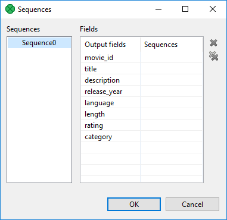
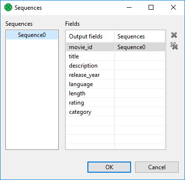
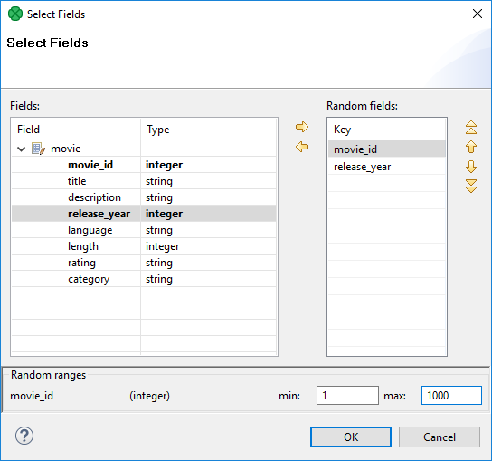

<!-- Development > Component reference > Readers > DataGenerator -->

### DataGenerator


| [Short description](datagenerator.md#short-description) |
| --- |
| [Ports](datagenerator.md#ports) |
| [Metadata](datagenerator.md#metadata) |
| [DataGenerator attributes](datagenerator.md#datagenerator-attributes) |
| [Details](datagenerator.md#details) |
| [CTL interface](datagenerator.md#ctl-interface) |
| [Java interface](datagenerator.md#java-interface) |
| [Examples](datagenerator.md#examples) |
| [Best practices](datagenerator.md#best-practices) |
| [See also](datagenerator.md#see-also) |

#### Short description

**DataGenerator** generates data records using transformation.

| Data source | Input ports | Output ports | Each to all outputs | Different to different outputs | Transformation | Transf. req. | Java | CTL | Auto-propagated metadata |
| --- | --- | --- | --- | --- | --- | --- | --- | --- | --- |
| Generated | 0 | 1-N | **⨯** | **✓** | **✓** | **✓** | **✓** | **✓** | **⨯** |

#### Ports

| Port type | Number | Required | Description | Metadata |
| --- | --- | --- | --- | --- |
| Output | 0 | **✓** | For generated data records | Any |
| 1-N | **⨯** | For generated data records | Any |  |

The component can send different records to different output ports using [Return values of transformations](transformations.md#return-values-of-transformations).

#### Metadata

**DataGenerator** does not propagate metadata.

**Datagenerator** has no metadata template.

Output metadata fields can have any data types.

Metadata on output ports can differ.

Metadata on all output ports can use [Autofilling functions](metadata-records-and-fields.md#autofilling-functions).

#### DataGenerator attributes

| Attribute | Req | Description | Possible values |
| --- | --- | --- | --- |
| Basic |  |  |  |
| Generator | [[1]](datagenerator.md#datagenerator-attributes-fn01) | Definition of the way how records should be generated; written in the graph in CTL or Java. |  |
| Generator URL | [[1]](datagenerator.md#datagenerator-attributes-fn01) | The name of an external file, including path, containing the definition of the way how records should be generated; written in CTL or Java. |  |
| Generator class | [[1]](datagenerator.md#datagenerator-attributes-fn01) | The name of an external class defining the way how records should be generated. |  |
| Generator source charset |  | Encoding of an external file defining the transformation.  The default encoding depends on DEFAULT_SOURCE_CODE_CHARSET in defaultProperties. |  |
| Number of records to generate | yes | Number of records to be generated. A negative number indicates that the number is unknown at design time. See [Generating variable number of records](datagenerator.md#generating-variable-number-of-records). |  |
| Deprecated |  |  |  |
| Record pattern | [[2]](datagenerator.md#datagenerator-attributes-fn02) | String consisting of all fields of generated records that are constant. It does not contain values of random or sequence fields. For more information, see [Record pattern](datagenerator.md#record-pattern). User should define random and sequence fields first. For more information, see [Random fields](datagenerator.md#random-fields) and [Sequence fields](datagenerator.md#sequence-fields). |  |
| Random fields | [[2]](datagenerator.md#datagenerator-attributes-fn02) | Sequence of individual field ranges separated by a semicolon. Individual ranges are defined by their minimum and maximum values. Minimum value is **included** in the range, maximum value is **excluded** from the range.  Numeric data types represent numbers generated at random that are greater than or equal to the minimum value and less than the maximum value. If they are defined by the same value for both minimum and maximum, these fields will equal to such specified value.  Fields of string and byte data type are defined by specifying their minimum and maximum length. For more information, see [Random fields](datagenerator.md#random-fields). Example of one individual field range: `$salary:=random("0","20000")`. |  |
| Sequence fields | [[2]](datagenerator.md#datagenerator-attributes-fn02) | Fields generated by a sequence. They are defined as a sequence of individual field mappings (`$field:=IdOfTheSequence`) separated by a semicolon. The same sequence ID can be repeated and used for more fields at the same time. For more information, see [Sequence fields](datagenerator.md#sequence-fields). |  |
| Random seed | [[2]](datagenerator.md#datagenerator-attributes-fn02) | Sets the seed of this random number generator using a single `long` seed. Assures that values of all fields remain stable on each graph run.  **Random seed** influences field values generated using the **Random fields** attribute only. It does not affect values generated using the **Generator**, **Generator URL** or **Generator class** attributes. To set a random seed there, use the `setRandomSeed()` function. | 0-N |

| 1 |  One of these transformation attributes should be specified instead of the deprecated attributes marked by number 2. However, these new attributes are optional. |
| --- | --- |

| 2 |  These attributes are deprecated now. Define one of the transformation attributes marked by number 1 instead. |
| --- | --- |

#### Details

**DataGenerator** generates data according to a pattern instead of reading data from a file, database, or any other data source. To generate data, a generate transformation may be defined.

It uses a CTL template for **DataGenerator** or implements a `RecordGenerate` interface.

##### DataGenerator deprecated attributes

If you do not define any of these three attributes, you can instead define the fields which should be generated at random (**Random fields**) and by sequence (**Sequence fields**) and fields that are constant (**Record pattern**).

###### Record pattern

Record pattern is a string containing all constant fields (all except random and sequential fields) of the generated records in the form of a delimited (with delimiters defined in metadata on the output port) or fixed length (with sizes defined in metadata on the output port) record.

###### Sequence fields

Sequence fields can be defined in the dialog that opens after clicking the **Sequence fields** attribute. The **Sequences** dialog looks like this:


*Figure 347. Sequences dialog*

This dialog consists of two panes with all graph sequences on the left and all Clover fields (names of the fields in metadata) on the right. Choose the desired sequence on the left and drag and drop it to the right pane to the desired field.

The dialog contains two buttons on its right side. For canceling the selected assigned mapping or all assigned mappings.


*Figure 348. A sequence assigned*
> [!NOTE]
> Remember that it is not necessary (although possible) to assign the same sequence to different Clover fields.

###### Random fields

This attribute defines the values of all fields whose values are generated at random. For each of the fields you can define its range (i.e. minimum and maximum values). These values are of the corresponding data types according to metadata. You can assign random fields in the **Edit key** dialog that opens after clicking the **Random fields** attribute.


*Figure 349. Edit key dialog*

There are the **Fields** pane on the left, the **Random fields** on the right and the **Random ranges** pane at the bottom. In the last pane, you can specify the ranges of the selected random field. There you can type specific values. You can move fields between the **Fields** and **Random fields** panes as was described above - by clicking the **Left arrow** and **Right arrow** buttons.

#### CTL interface

| [CTL templates for DataGenerator](datagenerator.md#ctl-templates-for-datagenerator) |
| --- |
| [Output records or fields](datagenerator.md#output-records-or-fields) |

You can specify a transformation using CTL in **Generator** or **Generator URL** attributes.

This can be done using the **Transformations** tab of the **Transform Editor**. However, you may find that you are unable to specify more advanced transformations using the easiest approach. In such a case, use CTL scripting.

##### CTL Templates for DataGenerator

This transformation template is used only in **DataGenerator**.

Once you have written your transformation in CTL, you can also convert it to the Java language code by using a corresponding button at the upper right corner of the tab.

| CTL Template Functions |  |
| --- | --- |
| **boolean init()** |  |
| Required | No |
| Description | Initialize the component, setup the environment, global variables. |
| Invocation | Called before processing the first record. |
| Returns | `true` \| `false` (if `false`, graph fails) |
| **integer generate()** |  |
| Required | yes |
| Input Parameters | none |
| Returns | Integer numbers. For detailed information, see [Return values of transformations](transformations.md#return-values-of-transformations). Note that when [Generating variable number of records](datagenerator.md#generating-variable-number-of-records), `STOP` is NOT used to indicate an error, but to finish the generation successfully. |
| Invocation | Called repeatedly for each output record |
| Description | Defines the structure and values of all fields of output record.  If `generate()` fails and the user has not defined any `generateOnError()`, the whole graph will fail.  If any part of the `generate()` function for some output record causes fail of the `generate()` function, and if the user has defined another function (`generateOnError()`), processing continues in this `generateOnError()` at the place where `generate()` failed.  The `generateOnError()` function gets the information gathered by `generate()` that was received from previously successfully processed code. Also an error message and stack trace are passed to `generateOnError()`. |
| Example | ```ctl function integer generate() {    string myTestString = iif(randomBoolean(),"1","abc");    $out.0.name = randomString(3,5) + " " + randomString(5,7);    $out.0.salary = randomInteger(20000,40000);    $out.0.testValue = str2integer(myTestString);    return ALL; } ``` |
| **integer generateOnError(string errorMessage, string stackTrace)** |  |
| Required | no |
| Input Parameters | `string errorMessage` |
| `string stackTrace` |  |
| Returns | Integer numbers. For detailed information, see [Return values of transformations](transformations.md#return-values-of-transformations). |
| Invocation | Called if `generate()` throws an exception. |
| Description | Defines the structure and values of all fields of an output record.  If any part of the `generate()` function for some output record causes fail of the `generate()` function, and if the user has defined another function (`generateOnError()`), processing continues in this `generateOnError()` at the place where `generate()` failed.  The `generateOnError()` function gets the information gathered by `generate()` that was received from previously successfully processed code. Also an error message and stack trace are passed to `generateOnError()`. |
| Example | ```ctl function integer generateOnError(                       string errorMessage,                       string stackTrace) {    $out.0.name = randomString(3,5) + " " + randomString(5,7);    $out.0.salary = randomInteger(20000,40000);    $out.0.stringTestValue = "myTestString is abc";    return ALL; } ``` |
| **string getMessage()** |  |
| Required | No |
| Description | Prints an error message specified and invoked by the user (called only when either `generate()` or `generateOnError()` returns a value less than or equal to -2). |
| Invocation | Called in any time specified by the user. |
| Returns | `string` |
| **void preExecute()** |  |
| Required | No |
| Input parameters | None |
| Returns | `void` |
| Description | May be used to allocate and initialize resources required by the generate. All resources allocated within this function should be released by the `postExecute()` function. |
| Invocation | Called during each graph run before the transformation is executed. |
| **void postExecute()** |  |
| Required | No |
| Input parameters | None |
| Returns | `void` |
| Description | Should be used to free any resources allocated within the `preExecute()` function. |
| Invocation | Called during each graph run after the entire transformation is executed. |

##### Output records or fields

Output records or fields are accessible within the `generate()` and `generateOnError()` functions only.
> [!WARNING]
> All of the other CTL template functions do not allow to access outputs.
>
> Remember that if you do not hold these rules, NullPointerException will be thrown.

#### Java interface

The transformation implements methods of the `RecordGenerate` interface and inherits other common methods from the `Transform` interface. See [Common Java interfaces](transformations.md#common-java-interfaces). You can use [Public CloverDX API](genericcomponent.md#public-cloverdx-api), too.

Following are the methods of `RecordGenerate` interface:

- `boolean init(Properties parameters, DataRecordMetadata[] targetMetadata)`
  Initializes generate class/function. This method is called only once at the beginning of the generate process. Any object allocation/initialization should happen here.
- `int generate(DataRecord[] target)`
  Performs generator of target records. This method is called as one step in generate flow of records.
  > [!NOTE]
  > This method allows to distribute different records to different connected output ports according to the value returned for them. For more information about return values and their meaning, see [Return values of transformations](transformations.md#return-values-of-transformations).
- `int generateOnError(Exception exception, DataRecord[] target)`
  Performs generator of target records. This method is called as one step in generate flow of records. Called only if `generate(DataRecord[])` throws an exception.
- `void signal(Object signalObject)`
  Method which can be used for signaling into generator that something outside has happened.
- `Object getSemiResult()`
  Method which can be used for getting intermediate results out of generation. May or may not be implemented.

#### Examples

##### Generating variable number of records

Sometimes the number of records to be generated is not known at design time. In such a case, set the value of the **Number of records to generate** attribute to a negative number. The component will then generate records until the `generate()` function returns `STOP` (in this case, it is not considered an error). This works for transformations defined both in Java and CTL.
> [!WARNING]
> Note that in the last iteration when `STOP` is returned, no records will be sent to any of the output ports.
Example 368. Generating variable number of records in CTL

```ctl
integer total = randomInteger(1, 100);
integer counter = 0;

// Generates output record.
function integer generate() {
    counter++;

    if (counter > total) {
        printLog(info, "Terminating");
        return STOP;
    }

    if ((counter % 10) == 0) {
        printLog(info, "Skipping record # " + counter);
        return SKIP;
    }

    $out.0.value = "Record # " + counter;

    return OK;
}
```

##### Generating random values with fixed random seed

Sometimes you need to generate random values in a graph and it should be possible to rerun it again returning the same values. This might be useful, for example, for tests.

The solution is to set the random seed for random number generator to some fixed value.
Example 369. Generating random values with fixed random seed

```ctl
function boolean init() {
    setRandomSeed(1231056256);
    return true;
}

function integer generate() {
    $out.0.value = randomInteger(0,199);

    return OK;
}
```

#### Best practices

If **Generator URL** is used, we recommend users to explicitly specify **Generator source charset**.

#### See also

| [Trash](trash.md) |
| --- |
| [Common properties of components](components.md#common-properties-of-components) |
| [Specific attribute types](components.md#specific-attribute-types) |
| [Common properties of Readers](common-of-readers.md) |
| [Readers comparison](common-of-readers.md#readers-comparison) |
