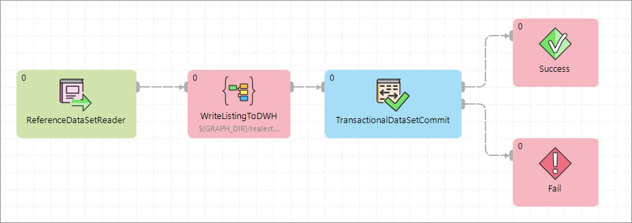

<!-- Development > Component reference > Readers > TransactionalDataSetReader -->

### TransactionalDataSetReader

| [Short description](datasetreader.md#short-description) |
| --- |
| [Ports](datasetreader.md#ports) |
| [Metadata](datasetreader.md#metadata) |
| [Attributes](datasetreader.md#transactionaldatasetreader-attributes) |
| [Details](datasetreader.md#details) |
| [Unloading data from Data Manager](datasetreader.md#unloading-data-from-data-manager) |
| [See also](datasetreader.md#see-also) |

#### Short description

**TransactionalDataSetReader** reads records from the specified transactional data set in the Data Manager.
> [!NOTE]
> This component must run in a server project within a CloverDX Server environment that has either a **locally configured Data Manager** or is set up to access a **Data Manager remotely**. For more information, refer [here](../admin/data-manager-administration.md#data-manager-configuration).

| Data source | Input ports | Output ports | Each to all outputs | Different to different outputs | Transformation | Transf. req. | Java | CTL | Auto-propagated metadata |
| --- | --- | --- | --- | --- | --- | --- | --- | --- | --- |
| Any transactional data set in Data Manager | 0 | 1 | **⨯** | **⨯** | **✓** | **⨯** | **⨯** | **✓** | **✓** |

#### Ports

| Port type | Number | Required | Description | Metadata |
| --- | --- | --- | --- | --- |
| Output | 0 | **✓** | For the data read from the selected data set. | Auto-propagated based on the layout of the selected data set.  Custom metadata and **Output mapping** can also be used. |

#### Metadata

The **TransactionalDataSetReader** component propagates metadata on the output port. Metadata is created based on the layout of the selected data set.

If different metadata is used, the mapping from data set’s metadata to the metadata on the output port can be done via the **Output mapping** component attribute.

#### TransactionalDataSetReader attributes

| Attribute | Req | Description | Possible values |
| --- | --- | --- | --- |
| Basic |  |  |  |
| Data Set | **✓** | Data set to read from. Clicking on the **Edit set** button will show all transactional data sets that are accessible to your user (when using a local Data Manager connection) or to the user configured in the remote connection (when using a remote Data Manager connection). See [Data set permissions in Data Manager](../user/data-manager-introduction.md#data-set-permissions).  Data set is identified by its code. The code is assigned to the data set when it is created and does not change when the data set is renamed. |  |
| Record status |  | Allows you to filter the records based on their status. Default value is *Approved*. | All (any status)  New  Edited **Approved** (default)  Committed |
| Include deleted |  | Configure whether to include records marked as deleted when reading from the data set.  The default value is “false” – deleted records are not included in the data returned by the component. | `false` (default) `true` |
| Complete batches only |  | Configure whether to include only batches that have all records in Approved or Committed status.  If this is disabled, records are read from batches regardless of the overall batch status.  If this is enabled, records from batch are read only if all records in given batch are approved.  This setting cannot be used on data sets that do not have batching enabled – the component will fail in such case. Default is false (disabled). | `false` (default) `true` |
| Output mapping |  | Allows you to map data read from the data set to the output port. By default, this is set to *Map by name* and fields with matching names and types will be mapped automatically. This is consistent with the common usage where the metadata on output port 0 is auto-propagated and will match the data set exactly. |  |
| Advanced |  |  |  |
| Max number of records |  | Configure how many records to read from the data set. If the data set contains fewer matching records than specified, the component will finish once it reads all of them – it will not wait for the data set to grow. If this attributed is left empty, all records from the data set will be read. |  |

#### Details

**TransactionalDataSetReader** connects to an instance of Data Manager running on the same Server as the component and returns data from the selected transactional data set. The component is intended for usage in “post-processing” jobs which read data from the Data Manager and load the data to the target system.

#### Unloading data from Data Manager

The basic pattern for reading data from Data Manager is to use **TransactionalDataSetReader** component followed by any components implementing the logic for the data and then followed by the **TransactionalDataSetCommit** to mark the records as fully processed.

As an example, a simple job pulling data from the Data Manager may look like this:

*Figure 372. A simple job that reads data from Data Manager, loads the records to the data warehouse and then informs the Data Manager that those records have been fully processed.*

**TransactionalDataSetReader** must be used together with **TransactionalDataSetCommit** component to mark the records processed with the reader as Committed. If this is not done, the records will stay in *Approved* status and will never be purged from the Data Manager.

The job above first reads data from the specified data set with the **TransactionalDataSetReader**, then loads the records to the warehouse and finally notifies the Data Manager that the records were successfully processed by setting their status to Committed with the **TransactionalDataSetCommit**.

Note how the **TransactionalDataSetCommit** is in phase 5 while the **TransactionalDataSetReader** and **WriteListingToDWH** are both in phase 0. This two-phase approach is necessary since it is possible that the records that are read from the data set do not make it to their destination – for example, they may be rejected by an API, or the target system may be unavailable when the job runs etc.

In such cases, the records will not be marked as Committed in the data set and will be picked up again next time the job runs.

#### See also

| [TransactionalDataSetWriter](datasetwriter.md) |
| --- |
| [TransactionalDataSetCommit](datasetcommit.md) |
| [ReferenceDataSetReader](referencedatasetreader.md) |
| [ReferenceDataSetWriter](referencedatasetwriter.md) |
