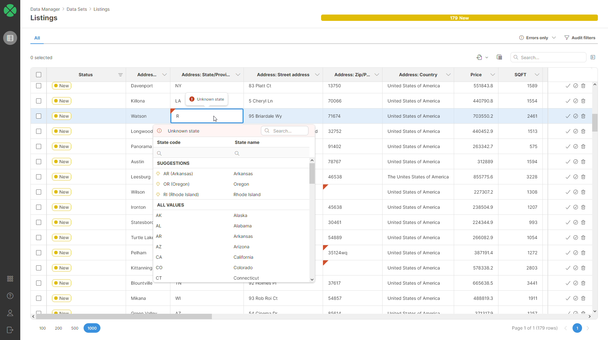

<!-- Development > Component reference > Writers > TransactionalDataSetWriter -->

### TransactionalDataSetWriter


| [Short description](datasetwriter.md#short-description) |
| --- |
| [Ports](datasetwriter.md#ports) |
| [Metadata](datasetwriter.md#metadata) |
| [Attributes](datasetwriter.md#transactionaldatasetwriter-attributes) |
| [Details](datasetwriter.md#details) |
| [Submitting information about errors to the data set](datasetwriter.md#submitting-information-about-errors-to-the-data-set) |
| [See also](datasetwriter.md#see-also) |

#### Short description

**TransactionalDataSetWriter** writes records to the specified transactional data set in the Data Manager.
> [!NOTE]
> This component must run in a server project within a CloverDX Server environment that has either a **locally configured Data Manager** or is set up to access a **Data Manager remotely**. For more information, refer [here](../admin/data-manager-administration.md#data-manager-configuration).

| Data output | Input ports | Output ports | Transformation | Transf. req. | Java | CTL | Auto-propagated metadata |
| --- | --- | --- | --- | --- | --- | --- | --- |
| Any transactional data set in Data Manager | 1 | 1 | **✓** | **⨯** | **⨯** | **✓** | **✓** |

#### Ports

| Port type | Number | Required | Description | Metadata |
| --- | --- | --- | --- | --- |
| Input | 0 | **✓** | For the data to write to the data set. | Auto-propagated based on the layout of the selected data set with one extra field called `_messages`.  Custom metadata and **Input mapping** can also be used. |
| Output | 0 | **⨯** | For records successfully written to the data set. | Auto-propagated based on the layout of the selected data set – contains all data set fields with additional field called `_id` which provides the id of the newly inserted record for each record written to the data set.  Custom metadata can be used as well with mapping between data set and the output implemented in **Output mapping**. |

#### Metadata

The **TransactionalDataSetWriter** component propagates metadata on the input port. The input metadata is created based on the layout of the selected data set. If different metadata is used, you can configure the **Input mapping** to map the incoming records to records required by the data set.

#### TransactionalDataSetWriter attributes

| Attribute | Req | Description | Possible values |
| --- | --- | --- | --- |
| Basic |  |  |  |
| Data Set | **✓** | Data set to write to. Clicking on the **Edit set** button will show all transactional data sets that your user (when using a local Data Manager connection) or the user configured in the remote connection (when using a remote Data Manager connection) has permission to edit. See [Data set permissions in Data Manager](../user/data-manager-introduction.md#data-set-permissions).  Data set is identified by its code. The code is assigned to the data set when it is created and does not change when the data set is renamed. |  |
| Input mapping |  | Allows you to map incoming records to records in the data set. Default mapping (when nothing is configured) is to map by name. |  |
| Output mapping |  | Allows you to map data written to the data set to the output port. By default, this is set to *Map by name* and fields with matching names and types will be mapped automatically. This is consistent with the common usage where the metadata on output port 0 is auto-propagated and will match the data set exactly. |  |

#### Details

**TransactionalDataSetWriter** connects to an instance of Data Manager running on the same Server as the component and writes (inserts) new records into the selected transactional data set. The component does not perform any validation of the data - the validation must be implemented before and the validation results sent to the component via `_messages` field (see below for more details).

#### Submitting information about errors to the data set

When writing to the data set, you can add information about validation errors to the data. It will be shown in the Data Manager editor with an error marker in the column and error message as a tooltip:


To add this kind of information to the data, you must submit it via `_messages` field. The `_messages` field is of type `variant` and has the following structure:

```ctl
{
  "fieldName1" : {
    "messageText" : "Any message"
  },
  ...
  "fieldNameN" : {
    "messageText" : "Another message"
  }
}
```

In the above structure, each field can have one message attached to it. You can supply any number of fields in the single variant value.

For example, to submit an error message about the state field like on the above screenshot, you can do this:

```ctl
$out.0._messages = {
	"state" -> {
		"messageText" -> "Unknown state"
	}
};
```

This can be done either before the data is submitted to the **TransactionalDataSetWriter** in a `variant` field and then mapped into the `_messages` field or this information can be derived directly in the **Input mapping** in the **TransactionalDataSetWriter** component.

The message itself can be any text – just remember that the text is shown in a tooltip and tooltips that are too long are usually hard to read.

The field name is case sensitive and must match the name of the field in the metadata for the given data set.

The approach will depend on what kind of validation messages you’d like to submit. In many cases you will use additional components to validate your data (e.g., **Validator**, **Map**, etc.) and thus it may make sense to create the messages variant before **TransactionalDataSetWriter**.

Simple validations can be done directly in the **TransactionalDataSetWriter**.

To submit multiple messages simply include multiple fields in the variant. The order in which the fields are listed in the variant does not matter.

```ctl
$out.0._messages = {
	"state" -> {
		"messageText" -> "Unknown state"
	},
	"price" -> {
		"messageText" -> "Price cannot be negative"
	}
};
```

#### Submitting error information with suggestions

To help users when editing data in Data Manager, it is possible to submit **suggestions** together with the messages. Suggestions are only available for columns that are defined as *Restricted to lookup* – i.e., their values can only come from a lookup. See additional information about lookups and their configuration in [Using reference data sets as lookups](../user/data-manager-working-with-reference-data.md#using-reference-data-sets-as-lookups).

The suggestions are displayed when the user clicks into the cell when editing the value. Suggestions are shown as a dropdown or table depending on how the lookup is configured (dropdown is used for lookups with just two columns, table for lookups with more than two columns):


*Figure 411. Suggestions shown when column with an error is clicked. Suggestions are the first three items in the dialog with the lookup values.*

The suggestions can be provided for each field and are stored as a list of items where each item has a `value` and a `label`. The `value` must correspond to the key field value in a lookup used for the given column while the `label` is any text you wish to associate with the given value. Note that the `label` does not have to match the `label` in the lookup - you can use it to provide additional information (e.g., confidence score or anything else that will help users pick the correct value).

The `_messages` variant with the suggestions for a field must have the following structure:

```ctl
{
  "fieldName" : {
    "messageText" : "Any message",
    "suggestions" : [
      {
        "label" : "Suggestion 1 label",
        "value" : <id 1>
      },
      ...
      {
        "label" : "Suggestion N label",
        "value" : <id N>
      }
    ]
  }
}
```

The type of the `value` attribute must match the type of the lookup key column – it can be `string`, `integer`, `date`.

It is possible to submit any number of suggestions, but we recommend submitting 3 as a maximum to not overwhelm the user.

As an example, if you want to submit suggestions for the state in the example above, it may look like this:

```ctl
$out.0._messages = {
	"state" -> {
		"messageText" -> "Unknown state",
		"suggestions" -> [
			{
				"label" -> "CA (California)",
				"value" -> "CA"
			},
			{
				"label" -> "CO (Colorado)",
				"value" -> "CO"
			},
			{
				"label" -> "CT (Connecticut)",
				"value" -> "CT"
			}
		]
	}
};
```

#### See also

| [TransactionalDataSetReader](datasetreader.md) |
| --- |
| [TransactionalDataSetCommit](datasetcommit.md) |
| [ReferenceDataSetReader](referencedatasetreader.md) |
| [ReferenceDataSetWriter](referencedatasetwriter.md) |
