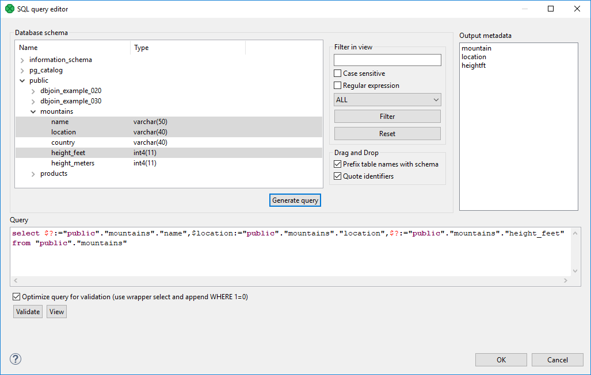
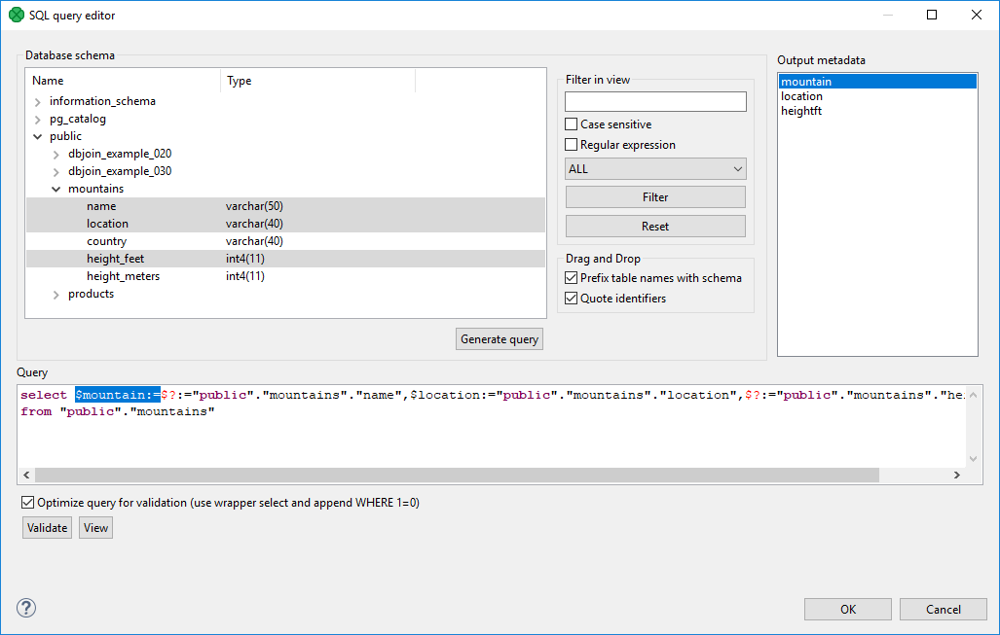
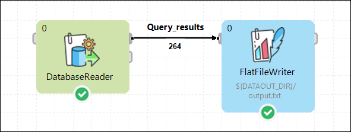
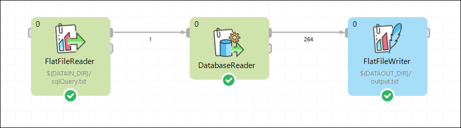
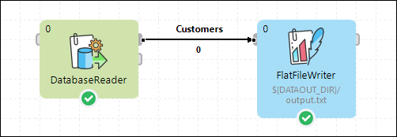
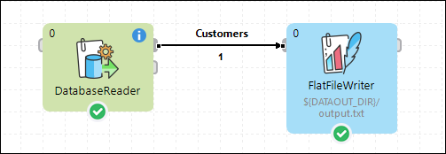

<!-- Development > Component reference > Readers > DatabaseReader -->

### DatabaseReader

| [Short description](dbinputtable.md#short-description) |
| --- |
| [Ports](dbinputtable.md#ports) |
| [Metadata](dbinputtable.md#metadata) |
| [DatabaseReader attributes](dbinputtable.md#databasereader-attributes) |
| [Details](dbinputtable.md#details) |
| [Examples](dbinputtable.md#examples) |
| [Best practices](dbinputtable.md#best-practices) |
| [Compatibility](dbinputtable.md#compatibility) |
| [See also](dbinputtable.md#see-also) |
> [!TIP]
> If you’re interested in learning more about this subject, we offer the [Databases course](https://academy.cloverdx.com/courses/database) in our CloverDX Academy.

#### Short description

**DatabaseReader** unloads data from database using JDBC driver. Supports Amazon Redshift, Microsoft Access, Microsoft SQL Server, MySQL, Oracle, PostgreSQL, Snowflake, SQLite, Sybase, Vertica, DB2 and any other database with JDBC compliant driver.

| Data source | Input ports | Output ports | Each to all outputs | Different to different outputs | Transformation | Transf. req. | Java | CTL | Auto-propagated metadata |
| --- | --- | --- | --- | --- | --- | --- | --- | --- | --- |
| Database | 0-1 | 1-n | **✓** | **⨯** | **⨯** | **⨯** | **⨯** | **⨯** | **⨯** |

#### Ports

| Port type | Number | Required | Description | Metadata |
| --- | --- | --- | --- | --- |
| Input | 0-1 | **⨯** | Incoming queries to be used in the **SQL query** attribute. When the input port is connected, **Query URL** should be specified as e.g. `port:$0.fieldName:discrete`. See [Reading from input port](examples-of-file-url-in-readers.md#reading-from-input-port). |  |
| Output | 0 | **✓** | for correct data records | equal metadata |
| 1-n | **⨯** | for correct data records |  |  |

#### Metadata

DatabaseReader does not propagate metadata.

DatabaseReader has no metadata templates.

Output metadata can use [Autofilling functions](metadata-records-and-fields.md#autofilling-functions)

#### DatabaseReader attributes

| Attribute | Req | Description | Possible values |
| --- | --- | --- | --- |
| Basic |  |  |  |
| DB connection | **✓** | An ID of a database connection to be used to access the database |  |
| SQL query | [[1]](dbinputtable.md#query-dbit) | The SQL query defined in the graph. For detailed information, see [SQL Query Editor](dbinputtable.md#sql-query-editor). |  |
| Query URL | [[1]](dbinputtable.md#query-dbit) | The name of an external file, including the path, defining the SQL query. |  |
| Query source charset |  | Encoding of an external file defining the SQL query.  The default encoding depends on `DEFAULT_CHARSET_DECODER` in defaultProperties. | UTF-8 \| <other encodings> |
| Data policy |  | Determines what should be done when an error occurs. For more information, see [Data policy](data-policy.md). | Strict (default) \| Controlled[[2]](dbinputtable.md#dbinputtable-attributes-controlled) \| Lenient |
| Print statement |  | If enabled, SQL statements will be written to the log. | false (default) \| true |
| Advanced |  |  |  |
| Fetch size |  | Specifies the number of records that should be fetched from the database at once. | 20 \| 1-N |
| Incremental file | [[3]](dbinputtable.md#increment-dbit) | The name of the file storing the incremental key, including the path. See [Incremental reading](incremental-reading.md). |  |
| Incremental key | [[3]](dbinputtable.md#increment-dbit) | A variable storing the position of the last read record. See [Incremental reading](incremental-reading.md). |  |
| Auto commit |  | By default, your SQL queries are committed immediately. If you need to perform more operations inside one transaction, switch this attribute to `false`. | true (default) \| false |

| 1 | At least one of these attributes must be specified. If both are defined, only **Query URL** is applied. |
| --- | --- |

| 2 | **Controlled** data policy in **DatabaseReader** does not send error records to the edge. Errors are written into the log. |
| --- | --- |

| 3 | Either both or neither of these attributes must be specified. |
| --- | --- |

#### Details

**DatabaseReader** unloads data from a database table using an SQL query or by specifying a database table and defining a mapping of database columns to Clover fields. It can send unloaded records to all connected output ports.

**Defining query attributes**

- **Query statement without mapping**
  When the order of **CloverDX** metadata fields and database columns in select statement is the same and data types are compatible, implicit mapping can be used which performs positional mapping. A standard SQL query syntax should be used:
  - `select * from table [where dbfieldJ = ? and dbfieldK = somevalue]`
  - `select column3, column1, column2, … from table [where dbfieldJ = ? and dbfieldK = somevalue]`
  For information about how an **SQL query** can be defined, see [SQL Query Editor](dbinputtable.md#sql-query-editor).
- **Query statement with mapping**
  If you want to map database fields to Clover fields even for multiple tables, the query will look like this:
  `select $cloverfieldA:=table1.dbfieldP, $cloverfieldC:=table1.dbfieldS, … , $cloverfieldM:=table2.dbfieldU, $cloverfieldM:=table3.dbfieldV from table1, table2, table3 [where table1.dbfieldJ = ? and table2.dbfieldU = somevalue]`
  For information about how an **SQL query** can be defined, see [SQL Query Editor](dbinputtable.md#sql-query-editor).

**Dollar sign in DB table name**

- A single dollar sign in a table name must be escaped by another dollar sign; therefore every dollar sign in a database table name will be transformed to a double dollar sign in the generated query. Meaning that each query must contain an even number of dollar signs in the DB table (consisting of adjacent pairs of dollars).

##### SQL Query Editor

For defining the **SQL query** attribute, **SQL query editor** can be used.

The editor opens after clicking the **SQL query** attribute row:

On the left side, there is the **Database schema** pane containing information about schemas, tables, columns, and data types of these columns.

Displayed schemas, tables, and columns can be filtered using the values in the **ALL** combo, **Filter in view** text area, **Filter** and **Reset** buttons, etc.

You can select any columns by expanding schemas, tables and clicking Ctrl+Click on desired columns.

Adjacent columns can also be selected by clicking Shift+Click on the first and the last item.

Then you need to click **Generate** after which a query will appear in the **Query** pane.

*Figure 341. Generated query with question marks*

A query may contain question marks if any DB columns differ from output metadata fields. Output metadata are visible in the **Output metadata** pane on the right side.

Drag and drop the fields from the **Output metadata** pane to the corresponding places in the **Query** pane and then manually remove the "$?:=" characters. See the following figure:

*Figure 342. Generated query with output fields*

You can also type a `where` statement to the query.

The buttons underneath allow you to validate the query (**Validate**) or view data in the table (**View**).

#### Examples

| [Read records from database](dbinputtable.md#read-records-from-database) |
| --- |
| [Read query from input port](dbinputtable.md#read-query-from-input-port) |

##### Read records from database

By generating a query in **DatabaseReader**, read the name, location and height in feet of mountains from the MountainsDB database.

###### Solution

Use the **DB connection** and **SQL query** attributes.

| Attribute | Value |
| --- | --- |
| DB connection | See [Creating internal database connections](database-connections.md#creating-internal-database-connections). |
| SQL query | Use the **Generate query** button in the SQL query editor. |

*Figure 343. Reading records from database*

In the **output metadata**, create the name, location and heightft fields. Set their data types to string, string and integer respectively.

Click on the **SQL query** property and open the **SQL query editor**. Select the MountainDB database in the **Database schema** pane.

Select the mountain, location and heightft fields and click the **Generate query** button.
> [!NOTE]
> If the output metadata fields have different names and/or data types, the generated query will contain question mark(s). See [SQL Query Editor](dbinputtable.md#sql-query-editor).
> [!TIP]
> You can modify the generated query by adding other keywords, e.g. ASC, DESC, etc.

You can **validate** the generated query and **view** the results by clicking the respective buttons in the lower left side of the **SQL query editor**.

Set the **File URL** path of the **FlatFileWriter** to the external file.

##### Read query from input port

A query is automatically generated into an external file. Read the query from the file and write the results into another file.

###### Solution

Use the **DB connection** and **Query URL** attributes.

| Attribute | Value |
| --- | --- |
| DB connection | See [Creating internal database connections](database-connections.md#creating-internal-database-connections). |
| Query URL | port:$0.field1:discrete |

*Figure 344. Reading query from input port*

Set the **File URL** path of the **FlatFileReader** to the external file containing the query.

According to the table above, set the **DB connection** and **Query URL** attributes of the **DatabaseReader**.

Set the **File URL** path of the **FlatFileWriter** to an external file of your choice.

Input metadata should contain one field in which the query will be written.

Output metadata should contain a number of fields equivalent to columns selected in the query.
> [!TIP]
> Make sure that the **EOF as delimiter** property in the input metadata is set to `true`.
> [!NOTE]
> **DatabaseReader** can only read one query per source file.

##### Incremental reading

[Incremental reading](incremental-reading.md) allows you to read only new records from a database. This can be done by setting the **Incremental key** and **Incremental file** attributes, and editing the **Query** attribute.

Let us have a database of customers. Each row in the database consists of an **id**, **date**, **first name** and **last name**, for example:
1|2018-02-01 23:58:02|Rocky|Whitson 2|2018-02-01 23:59:56|Marisa|Callaghan 3|2018-03-01 00:03:12|Yaeko|Gonzale 4|2018-03-01 00:15:41|Jeana|Rabine 5|2018-03-01 00:32:22|Daniele|Hagey
Read the records, then add a new record to the database and run the graph again reading only the new record.

###### Solution

In the output metadata, create the **id**, **date**, **firstName** and **lastName** fields. Set their data types to integer, date, string and string, respectively.

Use the **Incremental key** and **Incremental file** attributes, and modify the **SQL query** to use the incremental key:

| Attribute | Value |
| --- | --- |
| Incremental key | key01="LAST(id)!5" [[1]](dbinputtable.md#dbinputtable-incremental-read-fn-01) |
| Incremental file | ${DATATMP_DIR}/customers_inc_key |
| SQL query | Add the `where id > #key01` condition to your query. |

| 1 | Follow the instructions in [Incremental reading](incremental-reading.md) to create the **Incremental key** and edit the **Query** attribute. |
| --- | --- |

After the first read, the output file contains 0 records.

*Figure 345. Incremental reading - first read*

Now, add a new record to the database, for example:
6|2018-03-01 00:51:31|Nathalie|Mangram
and run the graph again.

This time, one new record is written to the output file, ignoring the previously processed records.

*Figure 346. Incremental reading - second read*

#### Best practices

If the **Query URL** attribute is used, we recommend to explicitly specify the **Query source charset**.

#### Compatibility

| Version | Compatibility Notice |
| --- | --- |
| 5.3.0 | **DBInputTable** was renamed to **DatabaseReader**. |

#### See also

| [DatabaseWriter](dboutputtable.md) |
| --- |
| [DBExecute](dbexecute.md) |
| [Common properties of components](components.md#common-properties-of-components) |
| [Specific attribute types](components.md#specific-attribute-types) |
| [Common properties of Readers](common-of-readers.md) |
| [Readers comparison](common-of-readers.md#readers-comparison) |
| [Database connections](database-connections.md) |
