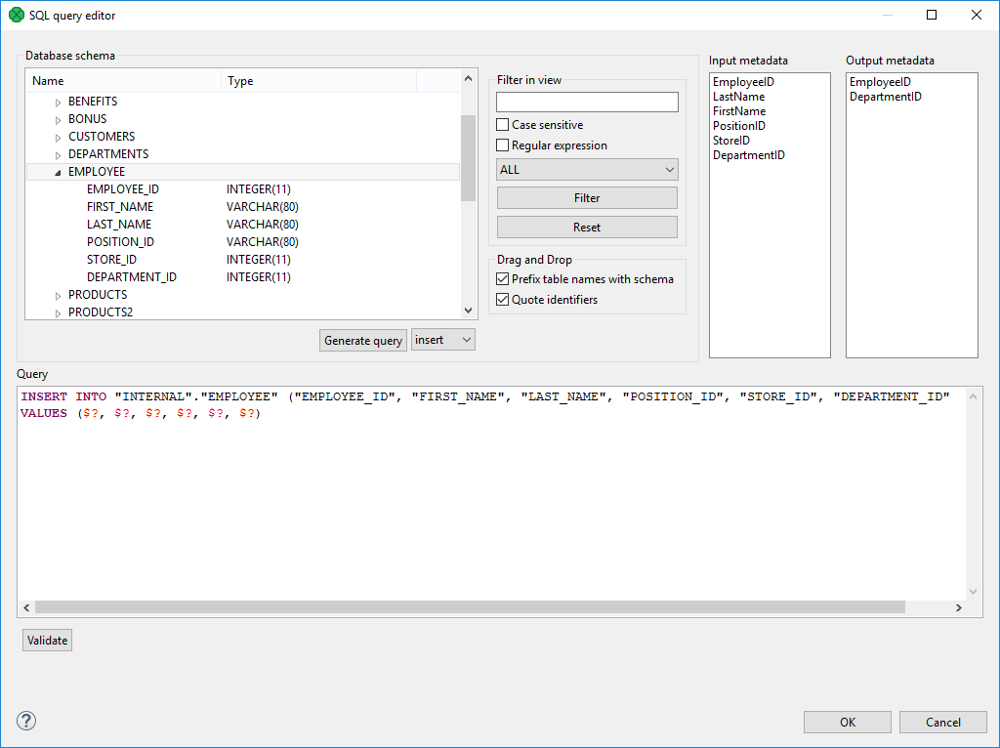
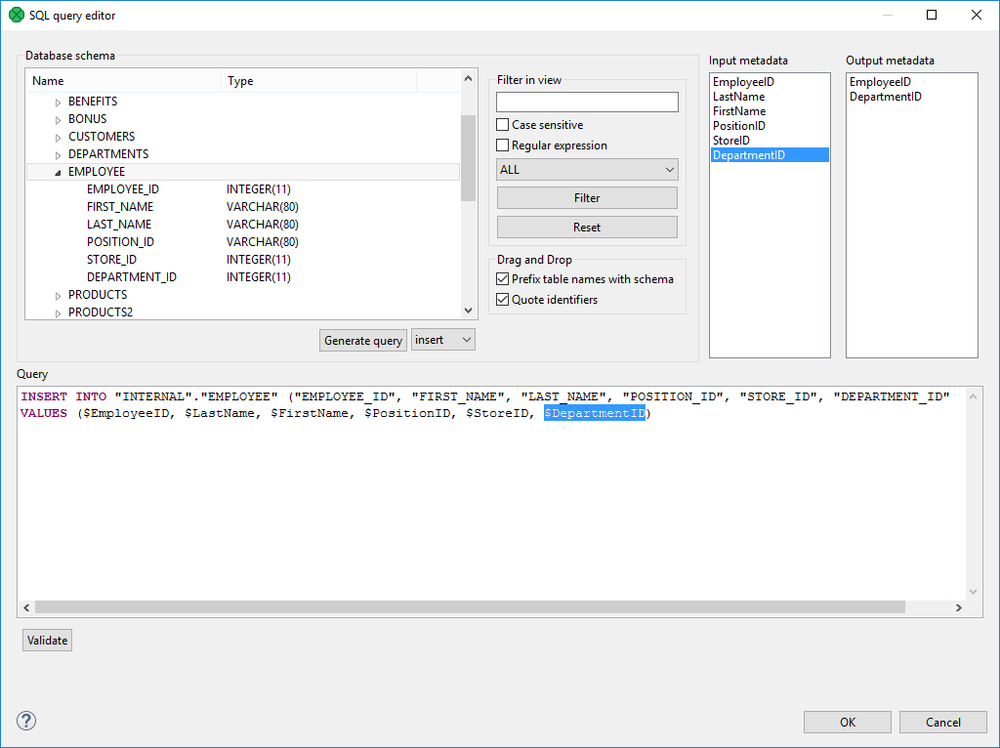
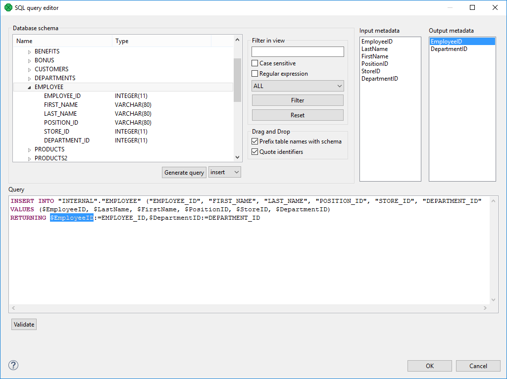

<!-- Development > Component reference > Writers > DatabaseWriter -->

### DatabaseWriter


| [Short description](dboutputtable.md#short-description) |
| --- |
| [Ports](dboutputtable.md#ports) |
| [Metadata](dboutputtable.md#metadata) |
| [DatabaseWriter attributes](dboutputtable.md#databasewriter-attributes) |
| [Details](dboutputtable.md#details) |
| [Examples](dboutputtable.md#examples) |
| [Best practices](dboutputtable.md#best-practices) |
| [Compatibility](dboutputtable.md#compatibility) |
| [See also](dboutputtable.md#see-also) |
> [!TIP]
> If you’re interested in learning more about this subject, we offer the [Databases course](https://academy.cloverdx.com/courses/database) in our CloverDX Academy.

#### Short description

**DatabaseWriter** loads data into a database using a JDBC driver. Supports Amazon Redshift, Microsoft Access, Microsoft SQL Server, MySQL, Oracle, PostgreSQL, Snowflake, SQLite, Sybase, Vertica, DB2 and any other database with JDBC compliant driver.

| Data output | Input ports | Output ports | Transformation | Transf. required | Java | CTL | Auto-propagated metadata |
| --- | --- | --- | --- | --- | --- | --- | --- |
| database | 1 | 0-2 | **⨯** | **⨯** | **⨯** | **⨯** | **⨯** |

#### Ports

| Port type | Number | Required | Description | Metadata |
| --- | --- | --- | --- | --- |
| Input | 0 | **✓** | Records to be loaded into the database | Any |
| Output | 0 | **⨯** | For rejected records | Based on Input 0 |
| 1 | **⨯** | For returned values | Any |  |

This component has one input port and two optional output ports. These output ports can be used for records that have been rejected by database table (first one) and/or for so called auto-generated columns (second one) (supported by some database systems only).

#### Metadata

**DatabaseWriter** propagates metadata from the first input port to the first output port. It propagates metadata only if the **SQL query**, **Query URL** or **DB table** attribute is defined.

The component adds the **ErrCode** and **ErrText** fields to propagated metadata.

Metadata on the output port 0 may contain any number of fields from input (same names and types) along with up to two additional fields for error information. Input metadata are mapped automatically according to their name(s) and type(s). The two error fields may have any names and must be set to the following [Autofilling functions](metadata-records-and-fields.md#autofilling-functions): `ErrCode` and `ErrText`.

Metadata on the output port 1 must include at least the fields returned by the `returning` statement specified in the query (for example, `returning $outField1:=$inFieldA,$outField2:=update_count,$outField3:=$inFieldB`). Remember that fields are not mapped by names automatically. Mapping must always be specified in the `returning` statement. The number of returned records is equal to the number of incoming records.

#### DatabaseWriter attributes

| Attribute | Req | Description | Possible values |
| --- | --- | --- | --- |
| Basic |  |  |  |
| DB connection | **✓** | The ID of a DB connection to be used. See [Database connections](database-connections.md). |  |
| SQL query | [[1]](dboutputtable.md#dbout-sql) | The SQL query defined in the graph. For more information, see [Mapping Clover fields to database fields](dboutputtable.md#mapping-clover-fields-to-database-fields). See also [SQL Query Editor](dboutputtable.md#sql-query-editor). |  |
| Query URL | [[1]](dboutputtable.md#dbout-sql) | The name of an external file, including a path, defining an SQL query. For more information, see [Mapping Clover fields to database fields](dboutputtable.md#mapping-clover-fields-to-database-fields). We recommend to put SQL scripts into a separate directory, e.g. `${PROJECT}/sql`. | e.g. `${PROJECT}/sql/insert.sql` |
| Query source charset |  | Encoding of an external file defining an SQL query.  The default encoding depends on DEFAULT_CHARSET_DECODER in defaultProperties. | UTF-8 \| <other encodings> |
| DB table | [[1]](dboutputtable.md#dbout-sql) | The name of a DB table. For more information, see [Mapping Clover fields to database fields](dboutputtable.md#mapping-clover-fields-to-database-fields). |  |
| Field mapping | [[2]](dboutputtable.md#dbout-map) | A sequence of individual mappings (`$CloverField:=DBField`) separated by a semicolon, colon, or pipe. For more information, see [Mapping of Clover fields to DB fields](dboutputtable.md#mapping-of-clover-fields-to-db-fields). |  |
| Clover fields | [[2]](dboutputtable.md#dbout-map) | Sequence of Clover fields separated by a semicolon, colon, or pipe. For more information, see [Mapping of Clover fields to DB fields](dboutputtable.md#mapping-of-clover-fields-to-db-fields). |  |
| DB fields | [[2]](dboutputtable.md#dbout-map) | A sequence of DB fields separated by a semicolon, colon, or pipe. For more information, see [Mapping of Clover fields to DB fields](dboutputtable.md#mapping-of-clover-fields-to-db-fields). |  |
| Batch mode |  | In batch mode, one SAVEPOINT statement is inserted after several INSERT statements.  Batch mode is supported by some databases only.  By default, batch mode is not used. For more information, see [Batch mode and batch size](dboutputtable.md#batch-mode-and-batch-size). | false (default) \| true |
| Advanced |  |  |  |
| Batch size |  | The number of records that can be sent to a database in one batch update. For more information, see [Batch mode and batch size](dboutputtable.md#batch-mode-and-batch-size). | 25 (default) \| 1-N |
| Commit |  | Defines after how many records (without an error) a commit is performed.  If the set value is higher than the number of records the component receives, the records are committed in the same phase.  If set to `MAX_INT`, the commit is never performed by the component, i.e. not until the connection is closed during graph freeing.  This attribute is ignored if **Atomic SQL query** is defined. | 100 (default) \| 1-MAX_INT |
| Max error count |  | The maximum number of allowed records. When this number is exceeded, the graph fails. By default, no error is allowed. If set to `-1`, all errors are allowed. For more information, see [Errors](dboutputtable.md#errors). | 0 (default) \| 1-N \| -1 |
| Action on error |  | By default, when the number of errors exceeds **Max error count**, correct records are committed into the database. If set to `ROLLBACK`, no commit of the current batch is performed. For more information, see [Errors](dboutputtable.md#errors). | COMMIT (default) \| ROLLBACK |
| Atomic SQL query |  | Sets atomicity of executing SQL queries. If set to `true`, all SQL queries for one record are executed as an atomic operation, but the value of the **Commit** attribute is ignored and the commit is performed after each record. For more information, see [Atomic SQL Query](dboutputtable.md#atomic-sql-query). | false (default) \| true |

| 1 | One of these attributes must be specified. If more are defined, **Query URL** has the highest priority and **DB table** the lowest one. For more information, see [Mapping Clover fields to database fields](dboutputtable.md#mapping-clover-fields-to-database-fields). |
| --- | --- |

| 2 |  For more information about their relation, see [Mapping of Clover fields to DB fields](dboutputtable.md#mapping-of-clover-fields-to-db-fields). |
| --- | --- |

#### Details

| [Using the DatabaseWriter](dboutputtable.md#using-the-databasewriter) |
| --- |
| [Mapping Clover fields to database fields](dboutputtable.md#mapping-clover-fields-to-database-fields) |
| [SQL Query Editor](dboutputtable.md#sql-query-editor) |
| [Batch mode and batch size](dboutputtable.md#batch-mode-and-batch-size) |
| [Errors](dboutputtable.md#errors) |
| [Atomic SQL Query](dboutputtable.md#atomic-sql-query) |
| [Notes and limitations](dboutputtable.md#notes-and-limitations) |

**DatabaseWriter** loads data into a database using a JDBC driver. It can also send out rejected records and generate auto-generated columns for some of the available databases.

##### Using the DatabaseWriter

To insert data with **DatabaseWriter**, create a database connection and specify an SQL query.

##### Mapping Clover fields to database fields

You can map Clover fields to database fields either by query or using a table name.

- **A Query is Defined (SQL Query or Query URL)**
  The query can be defined in two ways: it may either contain Clover fields or question marks.

- **The Query Contains Clover Fields**
  Clover fields are inserted into the specified positions of DB table.
  This is the simplest and most explicit way of defining the mapping of Clover and DB fields. No other attributes can be defined.
  See also [SQL Query Editor](dboutputtable.md#sql-query-editor).
- **The Query Contains Question Marks**
  Question marks serve as placeholders for Clover field values in one of the ways shown below. For more information, see [Mapping of Clover fields to DB fields](dboutputtable.md#mapping-of-clover-fields-to-db-fields).
  See also [SQL Query Editor](dboutputtable.md#sql-query-editor).
  Example 376. Examples of Insert Queries
  | Statement | Form |
  | --- | --- |
  | **Infobright, Informix, MSSQL2008 or newer, MSSQL2000-2005, MySQL, Sybase[[1]](dboutputtable.md#dboutputtable-footnote3)** |  |
  | insert (with clover fields) | ``` INSERT INTO mytable [(dbf1,dbf2,...,dbfn)] VALUES ($in0field1, constant1, id_seq.nextvalue, $in0field2, ..., constantk, $in0fieldm) [returning $out1field1 := $in0field3[, $out1field2 := auto_generated][, $out1field3 := $in0field7]] ``` |
  | insert (with question marks) | ``` INSERT INTO mytable [(dbf1,dbf2,...,dbfn)] VALUES (?, ?, id_seq.nextval, ?, constant1, ?, ?, ?, ?, ?, constant2, ?, ?, ?, ?, ?) [returning $out1field1 := $in0field3[, $out1field2 := auto_generated][, $out1field3 := $in0field7]] ``` |
  | **DB2, Oracle, PostgreSQL[[2]](dboutputtable.md#dboutputtable-footnote4)** |  |
  | insert (with clover fields) | ``` INSERT INTO mytable [(dbf1,dbf2,...,dbfn)] VALUES ($in0field1, constant1, id_seq.nextvalue, $in0field2, ..., constantk, $in0fieldm) [returning $out1field1 := dbf3[, $out1field3 := $in0field2]] ``` |
  | insert (with question marks) | ``` INSERT INTO mytable [(dbf1,dbf2,...,dbfn)] VALUES (?, ?, id_seq.nextval, ?, constant1, ?, ?, ?, ?, ?, constant2, ?, ?, ?, ?, ?) [returning $out1field1 := dbf3[, $out1field3 := $in0field2]] ``` |
  | **SQLite[[3]](dboutputtable.md#dboutputtable-footnote5)** |  |
  | insert (with clover fields) | ``` INSERT INTO mytable [(dbf1,dbf2,...,dbfn)] VALUES ($in0field1, constant1, id_seq.nextvalue, $in0field2, ..., constantk, $in0fieldm) ``` |
  | insert (with question marks) | ``` INSERT INTO mytable [(dbf1,dbf2,...,dbfn)] VALUES (?, ?, id_seq.nextval, ?, constant1, ?, ?, ?, ?, ?, constant2, ?, ?, ?, ?, ?) ``` |
  | 1 |  These databases generate a virtual field called `auto_generated` and map it to one of the output metadata fields as specified in the `insert` statement. |
  | --- | --- |
  | 2 |  These databases return multiple database fields and map them to the output metadata fields as specified in the `insert` statement. |
  | --- | --- |
  | 3 |  These databases do not return anything in the `insert` statement. |
  | --- | --- |
  Example 377. Examples of Update and Delete Queries
  | Statement | Form |
  | --- | --- |
  | **All databases[[1]](dboutputtable.md#dboutputtable-footnote6)** |  |
  | update | ``` UPDATE mytable SET dbf1 = $in0field1, ..., dbfn = $in0fieldn [returning $out1field1 := $in0field3[, $out1field2 := update_count][, $out1field3 := $in0field7]] ``` |
  | delete | ``` DELETE FROM mytable WHERE dbf1 = $in0field1 AND ... AND dbfj = ? AND dbfn = $in0fieldn ``` |
  | 1 |  In the `update` statement, along with the value of the `update_count` virtual field, any number of input metadata fields may be mapped to output metadata fields in all databases. |
  | --- | --- |
  > [!IMPORTANT]
  > Remember that the default (**Generic**) JDBC specific does not support auto-generated keys.
  - **A DB Table is Defined**
    The mapping of Clover fields to DB fields is defined as shown below. For more information, see [Mapping of Clover fields to DB fields](dboutputtable.md#mapping-of-clover-fields-to-db-fields).

###### Dollar sign in DB table name

- A single dollar sign in a table name must be escaped by another dollar sign; therefore, every dollar sign in a database table name will be transformed to double dollar signs in the generated query. Meaning that each query must contain an even number of dollar signs in the DB table (consisting of adjacent pairs of dollars).
  Table whose name is `my$table$` is converted in the query to `mytable`.

###### Mapping of Clover fields to DB fields

- **Field mapping is defined**
  If a **Field mapping** is defined, the value of each Clover field specified in this attribute is inserted to such DB field to whose name this Clover field is assigned in the **Field mapping** attribute.
  Pattern of **Field mapping**:
  `$CloverFieldA:=DBFieldA;…;$CloverFieldM:=DBFieldM`
- **Both Clover fields and DB fields are defined**
  If both **Clover fields** and **DB fields** are defined (but **Field mapping** is not), the value of each Clover field specified in the **Clover fields** attribute is inserted to such DB field which lies on the same position in the **DB fields** attribute.
  The number of Clover fields and DB fields in both of these attributes must be equal. The number of either part must equal to the number of DB fields that are not defined in any other way (by specifying Clover fields prefixed by dollar sign, db functions, or constants in the query).
  Pattern of **Clover fields**:
  `CloverFieldA;…;CloverFieldM`
  Pattern of **DB fields**:
  `DBFieldA;…;DBFieldM`
- **Only Clover fields are defined**
  If only the **Clover fields** attribute is defined (but **Field mapping** and/or **DB fields** are not), the value of each Clover field specified in the **Clover fields** attribute is inserted to such DB field whose position in DB table is equal.
  The number of Clover fields specified in the **Clover fields** attribute must equal to the number of DB fields in DB table that are not defined in any other way (by specifying Clover fields prefixed by a dollar sign, DB functions, or constants in the query).
  Pattern of **Clover fields**:
  `CloverFieldA;…;CloverFieldM`
- **Mapping is performed automatically**
  If neither **Field mapping**, **Clover fields** nor **DB fields** are defined, the whole mapping is performed automatically. The value of each Clover field of Metadata is inserted into the same position in the DB table.
  The number of all Clover fields must equal to the number of DB fields in DB table that are not defined in any other way (by specifying Clover fields prefixed by a dollar sign, DB functions, or constants in the query).

##### SQL Query Editor

For defining the **SQL query** attribute, **SQL query editor** can be used.

The editor opens after clicking the **SQL query** attribute row:

On the left side, there is the **Database schema** pane containing information about schemas, tables, columns, and data types of these columns.

Displayed schemas, tables, and columns can be filtered using the values in the **ALL** combo, the **Filter in view** textarea, the **Filter**, and **Reset** buttons, etc.

You can select any columns by expanding schemas, tables and clicking Ctrl+Click on desired columns.

Adjacent columns can also be selected by clicking Shift+Click on the first and the last item.

###### Using SQL Query Editor

Select one of the following statements from the combo: **insert**, **update**, **delete**.

Then use **Generate** button. A query will appear in the **Query** pane.


*Figure 382. Generated query with question marks*

The query may contain question marks if any db columns differ from input metadata fields. Input metadata are visible in the **Input metadata** pane on the right side.

Drag and drop the fields from the **Input metadata** pane to the corresponding places in the **Query** pane and manually remove the "$?" characters. See the following figure:


*Figure 383. Generated query with input fields*

If there is an edge connected to the second output port, autogenerated columns and returned fields can be returned.


*Figure 384. Generated query with returned fields*

Two buttons allow you to validate the query (**Validate**) or view data in the table (**View**).

##### Batch mode and batch size

Batch mode speeds up loading of data into database.
> [!NOTE]
> Returning statement is not available in the batch mode.

Remember that some databases return more records as rejected than what would correspond to their real number. These databases return even those records which have been loaded into database successfully and send them out through the output port 0 (if connected).

1. **Batch mode**
   Enables or disables batch mode
2. **Batch size**
   Number of records per one batch.

##### Errors

1. **Max error count**
   Specifies the number of errors that are still allowed, but after which the graph execution stops. After that, defined **Action on Error** is performed.
2. **Action on Error**
   `COMMIT`
   By default, when the maximum number of errors is exceeded, a commit is performed for correct records only in some databases. (Oracle XE 11.2, PostgreSQL 9.2, MySQL, …​). In others, rollback is performed instead. Then the graph stops.
   `ROLLBACK`
   On the other hand, if the maximum number of errors is exceeded, a rollback is performed in all databases, though only for the last, non-committed records. Then the graph stops. All that has been committed, cannot be rolled back anymore.

##### Atomic SQL Query

- **Atomic SQL query** specifies the way how queries consisting of multiple subqueries concerning a single records will be processed.
  By default, each individual subquery is considered separately and if some of these fails, the previous are committed or rolled back according to database.
  If the **Atomic SQL query** attribute is set to `true`, either all subqueries or none of them are committed or rolled back. This assures that all databases behave in an identical way.

##### Notes and limitations

Generally, you cannot write lists and maps using **DatabaseWriter**. However, writing lists and maps into string fields (e.g. VARCHAR) may work.

If you use **DatabaseWriter** with *returning statement* on **CloverDX Server** running on **Apache Tomcat** with **DBCP** JNDI pool, you will encounter a performance issue. Use another JNDI pool. See the [JNDI configuration and encryption](../admin/jndi-datasource-config.md) section.

#### Examples

| [Inserting data to database](dboutputtable.md#inserting-data-to-database) |
| --- |
| [Inserting one record into multiple database tables](dboutputtable.md#inserting-one-record-into-multiple-database-tables) |
| [Inserting records using an external SQL file](dboutputtable.md#inserting-records-using-an-external-sql-file) |
| [Passing the rejected records through](dboutputtable.md#passing-the-rejected-records-through) |

##### Inserting data to database

This example shows a basic use case of writing records to a database.

Input metadata contains the **ProductID** (string), **Count** (integer) and **UnitPrice** (decimal) fields. Load records to a database named **preprod** to a DB table **products** (productid, items, unitprice). The PostgreSQL database runs on `postgresql.example.com` and listens on the standard port 5432. User name is `smitha1`, password is `TheSecret123`.

###### Solution

1. Create a new database connection. See [Creating internal database connections](database-connections.md#creating-internal-database-connections).
   - From the list of drivers, select the **Postgresql** JDBC driver.
   - In the JDBC connection, enter the user name and password.
   - Change the URL to `jdbc:postgresql://postgresql.example.com/preprod`
     1. In **DatabaseWriter**, select the **DB Connection**.
     2. In **DatabaseWriter**, specify the **SQL query**.
        - In **SQL query editor**, select the target database table and click **Generate query**.
        - Modify the generated statement to map input metadata to database table fields.
   ```
   INSERT INTO "public"."products" ("productid", "items", "unitprice")
   VALUES ($ProductID, $Count, $UnitPrice)
   ```
   A dollar-sign-prefixed string represents a metadata field.

##### Inserting one record into multiple database tables

This example shows a way to insert data of one Clover record into multiple database tables.

The input record has the same fields as in the previous example (ProductID, Count, UnitPrice). Load the records into the **products** database table. Before inserting the records into the **products** table, insert the record and timestamp into the **products_audit** table.

###### Solution

1. Create a new database connection. See [Creating internal database connections](database-connections.md#creating-internal-database-connections).
2. In **DatabaseWriter**, select **DB Connection**.
3. In **DatabaseWriter**, specify **SQL query**.
   Modify the generated statement to map input metadata to database table fields. Use `;` (semicolon) as a separator.

```
INSERT INTO "public"."products_audit" ("productid", "items", "unitprice", "ts")
VALUES ($ProductID, $Count, $UnitPrice, now());
INSERT INTO "public"."products" ("productid", "items", "unitprice")
VALUES ($ProductID, $Count, $UnitPrice);
```

The `now()` function from this example is specific to particular database(s), you might need to use other function in your database.

To ensure that set of SQL queries of one record is executed atomically, check the **Atomic SQL query** checkbox. This set of SQL queries will be performed in one transaction.

##### Inserting records using an external SQL file

This example shows how to write records to the database using the SQL statements specified in an external file.

More than one graph will insert data into the **products** table (from the first example) and you would like to share the SQL statements between multiple graphs to avoid code duplication.

###### Solution

Specify the SQL statements in an external file.

1. Create an external file `${PROJECT}/sql/insert_products.sql` and enter the statements.
2. Create a new database connection and use it.
3. Enter **Query URL** and **Query source charset**.

We recommend using UTF-8 as **query source charset**.

##### Passing the rejected records through

This example shows how to handle the records that have been rejected by the database.

Input metadata contains the **ProductID** (string), **Count**(integer), and **UnitPrice**(decimal) fields. Insert data to the database table from example 1. Some records might be rejected by the database. Send the rejected records for further processing.

###### Solution

1. Create and use the connection in the same way as in the first example.
2. Enter **SQL query**.
3. Connect an edge to the first output port of **DatabaseWriter**.
4. Set **Max error count** to `-1` not to stop processing when an error occurs.

The rejected records are send to the first output port.

By default, the component fails on error. With **Max error count** set to `-1`, you allow the component to continue the processing.

#### Best practices

If the SQL query is in an external file (the **Query URL** attribute is used), we recommend users to explicitly specify **Query source charset**.

#### Compatibility

| Version | Compatibility Notice |
| --- | --- |
| 5.3.0 | **DBOutputTable** was renamed to **DatabaseWriter**. |

#### See also

| [DatabaseReader](dbinputtable.md) |
| --- |
| [DBExecute](dbexecute.md) |
| [MSSQLBulkWriter](mssqldatawriter.md) |
| [MySQLBulkWriter](mysqldatawriter.md) |
| [OracleBulkWriter](oracledatawriter.md) |
| [PostgreSQLBulkWriter](postgresqldatawriter.md) |
| [Common properties of Components](components.md#common-properties-of-components) |
| [Specific attribute types](components.md#specific-attribute-types) |
| [Common properties of Writers](common-of-writers.md) |
| [Writers comparison](common-of-writers.md#writers-comparison) |
| [Database connections](database-connections.md) |
