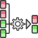

<!-- Development > Component reference > Transformers > Dedup -->

### Dedup

| [Short description](dedup.md#short-description) |
| --- |
| [Ports](dedup.md#ports) |
| [Metadata](dedup.md#metadata) |
| [Dedup attributes](dedup.md#dedup-attributes) |
| [Details](dedup.md#details) |
| [Examples](dedup.md#examples) |
| [Compatibility](dedup.md#compatibility) |
| [See also](dedup.md#see-also) |

#### Short description

**Dedup** removes duplicate records.

| Same input metadata | Sorted inputs[[1]](dedup.md#dedup-sorted) | Inputs | Outputs | Java | CTL | Auto-propagated metadata |
| --- | --- | --- | --- | --- | --- | --- |
| - | **✓** | 1 | 0-1 | - | - | **✓** |

| 1 |  Input records may be sorted only partially, i.e. the records with the same value of the **Dedup key** are grouped together but the groups are not ordered |
| --- | --- |

#### Ports

| Port type | Number | Required | Description | Metadata |
| --- | --- | --- | --- | --- |
| Input | 0 | **✓** | for input data records | any |
| Output | 0 | **✓** | For deduplicated data records. | equal input metadata |
| 1 | **⨯** | For duplicate data records. |  |  |

#### Metadata

Metadata can be propagated through this component.

**Dedup** has no metadata template.

**Dedup** does not require any specific metadata fields.

#### Dedup attributes

| Attribute | Req | Description | Possible values |
| --- | --- | --- | --- |
| Basic |  |  |  |
| Dedup key |  | A key according to which the records are deduplicated.  If the **Dedup key** is not set, the whole input is considered as one group. Therefore the **Number of duplicates** attribute specifies the number of records that are send to the output.  If the **Dedup key** is set, only a specified number of records with the same values in fields specified as the **Dedup key** is picked up. See [Dedup key](dedup.md#dedup-key). |  |
| Keep |  | Defines which records will be preserved.  If `First`, those from the beginning.  If `Last`, those from the end. Records are selected from a group or the whole input.  If `Unique`, only records with no duplicates are selected. If `Unique`, `Number of duplicates` is ignored. | First (default) \| Last \| Unique |
| Sorted input |  | Assume input as sorted. See [Sorted versus unsorted input](dedup.md#sorted-versus-unsorted-input). | true (default) \| false |
| Equal NULL |  | By default, records with null values of key fields are considered to be equal. If `false`, they are considered to be different. | true (default) \| false |
| Number of duplicates |  | The maximum number of duplicate records to be selected from each group of adjacent records with an equal key value or, if the key is not set, maximum number of records from the beginning or the end of all records. Ignored if the `Unique` option is selected. | 1 (default) \| 1-N |

#### Details

**Dedup** reads data flow of records grouped by the same values of the **Dedup key**. The key is formed by field name(s) from input records. If no key is specified, the component behaves like the Unix `head` or `tail` command. The groups don’t have to be ordered.

The component can select a specified number of the first or the last records from the group or from the whole input. Only those records with no duplicates can be selected, too.

The deduplicated records are sent to output port 0. The duplicate records may be sent through output port 1.

- **Dedup key**
  The component can process sorted input data as well as partially sorted ones. When setting the fields composing the **Dedup key**, choose the proper **Order** attribute:
  1. *Ascending* - if the groups of input records with the same key field value(s) are sorted in ascending order
  2. *Descending* - if the groups of input records with the same key field value(s) are sorted in descending order
  3. *Auto* - the sorting order of the groups of input records is guessed from the first two records with different value in the key field, i.e. from the first records of the first two groups.
  4. *Ignore* - if the groups of input records with the same key field value(s) are not sorted

##### Sorted versus unsorted input

**Dedup** can process data in two modes: sorted and unsorted.

If you want to process a huge number of records with many different key values, sort the records first and then use **Dedup** with **Sorted input**.

If your data contains a few different key values, you can use unsorted input. **Dedup** with unsorted input does not require pre-sorting, but is confined with main memory available as the records to be sent to the first output port are cached in memory.

The requirements on main memory in unsorted mode depend on values of the **Number of duplicates** and **Keep** attributes. Lower number of duplicates means less memory is necessary. Selecting several first records requires less memory than several last.

###### Unsorted Input Records and Order of Output Records

If you use unsorted input records, the order of output records is not guaranteed to be the same as the the order of input records.

If you keep **First** record(s), the order on both output ports is preserved.

If you keep **Last** record(s), the order within any group with the same key is preserved on both output ports. The order of records on the second output port is not guaranteed.

If you keep **Unique** records, the order of unique records on the first output port is preserved. The order of records on the second output port may be arbitrary.

#### Examples

| [Dedup sorted records](dedup.md#dedup-sorted-records) |
| --- |
| [Dedup unsorted records](dedup.md#dedup-unsorted-records) |
| [Sending out the first N records](dedup.md#sending-out-the-first-n-records) |

##### Dedup sorted records

This example shows the usage of **Dedup** with sorted input records. This case is suitable for a big number of records with many different key values.

An access log contains IPaddress and timestamp. Records are sorted in ascending order according to the IPaddress and timestamp. For each IPaddress, find timestamp of the first access. Null values do not appear in the data.

###### Solution

Set the **Dedup key** and **Keep** attributes.

| Attribute | Value |
| --- | --- |
| Dedup key | IPaddress |
| Keep | First |

By default, the number of duplicates is one, therefore it does not have to be set up.

##### Dedup unsorted records

This example shows the usage of **Dedup** with unsorted input records. This case is suitable for datasets with a small number of different key values.

An access log contains timestamp, username, and IPaddress fields. The records are sorted in ascending order according to the timestamp. The log contains a huge number of records but there are not so many different usernames. Your task is to filter out last two logins for each user.

###### Solution

Set **Sorted input** and **Number of duplicates**.

| Attribute | Value |
| --- | --- |
| Dedup key | username |
| Keep | Last |
| Sorted input | false |
| Number of duplicates | 2 |

**Sorted input** is set to `false` as records are not sorted according to **Dedup key**. Timestamp is not **Dedup key**.

Note that the order of records sent to the output port may be different from the order of records received from the input port.

##### Sending out the first N records

The previous component (A) sends out a variable number of records. Send the first 100 records to the component B and send the other records to the component C.

###### Solution

Connect the input port of **Dedup** with component A; the first output port with component B; and the second output port with component C.

Set the **Number of duplicates** attribute.

| Attribute | Value |
| --- | --- |
| Number of duplicates | 100 |

You can use **Dedup** to partition records in this way, if **Dedup key** is not set.

#### Compatibility

| Version | Compatibility Notice |
| --- | --- |
| 4.3.0-M1 | You can now use **Dedup** with unsorted input records. |

#### See also

| [Common properties of components](components.md#common-properties-of-components) |
| --- |
| [Specific attribute types](components.md#specific-attribute-types) |
| [Common properties of Transformers](common-of-transformers.md) |
| [Transformers comparison](common-of-transformers.md#transformers-comparison) |
