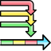
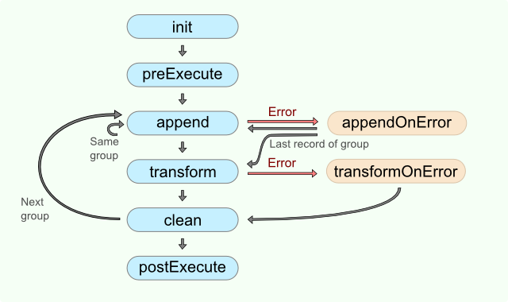

<!-- Development > Component reference > Transformers > Denormalizer -->

### Denormalizer



| [Short description](denormalizer.md#short-description) |
| --- |
| [Ports](denormalizer.md#ports) |
| [Metadata](denormalizer.md#metadata) |
| [Denormalizer attributes](denormalizer.md#denormalizer-attributes) |
| [Details](denormalizer.md#details) |
| [CTL interface](denormalizer.md#ctl-interface) |
| [Java interface](denormalizer.md#java-interface) |
| [Examples](denormalizer.md#examples) |
| [Best practices](denormalizer.md#best-practices) |
| [See also](denormalizer.md#see-also) |
> [!TIP]
> If you’re interested in learning more about this subject, we offer the [Transforming Groups of Records, Normalization course](https://academy.cloverdx.com/courses/normalize-denormalize) in our CloverDX Academy.

#### Short description

**Denormalizer** creates a single output record from one or more input records. Input records should be sorted.

| Same input metadata | Sorted inputs | Inputs | Outputs | Java | CTL | Auto-propagated metadata |
| --- | --- | --- | --- | --- | --- | --- |
| - | **⨯** | 1 | 1 | **✓** | **✓** | **⨯** |

#### Ports

| Port type | Number | Required | Description | Metadata |
| --- | --- | --- | --- | --- |
| Input | 0 | **✓** | For input data records. | any |
| Output | 0 | **✓** | For denormalized data records. | any |

#### Metadata

**Denormalizer** does not propagate metadata.

**Denormalizer** does not have metadata templates.

**Denormalizer** does not require any specific metadata fields.

#### Denormalizer attributes

| Attribute | Req | Description | Possible values |
| --- | --- | --- | --- |
| Basic |  |  |  |
| Key | [[1]](denormalizer.md#denormalizer-key-group) | A key that creates groups of input data records according to its value. Adjacent input records with the same value of **Key** are considered to be members of one group. One output record is composed from members of such group. For more information, see [Key](denormalizer.md#key). |  |
| Group size | [[1]](denormalizer.md#denormalizer-key-group) | A group may be defined by exact number of its members. E.g. each five records form a single group. The input record count **must** be a multiple of `group size` (see **Allow incomplete last group**). This is mutually exclusive with the `key` attribute. | a number |
| Denormalize | [[2]](denormalizer.md#denormalizer-triple) | Definition of how to denormalize records, written in the graph in CTL or Java. |  |
| Denormalize URL | [[2]](denormalizer.md#denormalizer-triple) | The name of an external file, including the path, containing the definition of how to denormalize records, written in CTL or Java. |  |
| Denormalize class | [[2]](denormalizer.md#denormalizer-triple) | The name of an external class defining how records should be normalized. |  |
| Equal NULL |  | By default, records with null values of key fields are considered to be equal. If `false`, they are considered to be different. | true (default) \| false |
| Denormalize source charset |  | Encoding of the external file defining the transformation.  The default encoding depends on `DEFAULT_SOURCE_CODE_CHARSET` in defaultProperties. | E.g. UTF-8 |
| Advanced |  |  |  |
| Allow incomplete last group |  | In case input records grouping is specified by the **Group size** attribute, the number of input records must be a multiple of group size. Using this attribute, this condition can be suppressed. The last group does not need to be complete. | true \| false (default) |
| Deprecated |  |  |  |
| Sort order |  | Order in which groups of input records are expected to be sorted. See [Sort order](denormalizer.md#sort-order) | Auto (default) \| Ascending \| Descending \| Ignore |
| Error actions |  | The definition of an action that should be performed when the specified transformation returns some **Error code**. See [Return values of transformations](transformations.md#return-values-of-transformations). |  |
| Error log |  | A URL of the file to which error messages for specified **Error actions** should be written. If not set, they are written to **Console**. |  |

| 1 | `group size` has higher priority than `key`. If neither of these attributes is specified, all records will form a single group. |
| --- | --- |

| 2 | One of them must specified. |
| --- | --- |

#### Details

**Denormalizer** receives sorted data through a single input port, checks **Key** values and creates one output record from one or more adjacent input records with the same **Key** value.

**Denormalizer** requires transformation. The transformation can be defined in CTL (see [CTL interface](denormalizer.md#ctl-interface)) or in Java (see [Java interface](denormalizer.md#java-interface)) or using existing `.class` file (**Denormalize class** attribute).

To define transformation, use one of the three transformation attributes: **Denormalize**, **Denormalize URL** or **Denormalize class**.

Diagram below describes flow of function calls in **Denormalizer**.


*Figure 426. Denormalizer code workflow*

The function `append()` is called once for each input record. The function `transform()` is called once for each group of input records.

If you do not define any of the optional functions `init()`, `preExecute()`, `clean()` or `postExecute()`, the execution flow continues with the next function according to the diagram.

If you do not specify the `appendOnError()` or `transformOnError()` functions and an error occurs, the execution of graph fails.

The transformation uses a CTL template for **Denormalizer**, implements a `RecordDenormalize` interface or inherits from a `DataRecordDenormalize` superclass. The interface methods are listed in [CTL interface](denormalizer.md#ctl-interface) and [Java interface](denormalizer.md#java-interface).

##### Key

**Key** is expressed as a sequence of field names separated from each other by a semicolon, colon, or pipe.
Example 396. Key for Denormalizer`first_name;last_name`
In this **Key**, `first_name` and `last_name` are fields of metadata on input port.

##### Sort order

If the records are denormalized by the **Key**, i.e. not by the **Group size**, the input records must be grouped according to the **Key** field value. Then, depending on the sorting order of the groups, select the proper **Sort order**:

- *Auto* - the sorting order of the groups of input records is guessed from the first two records with different value in the key field, i.e. from the first records of the first two groups.
- *Ascending* - if the groups of input records with the same key field value(s) are sorted in ascending order.
- *Descending* - if the groups of input records with the same key field value(s) are sorted in descending order.
- *Ignore* - if the groups of input records with the same key field value(s) are not sorted.

#### CTL interface

| [CTL templates](denormalizer.md#ctl-templates) |
| --- |
| [Access to input and output fields](denormalizer.md#access-to-input-and-output-fields) |

The transformation written in CTL uses a CTL template for **Denormalizer**. Only the functions `append()` and `transform()` are mandatory.

Once you have written your transformation, you can also convert it to Java language code by clicking the corresponding button at the upper right corner of the tab.

You can open the transformation definition as another tab of the graph (in addition to the **Graph** and **Source** tabs of **Graph Editor**) by clicking the corresponding button at the upper right corner of the tab.

##### CTL templates

| CTL Template Functions |  |
| --- | --- |
| **boolean init()** |  |
| Required | No |
| Description | Initializes the component, sets up the environment and global variables. |
| Invocation | Called before processing the first record |
| Returns | `true` \| `false` if `false`, graph fails) |
| **integer append()** |  |
| Required | yes |
| Input Parameters | none |
| Returns | Integer numbers. Negative value lower than -1 aborts processing. Any non-negative value means a successful pass. |
| Invocation | Called repeatedly, once for each input record |
| Description | For the group of adjacent input records with the same **Key** values, it appends the information from which the resulting output record is composed.  If `append()` fails and the user has not defined any `appendOnError()`, the whole graph will fail.  If any of the input records causes fail of the `append()` function, and if the user has defined `appendOnError()` function, processing continues in this `appendOnError()` at the place where `append()` failed. The `append()` passes to the `appendOnError()` error message and stack trace as arguments. |
| Example | ```ctl function integer append() {     CustomersInGroup++;     myLength = length(errorCustomers);     if(!isInteger($in.0.OneCustomer)) {         errorCustomers = errorCustomers + iif(myLength > 0 ," - ","") + $in.0.OneCustomer;     }     customers = customers + iif(length(customers) > 0 ," - ","") + $in.0.OneCustomer;     groupNo = $in.0.GroupNo;     return OK; } ``` |
| **integer transform()** |  |
| Required | yes |
| Input Parameters | none |
| Returns | Integer numbers. For detailed information, see [Return values of transformations](transformations.md#return-values-of-transformations). |
| Invocation | Called repeatedly, once for each output record. |
| Description | It creates output records.  If `transform()` fails and the user has not defined any `transformOnError()`, the whole graph will fail.  If any part of the `transform()` function for some output record causes fail of the `transform()` function, and if the user has defined the `transformOnError()` function, processing continues in the `transformOnError()` at the place where `transform()` failed.  The `transformOnError()` function gets the information gathered by `transform()` that was get from previously successfully processed code. Also error message and stack trace are passed to `transformOnError()`. |
| Example | ```ctl function integer transform() {     $out.0.CustomersInGroup = CustomersInGroup;     $out.0.CustomersOnError = errorCustomers;     $out.0.Customers = customers;     $out.0.GroupNo = groupNo;     return OK; } ``` |
| **void clean()** |  |
| Required | no |
| Input Parameters | none |
| Returns | void |
| Invocation | Called repeatedly, once for each output record.  The `clean()` function is called after the `transform()` function. |
| Description | Returns the component to the initial settings. |
| Example | ```ctl function void clean(){     customers = "";     errorCustomers = "";     groupNo = 0;     CustomersInGroup = 0; } ``` |
| **integer appendOnError(string errorMessage, string stackTrace)** |  |
| Required | no |
| Input Parameters | `string errorMessage` |
| `string stackTrace` |  |
| Returns | Integer numbers. Positive integer numbers are ignored, meaning of 0 and negative values is described in [Return values of transformations](transformations.md#return-values-of-transformations) |
| Invocation | Called if `append()` throws an exception. |
| Description | The function handles errors which occurred in the `append()` function.  If any of the input records causes fail of the `append()` function, and if the user has defined the `appendOnError()` function, processing continues in this `appendOnError()` at the place where `append()` failed.  The `appendOnError()` function gets the information gathered by `append()` that was get from previously successfully processed input records. The error message and stack trace are passed to `appendOnError()`, as well. |
| Example | ```ctl function integer appendOnError(                   string errorMessage,                   string stackTrace) {     printErr(errorMessage);     return CustomersInGroup; } ``` |
| **integer transformOnError(Exception exception, stackTrace)** |  |
| Required | no |
| Input Parameters | `string errorMessage` |
| `string stackTrace` |  |
| Returns | Integer numbers. For detailed information, see [Return values of transformations](transformations.md#return-values-of-transformations). |
| Invocation | Called if `transform()` throws an exception. |
| Description | The function handles errors which occurred in `transform()` function.  If any part of the `transform()` function fails, and if the user has defined the `transformOnError()` function, processing continues in the `transformOnError()` at the place where `transform()` failed.  The `transformOnError()` function gets the information gathered by `transform()` that was get from previously successfully processed code. The error message and stack trace are passed to `transformOnError()`, as well.  The function `transformOnError()` creates output records. |
| Example | ```ctl function integer transformOnError(                   string errorMessage,                   string stackTrace) {     $out.0.CustomersInGroup = CustomersInGroup;     $out.0.ErrorFieldForTransform = errorCustomers;     $out.0.CustomersOnError = errorCustomers;     $out.0.Customers = customers;     $out.0.GroupNo = groupNo;     return OK; } ``` |
| **string getMessage()** |  |
| Required | No |
| Description | Prints the error message specified and invoked by the user. |
| Invocation | Called in any time specified by the user (called only when either `append()`, `transform()`, `appendOnError()` or `transformOnError()` returns value less than or equal to -2). |
| Returns | `string` |
| **void preExecute()** |  |
| Required | No |
| Input parameters | None |
| Returns | `void` |
| Description | May be used to allocate and initialize resources required by the transform.  All resources allocated within this function should be released by the `postExecute()` function. |
| Invocation | Called during each graph run before the transform is executed. |
| **void postExecute()** |  |
| Required | No |
| Input parameters | None |
| Returns | `void` |
| Description | Should be used to free any resources allocated within the `preExecute()` function. |
| Invocation | Called during each graph run after the entire transform was executed. |

##### Access to input and output fields

###### Input records or fields

Input records or fields are accessible within the `append()` and `appendOnError()` functions only.

###### Output records or fields

Output records or fields are accessible within the `transform()` and `transformOnError()` functions only.
> [!WARNING]
> All of the other CTL template functions allow to access neither inputs nor outputs.
>
> Remember that if you do not hold these rules, NPE will be thrown.

#### Java interface

The transformation implements methods of the `RecordDenormalize` interface and inherits other common methods from the `Transform` interface. See [Common Java interfaces](transformations.md#common-java-interfaces). See [Public CloverDX API](genericcomponent.md#public-cloverdx-api).

Following are the methods of the `RecordDenormalize` interface:

- `boolean init(Properties parameters, DataRecordMetadata sourceMetadata, DataRecordMetadata targetMetadata)`
  Initializes denormalize class/function. This method is called only once at the beginning of denormalization process. Any object allocation/initialization should happen here.
- `int append(DataRecord inRecord)`
  Passes one input record to the composing class.
- `int appendOnError(Exception exception, DataRecord inRecord)`
  Passes one input record to the composing class. Called only if `append(DataRecord)` throws an exception.
- `int transform(DataRecord outRecord)`
  Retrieves composed output record. For detailed information about return values and their meaning, see [Return values of transformations](transformations.md#return-values-of-transformations). In **Denormalizer**, only `ALL`, `0`, `SKIP`, and **Error codes** have some meaning.
- `int transformOnError(Exception exception, DataRecord outRecord)`
  Retrieves composed output record. Called only if `transform(DataRecord)` throws an exception.
- `void clean()`
  Finalizes current round/clean after current round. Called after the transform method was called for the input record.

#### Examples

| [Converting multiple having same key records to one](denormalizer.md#converting-multiple-having-same-key-records-to-one) |
| --- |
| [Converting fixed number of records to one records](denormalizer.md#converting-fixed-number-of-records-to-one-records) |

##### Converting multiple having same key records to one

Input records acquired from relational database contain fields **companyName** and **product**.

```
Denormalizer Limited |chocolate
Denormalizer Limited |coffee
Denormalizer Limited |pizza
ZXCV International   |coffee
```

Convert the records to following form: **companyName** is followed by **list of products** separated by commas.

###### Solution

Use the **Key** and **Normalize** attributes.

| Attribute | Value |
| --- | --- |
| Key | companyName |
| Normalize | See the code below |

```ctl
//#CTL2

string[] products;
string companyName;

function integer append() {
    append(products, $in.0.product);
    companyName = $in.0.companyName;
    return OK;
}

function integer transform() {
    $out.0.companyName = companyName;
    $out.0.products = join(",", products);
    return OK;
}

function void clean() {
    clear(products);
}
```

Denormalizer returns following records:

```
Denormalizer Limited |chocolate,coffee,pizza
ZXCV International   |coffee
```

> [!IMPORTANT]
> Records with the same **Key** have to be available in input data all at once. Otherwise you will get a new output record for each several subsequent records having the same key.
>
> The best solution is to have input records sorted by **Key**.

##### Converting fixed number of records to one records

Given a list of students.

```
Charlie
Daniel
Agatha
Henry
Oscar
Kate
Romeo
Jane
```

Convert the list to groups of 3. Each group (one output record) has a number and names of its members. The names are separated by comma.

Each output record contains **groupNumber** and **members**.

###### Solution

Use the **Group size** and **Normalize** attributes. To be able to process the number of record not being divisible by 3, you need the **Allow incomplete last group** attribute.

| Attribute | Value |
| --- | --- |
| Group size | 3 |
| Normalize | See the code below |
| Allow incomplete last group | true |

```ctl
//#CTL2

integer groupNumber;
string[] names;

function integer append() {
    append(names, $in.0.name);
    return OK;
}

function integer transform() {
    $out.0.groupNo = groupNumber;
    $out.0.members = join(",", names);
    groupNumber++;

    return OK;
}

function boolean init() {
    groupNumber = 1;
    return true;
}

function void clean() {
    clear(names);
}
```

Denormalizer returns following records:

```
1|Charlie,Daniel,Agatha
2|Henry,Oscar,Kate
3|Romeo,Jane
```

#### Best practices

If the transformation is specified in an external file (with **Denormalize URL**), we recommend users to explicitly specify **Denormalize source charset**.

#### See also

| [Normalizer](normalizer.md) |
| --- |
| [Rollup](rollup.md) |
| [Common properties of components](components.md#common-properties-of-components) |
| [Specific attribute types](components.md#specific-attribute-types) |
| [Common properties of Transformers](common-of-transformers.md) |
| [Transformers comparison](common-of-transformers.md#transformers-comparison) |
