<!-- Development > CloverDX AI Assistant -->

## 2. CloverDX AI Assistant

### Introduction

**CloverDX AI Assistant** is an agentic collaborator embedded into **CloverDX Designer**. It can help you build your solutions using natural language directly within Designer. It is not just a graph builder though – it can do much more. It can collaborate with you in three broad categories of work:

- **Solution architect**: it can work on solutions that are much bigger than just a single job. The Assistant can help you build complex solutions based on specification provided in specification files (which are typically markdown, but it will ingest Word documents, too). It will suggest architecture; help you build the solution and even document it for you including data flow diagrams to make it easy to follow and understand.
- **Development companion**: the Assistant can help you while building your graphs – modify them based on a prompt, help you understand what the graphs are doing, improve CTL code, generate sample data and more. You can think of the Assistant as your everyday pair-programmer who is ready to help you turn natural language prompts into working graphs.
- **Troubleshooter**: the Assistant can also help you understand job failures. Not just the ones that it has created, but any job. It has full access to your Server’s logs, tracking data and more. It can help you diagnose the problem, suggest a fix or even implement it for you.
> [!IMPORTANT]
> The Assistant can read and modify files and run jobs in the CloverDX Server project you connect it to. Review what it produces before you rely on it – every change it makes is recorded in the project’s git history, so there is always something to look at. Point it at development and test projects; production data should reach it only when you decide so.

The Assistant itself is available via the **AI Assistant** view – a view usually docked to the right side of your Designer window.

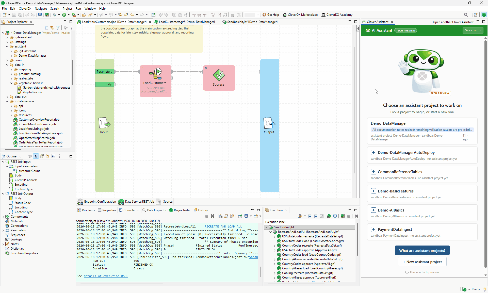
*Figure 46. Designer Assistant shown in a sidebar after running through a number of tasks that modified an existing project.*
> [!TIP]
> If you close the Assistant view, click the **AI Assistant** button in the main toolbar to bring it back. Alternatively, open it from **Window** ****Show View** ****Other…​** and search for **AI Assistant**.

The Assistant requires CloverDX Designer where it runs as well as CloverDX Server since it uses Server’s Model Context Protocol (MCP) API to work with projects. The Assistant requires connectivity to an LLM (which is typically hosted in the cloud), however only the Designer requires this access, the Server does not have to be publicly accessible – it only needs to be accessible from the Designer.

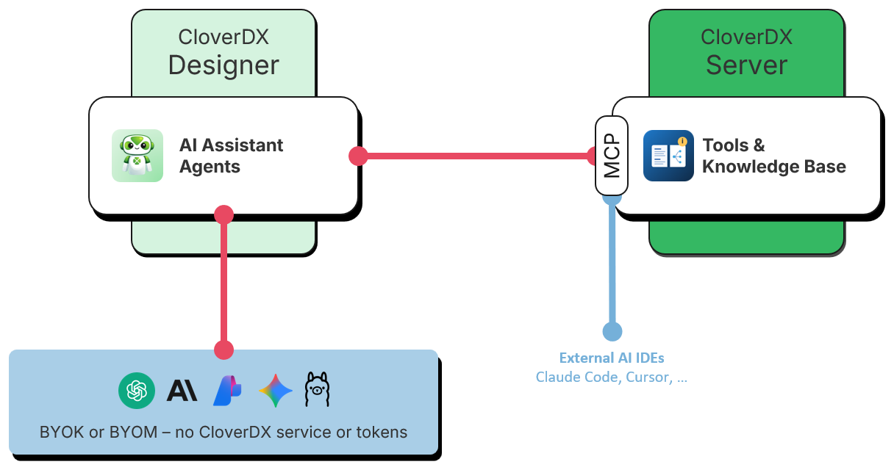
*Figure 47. Architecture of CloverDX AI Assistant in Designer.*

The diagram above shows basic building blocks required for the Assistant to work. The Assistant works with several distinct "components" that are shown on the diagram:

- **CloverDX Designer** which is the central part of the Assistant. Designer provides the user interface for the Assistant and runs all the orchestration as needed. Technically, the Assistant runs fully within the Designer and only calls outside to access Large Language Models (LLM) or Model Context Protocol (MCP) Server.
- **CloverDX Server** which provides Assistant’s agents with the tools to work with CloverDX jobs, investigate data, research knowledge base and more via its Model Context Protocol (MCP) Server. CloverDX Server provides [more than 60 tools](../operations/server-mcp-api.md#mcp-tools-reference) that can be used by agents.
  The **knowledge base** hosted by CloverDX Server provides the Assistant with information about components, usage patterns, design patterns or even skills (like data profiling) that the Assistant can use. See below for more details about how the library works and how to manage it.
  CloverDX Server also provides storage for CloverDX projects that the Assistant works with. Each CloverDX project corresponds to a sandbox on the **Server**. Read more about sandboxes and how they work in [Working with CloverDX Server projects](server-projects-usage.md).
- **External Large Language Models (LLMs)** provide the AI backend for the Assistant. Multiple different models can be used by Assistant’s agents depending on [agent type](designer-ai-assistant.md#agent-types) and its [configuration](../admin/designer-configuration.md#cloverdx-ai-assistant-configuration).
- **External AI IDEs** can be connected to CloverDX’s MCP Server and use the MCP to interact with CloverDX. You can use such IDEs to work with jobs (create new, modify existing ones, etc.) as well as investigate Server status via diagnostic tools.

Each Assistant user has their own instance of Designer with their own LLM configuration. However, the tools are shared by all users using single CloverDX Server and the Server administrator can configure MCP to allow/disallow specific tools if needed via [MCP tool permissions](../admin/server-config-mcp.md#mcp-tools-permissions).
> [!NOTE]
> CloverDX AI Assistant comes with every activated Designer – there is no separate Designer license for it. What you need is an **AI Authoring seat** on the CloverDX Server your project is connected to: a seat is assigned to your Server user account by the Server administrator, and it covers both the Assistant in Designer and the authoring tools of the CloverDX MCP Server used from other AI clients. See [Enabling CloverDX AI Assistant](../admin/part-installation-instructions.md#enabling-cloverdx-ai-assistant) for what the Server has to allow you, and [AI Authoring seats](../admin/server-config-mcp.md#ai-authoring-seats) for how the seats work.
>
> Additionally, since the Assistant uses third party Large Language Models (LLMs), you will need to connect it to your own account with one of the supported LLM providers such as OpenAI, Anthropic, Google, or others – the Assistant is a bring-your-own-key (BYOK) experience, the model calls are billed by your provider and CloverDX meters nothing. See more details about this configuration in [CloverDX AI Assistant Configuration](../admin/designer-configuration.md#cloverdx-ai-assistant-configuration).

### AI Assistant Quick Start
> [!NOTE]
> Since LLMs are not deterministic and there are differences between different LLM providers or even versions of the same model, you may get results that look different than what is shown on screenshots in this section. For example, your Assistant may produce responses with different wording, diagrams with slightly different layout (but same flow), etc. However, in all cases, the outputs should carry the same meaning.

#### Enabling the Assistant

The Assistant needs two things: the [access to Large Language Model (LLM)](../admin/designer-configuration.md#cloverdx-ai-assistant-configuration) that powers it, configured in your Designer, and a CloverDX Server that [allows you to use it](../admin/part-installation-instructions.md#enabling-cloverdx-ai-assistant) – your Server user account has to hold an [AI Authoring seat](../admin/server-config-mcp.md#ai-authoring-seats), which your Server administrator assigns. The Assistant walks you through both on its welcome page and tells you which step is still missing.

Without the seat the Assistant is locked: you can open assistant projects and read their conversations, but you cannot continue a chat or start a new one. The chat tells you what to ask your Server administrator for.

You may use the Assistant from one workstation at a time. If the same CloverDX account starts working with the Assistant on another machine, that machine takes the account over and your chat is refused for the next hour; the message tells you when you may use it again. It is not a connection problem, and reconnecting the project or restarting the Designer does not bring the account back – either wait for the hour to pass, or return to the machine that is now using it. See [One place at a time](../admin/server-config-mcp.md#one-place-at-a-time).

Once the Assistant is configured and the Server allows you in, you will see an intro screen like this:

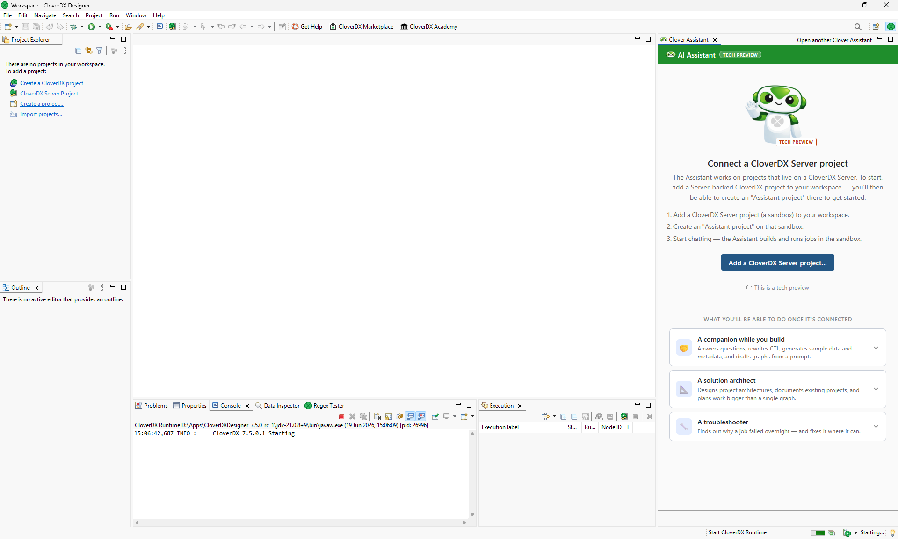
*Figure 48. Assistant view in Designer in an empty workspace (without any projects).*

To start working with the Assistant, you’ll have to either create a new Server project or import or open an existing one. In this quick start we’ll use an example project called **DWHExample**. This project is part of every CloverDX Server installation by default.

To allow the Assistant to work with this project, you only need to create it as a project in Designer via **File** ****New** ****CloverDX Server Project**. Use the Wizard to create a Designer project linked to DWHExample project on your Server. Once done, your Project Explorer should look like this:

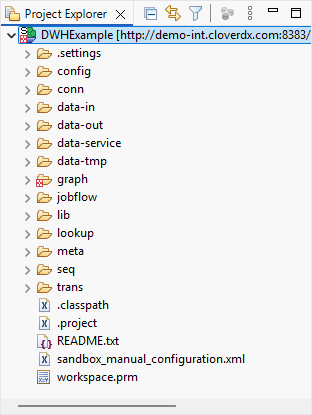
*Figure 49. Project Explorer view right after creating the DWHExample project in Designer.*

To learn more about projects in Designer see [Projects chapter](part2.md).

After the project has been created, you’ll see that your Assistant view has changed and will now list the DWHExample project. Click on the button to create a new assistant project.

#### Using Assistant for project discovery and research

As the first task in the quick start, let’s figure out more about what the DWHExample does. You can start with a prompt like this:

```
Explain the architecture of the DWH project - draw a diagram of the data flow for me.
```

You will get a result similar to this one:

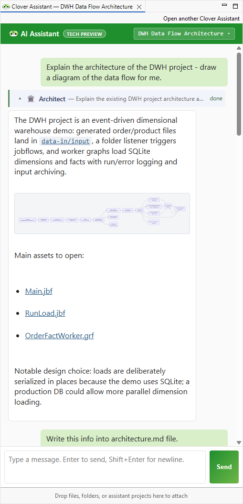
*Figure 50. Assistant view showing results of the above prompt. Notice the diagram shown directly in the view.*
> [!TIP]
> Click on the diagram to focus on it. The diagram viewer will then allow you to zoom-in/out, move around the diagram etc. You can also make the Assistant view larger by either resizing it or maximizing it by clicking on the **Maximize** button in the top right corner of the Assistant view.

As the Assistant is working on its task, you will see it call different agents – each agent has its own set of skills and is visualized in slightly different way so that you can see what was done at a glance. Learn more about different types of agents in [Agent types](designer-ai-assistant.md#agent-types) section below.

You can then continue the discussion with the Assistant further – for example, ask the Assistant to save the output to a file:

```
Write this info into architecture.md file.
```

As you are discovering the project, the Assistant may ask you to verify some facts that it was not able to determine by itself. For example, you may see something like the following animation which shows the Assistant asking two questions and the user providing answers to both:

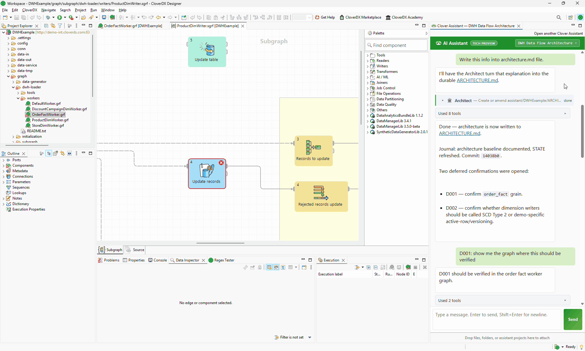
*Figure 51. Assistant view showing questions and the user providing answers.*

Questions are stored in `DECISIONS.md` file and each question gets a stable id like `D001`. You can answer these kinds of questions at any time or even ask follow-up questions of your own to help you when responding.

As the Assistant is working, you’ll see different agents generate their output. You can always review their output in detail by expanding section of each agent’s response:

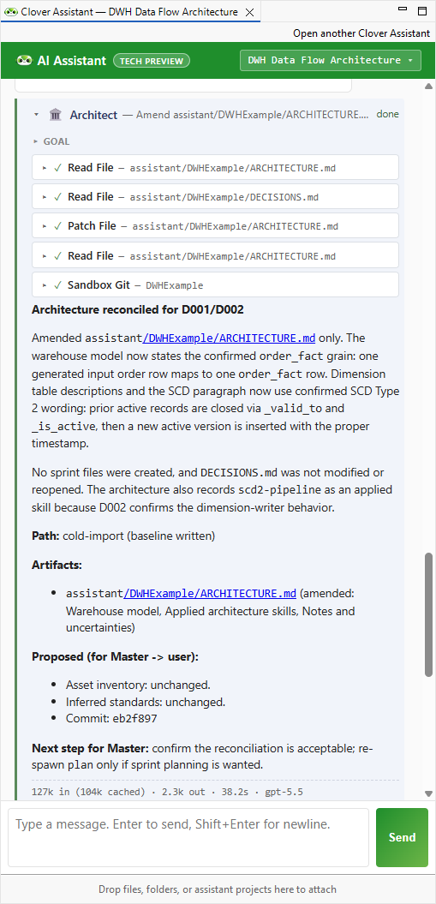
*Figure 52. A full response from the Architect agent shows which tools the agent used and the response providing details of what it figured out. Links in the response are clickable and will open editors for given files.*

In this example we did not modify any graphs or other jobs in the project – all changes were written to various MD files that serve as Assistant’s long-term memory.

#### Using Assistant to modify the project

Assistant can do much more than just figure out what the project is doing – it can help you design new solutions or modify the existing ones. As an example, let’s revisit the warehouse example. The Assistant in our discovery session responded that the warehouse uses SQLite database – this was done to make the example easy to use without any external dependencies on a database.

Let’s try to modify the project so that it uses more powerful database – PostgreSQL. To make this easier to follow, we’ll start a new session for this so that we do not mix project discovery with its changes. To create a new session, click on the session switcher drop down in the top right corner of the Assistant’s view:

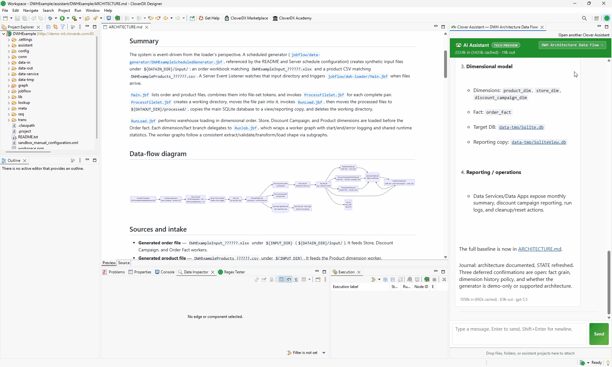
*Figure 53. Starting a new Assistant session.*

To start our implementation, we’ll use the following prompt in the new session:

```
I'd like to update the warehouse to use PostgreSQL database instead of SQLite. Assume that the DWHConnection will be modified by hand to connect to PostgreSQL database instead of SQLite. Update the project to take advantage of PostgreSQL. Assume larger volumes of data will be loaded since Postgre can handle it better than SQLite.
```

The result of this prompt is more complex than the previous example with architecture discovery. In this case, the Architect planned multiple **sprints** to accomplish the migration to PostgreSQL. **Each sprint represents a partial deliverable that has its own scope and acceptance criteria.** During the development, Master agent will go over the sprints and will plan development tasks for each sprint dispatching Architect or other types of agents as needed. Sprints use numbering schema where each sprint has an identified `S001`.

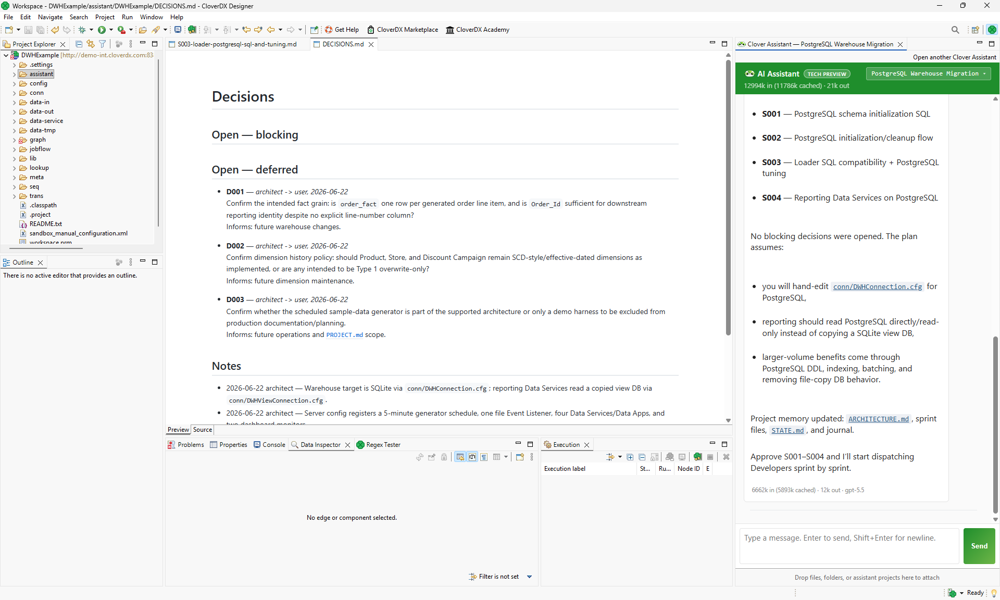
*Figure 54. Assistant proposed four sprints to convert the warehouse to PostgreSQL. Also shown is the Decisions.md file showing open questions. Although none of them are blockers, they should be responded to before implementation starts.*

Sprints are all stored in Markdown files in `assistant/sprints` folder in CloverDX project. You can see these files in Project Explorer:

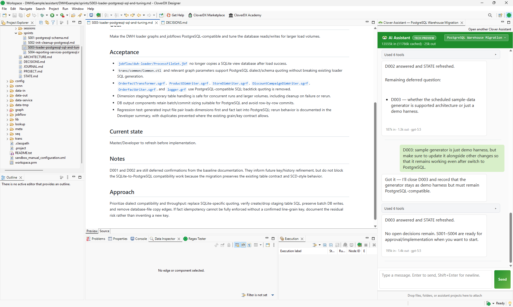
*Figure 55. Markdown files representing sprints in Project Explorer with S003 specification shown in the main view.*

To start the implementation, simply ask the Assistant to start:

```
Start with S001.
```

The Assistant will then call agents as needed to implement the requirements of the first sprint. Once done, it will produce a summary of what was done and will offer you the ability to review the output and continue with the next sprint.

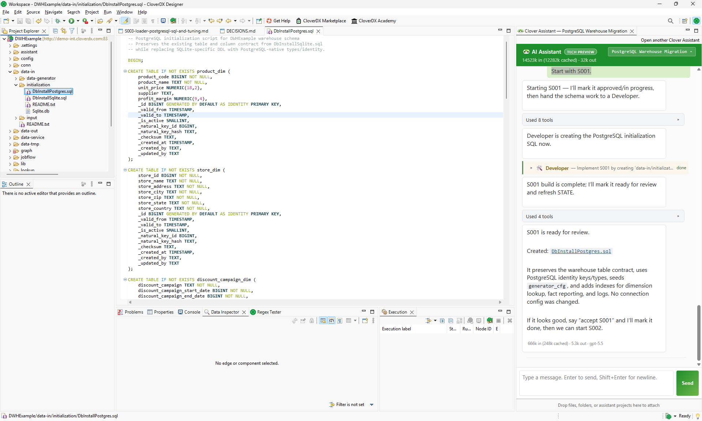
*Figure 56. First sprint is finished and the Assistant offers the ability to review the results and continue with the next sprint.*

As the implementation progresses, the Assistant will keep track of what was done in the files in the assistant project. It will update `STATE.md` after every implementation so you can easily see what was done. It will also update other files as needed – `DECISIONS.md`, `ARCHITECTURE.md`, and so on.

The Assistant may also ask you to validate various outputs or confirm its decisions. In those cases, it will stop and give you time to respond. It can even happen that some implementation steps fail:

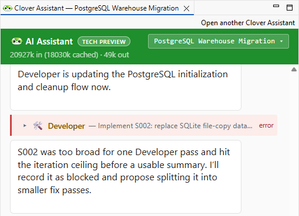
*Figure 57. Developer was not able to handle the task as it was too big.*

In case of failure like the above, the Assistant will automatically slice it into smaller chunks of work and will try again. It may ask you for confirmation or additional information to help it narrow down the scope of each change.

You can keep working with the Assistant in this kind of iterative way until all sprints are finished.

### Agent types

The Assistant uses multiple different agents with each focusing on different tasks. Separating agents like this helps each of them stay focused on its goal and deliver its results faster and more precisely. Each agent is powered by a Large Language Model (LLM) and can also access knowledge base which helps it understand what it should be doing.

Each agent produces an output that can be reviewed by expanding the agent’s section in the Assistant view. Different types of agents are visualized with different colors in the Assistant view – this will allow you to quickly see what is going on and follow the work as it is being performed even without having to read everything that is shown in the view.

Currently, the Assistant uses seven different agent types:

- **Master**: this is the main agent you interact with when you are using CloverDX Assistant. It handles conversation, project memory updates, quick explanations, etc. Master delegates most of work to other agents as needed and then provides the summary of sub-agent responses back to you.
- **Architect** is for design, planning, and documentation. It turns requirements into a CloverDX architecture, opens or records design decisions, proposes sprint-sized work packages, reviews existing assets against the design, and can reverse-engineer and document an existing sandbox. It does not build graphs or jobflows; it defines what should be built and why.

- **Developer** is for implementation. It creates, edits, fixes, validates, and runs CloverDX assets such as graphs, jobflows, subgraphs, metadata, CTL transforms, Data Services, and Data Apps. If a graph needs even a tiny change, Developer owns it because it has the CloverDX authoring and validation workflow.

- **Data Inspector** is for understanding input or output data files. It profiles CSV, Excel, delimited text, JSON-lines, and similar structured data, reporting columns, inferred types, sample rows, delimiters, encoding hints, row counts, nulls, data quality issues, or likely PII when requested. It is intentionally separate, so large data samples do not clutter the main conversation.

- **CTL Author** is used behind the scenes by Developer to work with CTL2 code. It writes, reviews, or fixes CTL code in various places and ensures that the syntax is correct.

- **Troubleshooter** is for read-only diagnosis when something fails or behaves unexpectedly. It examines run history, logs, tracking, edge debug data, server logs, scheduler/listener context, and performance indicators to identify the likely root cause. It recommends a fix but does not edit or rerun assets itself; if an asset change is needed, Master hands that diagnosis to Developer.

- **Librarian** is for research. It answers a single question from the knowledge base, the component reference and the project’s own memory, and returns a short answer with its sources – so whoever asked never has to load whole documents into their conversation. It is also the only agent that writes to the project knowledge, recording what has been learned about a project so later sessions can look it up.

Different kind of Agents can run on top of different LLMs. Our basic recommendation is to use higher-end, frontier models for the Master and the Architect, and previous generation/smaller models for other agents. The following table provide quick overview of our defaults (as of July 2026) – you are, of course, free to use other types of models if you’d like.

| Agent | OpenAI LLM | Anthropic LLM | Google LLM |
| --- | --- | --- | --- |
| **Master** | gpt-5.5 | Opus 4.8 | Gemini 3.5 |
| **Architect** | gpt-5.5 | Opus 4.8 | Gemini 3.5 |
| **Developer** | gpt-5.4 | Sonnet 4.6 | Gemini 3.5 Flash |
| **Data Inspector** | gpt-5.4 | Sonnet 4.6 | Gemini 3.5 Flash |
| **CTL Author** | gpt-5.4 | Sonnet 4.6 | Gemini 3.5 Flash |
| **Troubleshooter** | gpt-5.4 | Sonnet 4.6 | Gemini 3.5 Flash |
| **Librarian** | gpt-5.4 | Sonnet 4.6 | Gemini 3.5 Flash |

### Assistant projects and sessions

The Assistant works with the concept of **assistant projects**. Each assistant project represents a self-contained piece of work – whole data pipeline or even smaller changes like a report update. The Assistant maintains a durable memory for each project – the goal, scope, key decisions, architecture, and a journal of work done.

Each assistant project belongs to a CloverDX project in your Designer workspace. CloverDX projects are in turn linked to sandboxes on a Server. While this may seem complicated, it is relatively simple since all artefacts are represented as files. You can then think of a CloverDX project as a directory on your computer, the sandbox is then a directory on your CloverDX Server and these directories are automatically synced by CloverDX Designer.

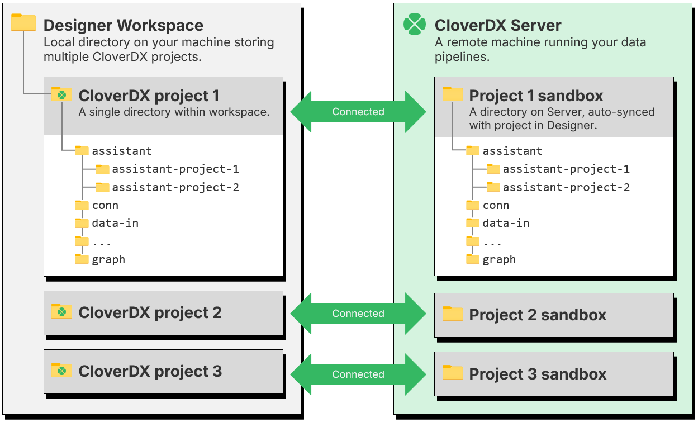
*Figure 58. Relationships between projects in Designer, assistant projects and sandboxes on Server.*

Assistant projects have additional structure inside – various files and directories can help you and the Assistant understand what the project is about, what was done and more. You do not have to maintain these files – the Assistant will do that for you.

When you create a new assistant project, the Assistant will create all markdown files in `assistant/<project_name>` folder and keep them up to date as you work. The files in the assistant project are the **long-term memory** the Assistant keeps.

At the same time, the Assistant maintains a server-side git repository which keeps track of all changes that it is making. This includes assets the Assistant is working on (graphs, metadata files, etc.) as well as memory files in the assistant project. This allows the Assistant to go back in history to review past decisions or even return to a previous state if needed. These git repositories are kept in `.git-assistant` folders in your sandbox.

The Assistant uses **sessions** to help you distinguish between different streams of work within a project. A new session is called *New session* (numbered – *New session (2)*, *New session (3)* – when the project already has unnamed ones) until your first message, from which the Assistant derives its name. Sessions are separate from each other and the Assistant does not see chat history from one session when working on another. This can help you keep multiple implementations separate without having to worry about mixing them up or confusing the agent by having too many things in one chat.

You can manage projects and sessions through the AI Assistant view. New projects can be created in sandboxes by clicking on the plus symbol next to each sandbox name in the view. Clicking on an existing project will open it and load the latest sessions from the project into the Assistant view. Once the workspace holds five or more projects, a filter box and **Recent**/**Name** sort buttons appear above the project cards: typing narrows the list to projects whose name, sandbox or goal contains the text (Enter opens the first match), and clicking the active sort button reverses its order. The filter also takes alternatives separated by `|` (`crm | billing`). The two icons next to the sort buttons switch between the cards and a compact list with one row per project.

The Assistant never switches projects on its own — you can open a job from another project while a chat is running. To sync the two on request, right-click a project, folder or file of a Server project in the Project Explorer and choose **Open in AI Assistant**: the Assistant opens the assistant project of that sandbox, or, when the sandbox holds several assistant projects, shows the project chooser filtered to them. A folder or file is also attached to the chat – to the running chat when it already belongs to that project, otherwise to the session the project opens with. Right-clicking the canvas of an open job offers **Ask AI Assistant about this job**, which starts a new session in that sandbox’s assistant project with the job attached to the chat. Right-clicking a component on the canvas, or any element in the Outline (a component, metadata, parameter, lookup table, connection, sequence, …), offers **Insert into AI Assistant**: the job is attached and the element’s kind, name and id are inserted into the chat box at the cursor — into the running chat when it already belongs to that project, otherwise into a new session — so you can point the Assistant at an element without typing its name. Dragging an element from the Outline onto the Assistant view does the same.

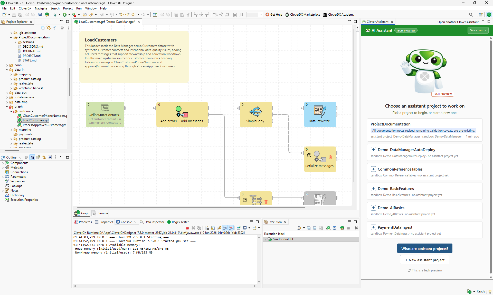
*Figure 59. Assistant view showing an existing assistant project ProjectDocumentation in Demo-DataManager project and five other sandboxes which do not have any assistant projects yet.*

The projects and sessions can also be managed via switcher accessible by clicking on a dropdown button in top right corner of the Assistant view. Its first row offers the two ways of starting something new: **New session** starts another session in the current project, **New window** opens another AI Assistant view – each view runs its own session, so you can work on two sessions or projects side by side.

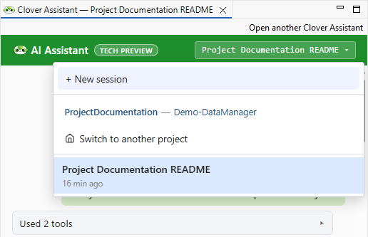
*Figure 60. Managing sessions or projects via menu in the Assistant view.*

The standard layout of the assistant project is the following:

- Directory `sessions`: stores per-session chat transcripts. You do not need to work with these files directly - the Assistant nicely renders their content in the Assistant panel in Designer.
- Directory `sprints`: specification documents for each sprint. The Assistant uses sprints to partition large and complex work into manageable pieces and uses `sprints` directory to keep track of the scope of each sprint. The files in this folder are created automatically and managed as needed by the Assistant. Note that this folder may not be created at all for simple assistant projects.
- Directory `knowledge_project`: what the Assistant has learned about this particular project, one markdown file per entry, optionally grouped into subfolders by topic. The Librarian agent writes these and searches them when a later session asks something that has already been answered.
- `ARCHITECTURE.md`: design document for the assistant project – provides overview of the project’s purpose, its sources and targets, business logics, etc.
- `DECISIONS.md`: open/answered decisions with each decision having a stable id (like "D001") so that it can be referred to later if needed.
- `JOURNAL.md`: a simple append-only event log, every change the Assistant makes is noted here.
- `PROJECT.md`: basic information about the assistant project – its goals, scope, enforced standards, and more.
- `STATE.md`: a markdown file which describes the current state of the project – active sprints, open questions, etc.

All these files can be quite useful to review – especially if you are coming back to a project after a while or if you need to collaborate on a project with someone else.

### Chat commands and the context window

Besides talking to the Assistant in plain language, you can type a few commands straight into the chat input. Type `/` and the Assistant offers the list.
**`/compact`**
Summarizes the older part of the conversation and replaces it with that summary, which frees up room in the context window. Use it when a long session is filling up and you would rather continue in it than start a new one.
**`/profile <name>`**
Switches this chat view to a different set of models. Type `/profile` on its own to pick from the profiles you have configured. The switch applies to this view only and is forgotten when you close it – to change what the Assistant runs on by default, use [Model profiles](../admin/designer-configuration.md#model-selection) in the preferences.
**`/read-only`**
Puts the session into read-only mode: tools that only read stay available and everything that would write, run or commit is refused. Useful when you want the Assistant to investigate something with no chance of it changing the project.
**`/read-write`**
Restores full access.

Every model has a limit on how much conversation it can keep in mind at once – its **context window**. The header of the Assistant view shows how full it currently is, next to the number of tokens the session has consumed so far across all agents; hover over either readout for the exact figures.

You rarely need to watch it, because the Assistant compacts the conversation by itself once it approaches the limit, exactly as `/compact` would. Compacting is not free – the summary is shorter than what it replaces, so detail is lost – which is why starting a new session for a new piece of work is usually better than compacting the same one over and over.

### Assistant’s knowledge base - CloverDXMCPKnowledge

CloverDX Assistant uses a special library called **CloverDXMCPKnowledge** which provides knowledge base to the Assistant. This knowledge base contains information about components, design patterns, various skills and more to help the Assistant create and debug CloverDX jobs.

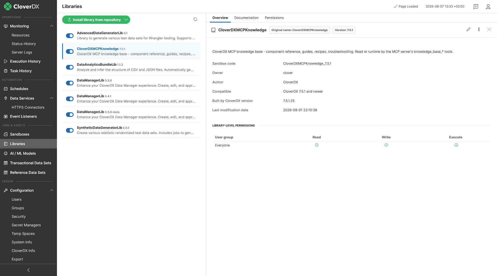
*Figure 61. Libraries module showing the CloverDXMCPKnowledge installed on the Server.*

The library is installed automatically for you as soon as you install CloverDX 7.5 or newer – regardless of whether it is an update of an existing instance or a clean deployment. Each build of CloverDX Server carries with it its own version of the library which will be automatically deployed to your instance during installation.

You can have more than version of the library installed – the Assistant will simply use the latest version (the one with the highest version number).

The library is what CloverDX knows. Your own rules and reference material – naming conventions, connection standards, the sources a job may read – belong to [company knowledge](assistant-company-knowledge.md), a second store the Assistant reads next to the library.
