<!-- Development > Designer user interface > Designer default layout -->

## 2. Designer default layout

The **CloverDX** perspective consists of 5 panes:

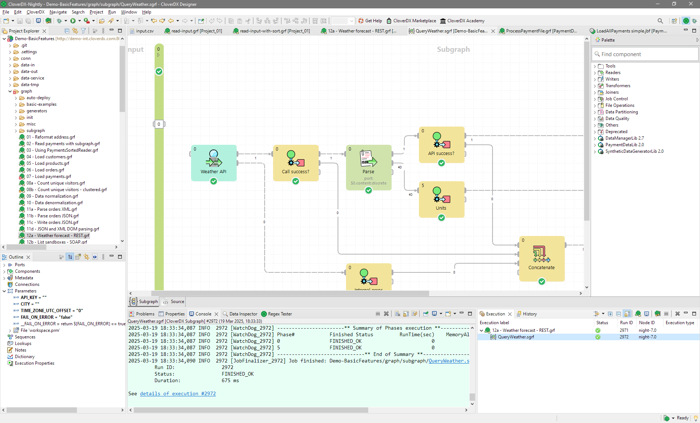
*Figure 47. CloverDX perspective*

- **Graph Editor** with **Palette of Components** is in the upper right part of the window.
  In this pane, you can create your graphs. **Palette of Components** serves to select components, move them into the **Graph Editor**, connect them with edges. This pane has two tabs. (See [Graph editor with Palette of Components](designer-layout.md#graph-editor-with-palette-of-components).)
- The **Project Explorer** pane is in the upper left part of the window.
  There are folders and files of your projects in this pane. You can expand or collapse them and open any graph by double-clicking its item. (See [Project Explorer pane](designer-layout.md#project-explorer-pane).)
- The **Outline** pane is in the lower left part of the window.
  The pane contains all parts of the graph that is opened in the **Graph Editor**. (See [Outline pane](designer-layout.md#outline-pane).)
- The **Tabs** pane is in the bottom of the window.
  You can see the data parsing process in these tabs. (See [Tabs pane](designer-layout.md#tabs-pane).)
- **Execution tab** is in the right bottom corner.
  You can see the details of graph execution here.

### Graph editor with Palette of components

The **Graph Editor** with **Palette of Components** is the most important pane for graph design.

| [Palette](designer-layout.md#palette) |
| --- |
| [Placing components from Palette](designer-layout.md#placing-components-from-palette) |
| [Components in Palette](designer-layout.md#components-in-palette) |
| [Using edges](designer-layout.md#using-edges) |
| [Saving the graph](designer-layout.md#saving-the-graph) |
| [Closing graphs](designer-layout.md#closing-graphs) |
| [Rulers](designer-layout.md#rulers) |
| [Grid](designer-layout.md#grid) |
| [Graph auto-layout](designer-layout.md#graph-auto-layout) |
| [Selecting components](designer-layout.md#selecting-components) |
| [Making components aligned](designer-layout.md#making-components-aligned) |
| [Copying and pasting of parts of a graph](designer-layout.md#copying-and-pasting-of-parts-of-a-graph) |
| [Source](designer-layout.md#source) |

#### Palette

The **Palette** contains components to be placed into **Graph Editor** and tools to work with them. The **Palette** enables you to **select** a component and paste it into the **Graph Editor**. Beside above mentioned components the **Palette** contains tools for placing notes and edges and for selection of components.

To **find** the component in **Palette**, use the **Filter**. The filter is placed at the top of the **Palette**. Start typing the component name into the input field of the filter and the component list is being filtered on the fly.

The **Palette** is either opened after **CloverDX Designer** has been started or you can **open** it by clicking the arrow which is located above the **Palette** label or by holding the cursor on the **Palette** label.

You can **hide** the **Palette** again by clicking the same arrow or even by simple moving the cursor outside the **Palette** tool.

You can even **change the shape** of the **Palette** by shifting its border in the **Graph Editor** and/or moving it to the left side of the **Graph Editor** by clicking the label and moving it to this location.

#### Placing components from Palette

To paste a component, you only need to click the component label, move the cursor to the **Graph Editor** and click again. After that, the component appears in the **Graph Editor**.

Another way to place a component into the **Graph editor** pane is to drag the component from the **Palette** and drop it on a place you want.

All components of the graph can be viewed in the **Outline** pane.

Once you have selected and pasted more components to the **Graph Editor**, you need to connect them with edges.

#### Components in Palette

**CloverDX Designer** provides all components in the **Palette of Components**. However, you can choose which should be included in the **Palette** and which not. If you want to choose only some components, select **Window** ****Preferences…​** from the main menu.

Expand the **CloverDX** item and choose **Components in Palette**.

In the window, you will see the categories of components. Expand the category you want and uncheck the checkboxes of the components you want to remove from the palette.

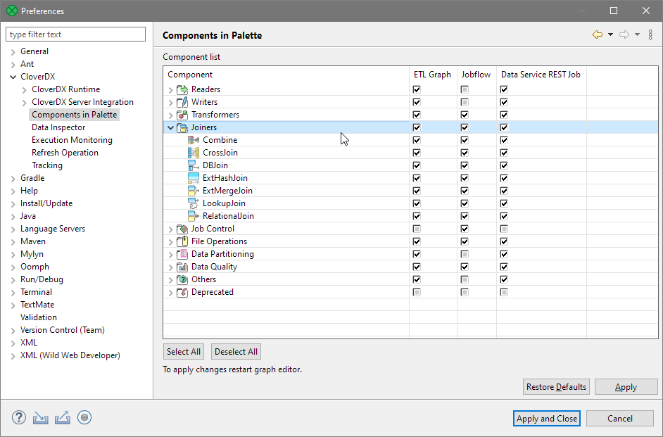
*Figure 48. Removing components from the Palette*

Then you only need to close and open the graph and the components will be removed from the **Palette**.

#### Using edges

To connect two components by an edge choose the **edge** label in the **Palette**, click the output port of the first component and click on the input port of the second component. This way, the two components will be connected. Once you have terminated your work with edges, click the **Select** item in the **Palette** window.

#### Saving the graph

After creating or modifying a graph, you should save it. Save the graph by selecting the **Save** item from the context menu or by using the **Save** button in the **File** menu or by Ctrl+S.

#### Closing graphs

If you want to close any of the graphs that are opened in the **Graph Editor**, you can click the cross on the right side of the tab. If you want to close more tabs at once, right-click any of the tabs and select a corresponding item from the context menu. There you have the items: **Close**, **Close other**, **Close All**, and other items.

#### Rulers

**Rulers** serve to align the components.

**Rulers** can be switched on from the main menu. Select the **CloverDX** item (make sure the **Graph Editor** is highlighted) and turn on the **Rulers** option from the menu items.

To align the components using rulers, click anywhere in the horizontal or vertical rulers. Vertical or horizontal lines will appear. Then, you can drag any component to some of the lines; once the component is dragged to it by any of its sides, you can move the component by moving the line.

When you click any line in the ruler, it can be moved throughout the **Graph Editor** pane.

#### Grid

**Grid** helps you to align components.

The **grid** is switched on or off from the main menu. To switch on the **Grid**, select the **CloverDX** item (make sure the **Graph Editor** is highlighted) and click on the **Grid** item in the menu.

After that, you can use the grid to align components as well. As you move them, the components snap to the lines of the grid by their upper and left sides.

#### Graph auto-layout

By clicking the **Graph auto-layout** item, you can change the layout of the graph - the components are aligned to the top left corner of the view.

#### Selecting components

When you push and hold down the left mouse button somewhere inside the **Graph Editor** and drag the mouse throughout the pane, a rectangle is created. When you create this rectangle in such a way so as to surround some of the graph components and then release the mouse button, you can see that these components have become highlighted. (All components in the graph below.)

#### Making components aligned

If at least two components are selected, six buttons (**Align Left**, **Align Center**, **Align Right**, **Align Top**, **Align Middle** and **Align Bottom**) appear highlighted in the tool bar above the **Graph Editor** or **Project Explorer** panes. (With their help, you can change the position of the selected components.) See below:

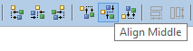
*Figure 49. Six new buttons in the Tool Bar appear highlighted (Align middle is shown)*

Alternatively, you can right-click inside the **Graph Editor** and select the **Alignments** item from the context menu. Then, a submenu appears with the same items as mentioned above.

#### Copying and pasting of parts of a graph

Remember that you can copy any highlighted part of any graph by pressing Ctrl+C and subsequently Ctrl+V after opening some other graph.

#### Source

The **Source** tab contains the source of the graph. The tab does not require editing.

The name of the user that has created the graph and the name of its last modifier are saved to the **Source** tab automatically.

### Project Explorer pane

In the **Project Explorer** pane, there is a list of your projects, their subfolders and files. You can expand or collapse them, view them and open.

#### Opening Graphs from Project Explorer pane

All graphs of the project are situated in this pane. You can open any of them in the **Graph Editor** by double-clicking the graph item.

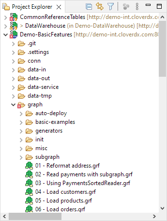
*Figure 50. Project Explorer pane*
> [!NOTE]
> Compatibility
> In **5.10.0**, the deprecated **Navigator** pane was replaced with **Project Explorer** in the default **CloverDX** perspective.

### Outline pane

The **Outline** pane contains a list of all elements of the currently used graph.

- **Ports** - list of connected input and output ports. Available in subgraphs only. See [Optional Ports](subgraphs.md#optional-ports)
- **Components** - list of components used in the selected graph. See [Components](components.md)
- **Metadata** - list of metadata assignable to edges in selected graph. See [Metadata](metadata.md)
- **Connections** - list of connections used in the graph. See [Connections](connections.md)
- **Parameters** - See [Parameters](parameters.md)
- **Sequences** - See [Sequences](sequences.md)
- **Lookups** - See [Lookup Tables](lookup-tables.md)
- **Notes** - See [Notes in Graphs](note.md)
- **Dictionaries** - See [Dictionary](dictionary.md)
- **Configuration** - See [Execution Properties](jobconfig.md)

The graph components, edges metadata, database connections or JMS connections, lookups, parameters, sequences, and notes are editable from the **Outline**. You can both create internal properties and link external (shared) ones. Internal properties are contained in the graph and are visible there. You can externalize the internal properties and/or internalize the external (shared) properties. You can also export the internal metadata. If you select any item in the **Outline** pane (component, connection, metadata, etc.) and press Enter, its editor will open.
> [!TIP]
> Activate the **Link with Editor** yellow icon in the top right corner and every time you select a component in the graph editor, **CloverDX** will select it in the **Outline** as well. Although this is convenient for smaller graphs, turning it off for complex graphs prevents the **Outline** from expanding the big list of components repeatedly when you are working in the graph.

*Figure 51. Outline pane*

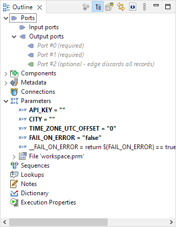
*Figure 52. Outline pane - Subgraphs*

#### Outline pane buttons

The **Outline pane Buttons** affect what is being displayed in the **Outline**. There are two buttons in the upper right part of the **Outline** switching between **Tree View** and **Graph Minimap**, and the **Link With Editor** button.

#### Tree view

In the tree view you can see the tree of components, metadata, connections, parameters, sequences, lookups and notes. **Tree View** is the default **Outline** view.

#### Graph minimap

The **Graph Minimap** is an **Outline** view not displaying the graph elements but the preview.

To switch to the **Graph Minimap** use the second button from the left in the top of the **Outline**.

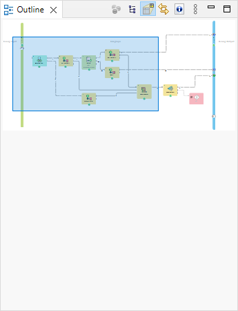
*Figure 53. Outline pane with minimap*

You can see a part of some of the example graphs in the **Graph Editor** and the same graph structure in the **Outline** pane. In addition to it, there is a light-blue rectangle in the **Outline** pane. You can see exactly the same part of the graph as you can see in the **Graph Editor** within the light-blue rectangle in the **Outline** pane. By moving this rectangle within the space of the **Outline** pane, you can see the corresponding part of the graph in the **Graph Editor** as it moves along with the rectangle. Both the light-blue rectangle and the graph in the **Graph Editor** move equally.

You can do the same with the help of the scroll bars on the right and bottom sides of the **Graph Editor**.

To switch to the tree representation of the **Outline** pane, you only need to click the first button from the left in the upper right part of the **Outline** pane.

#### Link with editor

**Link With Editor** button switches on a link between the currently selected element from the **Outline** and the currently selected element from the **Graph Editor**. If you click on a component in **Graph Editor** and this option is enabled, the component will be highlighted in the **Outline** too.

#### Show element IDs

**Show Element IDs** shows or hides element IDs of graph elements (components, metadata, etc.) in **Outline**. Element ID is displayed behind the corresponding element name.

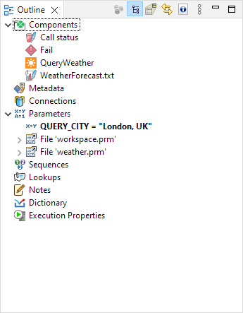
*Figure 54. Show element ID enabled*

#### Cleanup unused elements

**Graph Cleanup** assists you in removing unused elements from a graph. The dialog helps you to remove unused metadata, connections, sequences or lookup tables or dictionaries, but it does not remove unused parameters. The removal of unused parameters might affect other graphs in the project.

The **Graph Cleanup** can be opened by right click from the **Outline** pane or **Graph Editor** pane using **Cleanup unused elements** option.

If you open the dialog, the unused parameters will be preselected. You can deselect any of preselected items or add any item or items.

The **Graph Cleanup** dialog contains buttons to **Select all** elements, to **Deselect all** elements and to **Reset to default** selection of elements.

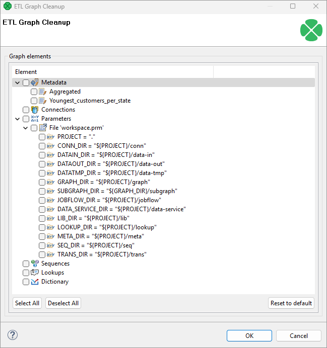
*Figure 55. Graph Cleanup*

#### Locking elements

In **Outline**, you can lock any of the shared graph elements. A lock is a flag (with an optional text message) that you deliberately assign to an element so that others are notified that they should not attempt to modify the element. These graph elements can be locked

- **Metadata**
- **Connections**
- **Sequences**
- **Lookups**

##### How to lock

To lock any of these elements, right click it in **Outline** and click **Lock**.

Provide a message to be displayed if a locked item is being edited. You can use the default one.

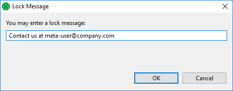
*Figure 56. Locking an element - Message dialog*
> [!NOTE]
> Lock is not a security tool - anyone can perform unlock and locks are not owned by users.

##### Locked elements

In various places (such as the [Transform Editor](transformations.md#transform-editor)), you are warned if you are accessing a locked element, e.g. modifying locked metadata.

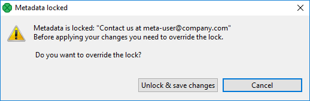
*Figure 57. Accessing a locked graph element - you can add any text you like to describe the lock.*

### Tabs pane

In the lower right part of the window, there is a series of tabs.

- [Properties Tab](designer-layout.md#properties-tab)
- [Console Tab](designer-layout.md#console-tab)
- [Problems Tab](designer-layout.md#problems-tab)
- [Regex Tester tab](designer-layout.md#regex-tester-tab)
> [!NOTE]
> If you want to extend any of the tabs in a pane, simply double-click the tab. After that, the pane will extend to the size of the whole window. When you double-click it again, it will return to its original size.

#### Properties tab

In the **Properties** tab, you can view and/or edit the component properties.

When you click a component, properties (attributes) of the selected component appear in this tab.

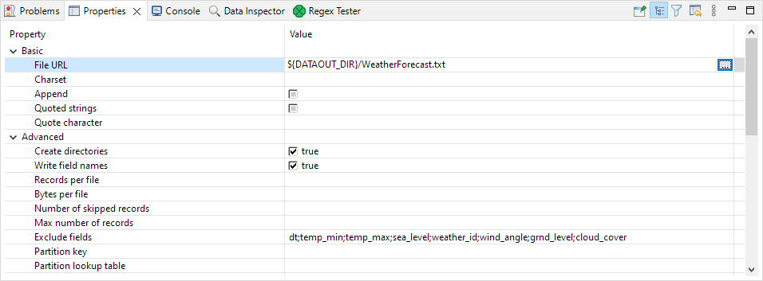
*Figure 58. Properties tab*

Note that the best way to edit properties of the component is to double-click the component. A more powerful Edit component dialog will be shown and will allow you to edit settings of your component in more comfortable interface.

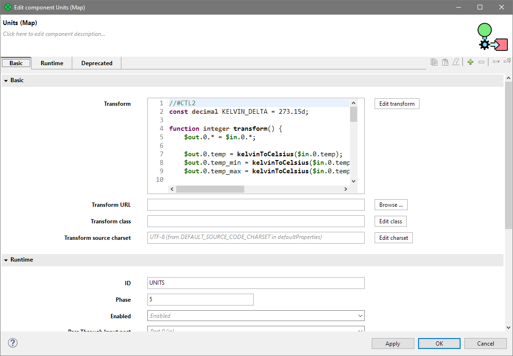
*Figure 59. Edit component dialog.*

#### Console tab

In this tab, the process of reading, unloading, transforming, joining, writing, and loading data can be seen.

By default, **Console** opens whenever **CloverDX** writes to `stdout` or `stderr`. You will see the `stdout` or `stderr` in the tab.

##### Console preferences

If you want to change it, you can uncheck any of the two checkboxes that can be found when selecting **Window** ****Preferences**. Expand the **Run/Debug** category and open the **Console** item.

To avoid switching to the console, uncheck the **Show when program writes to standard out** and **Show when program writes to standard error** checkboxes.

##### Check buttons

Two checkboxes that control the behavior of **Console** are:

- **Show when program writes to standard out**
- **Show when program writes to standard error**

Note that you can also control the buffer of the characters stored in **Console**:

There is another checkbox (**Limit console output**) and two text fields for the buffer of stored characters and the tab width.

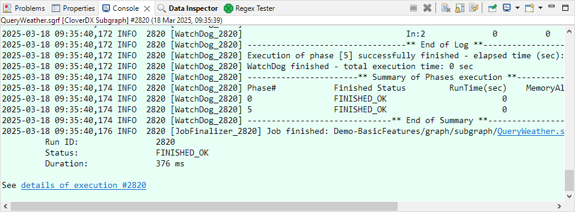
*Figure 60. Console Tab*

#### Problems tab

In this tab, you can view error messages, warnings, etc.

When you expand any of the items, you will see their resources (name of the graph), paths (path to the graph) and location (name of the component).

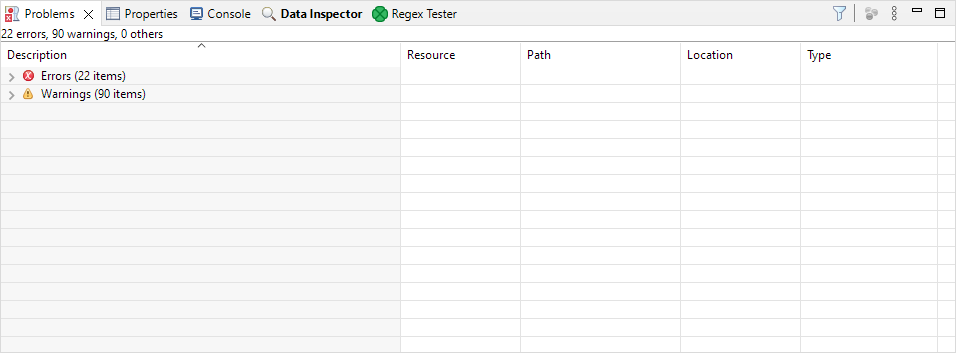
*Figure 61. Problems tab*

#### Regex Tester tab

In this tab, you can work with [*regular expressions*](language-reference-ctl2.md#regular-expressions).

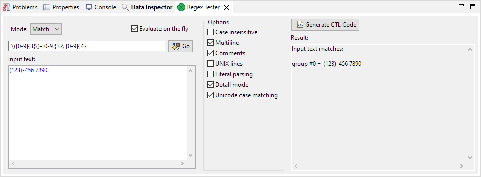
*Figure 62. Regex Tester tab*

You can paste or type any regular expression into the **Regular expression** text area. Content assistant can be called out by pressing Ctrl+Space in this area.

You need to paste or type the text to be matched into the pane below the **Regular expression** text area. After that, you can compare the expression with the text.

You can either evaluate the expression as you type, or you can uncheck the **Evaluate on the fly** checkbox and compare the expression with the text upon clicking the **Go** button. The result will be displayed in the pane on the right.

The **Regex Tester** can work in one of three modes.

- Select **Find** if you want to find a substring matching the expression.
- Select **Split** if you want to split the text according to the expression.
- Select **Match** if you want to check for an exact match.

You have at your disposal a set of checkboxes. Some options are checked by default.

From the **Regular expression** you can generate CTL code by clicking on the **Generate CTL code** button, the dialog with generated CTL will open and you can copy the CTL from there.

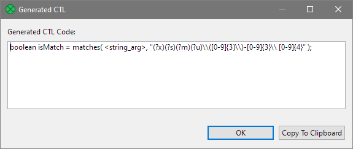
*Figure 63. Generated CTL code*

More information about regular expressions and provided options can be found at the following site: [http://docs.oracle.com/javase/8/docs/api/java/util/regex/Pattern.html](http://docs.oracle.com/javase/8/docs/api/java/util/regex/Pattern.html)

### Execution tab

**Execution tab** displays details of execution of a graph and its subgraphs. You can connect to **CloverDX Server** and see details of the graph run. See [Connecting to a running job](running-graphs.md#connecting-to-a-running-job).

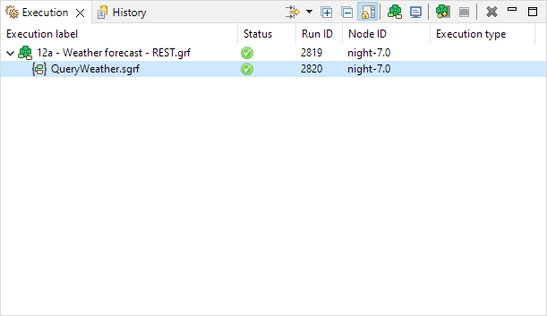
*Figure 64. Execution tab of a graph running on CloverDX Designer*

#### Execution label

**Execution label** is the name of a graph or particular subgraph components.

#### Status

**Status** shows which parts of a graph are **waiting**, **running**, **successfully completed** or which **failed**.

[Graph states](running-graphs.md#graph-states)

#### Run ID

**Run ID** is an identifier of a graph run, or an identifier of the run of a subgraph component.

#### Node ID

**Node ID** is an identifier of the node on which graph runs. This column is available for server runs only.

#### Execution type

**Execution type** displays node allocation on Clustered graph runs.
