<!-- Development > First steps with CloverDX Designer > CloverDX Designer tutorial -->

### CloverDX Designer tutorial

This chapter explains the basics of CloverDX projects and shows you way to create a simple graph that reads records from a CSV file and writes them to a .xlsx file.

Instead of reading this chapter, you can try the **Tutorial** that is available in the product after the first start in a new workspace or [watch a video tutorial](https://academy.cloverdx.com/courses/quick-start-guide/).

#### Terminology

Before creating a transformation graph we will explain some terms we use in this tutorial.

- A **workspace** is a directory on your computer where your save your projects. It also contains per-workspace configuration. You have chosen it during the start of Designer.
- A **project** is a directory in **workspace**. It is the location where you place data transformations and data.
- A **graph** , or a transformation graph, is *a recipe* to data transformation. The graph consists of **components** which are connected by **edges**.

#### Creating a project

We assume that you have downloaded and installed **CloverDX Designer**.

It is the right time to create a new project now. Select **File** ****New** ****CloverDX Project** from the main menu:

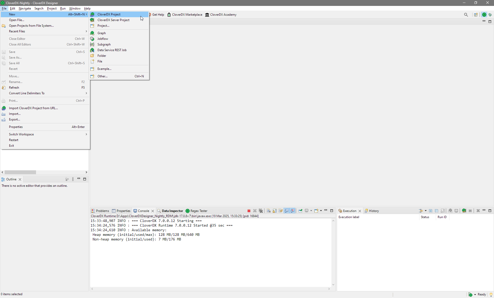
*Figure 2. Creating a New CloverDX project*

Type the name of the project, e.g. `Project_01`.

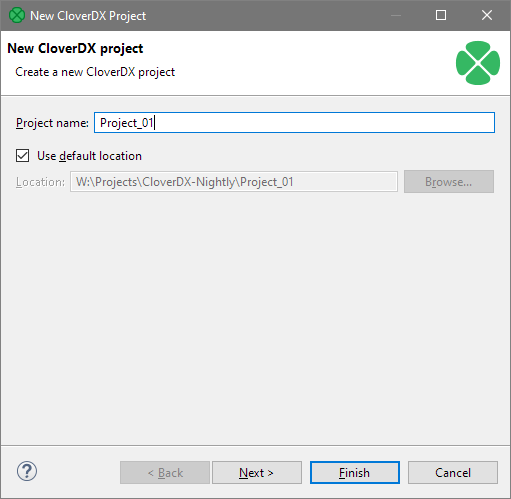
*Figure 3. Selecting a name of a new project*

#### Creating a new data file

Now you need a data file. You probably have some. If not, you can create an example file as shown below.

The best practice is to place your input data into `data-in`.

Right-click `data-in` item in the **Project Explorer** pane and select **New** ****File** from the context menu.

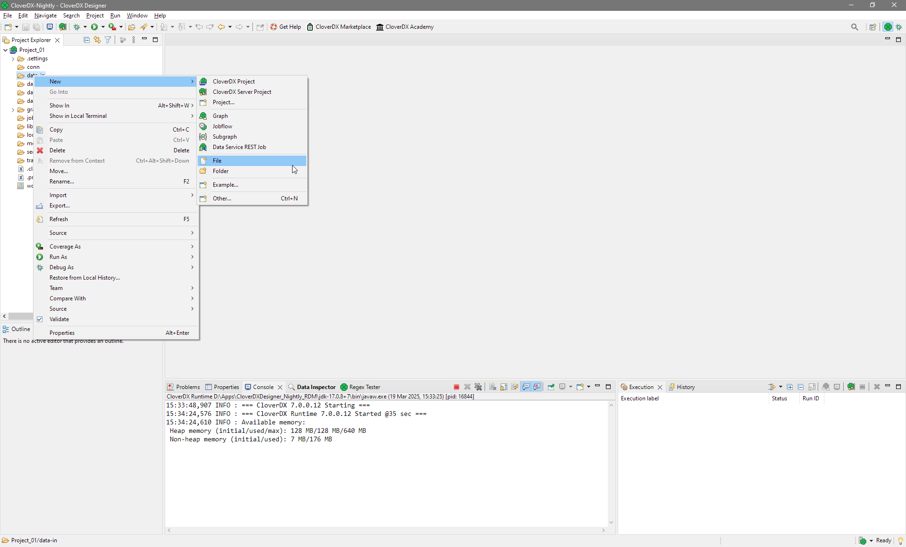
*Figure 4. Creating a flat data file in data-in directory.*

Type file name, e.g. `input.csv`. It will be created and stored in the highlighted `data-in` subfolder.

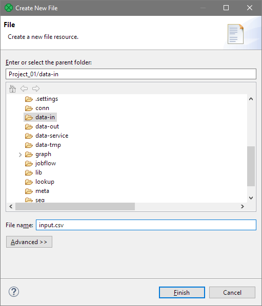
*Figure 5. Selecting a file name for the new file.*

The file will be created and opened. Note that depending on your computer settings, the file may open outside of the Designer. In that case, you can simply drag and drop the file from the Project Explorer to the empty place in the Designer to open it.

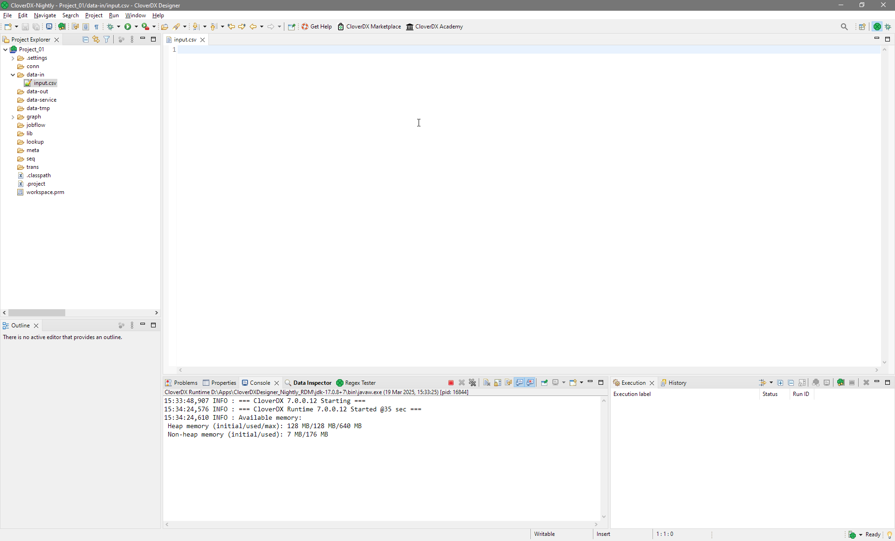
*Figure 6. Still empty data file*

Enter some data records in this file; for example, copy and paste the lines below (make sure there is an empty line at the end) and save the file:

```
John;Smith;25000
Peter;Brown;30000
George;Hardy;20000
Richard;Gordon;22000
Mark;Taylor;40000
Michael;Lester;18000
George;Smith;30000
Albert;Brown;30000
```

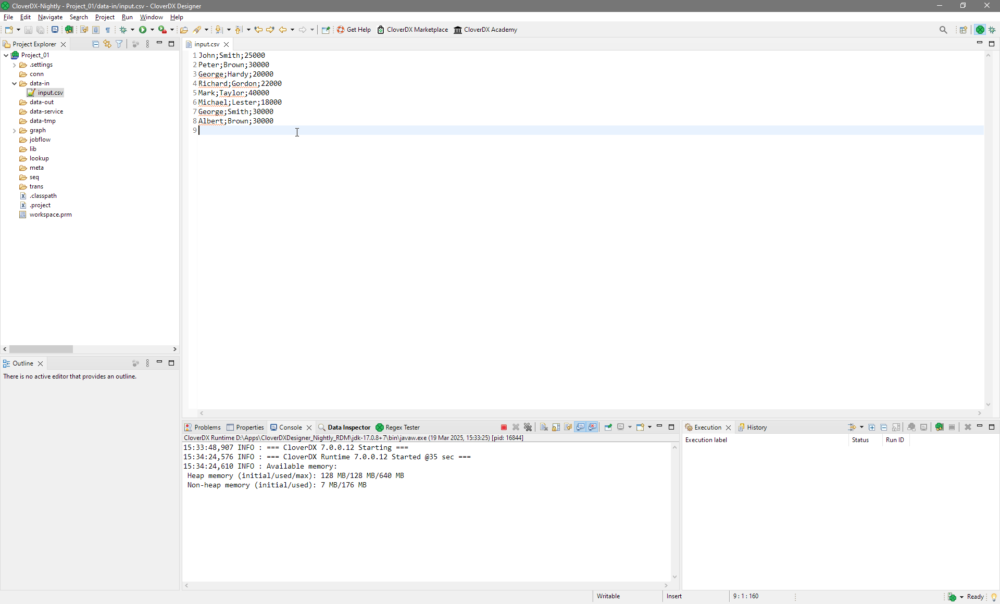
*Figure 7. Filling the graph with delimited data records*
> [!NOTE]
> Remember that once you have already some **CloverDX** project in you workspace and have opened the **CloverDX** perspective, you can create your next **CloverDX** projects in a slightly different way:
>
> - You can create directly a new **CloverDX** project from the main menu by selecting **File** ****New** ****CloverDX Project** or select **File** ****New** ****Project…​** and do what has been described above.
> - You can also right-click inside the **Project Explorer** pane and select either directly **New** ****CloverDX Project** or **New** ****Project…​** from the context menu and do what has been described above.

#### Creating a graph

After creating a new project, create a new graph: select **File** ****New** ****Graph** from the main menu. The graph is a recipe of your data transformation.

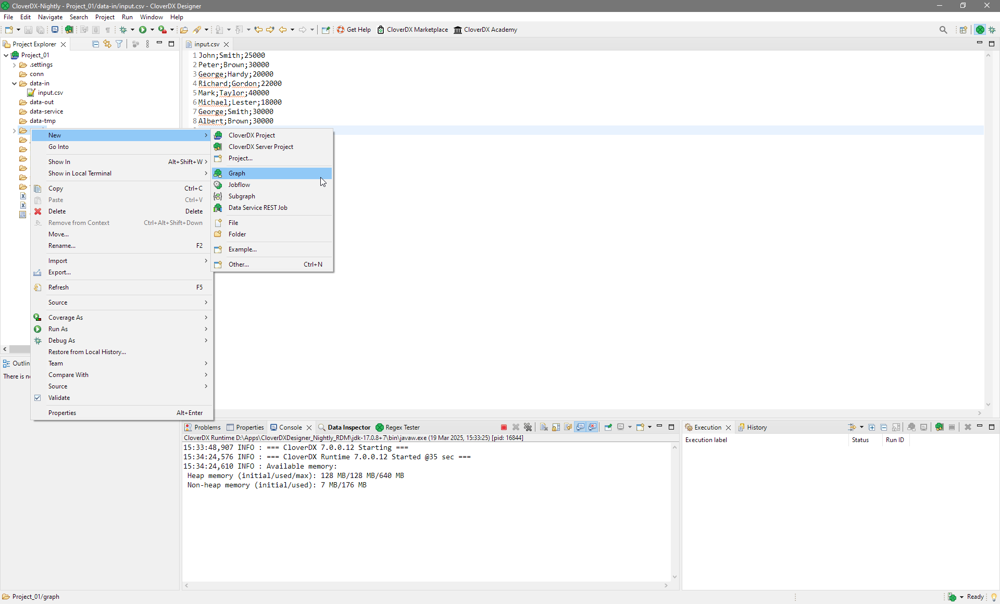
*Figure 8. Creating a new graph.*

Give a name to the graph and choose a directory for it. We choose `graph` as the graph name. **CloverDX Designer** gives it the `.grf` extension automatically.

**CloverDX Designer** offers the `graph` subfolder. It is the recommended place for graphs.

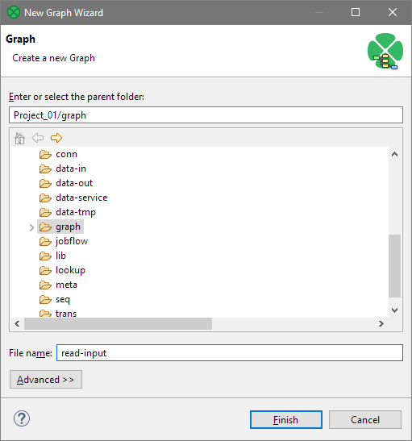
*Figure 9. Selecting a folder for the graph and a name of a new graph. By default, graphs go into the graph folder in the project.*

#### Placing components in the Graph Editor canvas

To place components into a graph, you can select them from the **Component Palette** on the right of the side of the Designer and then place them on the **Graph Editor** canvas.

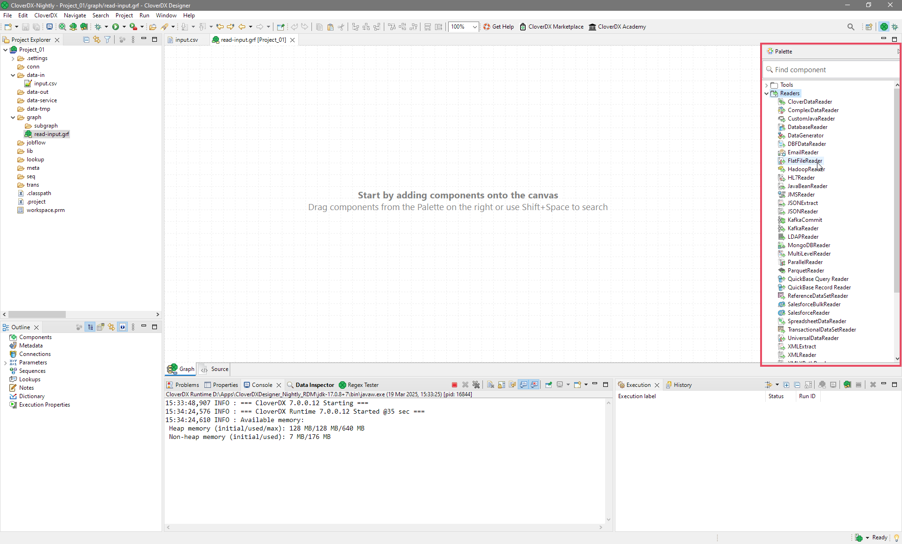
*Figure 10. Selecting components for the graph.*

If the **Palette** is not displayed, click an arrow in the right top of the **Graph Editor** pane. This way, the **Palette** will remain opened until you fold it.

Find the [FlatFileReader](flatfilereader.md) component in the **Palette** among **Readers**. You can find it in the **Readers** category in the palette or you can search using the search box at the top. The [FlatFileReader](flatfilereader.md) component can read various flat files - CSV, TSV, TXT and more.

To place the component on the canvas, you can drag & drop it from the **Palette** to the canvas or you can click first on the **Palette** and then into the canvas where you’d like the component to be placed.

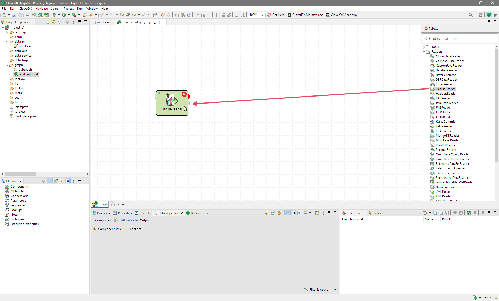
*Figure 11. Placing the first component to the Graph Editor canvas.*

Place the second component - the [SpreadsheetDataWriter](spreadsheetwriter.md) - to the graph in the same way. Since the data will from the FlatFileReader to the SpreadsheetDataWriter, place the writer component to the right of the reader. SpreadsheetDataWrite is in the **Writers** category in the Palette. The [SpreadsheetDataWriter](spreadsheetwriter.md) can write Excel files (XLSX and XLS).

You can also add components by searching for them in the **Add component** dialog. This dialog can be shown when you press Shift+Space keyboard shortcut while working with the graph editor. The dialog allows you to find a component based on its name or description. To add the component, simple select it from the dialog and click anywhere in the graph to place it.

You can also navigate the dialog using the keyboard, so the fastest way to add a component is to press Shift+Space, type your search term, find the component using the keyboard (arrows) and then pressing Enter. You can then click into the graph canvas to place the selected component.

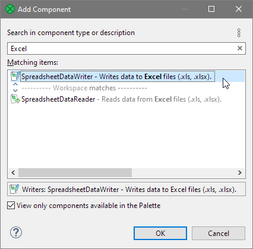
*Figure 12. Add component dialog while searching for "Excel". Select the writer (the second component) and click OK or press Enter to place it into the graph.*

Place the SpreadsheetDataWriter into the graph like this:

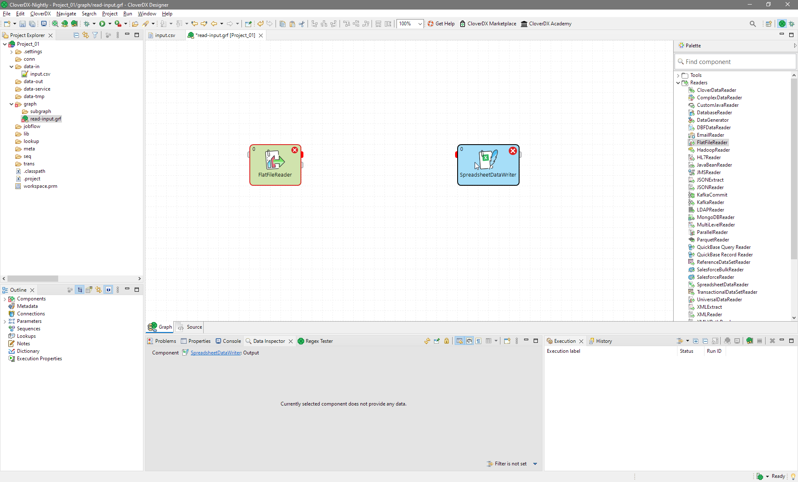
*Figure 13. Placing the writer component to the right of the reader.*

#### Connecting components by an edge

Data flow in the graph is shown as edges with arrows going from one component to the next. Edges connect to **component ports** which provide interface for data to get into and out of the component. Different components have different numbers of ports depending on what functionality they implement.

Ports are shown as little "bumps" on each component. **Output ports** produce data and are on the right side of the component while **input ports** feed data into the component and are on the left side of the component.

Edges in the graph always go from output ports of one component to the input port of another component.

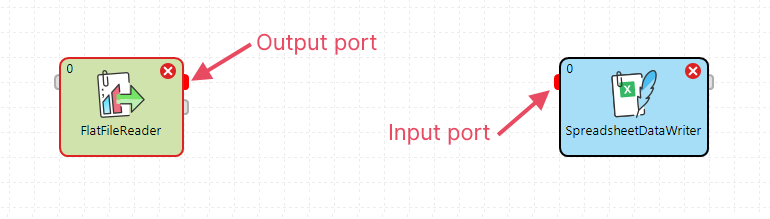
*Figure 14. Input and output ports on components.*

To start creating an edge, click on a port. Your mouse pointer will change and will start "dragging" an edge coming out of the port you clicked. In our example, click on the **first output port of the FlatFileReader** and drag the edge **to the first input port of the SpreadsheetDataWriter**.

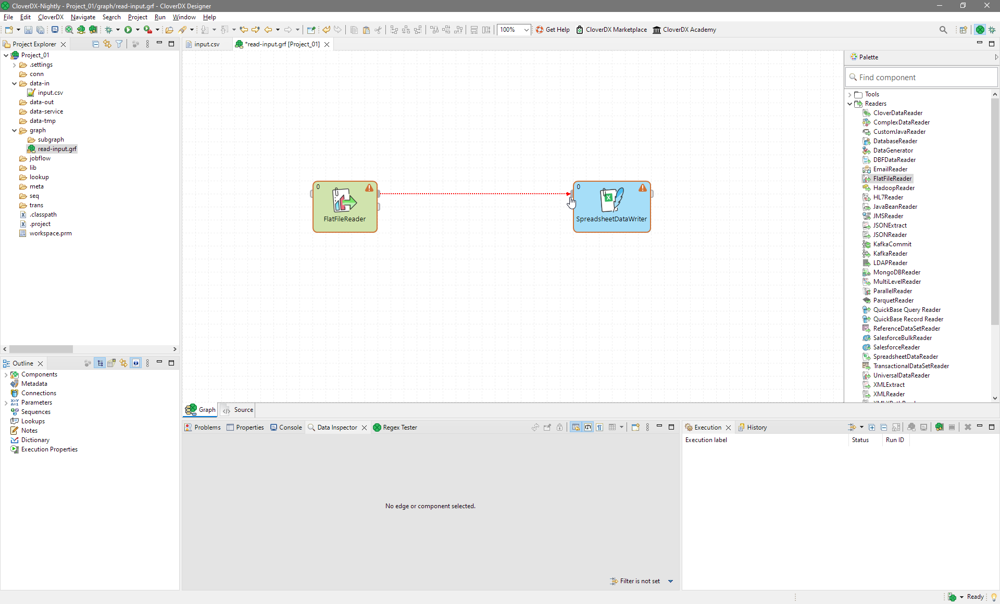
*Figure 15. Components connected by an edge.*

If done correctly, you will see something like on the above screenshot. The edge is dotted and red since it has not been configured yet - it is missing **metadata**. The edges are still red and dashed since no metadata are assigned to them.

In the next step we will assign metadata to the edge.

#### Extracting metadata from the input file

**Metadata** in CloverDX describes the data structure of the data flowing on edges.

You can extract metadata from your flat data file or create it on your own. We will show you, how to extract it from input file.

Right-click the first edge and select **New metadata** ****Extract from flat file**.

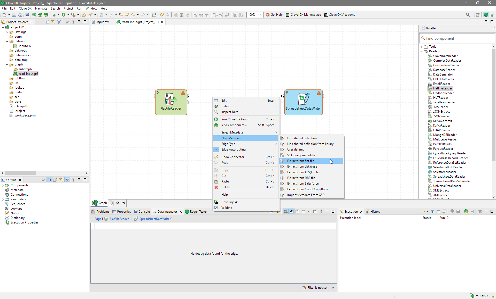
*Figure 16. Extracting metadata*

A wizard for metadata extraction opens. Use the **Browse** button to open a dialog to specify which file you’d like to work with.

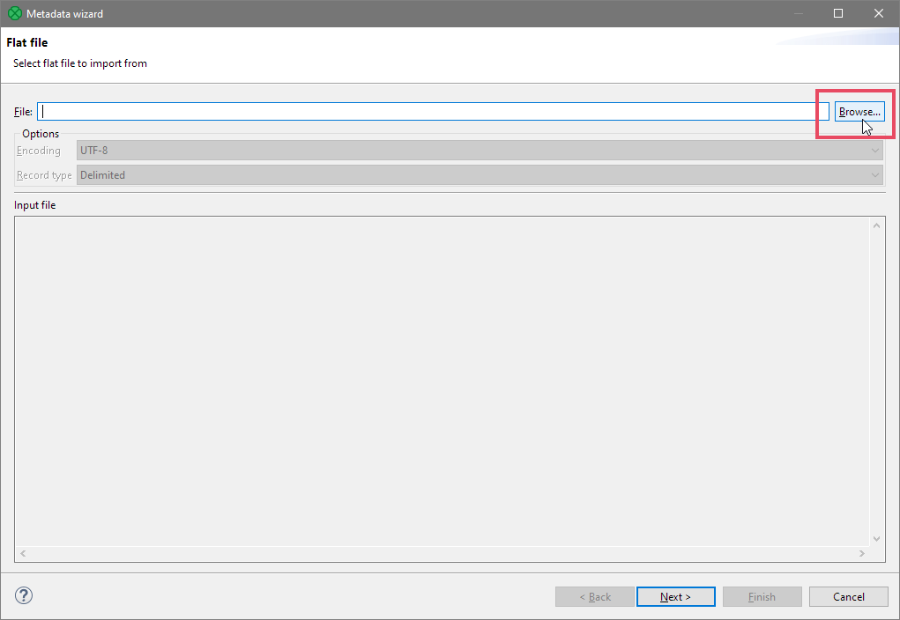
*Figure 17. File selection step in metadata extraction from flat file.*

Select the `input.csv` file in your `data-in` directory in the project and click the **OK** button.

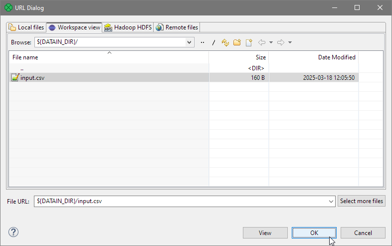
*Figure 18. Selecting data file*

The **Metadata Editor** fills up:

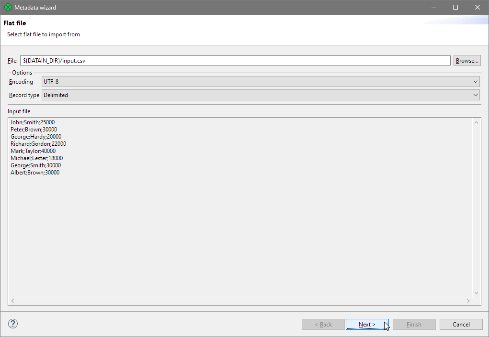
*Figure 19. Metadata extraction wizard showing simple preview of the selected file.*

Click **Next** to see and edit specify metadata fields (columns in your data).

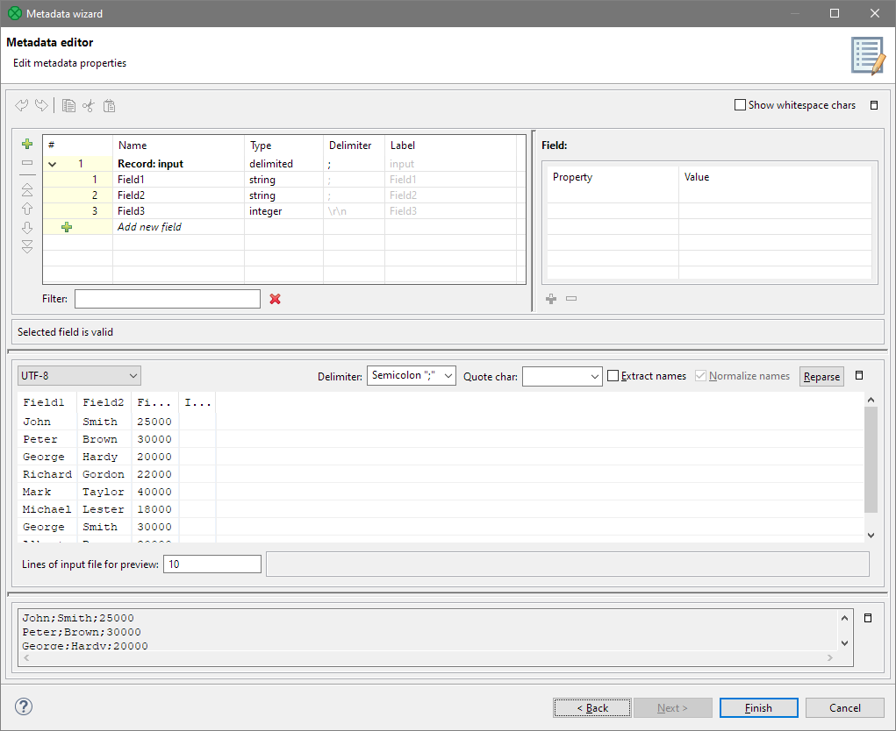
*Figure 20. Metadata Editor showing the fields and data preview.*

As you can see, the wizard determined that the records consisted of three fields and it also understood that the third field’s values were integer numbers.

You can replace the three default field names (`Field1`, `Field2` and `Field3`) with more descriptive ones: `FirstName`, `LastName` and `Salary`. If you file contained a header row, the Metadata extraction wizard would also be able to read the names of the fields from it.

To change tha name of a field, click the `Field1` item and enter the new field name. Field names cannot contain any special characters and cannot start with a number. They are also case-sensitive, so `FirstName` is not the same as 'firstname'.

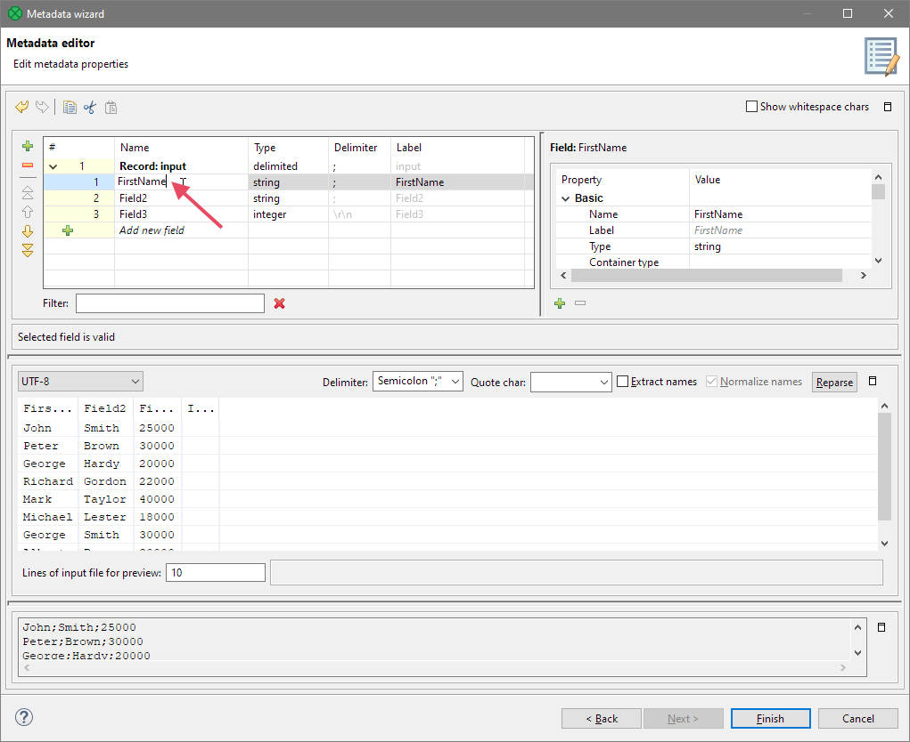
*Figure 21. Renaming a field.*

Do the same with the other two field names. You can also rename the whole record to `EmployeeSalary` to help users see the purpose of the data before they look into it. The result will look like this:

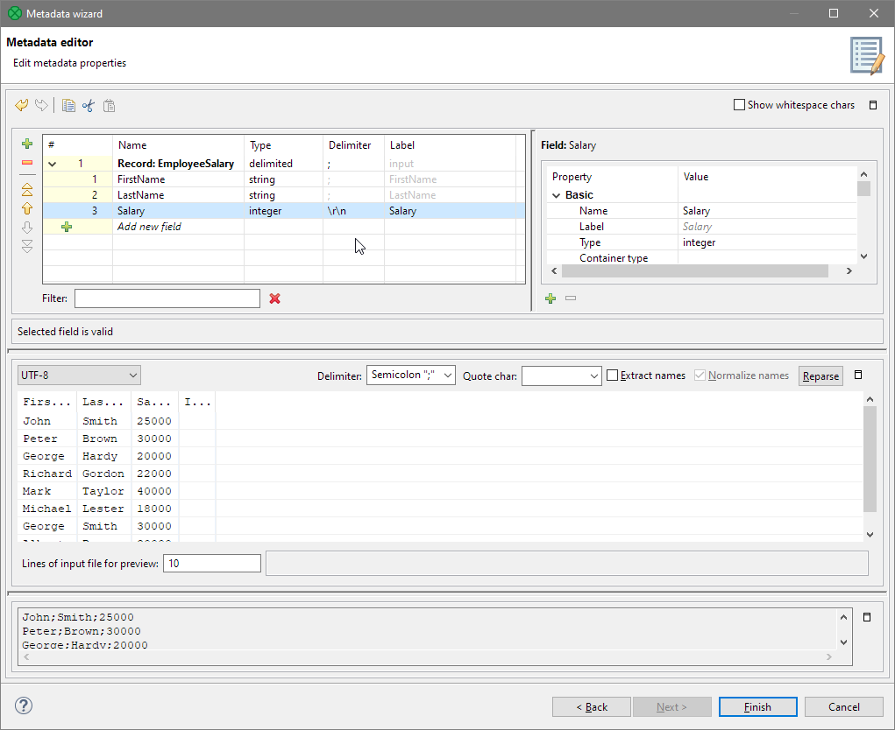
*Figure 22. All fields have been renamed.*

Now click **Finish**. You’ve now created your metadata and assigned it to the edge between the two components in the graph.
> [!NOTE]
> You can extract metadata on edges and on input components.

#### Assigning metadata to the edges

If you have metadata assigned to the edge from the previous step, you do not have to assign it again.

If you have any edge without metadata and you would like to assign the metadata to the edge, right-click the edge and select the **Select Metadata** item from the context menu.

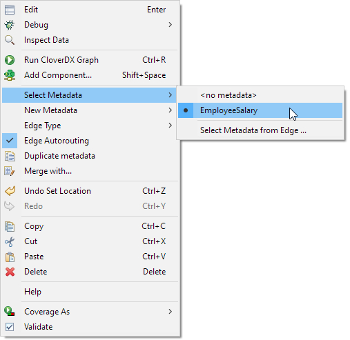
*Figure 23. Assigning metadata to an edge*

Select the desired metadata by clicking its item. The edge with assigned metadata becomes solid.

Alternatively, you can use the **Outline view** in the lower-left corner of the Designer window to select your metadata and drag & drop it onto the edge.

#### Setting up Readers (FlatFileReader)

To set up the **FlatFileReader** component, double-click the component in the **Graph Editor** pane. The component editor opens.

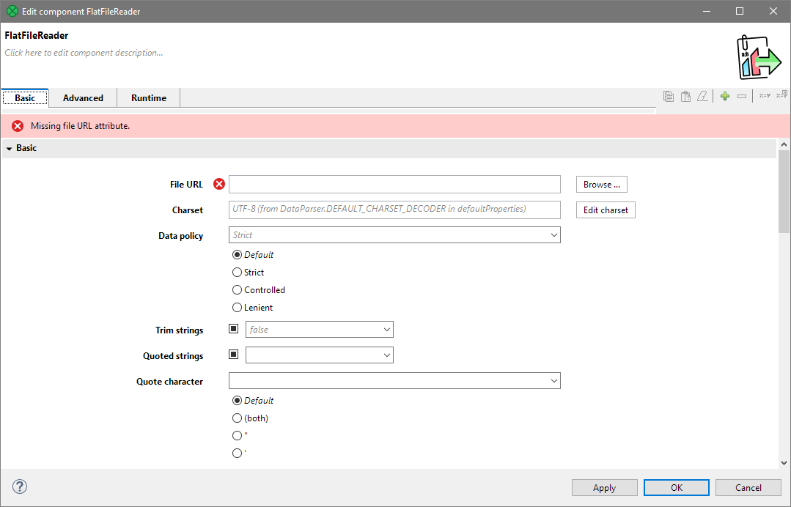
*Figure 24. Editing a Reader*

Click the **Browse** button to the right of the **File URL** attribute. A **File URL** dialog will be shown and will allow you to pick the input file `input.csv` from the `data-in` directory.

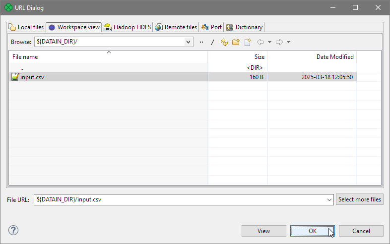
*Figure 25. Selecting the file in File URL dialog*

Once you select the file, the component will not longer report any errors.

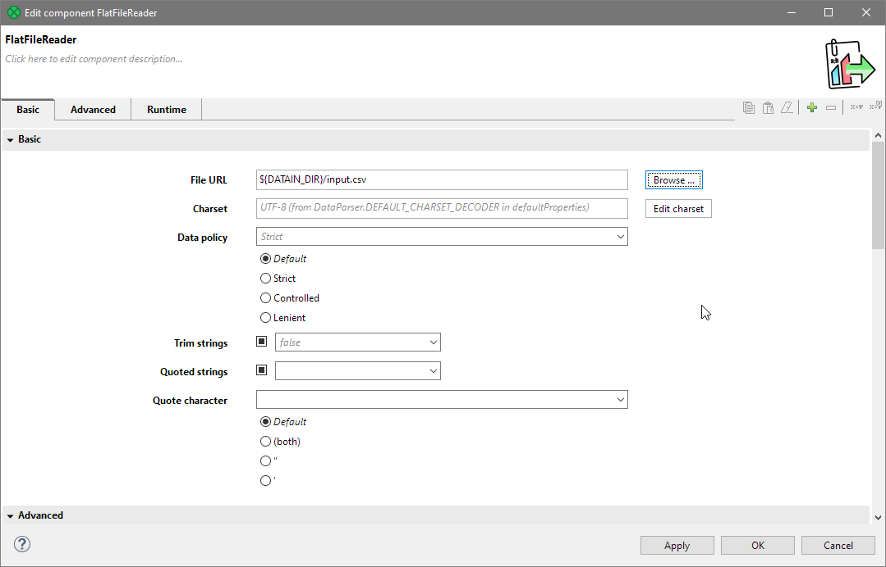
*Figure 26. FlatFileWriter configured to read the data-in/input.csv.*

#### Setting up Writers (SpreadsheetDataWriter)

Writer set-up is very similar to the set-up of the reader component. You will have to configure the output file where to write your Excel spreadsheet. This is done again in the Edit component dialog which is shown by double-clicking on the SpreadsheetDataWriter component.

Configure the **File URL** to `${DATAOUT_DIR}/Salaries.xlsx` via the **File URL dialog** or by typing the URL into the **File URL** property. Once you do this, your graph will be ready to run.

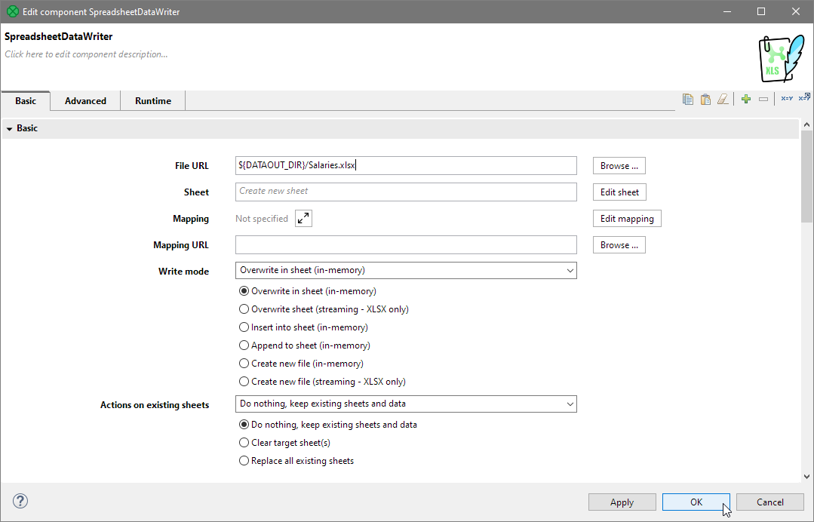
*Figure 27. Configured SpreadsheetDataWriter component.*

The [SpreadsheetDataWriter](spreadsheetwriter.md) has many more parameters that can help you configure how the file is written, which sheet is used, which columns and mapped and more.

#### Running the graph

To run the graph, right-click anywhere inside the **Graph Editor** pane and select **Run CloverDX Graph** from the context menu. The graph will run.

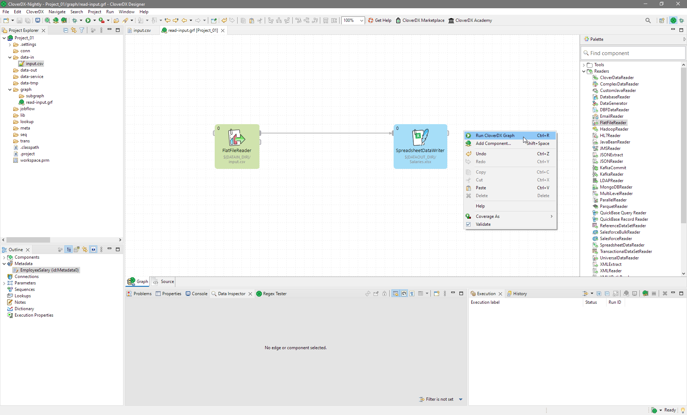
*Figure 28. Running the graph*

Once the graph starts running, you’ll see the logs in the **Console** view which is shown under the graph canvas by default. If the graph finished successfully, the console will be green. Failed graphs will show with red console background and the error message will be visible at the end of the log.

After you run the graph we just created, you should see output similar to the below.

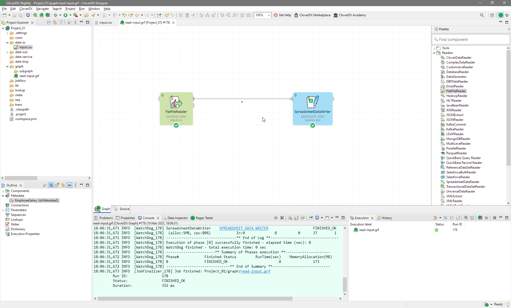
*Figure 29. Execution of the example graph finished successfully.*

If you would like to see more detailed information about graph run, double-click the **Console** tab. The tab will maximize to cover the whole window. You can restore the original size of this tab when you double-click it again.

#### Opening the output file

After running a graph, the file structure of the **Project Explorer** pane refreshes automatically. If not, you can press F5 in the **Project Explorer** view to refresh.

Expand the `data-out` directory to see the files inside it. You should also see `Salaries.xlsx` file.

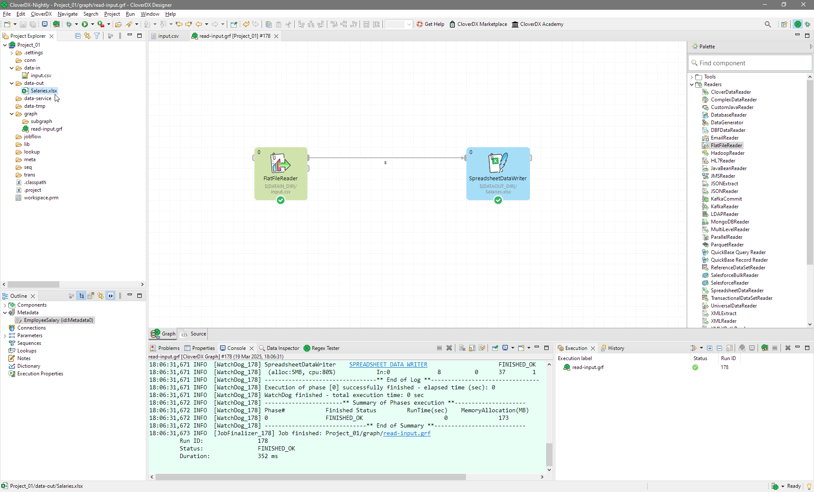
*Figure 30. The output folder with*

Double click the file to open it with an appropriate spreadsheet editor.

##### Summary

In this tutorial we have learned to

- create a transformation graph
- place component to a graph
- assign metadata to an edge
- run a graph
- read data from a CSV file
- write data to Excel spreadsheet

##### What to do next

You can continue with [Filtering the records](designer-tutorial.md#filtering-the-records) or [Sorting the records](designer-tutorial.md#sorting-the-records).

You can also play with built-in pre-prepared examples: **Help** ****CloverDX Examples**

#### Filtering the records

In this chapter we will learn how to filter records with the [**Filter**](extfilter.md) component.

This chapter builds on the graph from [Creating a graph](designer-tutorial.md#creating-a-graph).

#### Inserting the filter

The component for data filtering is called **Filter** and can be found in the **Transformers** category in the **Palette**.

Filter requires an input as well as output - it reads data from its input port and produces data on its output ports. First input port and first output port are both mandatory and must be connected. The second output port is optional (for removed records) and does not need to be connected.

To insert the component, you can either add if from the **Add component dialog** (shown via Shift+Space) or from the **Palette**. Once you select the component in the dialog or the Palette, you can add it directly on the edge between **FlatFileReader** and **SpredsheetDataWriter** by clicking on the edge. The **Filter** will be inserted and the edge will be split as needed.

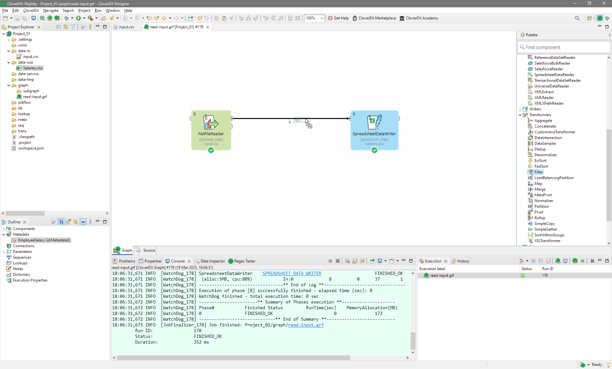
*Figure 31. Adding the Filter component to the existing edge. Notice the mouse cursor is changed to "Add component" cursor and edge you hover over is highlighted.*

Once you add the component, your other components may be too close to each other. In general, we recommend you space out the components a bit and align them nicely. It will help you navigate larger and more complex jobs in the future.

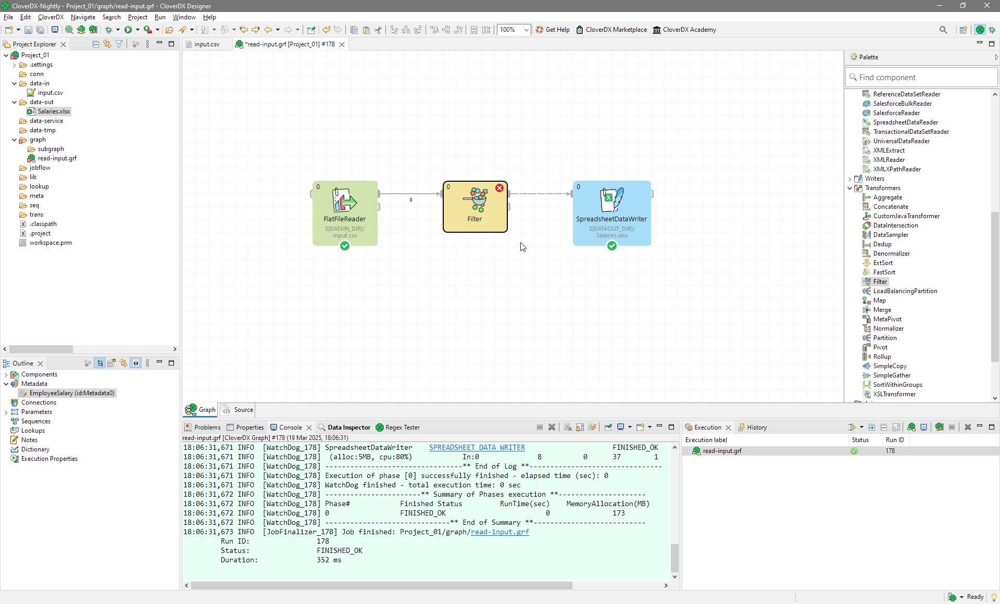
*Figure 32. Filter was added to the graph. It is highlighted in red since it has not been configured yet.*

The filtering condition is not specified yet, therefore can you see an error on the component.

#### Setting up the filter component

Double-click the **Filter** component to open the component editor.

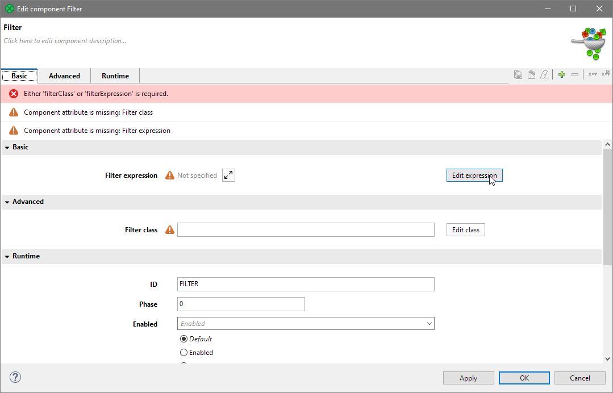
*Figure 33. Filter component attributes before anything is configured.*

The only attribute we will need to configure now is the **Filter expression**. To configure it, click the **Edit expression** button. A **Filter editor** dialog will open.

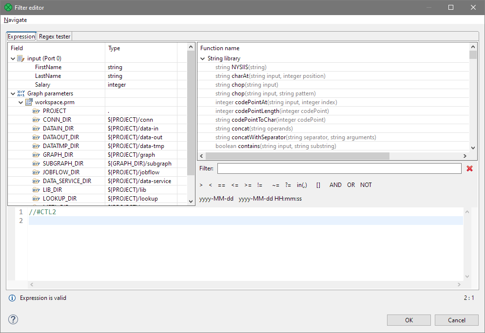
*Figure 34. Filter editor dialog.*

This dialog allows you to configure any filtering condition. Filtering conditions are specified as boolean expressions in language called CTL2. To learn more about how CTL2 works, please see [CTL2 - CloverDX Transformation Language](part5.md) chapter in the documentation. At this point we will not need to configure anything complicated - we will configure the component to filter records so that records where `Salary` is at least 24000 will be kept and everything else will be removed.

To build the filtering expression, you can use the top-right part of the dialog to see which fields are available in the data flowing to the component. Double-clicking on a field here will add the field name to the expression below. Double-click on the `Salary` field.

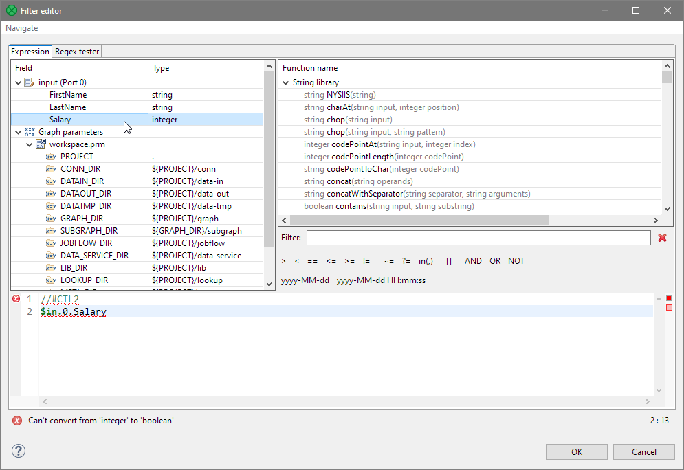
*Figure 35. Selecting the Salary field.*

**CloverDX** validates the expressions as you work on it so you’ll see an error in the expression editor. The error is shown with the red underline and hovering over it will show you additional details. In this case, the expression is not complete yet, hence the error.

To complete the expression, click into the editor and type the rest of the expression. The full expression should read:

```
$in.0.Salary > 24000
```

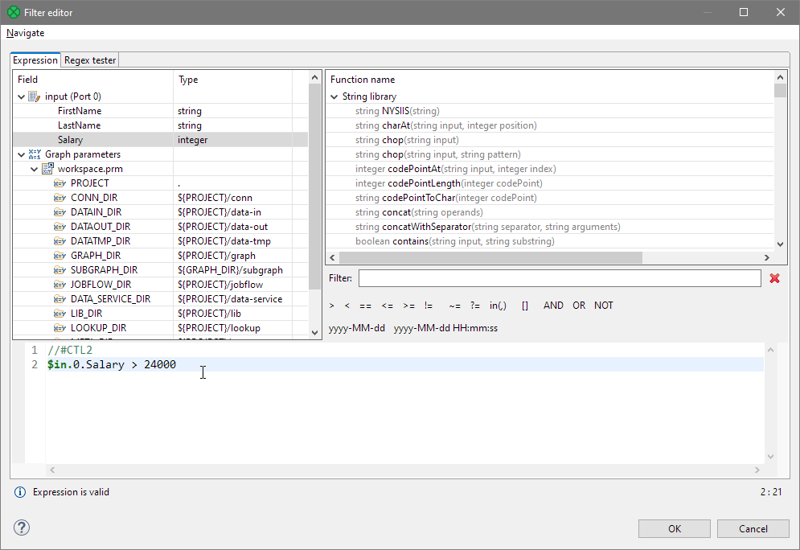
*Figure 36. Filter with the expression fully defined. No errors are reported.*

By clicking **OK**, you close the **Filter Expression** editor.

When you save the graph, you can see that the warning icon has disappeared from the **Filter** component. When you iun the graph, you’ll see that the **Filter** kept five records out of eight - this is visible in the little numbers shown next to each edge. These numbers show you the number of records that were sent though each edge.


*Figure 37. Graph with filter after successful execution.*
> [!NOTE]
> Best practices
> It’s better to filter first and sort records later than to sort and then filter. This is because for larger data volumes sorting can be time consuming operation, so reducing the volume of data before the sorting will result in faster graph execution.
>
> If you need to split data into multiple (more than two) streams, use [**Partition**](partition.md) component.

##### See also

- [**Filter** component](extfilter.md)
- [**Partition** component](partition.md)

#### Two data streams

You can use **Filter** component to split data stream into two data streams - one stream of record that satisfy the filtering condition like we’ve done in the previous example and the second stream for rejected records that do not satisfy the condition. This is very easy to set-up - simply connect additional component to the second port of the **Filter** component.

In the following example we’ll connect another **SpreadsheetDataWriter** component to write the rejected records to a different Excel file. The configuration for this component will be almost the same as what we did above but must use a different file name, e.g. `${DATAOUT_DIR}/Salaries_rejected.xlsx`.

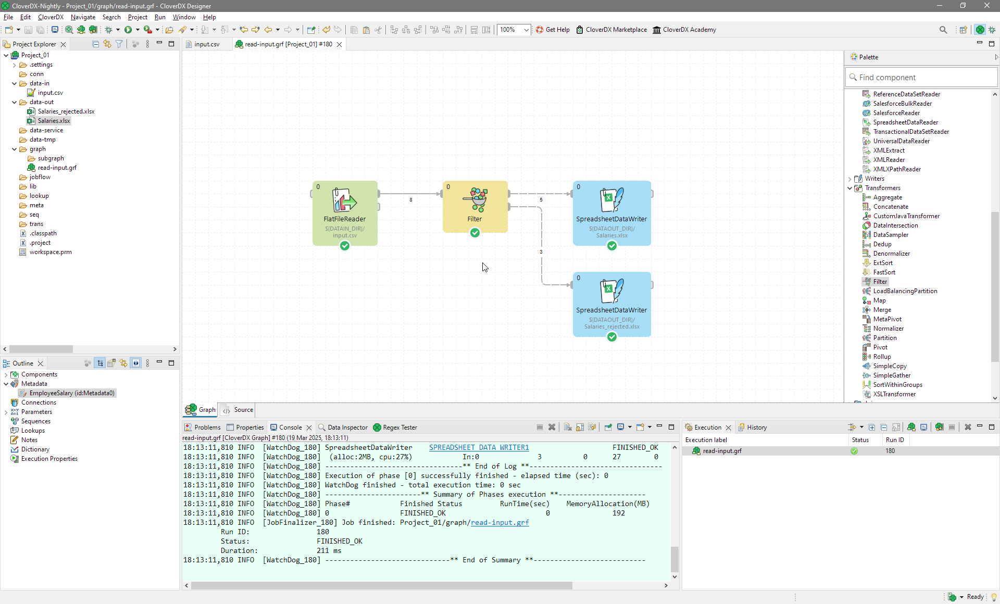
*Figure 38. Splitting one data stream into two - successful execution of the job. Note the two output files in the data-out folder.*

You can use the same condition as in the previous example. The records matching the data filter condition will be passed to the first output port, the later ones will go to the second output port.

#### Sorting the records

In this chapter we will learn how to sort records with the [**ExtSort** component](extsort.md).

This chapter builds on the graph from [Creating a graph](designer-tutorial.md#creating-a-graph). You can create a copy of this graph in the **Project Explorer** and rename it to a new name (e.g., `read-input-with-sort.grf`). This can all be done using context menu in the **Project Explorer** when you right-click your graph file.

#### Adding ExtSort

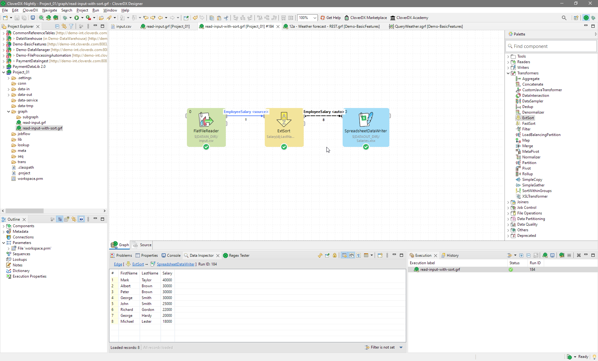
*Figure 39. Adding ExtSort component*

#### Setting up the ExtSort component

Double-click the **ExtSort** component to open the **Edit component** dialog.

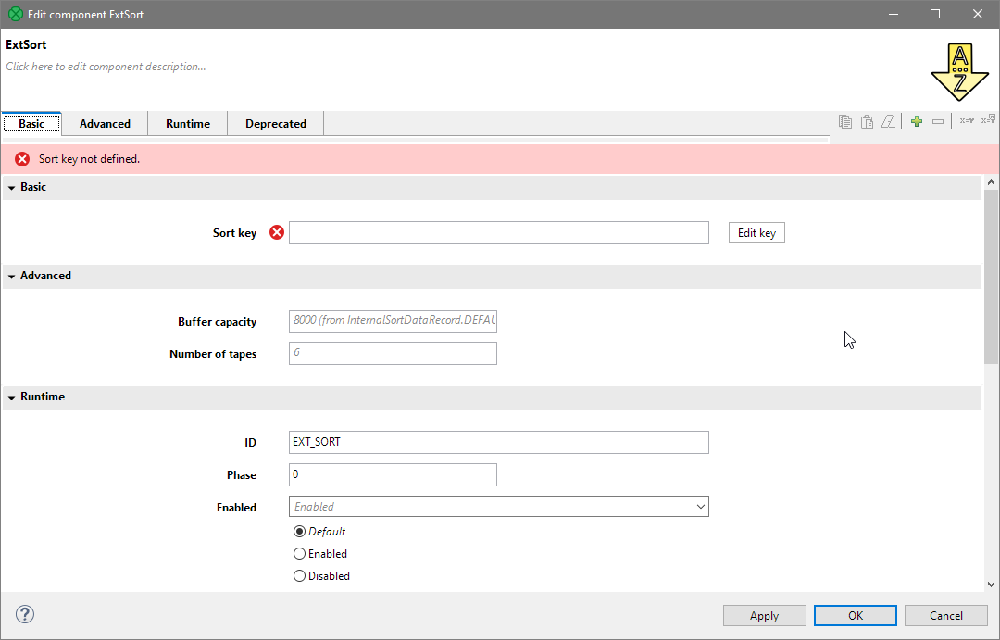
*Figure 40. Editing ExtSort component*

Open the sort key editor by clicking on the **Edit key** button.

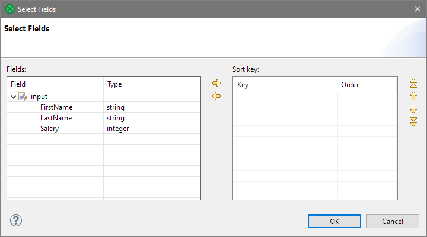
*Figure 41. Selecting a Sort key*

Configure the key to sort based on `Salary` in descending order and then by `LastName` and `FirstName` in ascending order. To add fields to the sort key you can either use drag & drop of the field from the left panel to the right or yellow arrows in the middle. You can also change the order of the fields within the key using the up and down arrows on the right side of the dialog.

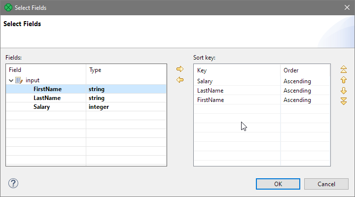
*Figure 42. Sort key selection*

Once you have the key fields selected, you can change the order on the `Salary` field. Do this by clicking into the **Order** column for given field and select **Descending** from the drop-down that is shown.

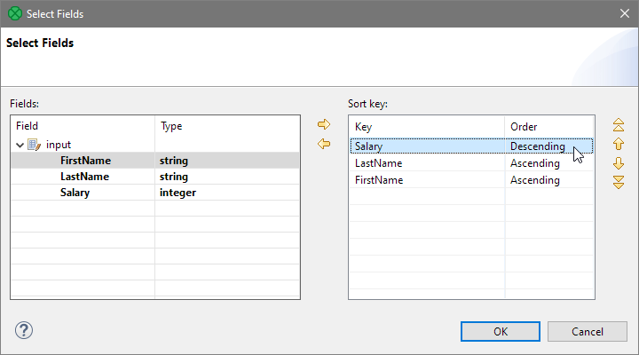
*Figure 43. Sort key selection*

After clicking **OK**, a sequence of field names separated by semicolon will appear in the component editor:

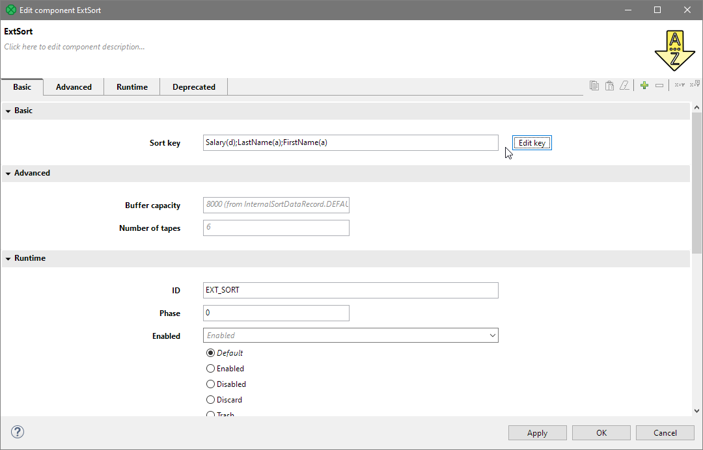
*Figure 44. Sort key appearance*

Run the graph and see the results.

You can see that all salaries are sorted in descending order. Note that within the same salary of 30000 both `Browns` lies above `George Smith` and that `Albert Brown` lies higher than `Peter Brown`.

To quickly see the output without having to open the resulting Excel file, you can simply click on the edge coming out of the **ExtSort** component. This will show a **Data Inspector** view at the bottom of the Designer. The Data Inspector will show you preview of the data that was transferred over the selected edge. Data Inspector work on every edge in the graph and can help you debug and build your graphs much faster than having to look at output files.

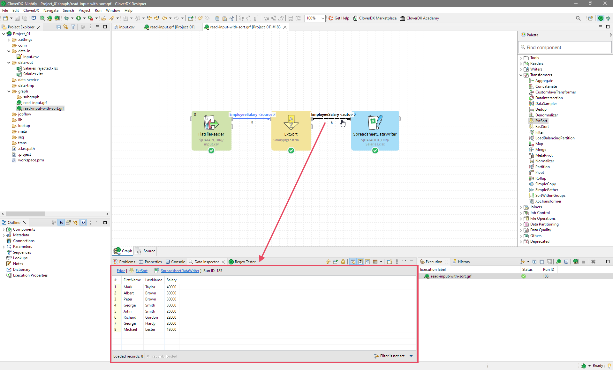
*Figure 45. Sorted data visible in the Data Inspector after the graph has finished.*
