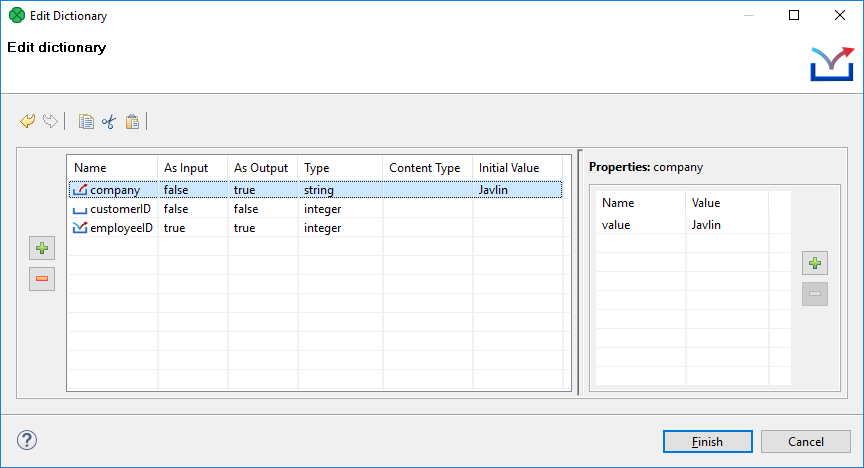
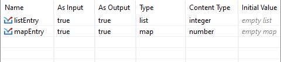

<!-- Development > Job elements > Dictionary -->

## 30. Dictionary

Dictionary is a data storage object associated with each run of a graph in **CloverDX**. Its purpose is to provide a simple and type-safe storage of various parameters required by a graph.

It is not limited to storing only input or output parameters but can also be used as a way of sharing data between various components of a single graph.

When a graph is loaded from its XML definition file, the dictionary is initialized based on its definition in the graph specification. Each value is initialized to its default value (if any default value is set) or it must be set by an external source (e.g. **Data Service**, etc.).
> [!IMPORTANT]
> In CTL2 dictionary, entries must always be defined first before they are used. The user needs to use a standard CTL2 syntax for working with dictionaries. No dictionary functions are available in CTL2.
>
> See [Dictionary in CTL2](language-reference-ctl2.md#dictionary-in-ctl2)

Between two subsequent runs of any graph, the dictionary is reset to the initial or default settings so that all dictionary runtime changes are destroyed. For this reason, dictionary cannot be used to pass values between different runs of the same graph.
> [!IMPORTANT]
> A dictionary entry must be read and written in different phases. If you write data to a dictionary and read it in the same phase, you may get the previous dictionary entry value. Both components run concurrently and therefore you may read a dictionary before data has been written to it.

In this chapter, we will describe how a dictionary should be created and how it should be used.

### Creating a dictionary

To create a dictionary, right-click the **Dictionary** item in the **Outline** pane and choose **Edit** from the context menu. The **Dictionary** editor will open.

*Figure 336. Dictionary dialog with defined entries*

Click the **Plus sign** button on the left to create a new dictionary entry.

After that, specify its **Name**. You must also specify other properties of the entry:

1. `Name`
   Specifies the name of the dictionary entry.
   Names are case-sensitive and must be unique within the dictionary. Generally, a dictionary name does not have to be a valid Java identifier. For example, a dictionary name in the `>File URL` attribute does not require this condition to be met. We recommend using legal Java identifiers since an access to a dictionary in CTL requires the dictionary name to be a legal Java identifier.
2. `As Input`
   Specifies whether the dictionary entry can be used as an input or not. Its value can be `true` or `false`.
3. `As Output`
   Specifies whether the dictionary entry can be used as an output or not. Its value can be `true` or `false`.
4. `Type`
   Specifies the type of the dictionary entry.
   See [Dictionary Entry Types](dictionary.md#dictionary-entry-types) below for the list of available types.
5. `Content Type`
   For `list`, `map` and `variant` types, the **Content Type** is used to specify the sub-type, see [Dictionary Entry Types](dictionary.md#dictionary-entry-types) below.
6. `Initial Value`
   A default value of an entry - useful when executing the graph without actually populating the dictionary with external data. Note that you cannot edit this field for all data types (e.g. `object`). As you set a new **Initial Value**, a corresponding name-value pair is created in the **Properties** pane on the right. **Initial value** is therefore the same as the first value you have created in that pane.

#### Dictionary entry types

There are two categories of dictionary entry types - those that can be accessed in CTL2 and the remaining ones.

##### CTL types

Any of the following types are accessible in CTL2. For detailed information, see [Dictionary in CTL2](language-reference-ctl2.md#dictionary-in-ctl2).

- primitive data types
  - `boolean`, `byte`, `date`, `decimal`, `integer`, `long`, `number` and `string`.
- multi-value types
  - `list` - a generic list of elements, the initial value is an empty list.
  - `map` - a generic mapping from keys to values, the initial value is an empty map.
  - `variant` - may contain any data type usable in CTL2, typically a JSON-like tree structure. See [variant](language-reference-ctl2.md#variant) section. The initial value is an empty map or list, which is configurable in the **Content Type** column.

List and map entries can be accessed in CTL2, but you need to specify the type of elements of the list or map in the **Content Type** column, see the picture below:

For example, if you create a dictionary entry of the type list and set the **Content Type** to integer, you can access the entry in CTL2 as `list[integer]` - a list of integers. New entries are automatically set to `list[integer]`.

Similarly, if you create a dictionary entry of the type map and set the **Content Type** to number, you can access the entry in CTL2 as `map[string, number]` - a mapping from string keys to number values (the keys are always assumed to be of the string data type). New entries are automatically set to `map[string, string]`.

For further information about multi-value data types in CloverDX, see [Multivalue Fields](multivalue-fields.md).

##### Non-CTL types

- `object` - **CloverDX** data type available with **CloverDX Engine**.
- `readable.channel` - the input will be read directly from the entry by the **Reader** according to its configuration. Therefore, the entry must contain data in valid format.
- `writable.channel` - the output will be written directly to this entry in the format given by the output **Writer** (e.g. text file, XLS file, etc.)

These types are not available in CTL2. They are only accessible by readers and writers or from Java code.

#### Dictionary entry properties

Each entry can have some properties (name-value pairs). To add a property, click the **Plus** button on the right and enter the **Name** and **Value** of the new property.

### Using a dictionary in graphs

The dictionary can be accessed in multiple ways by various components in the graph. It can be accessed from:

**Readers** and **Writers**. Both of them support dictionaries as their data source or data target via the **File URL** attribute.

The dictionary can also be accessed with CTL or Java source code in any component that defines a transformation (all **Joiners**, **Map**, **Normalizer**, etc).

#### Accessing dictionary from Readers and Writers

To reference the dictionary parameter in the **File URL** attribute of a graph component, this attribute must have the following form: `dict:<Parameter name>[:processingType]`. Depending on the type of the parameter in the dictionary and the `processingType`, the value can be used either as a name of the input or output file or it can be used directly as data source or data target (i.e. the data will be read from or written to the parameter directly).

Processing types are the following:

1. **For Readers**
   - `discrete`
     This is the default processing type. It does not need to be specified.
   - `source`
   For information about URL in **Readers**, see also [Reading from Dictionary](examples-of-file-url-in-readers.md#reading-from-dictionary).
2. **For Writers**
   - `source`
     This processing type is preselected by default.
   - `stream`
     If no processing type is specified, **stream** is used.
   - `discrete`
   For information about URL in **Writers**, see also [Writing to Dictionary](examples-of-file-url-in-writers.md#writing-to-dictionary).

For example, `dict:mountains.csv` can be used as either input or output in a **Reader** or a **Writer**, respectively (in this case, the property type is `writable.channel`).

#### Accessing dictionary with Java

To access the values from the Java code embedded in the components of a graph, methods of the `org.jetel.graph.Dictionary` class must be used.

For example, to get the value of the `heightMin` property, you can use a code similar to the following snippet:

`getGraph().getDictionary().getValue("heightMin")`

In the snippet above, you can see that we need an instance of `TransformationGraph`, which is usually available via the `getGraph()` method in any place where you can put your own code. The current dictionary is then retrieved via the `getDictionary()` method and finally the value of the property is read by calling the `getValue(String)` method.
> [!NOTE]
> For further information, see the **JavaDoc** documentation.

#### Accessing dictionary with CTL2

If the dictionary entries should be used in CTL2, they must be defined in the graph. Working with the entries uses standard CTL2 syntax. No dictionary functions are available in CTL2.

For more information, see [Dictionary in CTL2](language-reference-ctl2.md#dictionary-in-ctl2).
