<!-- Development > Job elements > Edges -->

## 23. Edges

This chapter presents an overview of edges. It describes their purpose, how they can be connected to components of a graph, how metadata can be assigned to them and propagated through them, how edges can be debugged and how data flowing through edges can be analyzed.

### What are edges?

An edge can be seen as a pipe conveying data from one component to another.

The following are properties of edges:

- [Connecting components with edges](edge.md#connecting-components-with-edges)
  Each edge must connect two components.
- [Types of edges](edge.md#types-of-edges)
  Each edge is of one of the four types.
- [Assigning metadata to edges](edge.md#assigning-metadata-to-edges)
  Metadata must be assigned to each edge, describing the data flowing through the edge.
- [Colors of edges](edge.md#colors-of-edges)
  Each edge changes its color upon metadata assignment, edge selection, etc.
- [Edge memory allocation](edge.md#edge-memory-allocation)
  Some edges require more memory than others. This section contains the explanation.
- [Debugging edges](edge.md#debugging-edges)
  Each edge can be debugged.

### Connecting components with edges

If there are at least two components placed in the **Graph Editor**, you can connect them with edges. Data will flow from one component to the other through this edge. For this reason, each edge must have assigned some metadata describing the structure of data records flowing through the edge.

###### Placing an edge

There are two ways to create an edge between two components:

- Click the **edge** label in the **Palette** tool. Move the cursor over the source component - the one you want the edge to start from. Left-click to start the edge creation. Then, move the cursor over to the target component - the one you want the edge to end at and click again. This creates the edge.
- The second way short-cuts the tool selection. You can simply mouse over the output ports of any component, and **CloverDX** will automatically switch to the **edge** tool if you have the **selection** tool currently selected. You can then click to start the edge creation process identical to the one above.

When creating an edge in a graph, as described, the edge is always bound to component ports. The number of ports of some components is strictly specified, while other components have unlimited number of ports. If the number of ports is unlimited, a new port is created by connecting a new edge.

To escape the Edge tool, click the **Select** item in the **Palette** or press the **Esc** key.

###### Moving an existing edge

An existing edge can be moved to connect different ports or different components.

To move an existing edge, highlight the edge with a left-click. Move cursor to an input or output port of the edge. The arrow mouse cursor turns to a cross. Once the cross appears, you can drag the edge to a free port of any component.

If you mouse over the port with the selection tool, it will automatically select the edge for you, so you can simply click and drag.

Remember that you can only replace an output port by another output port and an input port by another input port.

#### Edge auto-routing or manual routing

When two components are connected by an edge, sometimes the edge might overlap with other elements, e.g. other components, notes, etc. In this case, you may want to switch from default auto-routing to manual routing of the edge - in this mode you have a control over where the edge is displayed.

###### Manual routing

To switch from Auto-routing to Manual Routing, right-click the edge and uncheck the **Edge Autorouting** option from the context menu.

After that, a point will appear in the middle of each straight part of the edge.

When you move the cursor over such point, the cursor will be replaced with either a horizontal or vertical resize cursor, and you will be able to drag the corresponding edge section horizontally or vertically.

This way, you can move the edges away from problematic areas.

### Types of edges

There are four types of edges, three of them have an internal buffer. You can select a type of the edge by right clicking on the edge and choosing the type from the **Select edge** option.

Edges can be set to any of the following types:

- ###### Direct edge
  A direct edge has a buffer in memory, which helps data to flow faster. This is the default edge type for Graphs.
  In 4.5.0-M1, a timeout was introduced, therefore the edge can send records in smaller chunks. This can improve the throughput in graphs with high-latency data sources.
- ###### Buffered edge
  A buffered edge also has a buffer in memory, but, if necessary, it can store data on a disk as well. Thus the buffer size is unlimited. It has two buffers, one for reading and one for writing.
- ###### Direct fast propagate edge
  A direct fast propagate edge is an alternative implementation of a **Direct edge**. This edge type has no buffer but it still provides fast data flow. It sends each data record to the target of this edge as soon as it receives it. This is the default edge type for jobflows.
- ###### Buffered fast propagate edge
  A buffered fast propagate edge is an alternative implementation of a **Buffered edge**. This type of edge has a memory buffer, but, if necessary, it can store data on a disk as well. Thus the buffer size is unlimited. Moreover, data records written to this edge are immediately available to the target of this edge as soon as it receives it.
- ###### Phase connection edge
  A phase connection edge type cannot be selected, it is created automatically between two components with different phase numbers.

If you do not want to specify an explicit edge type, you can let **CloverDX** decide by selecting the option **Detect default**.

### Assigning metadata to edges

Metadata are structures that describe data. (See [Metadata](metadata.md)) At first, each edge is displayed as a dashed line. Only after metadata has been created and assigned or propagated to the edge, the line becomes solid.

You can create metadata as shown in corresponding sections below; however, you can also double-click the empty (dashed) edge and select **Create metadata** from the menu, or link some existing external metadata file by selecting **Link shared metadata**.

You can also assign metadata to an edge by right-clicking the edge, choosing the **Select metadata** item from the context menu and selecting the desired metadata from the list.

Third way to add metadata to an edge is to drag a metadata’s entry from the **Outline** onto the edge.

You can also select metadata to be automatically assigned to edges as you create them. You choose this by right-clicking on the edge tool in the **Palette** and then selecting the metadata you want, or **none** if you want to remove the selection.

### Colors of edges

- When you connect two components with an edge, it is red and dashed.
- After assigning metadata to the edge, it becomes solid and gray.
- Edges with propagated metadata are gray and dashed.
- When you click any metadata item in the **Outline** pane, all edges with the selected metadata become blue.
- If you click an edge in the **Graph Editor**, the selected edge becomes black and all of the other edges with the same metadata become blue. (In this case, metadata are shown in the edge tooltip as well.)
  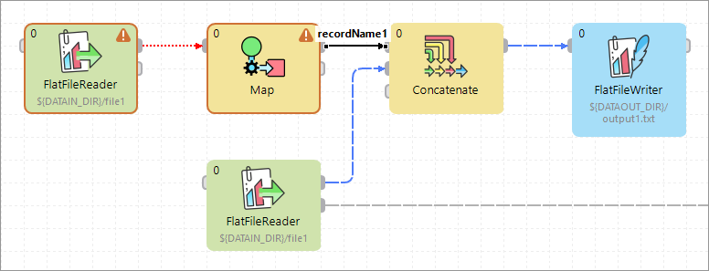
  *Figure 220. Metadata in the Tooltip*

### Edge memory allocation

Manipulating large volumes of data in a single record is always an issue. In **CloverDX Designer**, sending big data along graph edges means that:

- Whenever there is a need to carry many MBs of data between two components in a single record, the edge connecting them expands its capacity. This is referred to as dynamic memory allocation.
- If you have a complicated transformation scenario with some sections transferring huge data, only the edges in these sections will use dynamic memory allocation. The other edges retain low memory requirements.
- An edge which has carried a big record before and allocated more memory for itself will not reduce its size back again. It consumes bigger amount of memory till your graph execution is finished.

By default, the maximum size of a record sent along an edge is 268,435,456 bytes (256 MB). This value can be increased, theoretically, up to GBs by setting the `Record.RECORD_LIMIT_SIZE` property, see [Engine configuration](../admin/designer-configuration.md#engine-configuration). `Record.FIELD_LIMIT_SIZE` can also be 268,435,456 bytes (256 MB), by default. All fields in total cannot use more memory than `Record.RECORD_LIMIT_SIZE`.

There is no harm in increasing `Record.RECORD_LIMIT_SIZE` to whatever size you want. The only reason for keeping it smaller is an early error detection. For instance, if you start appending to a string field and forget to reset record (after each record), the field size can break the limits.
> [!NOTE]
> Let us look a little deeper into what happens in the memory. Initially, a record starts with 65,536 (64kB) of memory allocated to it. If there is a need to transfer huge data, its size can dynamically grow up to the value of `Record.RECORD_LIMIT_SIZE`. Therefore, the amount of memory a record can consume is between `65,536` (`64k`) and `Record.RECORD_LIMIT_SIZE`.

In your graph, edges which are more 'memory greedy' look like regular edges. They have no visual distinction.

##### Measuring and estimating edge memory demands

To estimate how memory-greedy your graph is even before executing it, consult the table below (note: computations are simplified). In general, a graph’s memory demands depend on the input data, components used and edge types. In this place, we contribute to understanding the last one. See approximately how much memory your graph takes before its execution and to what extent memory demands can rise.

The following table depicts memory demands for particular edge types in MB and in the multiples of *record initial size* and *record limit size*. The limits can be raised if necessary.

| Edge type | Initial size | Multiple of RIS[[1]](edge.md#edge-memory-demand-ris) | Maximum size | Multiple of RLS[[2]](edge.md#edge-memory-demand-rls) |
| --- | --- | --- | --- | --- |
| Direct | 589,824 B (576 kB) | 9 RIS | 805,306,368 B (768 MB)[[3]](edge.md#edge-memory-demand-fn01) | 3 RLS |
| Buffered | 1,376,256 B (1344 kB) | 21 RIS | 805,306,368 B (768 MB)[[3]](edge.md#edge-memory-demand-fn01) | 3 RLS |
| Phase | 131,072 B (128 kB) | 2 RIS | 536,870,912 B (512 MB)[[3]](edge.md#edge-memory-demand-fn01) | 2 RLS |
| Direct Fast Propagate | 262,144 B (256 kB) | 4 RIS[[4]](edge.md#edge-memory-demand-fn04) | 1,073,741,824 B (1024 MB)[[3]](edge.md#edge-memory-demand-fn01) | 4 RLS |

| 1 | RIS = `Record.RECORD_INITIAL_SIZE` = 65,536 (by default) |
| --- | --- |

| 2 | RLS = `Record.RECORD_LIMIT_SIZE` = 268,435,456 (by default) |
| --- | --- |

| 3 | The size depends on RECORD_LIMIT_SIZE. It can be changed, see [Engine configuration](../admin/designer-configuration.md#engine-configuration). |
| --- | --- |

| 4 | The number 4 is the number of buffers and it can be changed. In general, buffers' memory can rise up to RLS * (number of buffers) |
| --- | --- |

### Debugging edges

| [Selecting debug data](edge.md#selecting-debug-data) |
| --- |
| [Viewing debug data](edge.md#viewing-debug-data) |
| [Turning off debug](edge.md#turning-off-debug) |

Debugging edges means recording of data flowing through the edge for further inspection.

Debugging is useful if you obtain incorrect or unexpected results after running a graph, as it helps you locate and identify the errors in the graph.
> [!TIP]
> If you process a large amount of data, consider limiting the number of records to be saved into debug files or to filter the data.

By default, debugging is **enabled** on all edges.

There are several debugging options for each edge. Right-click on the edge and select the **Debug** option from the context menu:

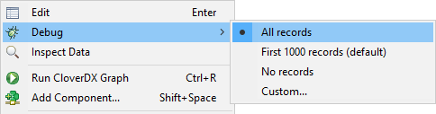
*Figure 221. Debugging options*

**Debugging options**
All records
All records going through a debugged edge are saved. When selected, the option is indicated by the icon  on the selected edge.
First 1000 records (default)
First 1000 records going through the debugged edge are saved, the rest is ignored. When selected, the **debug file size** is limited to **1 MB**.
No records
Debugging on the selected edge is disabled. When selected, the option is indicated by the icon 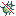 on the selected edge.
Custom…​
Allows you to set several edge attributes, see [Selecting debug data](edge.md#selecting-debug-data). When selected, the option is indicated by the icon  on the selected edge.

After you run the graph, one debug file is created for each debugged edge. You can analyze the data records from the debug files (`.dbg` extension), see [Viewing debug data](edge.md#viewing-debug-data).

Debugging on edges can be **disabled**, see [Turning Off Debug](edge.md#turning-off-debug).
> [!NOTE]
> You can only view data on some components and on edges with debugging enabled.
> [!NOTE]
> The **Filter expression** option may not be available if multiple edges with different metadata are selected simultaneously.

#### Selecting debug data

By default, the first 1000 records going through debugged edges are saved to debug files. There is also the second limit 1 MB for default viewing of records on Edges in Data Inspector. The exception are graphs running on the Server via automated process (e.g. scheduling, listening) where debugging on edges is disabled by default.

You can restrict the data records that will be saved to debug files. You can set it up in the **Properties** tab of any debug edge, or you can right-click the debugged edge and set it up in **Debug properties** accessible from the context menu.

To avoid saving all data records, you can set any of the following four edge attributes either in the **Properties** tab or in the **Debug properties** dialog: **Debug filter expression**, **Debug last records**, **Debug max. records** and **Debug sample data**.

- [Debug Filter Expression](edge.md#debug-filter-expression)
- [Debug Last Records](edge.md#debug-last-records)
- [Debug Max. Records](edge.md#debug-max-records)
- [Debug Sample Data](edge.md#debug-sample-data)

##### Debug Filter Expression

If you specify a filter expression for an edge, data records that satisfy the specified filter expression will be saved to the debug file. Those that do not satisfy the expression will be ignored.

If a filter expression is defined, either all records that satisfy the expression (**Debug sample data** set to `false`) or only a sample of them (**Debug sample data** set to `true`) will be saved.

The filter expression is defined with the help of **Filter Editor**.

###### Filter Editor

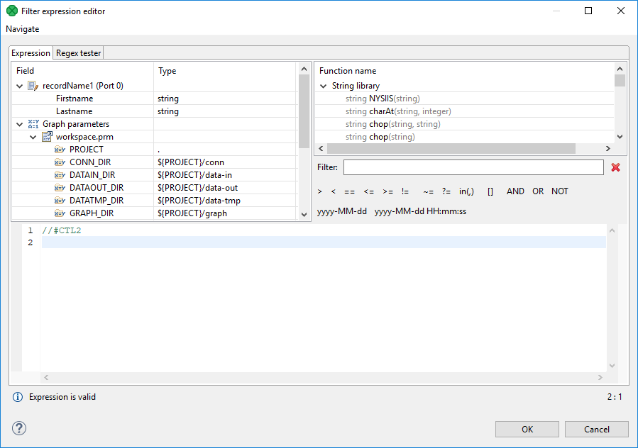
*Figure 222. Filter Editor*

The **Filter Editor** consists of three panes.

- The left pane displays a list of record fields, their names and data types. You can select any record field by double-clicking or dragging and dropping. Then a field name appears in the bottom area. The field name consists of a dollar sign, followed by a type of the port (in or out), port number and the name itself. (For example, `$in.0.street`.)
- The right pane displays a list of available CTL functions. Below this pane, there are both comparison signs and logical connections. You can select any of the names, functions, signs and connections by double-clicking. After that, they appear in the bottom area.
- You can work with functions, operators and fields in the bottom area and complete the creation of the filter expression. The filter expression is validated on the fly.
Example 7. Debug filter expression

```ctl
//#CTL2
isInteger($in.0.field1)
```

> [!IMPORTANT]
> The old version of CTL (CTL1) is deprecated and should not be used.

The Filter Editor is described in the documentation on [Filter](extfilter.md).

##### Debug last records

If you set the **Debug last records** property to `false`, data records from the beginning will be saved to the debug file. By default, the records from the end are saved to debug files. The default value of **Debug last records** is `true`.

Remember that if you set the **Debug last records** attribute to `false`, data records will be selected from the beginning with a greater frequency than from the end. Alternatively, if you set the **Debug last records** attribute to `true` or leave it unchanged, they will be selected more frequently from the end than from the beginning.

###### Debug max. records

You can also set up a limit on the number of data records that will be saved into a debug file. These data records will be taken either from the beginning (**Debug last records** is set to `false`) or from the end (**Debug last records** has the default value or it is set to `true` explicitly).
> [!NOTE]
> If the **Debug max. records** is set up in the **Properties tab**, all edges of the graph are affected.
>
> If the **Debug max. records** is set up on an edge, only the debugging on the edge is affected.
>
> If the property is set up in the Properties tab and on the edge, the value set up on the edge level has a higher priority.

###### Debug sample data

If you set the **Debug sample data** attribute to `true`, the **Debug max. records** attribute value is only the threshold that limits how many data records could be saved to a debug file. Data records will be saved at random, some of them will be omitted, others will be saved to the debug file. In this case, the number of data records saved to a debug file will be less than or equal to this limit.

If you do not set any value of **Debug sample data**, or if you set it to `false` explicitly, the number of records saved to the debug file will be equal to the **Debug max. records** attribute value (if more records than **Debug max. records** go through the debug edge).

The same properties can also be defined using the context menu by selecting the **Debug properties** option. After that, the following dialog will open:

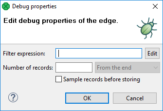
*Figure 223. Debug properties dialog*

##### Viewing debug data

Let us show how to view the records that have passed through an edge, have met the filter expression and have been saved.

You can view data on edges with debug enabled.

Click an edge and **Data Inspector** tab in the bottom will display the debugged data. If you click another edge, you will see the data of another edge.

If you intend to see the data of more edges at once, use a new **Data Inspector** tab: open the context menu with right-click and select the **Inspect data**.

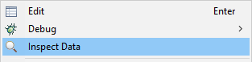
*Figure 224. Choosing Inspect data from context menu*

#### Data Inspector

**Data Inspector** tab displays debug data of an edge. It lets you see data on readers and writers as well.

If **Data Inspector** opens, you can see data on edges without using context menu: just click an edge, and **Data Inspector** displays data of the edge. The displayed **Data Inspector** view is refreshed after a graph run.

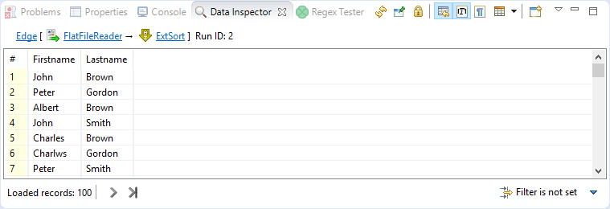
*Figure 225. Data Inspector*

- Data Inspector loads only first 100 records by default. To load more records, scroll down the view and new records will load automatically. Alternatively, you can click on the **Load More** button  at the bottom of the view. There is also the **Load All** button  which loads all available records. Use this button only when the number of available records is small.
- You can sort the records according to any column: click the column’s header. Records can be sorted in ascending or descending order.
- You can view data on more edges at the same time. Records from each debug edge are displayed in a separate tab. Feel free to displace the tabs as you need. Each Data Inspector’s title bar contains a reference to viewed edge in the format Edge [Component name → Component name] Run ID: number.
> [!TIP]
> You can drag the tab into a new window.
>
> Use the **Load More** button  when observing records while your graph is still running - they are loaded on your click as they are produced by graph’s transformations.

##### View Modes

Data Inspector is capable of displaying data in four view modes: **Table View**, **Single Record View**, **Text View** and **Hexadecimal View**. You can switch between the view modes by clicking on the **View Mode** icon in Data Inspector’s toolbar. A list of available view modes is based on the inspected element: data records for edges can be viewed in Table View and Single Record View; supported view modes for a component are based on the component’s type.
Table View
A default view mode. Displays data in a table, one record per line.
Single Record View
Displays details for a single record only, one field per line. Can also be accessed from a Table View, by choosing **Show as Single Record** item in a record’s context menu or by pressing the Enter key. When in Single Record View, **Show in Table View** item in context menu or pressing the Backspace key returns back to Table View.
Text View
Displays the content of an input or output file as a plain text.
Hexadecimal View
Displays the content of an input or output file in a hexadecimal mode.

##### Actions on Data Inspector

Following actions are available from Data Inspector toolbar.

##### Refresh

The **Refresh** button  lets you perform manual refresh of debug data.

Data is refreshed automatically when a graph run finishes and after performing actions that require refresh (applying a filter, switching the truncate option). Manual refresh might be useful, for example, when source file of inspected component has changed.

Keyboard shortcut: F5

##### Pin Data

Pin Data binds Data Inspector to a specific edge or a component. If you **pin data**, and another edge or component is selected, Data Inspector’s content will not change. But it will still be automatically refreshed after a graph run is finished or when performing data inspection on the same edge or component.

If you open **Data Inspector** from the context menu and at least one unpinned Data Inspector already exists, the **Pin Data** option will be applied.

##### Lock Data

**Lock Data** locks the content of Data Inspector so that it is not refreshed automatically (e.g. after a graph run). Locked state also disables manual refresh, so data cannot be refreshed by accident.
> [!TIP]
> Use **Lock Data** to view the differences between two graph runs.

##### Quote Strings in Lists

This action is available from the drop-down menu  in the Data Inspector toolbar.

Displays items of the lists quoted. It makes it easy to see which comma is a delimiter and which one is a part of the list item.

##### Show View When Content Changes

This option makes the Data Inspector tab active when its content has changed.

##### Truncate Long Values

When **Truncate Long Values** is active, values of loaded data fields are truncated to the first 253 characters or array elements to improve performance when loading huge data records. Disable this option to show entire field values.

##### Show Unprintable Characters

Unprintable characters (line breaks, space characters, etc.) are displayed as a proxy character.

##### View Mode

Switches between view modes, see [View Modes](edge.md#view-modes).

##### Open New Data Inspector View

This action opens a new view with the same content.

**Tip:** open a new data view and lock the old one. You will be able to see differences between two graph runs.

Additional actions are available from Data Inspector’s menu or from context inside the view. The Data Inspector’s menu can be accessed by clicking on the arrow in right side of Data Inspector’s toolbar.

##### Copy

In Table View and Single Record View modes, you can copy either a whole table row (or more rows) or a value of a single cell. In Text View and Hexadecimal View, it is possible to copy a selected text.

Whole records can be copied by using Ctrl+C keyboard shortcut or using **Copy** item in the context menu. Fields in copied records are delimited by tabulators. If pasted into a spreadsheet (e.g. Microsoft Excel), they fill spreadsheet cells.

A single cell value can be copied by choosing **Copy Cell** from a context menu of the particular cell.

##### Hide/Show Columns

Actions for hiding columns are available only in Table View mode. They allow to select which columns will be displayed and which not. They are available from Data Inspector’s menu under **Hide/Show Columns** or from a context menu of a column header.

- **Hide Column** - available from header’s context menu, hides the particular column
- **Hide Other Columns** - available from header’s context menu, hides the other columns
- **Show All** and **Hide All** - available from Data Inspector’s menu, shows/hides all columns
- **Show Selected…​** - opens a dialog that allows to configure visible columns
- **Columns** - allows to hide or show a column by checking or unchecking it in the menu

##### Go to Line…/Go to Record…

Opens a dialog that requests a line number. After confirming the dialog, the requested record or line will be highlighted. If necessary, the dialog scrolls to display the record.

Keyboard shortcut: Ctrl+L

##### Filtering records

In Table View and Single Record View modes, it is possible to apply a filter to the displayed records.

In the right bottom corner of Data Inspector, there is a filter widget that shows the state of the filter. It also serves to modify the filter, clear the filter or disable it temporarily.

##### New filter expression

In a new **Data Inspector**, the widget in the right bottom corner shows the **Filter is not set** text. Click the text to open the **Filter Editor** and define a filter expression. For information on how to create filter expression, see [Debug filter expression](edge.md#debug-filter-expression).

When you have created a filter, the text **Filter is not set** changes to **Filter is active**.

##### Disabling the filter

You can disable the filter by clicking the **Filter is active** text. The filter is not applied and the text changes to **Filter is not active**.

An alternative way to disable the filter is to click the arrow next to the filter widget and choose **Active** from the menu. Tick before the menu item disappears.

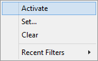

##### Enabling the filter

You can enable the filter by clicking the text again.

Another way to enable the filter is to click the arrow next to the filter widget and choose **Activate** from the context menu.

###### Search data

The **Search Data** allows you to look up a text in the records.

You can open the **Search Data** panel using the Ctrl+F shortcut, or by choosing **Search Data…​** from the Data Inspector’s menu.

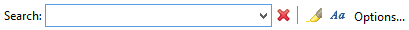
*Figure 226. Search Data*

The search panel contains a text area where you can type an expression.

Next to the text area, there are the **Mark all found matches** and **Case sensitivity** buttons. If **Mark all found matches** button is checked, all found matches for the search expression are highlighted. If you enable the **Case sensitivity** option, the search will be case sensitive.

The **Options…​** button gives you access to **Search Options**.

##### Search Options

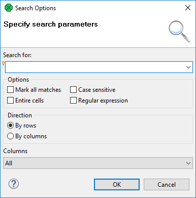
*Figure 227. Search Options*

If **Entire cells** option is checked, the searched text must match the cell entirely.

If you check the **Regular expression** checkbox, the expression you have typed into the text area will be used as a [*regular expression*](language-reference-ctl2.md#regular-expressions).

**Direction** lets you choose a search order - you can search in direction of rows, or columns.

You can also select which column will be searched in: **all**, only **visible** or one column from the list.

The **Bulb** icon on the left side of the text area indicates that Content Assist is available by pressing Ctrl+Space.

The **OK** button searches for the first occurrence and closes the **Find dialog**.

The **Cancel** button closes the dialog.

##### Export data to CSV

You can export the debug data to CSV without a clipboard.

To export records to CSV click the arrow in the upper right corner and choose **Export to CSV**. You can use Ctrl+E as well. The CSV files can be subsequently loaded into a spreadsheet editor or processed by another graph.

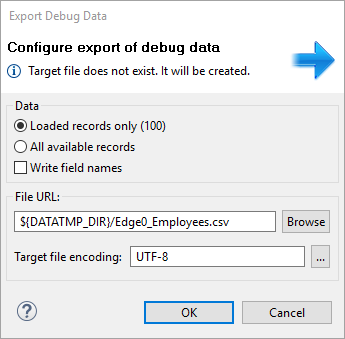
*Figure 228. Export debug data to CSV*

When the directory specified by **File URL** does not exist, it is created before export of the file itself.

Export can run in the background and the user can do another work meanwhile. Progress is reported in Progress view in the bottom right corner of designer.

##### Data Inspector Preferences

**Data Inspector** lets you change its default configuration. You can set up a preferred view mode, show/hide unprintable characters, truncation of strings and byte arrays and number of loaded lines/records.

##### Truncate long values

This option truncates data shown in the Data Inspector and in the detail shown after you double click a record.

When **checked**, the number of characters shown is limited to 254 (including the `[…]` string indicating truncation) both in the Data Inspector and the detail. When **unchecked**, the limit for Data Inspector is 300 characters, while the detail shows the whole value of the field.

Changing the setting requires restart of the **CloverDX Designer**.

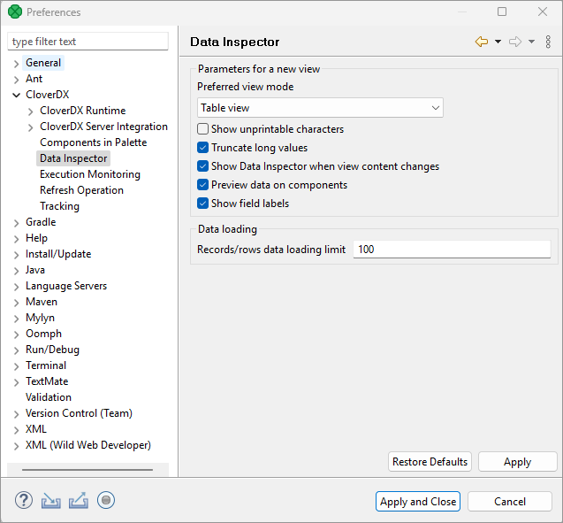
*Figure 229. Data Inspector Preferences*

##### Turning Off Debug

###### Disabling Debugging on Particular Edges

To **disable debugging**, right-click on the edge and select **Debug** ****No records** from the context menu. Disabled debugging is indicated by the icon 

If you want to disable debugging on multiple edges simultaneously, select the edges by left-clicking while holding down the Ctrl key first.

###### Disabling all debugging

If you want to turn off debugging, you can click the **Graph editor** in any place outside the components and the edges, switch to the **Properties** tab and set the **Debug mode** attribute to `false`. This way you can turn off all debugging at a time.

Bug icons do not disappear, but edge debugging is not performed. If you disable debugging this way, it can be enabled back keeping the original configuration.

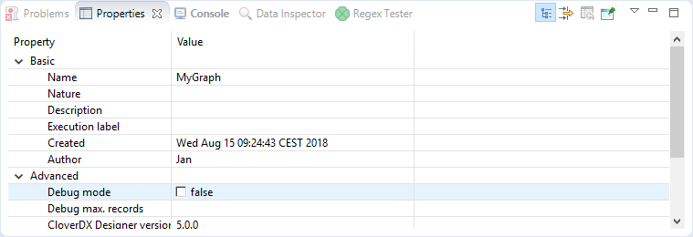
*Figure 230. Debug mode in the Properties tab*

Alternatively, you can select **Run** ****Debug Configurations…​** on the menu bar and check the **Disable edge debugging** option.
