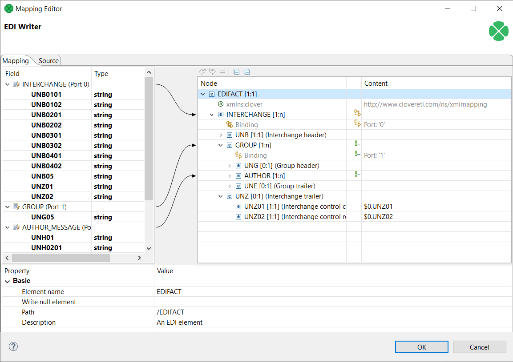

<!-- Development > Component reference > Writers > EDIFACTWriter -->

### EDIFACTWriter

| [Short description](edifactwriter.md#short-description) |
| --- |
| [Ports](edifactwriter.md#ports) |
| [Metadata](edifactwriter.md#metadata) |
| [EDIFACTWriter attributes](edifactwriter.md#edifactwriter-attributes) |
| [Details](edifactwriter.md#details) |
| [Autofilled segments](edifactwriter.md#autofilled-segments) |
| [Examples](edifactwriter.md#examples) |
| [See also](edifactwriter.md#see-also) |

#### Short description

**EDIFACTWriter** writes data in the EDIFACT format. All EDIFACT versions from `D.93A` to `D.22A` are supported.
> [!NOTE]
> Please note that **EDIFACTWriter** component is only available in certain CloverDX plans. To find out more about licensing requirements, please contact *[sales@cloverdx.com](mailto:sales@cloverdx.com)*.

| Data output | Input ports | Output ports | Transformation | Transf. req. | Java | Auto-propagated metadata |
| --- | --- | --- | --- | --- | --- | --- |
| EDIFACT file | 1-n | 0-1 | **⨯** | **⨯** | **⨯** | **⨯** |

#### Ports

| Port type | Number | Required | Description | Metadata |
| --- | --- | --- | --- | --- |
| Input | 0-n | At least one | Input records to be mapped into the EDIFACT message structure. | Any (each port can have different metadata) |
| Output | 0 | **⨯** | For port writing. | Only one field (`byte`, `cbyte` or `string`) is used. The field name is used in **File URL** to govern how the output records are processed - see [Writing to output port](examples-of-file-url-in-writers.md#writing-to-output-port) |

#### Metadata

**EDIFACTWriter** does not propagate metadata.

**EDIFACTWriter** has no metadata template.

#### EDIFACTWriter attributes

| Attribute | Req | Description | Possible values |
| --- | --- | --- | --- |
| Basic |  |  |  |
| File URL | yes | The target file for the output EDIFACT message. See [Supported file URL formats for Writers](examples-of-file-url-in-writers.md). |  |
| EDIFACT version |  | Attribute specifying version of EDIFACT message. |  |
| EDIFACT message |  | Attribute specifying type of EDIFACT message. Possible values depend on selected **EDIFACT version**. |  |
| Interchange sender identification |  | Attribute specifying default identification of EDIFACT interchange sender. When specified, the value is used as default for `UNB` segment. |  |
| Interchange recipient identification |  | Attribute specifying default identification of EDIFACT interchange recipient. When specified, the value is used as default for `UNB` segment. |  |
| Interchange control reference |  | Attribute specifying default identification of EDIFACT interchange. When specified, the value is used as default for `UNB` segment. In EDIFACT the interchange identification should be unique for every interchange exchanged between sender and recipient, therefore this attribute should not be used if multiple interchanges are written at the same time. |  |
| Message reference number |  | Attribute specifying default identification of EDIFACT message. When specified, the value is used as default for `UNH` segment. In EDIFACT the message identification should be unique for every message exchanged between sender and recipient, therefore this attribute should not be used if multiple messages are written at the same time. |  |
| Mapping | [[1]](edifactwriter.md#edifactwriter-attributes-fn01) | Defines how input data is mapped onto an output EDIFACT message. See [Details](edifactwriter.md#details). |  |
| Mapping URL | [[1]](edifactwriter.md#edifactwriter-attributes-fn01) | External text file containing the mapping definition. |  |
| Advanced |  |  |  |
| Strict validation |  | Enables strict validation of the written values, their sizes and data types. Also checks that composite elements are not written in places where only simple elements are allowed. Produces error if any validation check finds a problem. | true (default) \| false |
| Cache size |  | The size of the database used when caching data from ports to elements (the data is first processed then written). The larger your data is, the larger cache is needed to maintain fast processing. | auto (default) \| e.g. 300MB, 1GB etc. |
| Cache in Memory |  | Cache data records in memory instead of the JDBM’s disk cache (default). Note that while it is possible to set the maximal size of the disk cache, this setting is ignored in case the in-memory cache is used. As a result, an `OutOfMemoryError` may occur when caching too many data records. | false (default) \| true |
| Sorted input |  | Tells **EDIFACTWriter** whether the input data is sorted. Setting the attribute to true declares you want to use the sort order defined in **Sort keys**, see below. | false (default) \| true |
| Sort keys |  | Tells **EDIFACTWriter** how the input data is sorted, thus enabling streaming. The sort order of fields can be given for each port in a separate tab. Working with **Sort keys** has been described in [Sort key](components.md#sort-key). |  |
| Max number of records |  | The maximum number of records written to all output files. See [Selecting output records](selecting-output-records.md). | 0-N |
| Partitioning |  |  |  |
| Records per file |  | The maximum number of records that are written to a single file. See [Partitioning output into different output files](partitioning-output-into-different-output-files.md) | 1-N |
| Partition key |  | The key whose values control the distribution of records among multiple output files. For more information, see [Partitioning output into different output files](partitioning-output-into-different-output-files.md). |  |
| Partition lookup table |  | The ID of a lookup table. The table serves for selecting records which should be written to the output file(s). For more information, see [Partitioning output into different output files](partitioning-output-into-different-output-files.md). |  |
| Partition file tag |  | By default, output files are numbered. If this attribute is set to `Key file tag`, output files are named according to the values of **Partition key** or **Partition output fields**. For more information, see [Partitioning output into different output files](partitioning-output-into-different-output-files.md). | Number file tag (default) \| Key file tag |
| Partition output fields |  | The fields of **Partition lookup table** whose values serve for naming output file(s). For more information, see [Partitioning output into different output files](partitioning-output-into-different-output-files.md). |  |
| Partition unassigned file name |  | The name of a file that the unassigned records should be written into (if there are any). If it is not given, the data records whose key values are not contained in **Partition lookup table** are discarded. For more information, see [Partitioning output into different output files](partitioning-output-into-different-output-files.md). |  |
| Partition key sorted |  | In case partitioning into multiple output files is turned on, all output files are open at once. This could lead to an undesirable memory footprint for many output files (thousands). Moreover, for example unix-based OS usually have a very strict limitation of number of simultaneously open files (1,024) per process.  In case you run into one of these limitations, consider sorting the data by a partition key using one of our standard sorting components and setting this attribute to true. The partitioning algorithm does not need to keep open all output files, just the last one is open at one time. For more information, see [Partitioning output into different output files](partitioning-output-into-different-output-files.md). | false (default) \| true |

| 1 |  One of these must be specified if **EDIFACT version** and **EDIFACT message** are used. If both are specified, **Mapping URL** has a higher priority. |
| --- | --- |

#### Details

**EDIFACTWriter** receives data from all connected input ports and converts records to EDIFACT message structure based on the mapping you define. You map the input ports and fields in a manner similar to **XMLWriter** as described in [Creating the mapping - mapping ports and fields](extxmlwriter.md#creating-the-mapping-mapping-ports-and-fields). Finally, the component writes the resulting tree structure of elements to the output: an EDIFACT message file, port or dictionary.

Input data has to provide all mandatory data required by selected EDIFACT message format. When any mandatory element is missing the mapping editor produces a warning. Type of a message can be specified by **EDIFACT version** and **EDIFACT message** properties in the component.

Individual fields of EDIFACT message can be filled by input fields of primitive types such as **string** or **long**. Entire subtrees of the target message can be filled by input **variant** fields. When using **variant** fields the structure of the input **variant** must match the schema of the target mapped element, otherwise the **EDIFACTWriter** will fail at runtime.

Specifying **EDIFACT version** and **EDIFACT message** is optional. You can leave both attributes empty, in which case **EDIFACTWriter** expects a single **variant** field with entire interchange structure on first input port. The expected structure is the same as produced by **EDIFACTReader**. Defining a mapping is not possible in this case.

#### Autofilled segments

**EDIFACTWriter** automatically fills values for some elements. EDIFACT technical fields such as various segment counters, checksums and timestamps are computed automatically when writing.

These fields are filled automatically, it is not necessary to specify their values in input data:

- UNB0401 (Interchange header) - Date and time of preparation - Date
- UNB0402 (Interchange header) - Date and time of preparation - Time
- UNG0401 (Group header) - Date and time of preparation - Date
- UNG0402 (Group header) - Date and time of preparation - Time
- UNT01 (Message trailer) - Number of segments in a message
- UNT02 (Message trailer) - Message reference number
- UNE01 (Group trailer) - Group control count
- UNE02 (Group trailer) - Group reference number
- UNZ01 (Interchange trailer) - Interchange control count
- UNZ02 (Interchange trailer) - Interchange control reference

When **Mapping** attribute is used, additional EDIFACT fields are pre-generated with default values based on current configuration of the component. You can see the pre-generated defaults in the Mapping dialog.

#### Examples

Mapping different ports on parts of an EDIFACT message format allows to insert multiple repeating segments into one EDIFACT message file.

The example below creates one EDIFACT interchange for each record obtained from port 0 and one AUTHOR message for each record obtained from port 2.

*Figure 385. EDIFACTWriter - mapping input records on different parts of a message*

#### Compatibility

| Version | Compatibility Notice |
| --- | --- |
| 5.13 | **EDIFACTWriter** is available since **5.13.0**. |

#### See also

| [EDIFACTReader](edifactreader.md) |
| --- |
| [X12Writer](x12writer.md) |
| [Common properties of components](components.md#common-properties-of-components) |
| [Specific attribute types](components.md#specific-attribute-types) |
| [Common properties of Writers](common-of-writers.md) |
| [Writers comparison](common-of-writers.md#writers-comparison) |
