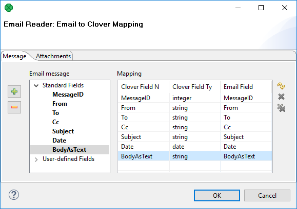

<!-- Development > Component reference > Readers > EmailReader -->

### EmailReader

| [Short description](emailreader.md#short-description) |
| --- |
| [Ports](emailreader.md#ports) |
| [Metadata](emailreader.md#metadata) |
| [EmailReader attributes](emailreader.md#emailreader-attributes) |
| [Details](emailreader.md#details) |
| [Examples](emailreader.md#examples) |
| [See also](emailreader.md#see-also) |

#### Short description

**EmailReader** reads a store of email messages, either locally from a delimited flat file, or on an external server.

| Same input metadata | Sorted inputs | Inputs | Outputs | Java | CTL | Auto-propagated metadata |
| --- | --- | --- | --- | --- | --- | --- |
| **⨯** | **⨯** | 1 | 2 | - | - | **⨯** |

#### Ports

When looking at ports, it is necessary for use-case scenarios to be understood. This component has the ability to read data from a local source, or an external server. The component decides which case to use based on whether there is an edge connected to the single input port.

**Case One:** If an edge is attached to the input port, the component assumes that it will be reading data locally. In many cases, this edge will come from a **FlatFileReader**. In this case, a file can contain multiple email message bodies separated by a chosen delimiter and each message will be passed one by one into the **EmailReader** for parsing and processing.

**Case Two:** If an edge is not connected to the input port, the component assumes that messages will be read from an external server. In this case, the user *must* enter related attributes, such as the server host and protocol parameters, as well as any relevant username and/or password.

| Port type | Number | Required | Description | Metadata |
| --- | --- | --- | --- | --- |
| Input | 0 | **⨯** | For inputting email messages from a flat file. | String field |
| Output | 0 | **⨯** | The content port | Any |
| 1 | **⨯** | The attachment port | Any |  |

#### Metadata

EmailReader does not propagate metadata.

EmailReader has metadata templates on its output ports.

Fields of the templates have to be mapped using the **Field Mapping** attribute. Otherwise, null values are sent out to output ports.

| Field number | Field name | Data type | Description |
| --- | --- | --- | --- |
| 1 | MessageID | string | Message ID |
| 2 | From | string | Sender of the message |
| 3 | To | string | Addressee of the message |
| 4 | Cc | string | Copy sent to |
| 5 | Subject | string | Email subject |
| 6 | Date | string | Email delivery date |
| 7 | Body | string | Email content |

| Field number | Field name | Data type | Description |
| --- | --- | --- | --- |
| 1 | MessageID | string | Message ID |
| 2 | ContentType | string | Content type of the attachment |
| 3 | Charset | string | Character set of the attachment |
| 4 | Disposition | string | Attachment or inline |
| 5 | Filename | string | Attachment file name |
| 6 | AttachmentRaw | byte | Email attachment as bytes |
| 7 | AttachmentFile | string | Path to the downloaded attachment |

#### EmailReader attributes

The number of attributes which are required or not depends solely on the configuration of the component. See [Ports](emailreader.md#ports): in **Case Two**, where the edge is not connected to the input port, more attributes are required in order to connect to the external server. At minimum, the user must choose a protocol and enter a hostname for the server. Usually, a username and password is also required.

| Attribute | Req | Description | Possible values |
| --- | --- | --- | --- |
| Basic |  |  |  |
| Server Type |  | Protocol utilized to connect to the mail server. | IMAP (default) \| POP3 |
| Server Name |  | The hostname of the server. | e.g. imap.example.com |
| Server Port |  | Specifies the port used to connect to an external server. If left blank, a default port will be used. | Integers |
| Security |  | Specifies the security protocol used to connect to a server. | None (default) \| STARTTLS \| SSL |
| User Name |  | The username to connect to a server (if authorization is required) |  |
| Password |  | The password to connect to a server (if authorization is required) |  |
| OAuth2 connection |  | OAuth2 connection to authorize a connection to a server (if OAuth2 authorization is required) | Replaces password[[1]](emailreader.md#emailreader-attributes-footnote-1) |
| Fetch Messages |  | Filters messages based on their status. The option `ALL` will read every message located on a server, regardless of its status. `NEW` fetches only messages that have not been read. | NEW \| ALL |
| Field Mapping | Yes | Defines how parts of the email (*standard* and *user-defined*) will be mapped to Clover fields, see [Mapping fields](emailreader.md#mapping-fields). |  |
| Source Folder |  | Defines a source folder on a remote server. Use with `IMAP` only. | e.g. INBOX |
| Mark/Delete Messages |  | Defines what to do with read messages. By default, messages are *marked as read*. | mark as read (default) \| no action \| delete |
| Max. Number of Messages |  | Defines the maximum number of messages to be downloaded. Any positive value defines the limit, negative value or 0 means unlimited. | e.g. 50 |
| Advanced |  |  |  |
| POP3 Cache File |  | Specifies the URL of a file used to keep track of which messages have been read. POP3 servers by default have no way of keeping track of read/unread messages. If you wish to fetch only unread messages, you must download all of the messages IDs from the server and then compare them with a list of message IDs that have already been read. Using this method, only the messages that do not appear in this list are actually downloaded, thus saving bandwidth. This file is simply a delimited text file storing the unique IDs of messages that have already been read. Even if `ALL` messages is chosen, the user should still provide a cache file, as it will be populated by the messages read. **Note:** the pop cache file is universal; it can be shared amongst many inboxes, or the user can choose to maintain a separate cache for different mailboxes. |  |
| Additional JavaMail Properties |  | The component uses JavaMail library to read emails. This attribute can be used to specify additional configuration properties of JavaMail library to tweak its behavior, performance etc. See online documentation for properties relevant for [IMAP](https://eclipse-ee4j.github.io/angus-mail/docs/api/org.eclipse.angus.mail/org/eclipse/angus/mail/imap/package-summary.html) and [POP3](https://eclipse-ee4j.github.io/angus-mail/docs/api/org.eclipse.angus.mail/org/eclipse/angus/mail/pop3/package-summary.html). For the IMAP and POP3 properties use the correct prefix based on usage of SSL, e.g. `mail.imap.timeout` vs `mail.imaps.timeout`.  Some properties of JavaMail library are overridden by the component by default. We increase values of `mail.imap.fetchsize` and `mail.imaps.fetchsize` for faster download of attachments. These properties can be also changed by this attribute, e.g. you can set `mail.imaps.fetchsize` to 5000000 for even faster download but larger memory footprint. |  |

| 1 | Using OAuth2 connection to connect to Microsoft Exchange via IMAP requires `https://outlook.office.com/IMAP.AccessAsUser.All` Scope to be specified. |
| --- | --- |

#### Details

**EmailReader** is a component suitable for reading of online or local email messages.

This component parses email messages and writes their attributes out to two attached output ports. The first port, the content port, outputs relevant information about the email and body. The second port, the attachment port, writes information relevant to any attachments that the email contains.

The content port will write one record per email message. The attachment port can write multiple records per email message; one record for each attachment it encounters.

##### Mapping fields

If you edit the **Field Mapping** attribute, you will get **Email to Clover Mapping** dialog:

*Figure 352. Mapping to Clover fields in EmailReader*

In its two tabs - **Message** and **Attachments** - you map incoming email fields to Clover fields by dragging and dropping. You will see metadata fields in a particular tab only if a corresponding edge is connected and has metadata assigned. The first output port influences the **Message** tab, the second output port influences the **Attachments** tab.

Buttons on the right hand side allow you to perform **Auto mapping**, **Clear selected mapping** or **Cancel all mappings**. Buttons on the left hand side add or remove user-defined fields.

###### User-defined Fields

**User-defined Fields** let you handle non-standardized email headers. Manually define a list of email header fields that should be populated from email message. For example, you can read additional email headers like **Accept-Language**, **DKIM-Signature**, **Importance**, **In-Reply-To**, **Received**, **References**, etc.

See details on message headers at [http://www.iana.org/assignments/message-headers/message-headers.xhtml](http://www.iana.org/assignments/message-headers/message-headers.xhtml).

##### Tips&Tricks

- Be sure you have dedicated enough memory to your Java Virtual Machine (JVM). Depending on the size of your message attachments (if you choose to read them), you may need to allocate up to 512 MB to **CloverDX** so that it may effectively process the data.

##### Performance bottlenecks

- *Quantity of messages to process from an external server***EmailReader** must connect to an external server, therefore you may reach bandwidth limitations. Processing a large number of messages which contain large attachments may bottleneck the application, waiting for the content to be downloaded. Use the `NEW` option whenever possible, and maintain a POP3 cache if using the POP3 protocol.

#### Examples

| [Reading emails](emailreader.md#reading-emails) |
| --- |
| [Reading attachments](emailreader.md#reading-attachments) |

##### Reading emails

This example describes the basic usage of **EmailReader** component.

Read the email of Adam Smith (email: adam.smith@example.com, password: InquiryInto). Read all messages. The example.com can be accessed via POP3 protocol.

###### Solution

Create a graph with the **EmailReader** component, connect the first output port of **EmailReader** with another component, and configure the component:

| Attribute | Value |
| --- | --- |
| Server Type | POP3 |
| Server Name | example.com |
| User Name | adam.smith |
| Password | InquiryInto |
| Fetch Messages | ALL |
| Field Mapping | MessageID:=MessageID; From:=From; To:=To; Cc:=Cc; Subject:=Subject; Date:=Date; Body:=BodyAsText;\| |
| Mark/Delete Messages | no action |
| POP3 Cache File | ${DATATMP_DIR}/pop3cache |

The **POP3 Cache File** must be in an existing directory.

The **Field Mapping** can be defined on the **Message** tab of the [Email to Clover mapping](emailreader.md#emailreader-mapping) dialog.

##### Reading attachments

This example describes reading attachments and saving the files under their original names.

Read attachments from the email of John Doe (john.doe@example.com, password: MyKittenName123) and store the files into the `data-out` directory. The mailbox is accessible via IMAP4 protocol.

###### Solution

Create a graph containing **EmailReader** and [FlatFileWriter](flatfilewriter.md). Connect the second output port of **EmailReader** with **FlatFileWriter**.

In **EmailReader**, set the following attributes:

| Attribute | Value |
| --- | --- |
| Server Type | IMAP |
| Server Name | example.com |
| User Name | john.doe |
| Password | MyKittenName123 |
| Fetch Messages | ALL |
| Field Mapping | \|MessageID:=MessageID; ContentType:=ContentType; Charset:=Charset; Disposition:=Disposition; Filename:=Filename; AttachmentRaw:=AttachmentRaw; AttachmentFile:=AttachmentFile; |
| Mark/Delete Messages | no action |
| Max. Number of Messages | 0 |

The **Field Mapping** in **EmailReader** can be configured on the **Attachment** tab of the [Email to Clover mapping](emailreader.md#emailreader-mapping) dialog.

In **FlatFileWriter**, set the following attributes:

| Attribute | Value |
| --- | --- |
| File URL | ${DATAOUT_DIR}/# |
| Create directories | true |
| Exclude fields | MessageID;ContentType;Charset;Disposition;AttachmentFile;Filename |
| Partition key | Filename |
| Partition file tag | Key file tag |
> [!NOTE]
> You should filter out `null` file names before writing. Use [Filter](extfilter.md).
>
> You should handle duplicated file names as well.

#### Compatibility

| Version | Compatibility Notice |
| --- | --- |
| 3.4.x-3.5.x | **Auto mapping** accessible via the **Field mapping** attribute is automatically performed when you first open this window. |

#### See also

| [EmailSender](emailsender.md) |
| --- |
| [Common properties of components](components.md#common-properties-of-components) |
| [Specific attribute types](components.md#specific-attribute-types) |
| [Common properties of Readers](common-of-readers.md) |
| [Readers comparison](common-of-readers.md#readers-comparison) |
