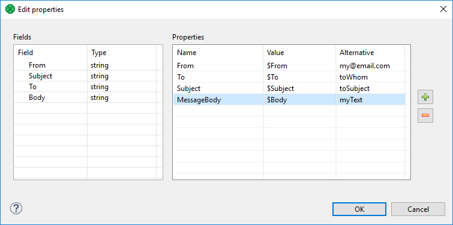
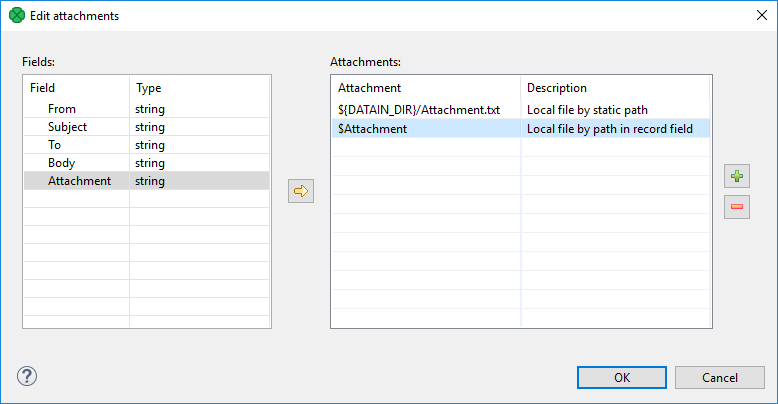
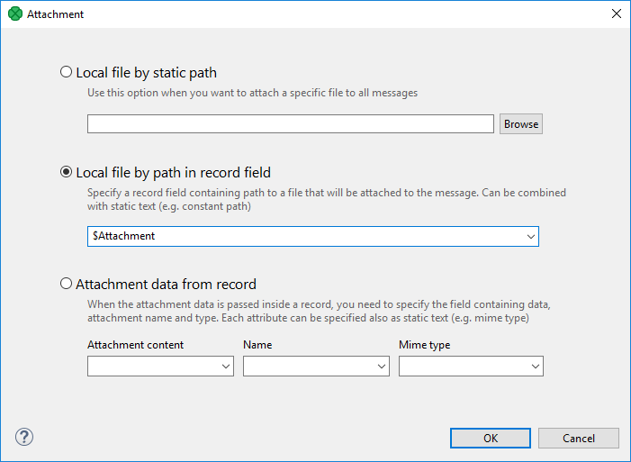

<!-- Development > Component reference > Writers > EmailSender -->

### EmailSender


| [Short description](emailsender.md#short-description) |
| --- |
| [Ports](emailsender.md#ports) |
| [Metadata](emailsender.md#metadata) |
| [EmailSender attributes](emailsender.md#emailsender-attributes) |
| [Details](emailsender.md#details) |
| [See also](emailsender.md#see-also) |

#### Short description

**EmailSender** sends emails.

| Data output | Input ports | Output ports | Transformation | Transf. required | Java | CTL | Auto-propagated metadata |
| --- | --- | --- | --- | --- | --- | --- | --- |
| flat file | 0-1 | 0-2 | **⨯** | **⨯** | **⨯** | **⨯** | **⨯** |

#### Ports

| Port type | Number | Required | Description | Metadata |
| --- | --- | --- | --- | --- |
| Input | 0 | **⨯** | For data for emails | Any |
| Output | 0 | **⨯** | For successfully sent emails. | Input 0 |
| 1 | **⨯** | For rejected emails. | Input 0 plus field named `errorMessage` |  |

#### Metadata

**EmailSender** does not propagate metadata.

**EmailSender** has no metadata templates.

Metadata of the first output port are the same as those of the input port. However, metadata are not propagated from the input port to the first output port.

Metadata of the second output port have the same fields as metadata of the input port plus one field named `errorMessage`. This field receives the information about the error that has occurred.

#### EmailSender attributes

| Attribute | Req | Description | Possible values |
| --- | --- | --- | --- |
| Basic |  |  |  |
| SMTP server | yes | The name of an SMTP server for outgoing emails. | e.g. smtp.example.com |
| SMTP user |  | The name of the user for an authenticated SMTP server. |  |
| SMTP password |  | A password of the user for an authenticated SMTP server. |  |
| OAuth2 connection |  | OAuth2 connection to authorize a connection to an authenticated SMTP server. | Replaces SMTP password[[1]](emailsender.md#emailsender-attributes-footnote-1) |
| Connection security |  | Specifies the security protocol used to connect to the server. | None (default) \| STARTTLS \| SSL |
| Message | yes | A set of properties defining the message headers and body. For more information, see [Email message](emailsender.md#email-message). |  |
| Attachments |  | A set of properties defining the message attachments. For more information, see [Email attachments](emailsender.md#email-attachments). |  |
| Advanced |  |  |  |
| SMTP port |  | The number of the port used for connection to an SMTP server. | Integers |
| Trust invalid SMTP server certificate |  | By default, invalid SMTP server certificates are not accepted. If set to `true`, an invalid SMTP server certificate (with different name, expired, etc) is accepted. | false (default) \| true |
| Ignore send fail |  | By default, when an email is not successfully sent, the graph fails.  If set to `true`, the graph execution continues even if no mail can be sent successfully. | false (default) \| true |
| Connect timeout |  | Timeout for establishing connection to the SMTP server.  The value is in milliseconds. Additionally you can use other time units to define the [time interval](components.md#time-intervals), e.g. `30s` for seconds, `10m` for minutes. | 5 minutes (default) \| 0 (no timeout) \| number of milliseconds or [time interval](components.md#time-intervals) |
| Read timeout |  | Timeout for reading from the SMTP server.  The value is in milliseconds. Additionally you can use other time units to define the [time interval](components.md#time-intervals), e.g. `30s` for seconds, `10m` for minutes. | 5 minutes (default) \| 0 (no timeout) \| number of milliseconds or [time interval](components.md#time-intervals) |
| Write timeout |  | Timeout for writing to the SMTP server.  The value is in milliseconds. Additionally you can use other time units to define the [time interval](components.md#time-intervals), e.g. `30s` for seconds, `10m` for minutes. | 5 minutes (default) \| 0 (no timeout) \| number of milliseconds or [time interval](components.md#time-intervals) |
| Additional JavaMail Properties |  | The component uses JavaMail library to send emails. This attribute can be used to specify additional configuration properties of JavaMail library to tweak its behavior, performance etc. See online documentation for properties relevant for [SMTP](https://eclipse-ee4j.github.io/angus-mail/docs/api/org.eclipse.angus.mail/org/eclipse/angus/mail/smtp/package-summary.html). Note that if you set **Connection security** to "SSL", you need to use `mail.smtps.*` prefix instead of `mail.smtp.*`. |  |
| Use short-lived connections |  | By default, SMTP connection remains open for the entire time the component is running, which can be a very long time. The SMTP connection is kept open even if none or just few emails are sent.  If you want to shorten SMTP connection lifetime, set this parameter to `true`. SMTP connection will be opened lazily (only when input data record is received) and closed immediately when no more data records are available on input edge. | false (default) \| true |

| 1 | Using OAuth2 connection to connect to Microsoft Exchange via SMTP requires the `https://outlook.office.com/SMTP.Send` scope to be specified. |
| --- | --- |

#### Details

| [Email message](emailsender.md#email-message) |
| --- |
| [Email attachments](emailsender.md#email-attachments) |
| [JavaMail system properties](emailsender.md#javamail-system-properties) |

**EmailSender** converts data records into emails. It can use input data to create the email sender and addressee, email subject, message body, and attachment(s). If no input edge is connected, this component sends one email.

If a record is rejected and an email is not sent, an error message is created and sent to the `errorMessage` field of metadata on the output 1 (if it contains such a field).

##### Email message

To define the **Message** attribute, you can use the following wizard:


*Figure 368. EmailSender Message Wizard*

In this wizard, you specify a content of particular parts of an email message: drag and drop the proper field from the **Fields** pane to the **Value** column.

You can also specify values to be used if the mapped field is empty. The alternative values of these attributes should be typed to the **Alternative** column. If a field is empty or has null value, **Alternative** is used instead of the field value.

You can add additional headers, for example **Cc**, **Bcc** or **Content-type**, using the **plus** button.

The resulting value of the **Message** attribute will look like this:

```ctl
From=$From|my@mail.com Subject=$Subject|mySubject To=$To|toWhom MessageBody=$Message|myText
```

> [!TIP]
> To send an email to multiple recipients, separate their addresses by a comma ','. If needed, use the same delimiter in the `Cc` and `Bcc` fields.
> [!NOTE]
> Each field in the **Properties** table can be used as a template. Variable names are substituted with values from record.
>
> For example, the **MessageBody** field contains `Hello, my name is $name.` and the **name** field in input record contains the value **Bob**. The output message will contain the text `Hello, my name is Bob.`

##### Email attachments

The **Attachments** attribute lets you add files as an email attachment.

The attachment can be a file with invariable path (static file), a file whose name is received from an edge or a file whose content is received from an edge. These ways can be arbitrarily combined.

The attachment is specified as a sequence of individual attachments separated by a semicolon. It is defined as a field name (file name received from an edge), as a file name including its path or as a triplet of field name, file name of the attachment and its mime type. Each of these three parts of the triplet can be also specified using a static expression.

The attachments is added to the email using the following **Edit attachments** wizard:


*Figure 369. Edit Attachments Wizard*

You add the items by clicking the **Plus sign** button and remove by clicking the **Minus sign** button. Input fields can be dragged to the **Attachment** column of the **Attachments** pane or the **Arrow** button can be used.

If you want to edit any attachment definition, click the corresponding row in the **Attachment** column and the following attribute will open:


*Figure 370. Attachment Wizard*

In this wizard, you need to locate files, specify them using field names or the mentioned triplet. After clicking **OK**, the attachment is defined.

If you want to use non-ASCII characters in filenames of attachments, value of the [system property](emailsender.md#javamail-system-properties)`mail.mime.encodefilename` needs to be set to `true`. Any non-ASCII characters in the filenames will be encoded then (default is `false`).

Default MIME charset to use for encoded words and text parts that don’t otherwise specify a charset (not only filename, but subject, message body as well) can be specified using the `mail.mime.charset` system property. The default value is the value of the `file.encoding` system property.

##### JavaMail system properties

The **EmailSender** component is implemented using the JavaMail reference implementation library. JavaMail specification lists Java system properties which control behavior of the JavaMail implementation. For description of these properties, see the [JavaMail API documentation](http://docs.oracle.com/javaee/6/api/javax/mail/internet/package-summary.html#package_description). Use `-D` Java VM parameter to set the value of a system property.

##### Notes and limitations

Metadata of **EmailSender** can have list and map fields. The map and list fields can be passed through, but they are not suitable for use in the component.

#### See also

| [EmailReader](emailreader.md) |
| --- |
| [Common properties of components](components.md#common-properties-of-components) |
| [Specific attribute types](components.md#specific-attribute-types) |
| [Common properties of Writers](common-of-writers.md) |
| [Writers comparison](common-of-writers.md#writers-comparison) |
