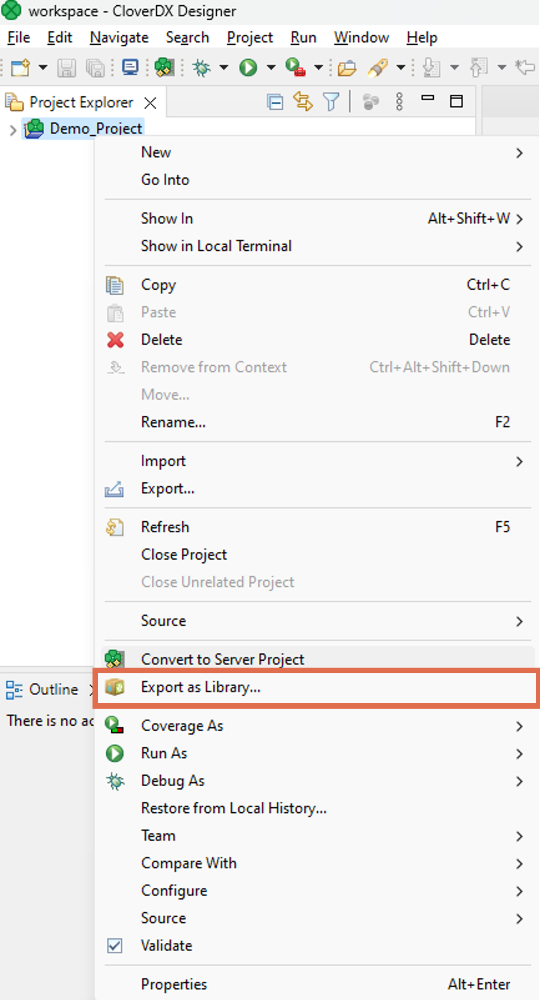
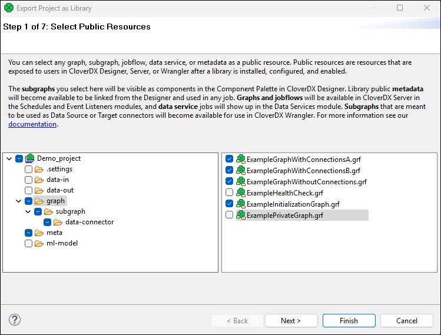
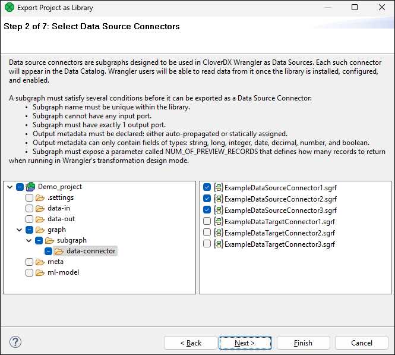
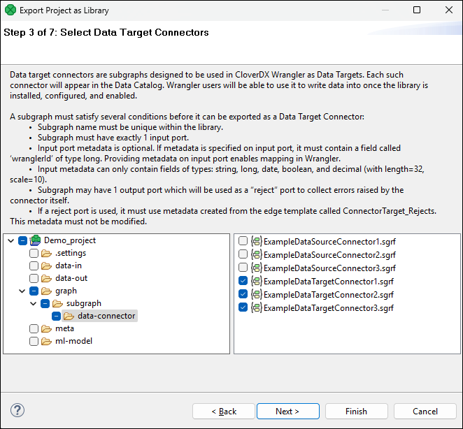
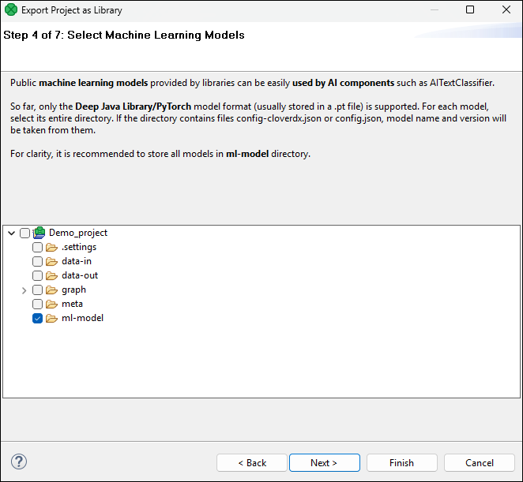
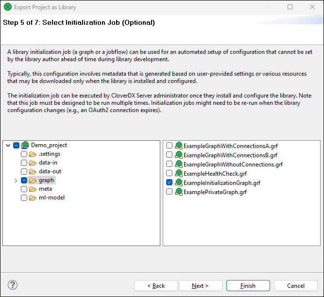
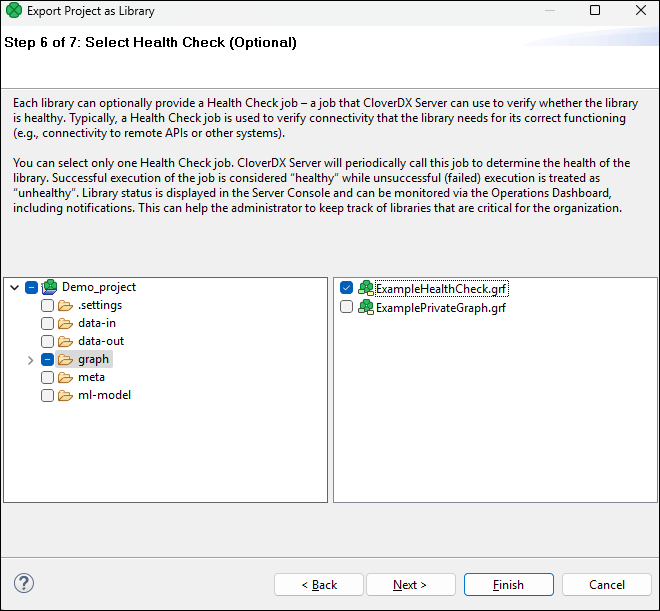
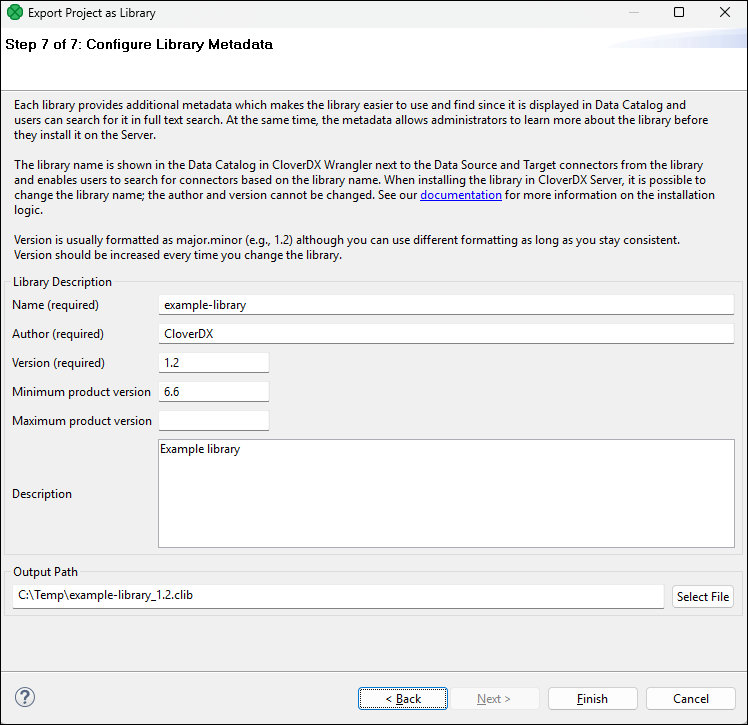

<!-- Development > Projects > Export project as library -->

## 16. Export project as library
> [!TIP]
> See the [Libraries](libraries-dev.md) section for more information on CloverDX libraries and libraries development best practices and recommendations.

To export a project into a CloverDX library file, right-click on it and select **Export as Library…​**

*Figure 136. Export project as library*

The action will open a wizard. On the first page of the wizard, you can select which elements should be **public** – visible to other users. Other elements will also be included in the package, but they will be hidden. These internal elements may be used as sub-routines in the public ones.

*Figure 137. Export as library – selecting public resources*

On the second wizard page, you can select **data source connectors**. For more information, see [Requirements for Data Source Connectors.](libraries-dev.md#data-source-connector-requirements)

*Figure 138. Export as library – selecting data source connectors*

On the third wizard page, you can select **data target connectors**. For more information, see [Requirements for Data Target Connectors.](libraries-dev.md#data-target-connector-requirements)

*Figure 139. Export as library – selecting data target connectors*

On the fourth page, you can select **models for AI components**. For more information, see [Machine Learning Models](libraries-dev.md#machine-learning-models).

On the fifth wizard page, you can select one job (graph, subgraph, jobflow) which you may use as an **initialization job** for your library after you successfully install it on **CloverDX Server**. Note that an initialization job must not include required parameters. For more information, see [Initialization jobs (pre-generating metadata)](libraries-dev.md#initialization-jobs-pre-generating-metadata).

*Figure 140. Export as library – selecting an initialization job*

On the sixth page, you can select a **Health Check job** which will be used to monitor health of your library. Note that a Health Check job must not include required parameters.

*Figure 141. Export as library – selecting a Health Check job*

On the last wizard page, you can give your library a custom *Name*, *Author*, *Version*. These fields are mandatory.

*Minimum and Maximum product version*, and *Description* are optional.

The *Minimum* and *Maximum product* specify minimum and maximum **CloverDX** versions, for which the library is supported in **CloverDX Server**. This information is a crucial indicator for CloverDX administrators. These fields highlight potential compatibility issues when installing the library on a server version outside the specified range. For more information refer to the Server documenation [here](../operations/libraries.md#library-incompatible-with-server).

Finally, you need to select the output file path.

*Figure 142. Export as library – configuring metadata*

After pressing *Finish*, the wizard will package the project (excluding data-out and data-tmp directories) into a file with the “.clib” extension. An administrator can install the file to **CloverDX Server** in the [Libraries](../operations/libraries.md) section.
