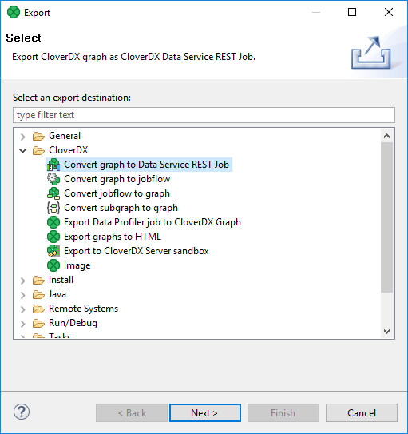
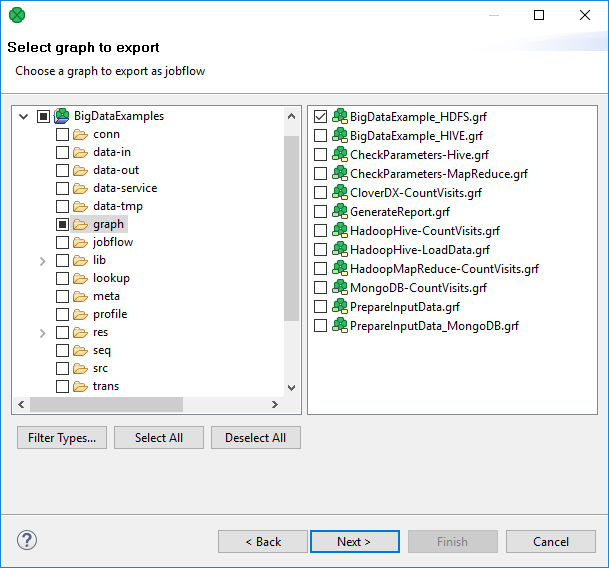
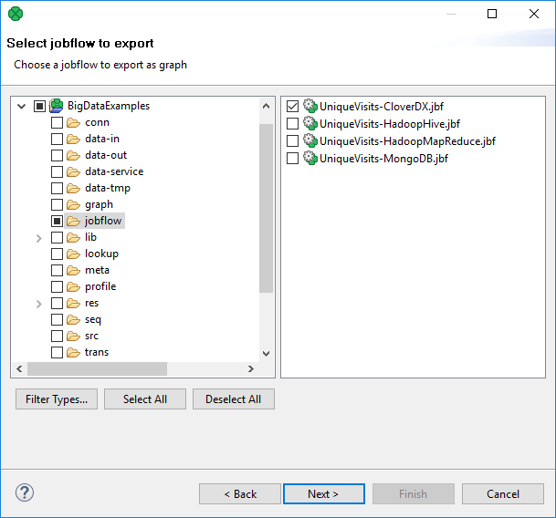
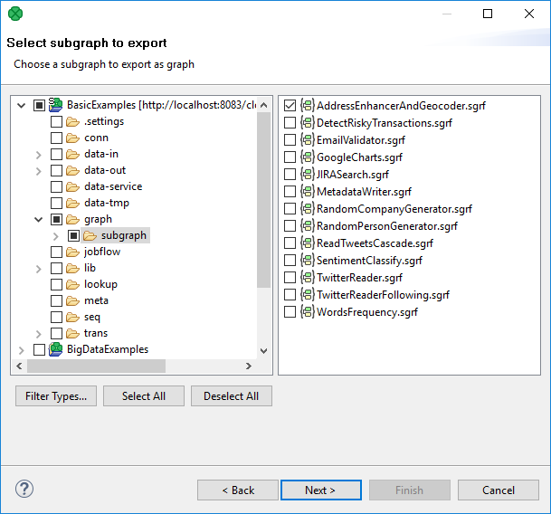
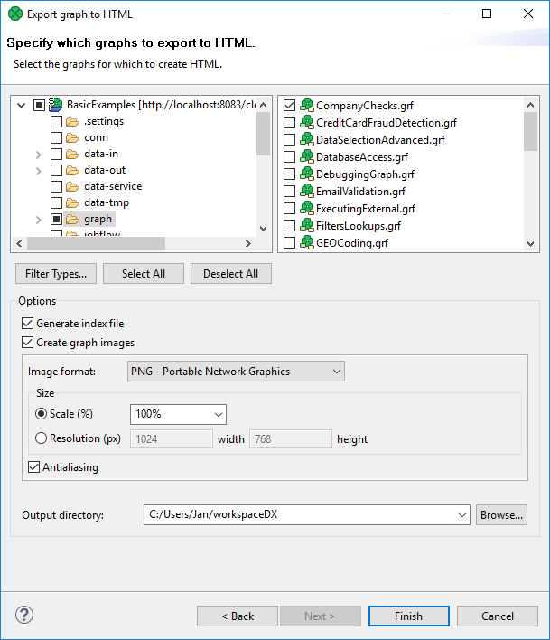
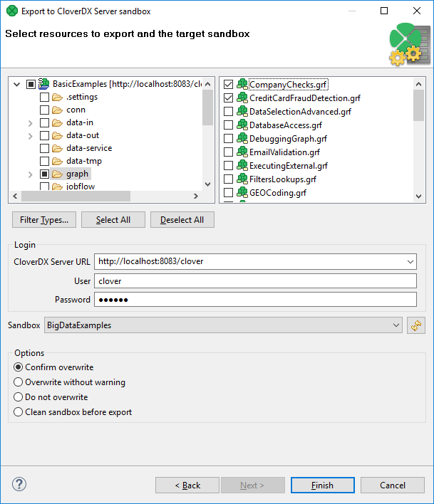
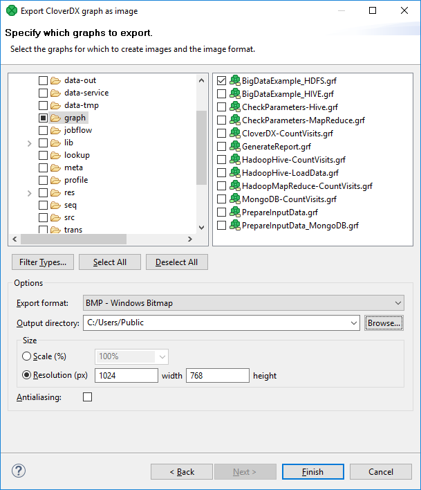

<!-- Development > Designer user interface > Export -->

## 9. Export

**Export** converts graphs (and jobflow) to formats independent of **CloverDX Designer**, or exports metadata or converts graphs to jobflow, jobflow or subgraphs to graphs.

If you want to export something, you can either select **File** ****Export…​** from the main menu or right-click in the **Project Explorer** pane and select **Export…​** from the context menu. After that, the **Export** wizard window opens. When you expand the **CloverDX** category, the window will look like this:

*Figure 110. Export Options*

### Convert graph to jobflow

A graph can be converted to a jobflow. The wizard converting a graph to a jobflow creates a new jobflow in a user-defined directory. The original graph is left untouched.

You can convert only one graph at a time.

Right-click **Outline** and choose **Export**.

Select **Convert Graph to Jobflow**.

Select one graph to be converted to a jobflow.

*Figure 111. Converting graph to jobflow*

Choose the file name and destination for the converted jobflow.

### Convert jobflow to graph

A jobflow can be converted to a graph.

The wizard converting a jobflow to a graph creates a new **CloverDX** graph in a user-defined directory. The original jobflow is left untouched.

You can convert only one jobflow at a time.

Right-click the **Outline** and choose **Export**.

Select **Convert Jobflow to Graph**.

Select one jobflow to be converted to a graph.

*Figure 112. Converting jobflow to graph*

Choose destination for the graph.

### Convert subgraph to graph

Subgraphs can be converted to graphs.

The wizard converting a subgraph to a graph creates a new graph. The original subgraph is left untouched.

Conversion replaces the **SubgraphInput** and **SubgraphOutput** components with **SimpleCopy**. **DebugInput** and **DebugOutput** are preserved too.

Only one subgraph can be converted at a time.

#### Conversion of subgraph to graph in steps

Right-click the **Outline** and choose **Export**.

Select **Convert Subgraph to Graph**.

Select a subgraph to be converted to a graph and choose a directory and file name for the graph.

*Figure 113. Converting subgraph to graph*

### Export graphs to HTML

If you select the **Export graphs to HTML** item, you can click the **Next** button and see the following window:

*Figure 114. Export graphs to HTML*

You must select the graph(s) and specify to which output directory the selected graph(s) should be exported. You can also generate index file of the exported pages and corresponding graphs and/or images of the selected graphs. By switching the radio buttons, you are selecting either the scale of the output images, or the width and the height of the images. You can decide whether antialiasing should be used.

### Export to CloverDX Server sandbox

**CloverDX Designer** now allows you to export any part of your projects to **CloverDX Server** sandboxes. To export, select the **Export to CloverDX Server sandbox** option. After that, the following wizard will open:

*Figure 115. Export to CloverDX Server sandbox*

Select the files and/or directories that should be exported and decide whether the files and/directories with identical names should be overwritten without warning or whether overwriting should be confirmed or whether the files and/or directories with identical names should not be overwritten at all, and also decide whether the sandbox should be cleaned before export.

Specify the following three items: **CloverDX Server URL**, your **username** and **password**. Then click **Reload**. After that, a list of sandboxes will be available in the **Sandbox** menu.

Select a sandbox. Then click **Finish**. Selected files and/or directories will be exported to the selected **CloverDX Server** sandbox.
> [!NOTE]
> Exporting to a **partitioned** sandbox is not supported. Since the sandbox location to be affected is not known in this case, the action returns errors.

### Export image

If you select the **Export image** item, you can click the **Next** button and you will see the following window:

*Figure 116. Export image*

This option allows you to export images of the selected graphs only. You must select the graph(s) and specify to which output directory the selected graph(s) images should be exported. You can also specify the format of output files - `bmp`, `jpeg` or `png`. By switching the radio buttons, you are selecting either the scale of the output images, or the width and the height of the images. You can decide whether antialiasing should be used.
