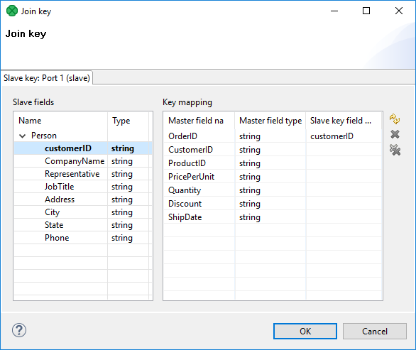

<!-- Development > Component reference > Joiners > ExtHashJoin -->

### ExtHashJoin


| [Short description](exthashjoin.md#short-description) |
| --- |
| [Ports](exthashjoin.md#ports) |
| [Metadata](exthashjoin.md#metadata) |
| [ExtHashJoin attributes](exthashjoin.md#exthashjoin-attributes) |
| [Details](exthashjoin.md#details) |
| [Examples](exthashjoin.md#examples) |
| [Best practices](exthashjoin.md#best-practices) |
| [Compatibility](exthashjoin.md#compatibility) |
| [See also](exthashjoin.md#see-also) |

#### Short description

**ExtHashJoin** is a general purpose joiner. It merges potentially unsorted data from two or more data sources on a common key. The component is fast as it is processed in memory.

| Same input metadata | Sorted inputs | Slave inputs | Outputs | Output for drivers without slave | Output for slaves without driver | Joining based on equality | Auto-propagated metadata |
| --- | --- | --- | --- | --- | --- | --- | --- |
| **⨯** | **⨯** | 1-n | 1-2 | **⨯** | **⨯** | **✓** | **✓** |

#### Ports

**ExtHashJoin** receives data through two or more input ports, each of which may have a different metadata structure.

The joined data is then sent to the single output port.

| Port type | Number | Required | Description | Metadata |
| --- | --- | --- | --- | --- |
| Input | 0 | **✓** | Master input port | Any |
| 1 | **✓** | Slave input port | Any |  |
| 2-n | **⨯** | An optional slave input ports | Any |  |
| Output | 0 | **✓** | Output port for the joined data | Any |
| 1 | **⨯** | Output port for the unjoined data | Input port 0 |  |

#### Metadata

**ExtHashJoin** propagates metadata from the first input port to the second output port and from the second output port to the first input port.

**ExtHashJoin** has no metadata templates.

Metadata on the first input port and the second output port must be the same. (Metadata fields must have the same types, metadata field names may differ.)

#### ExtHashJoin attributes

| Attribute | Req | Description | Possible values |
| --- | --- | --- | --- |
| Basic |  |  |  |
| Join key | yes | A key according to which incoming data flows are joined. See [Join key](exthashjoin.md#join-key). |  |
| Join type |  | Type of the join. See [Join types](join-types.md). | Inner (default) \| Left outer \| Full outer |
| Transform | [[1]](exthashjoin.md#exthashjoin-attributes-fn01) | A transformation in CTL or Java defined in a graph. |  |
| Transform URL | [[1]](exthashjoin.md#exthashjoin-attributes-fn01) | An external file defining the transformation in CTL or Java. |  |
| Transform class | [[1]](exthashjoin.md#exthashjoin-attributes-fn01) | External transformation class. |  |
| Advanced |  |  |  |
| Transform source charset |  | Encoding of an external file defining the transformation.  The default encoding depends on DEFAULT_SOURCE_CODE_CHARSET in defaultProperties. | E.g. UTF-8 |
| Allow slave duplicates |  | If set to `true`, records with duplicate key values are allowed. If `false`, only the **first** record is used for join. | false (default) \| true |
| Ignore case |  | If set to `true`, string key field comparisons are performed case-insensitively (i.e. "Smith" = "smith"). If `false` (default), key comparisons are case-sensitive. | false (default) \| true |
| Hash table size |  | An initial size of a hash table that should be used when joining data flows. If there are more records that should be joined, the hash table can be rehashed; however, it slows down the parsing process.  The lowest possible value is 512; if a value lower than 512 is defined, 512 is used instead.  The number denotes the number or record.  For more information, see [Hash Tables](exthashjoin.md#hash-tables). | 512 (default) |
| Deprecated |  |  |  |
| Error actions |  | A definition of the action that should be performed when the specified transformation returns an **Error code**. See [Return values of transformations](transformations.md#return-values-of-transformations). |  |
| Error log |  | A URL of the file to which error messages for specified **Error actions** should be written. If not set, they are written to **Console**. |  |
| Left outer |  | If set to `true`, `left outer` join is performed. By default, the attribute is set to `false`. However, this attribute has a lower priority than **Join type**. If you set both, only **Join type** will be applied. | false (default) \| true |
| Full outer |  | If set to `true`, `full outer` join is performed. By default, the attribute is set to `false`. However, this attribute has a lower priority than **Join type**. If you set both, only **Join type** will be applied. | false (default) \| true |

| 1 |  One of these must be set. These transformation attributes must be specified. Any of these transformation attributes must use a common CTL template for **Joiners** or implement a `RecordTransform` interface. |
| --- | --- |

For more information, see [CTL scripting specifics](exthashjoin.md#ctl-scripting-specifics)or [Java interfaces](exthashjoin.md#java-interfaces).

For detailed information about transformations, see [Defining transformations](transformations.md#defining-transformations).

#### Details

| [Join key](exthashjoin.md#join-key) |
| --- |
| [Hash tables](exthashjoin.md#hash-tables) |
| [Joining mechanics](exthashjoin.md#joining-mechanics) |
| [Transformation](exthashjoin.md#transformation) |

**ExtHashJoin** reads records from slave ports and stores them into hash tables. The records from the hash tables are employed for mapping with the records from the master.

The data attached to the first input port is called the **master** (as usual in other **Joiners**). All remaining connected input ports are called **slaves**.

Each master record is matched to all slave records on one or more fields known as the **join key**. An output is produced after applying a transformation that maps joined inputs to the output. For details, see [Joining mechanics](exthashjoin.md#joining-mechanics).

This joiner should be avoided in the case of large inputs on the slave port. The reason is that slave data is cached in the main memory.
> [!TIP]
> If you have larger data, consider using the [ExtMergeJoin](extmergejoin.md) component. If your data sources are unsorted, use a sorting component first ([ExtSort](extsort.md), [FastSort](fastsort.md) or [SortWithinGroups](sortwithingroups.md)).

##### Join key

The **Join key** is a key according to which the incoming data flows are joined. It is specified as a sequence of mapping expressions for all slaves.

The mapping expressions are separated from each other by hash. Each of these mapping expressions is a sequence of field names from master and slave records (in this order) put together using an equal sign and separated from each other by a semicolon, colon, or pipe.

```ctl
$CUSTOMERID=$CUSTOMERID#$ORDERID=$ORDERID;$PRODUCTID=$PRODUCTID
```

The order of these mappings must correspond to the order of the slave input ports. If some of these mappings are empty or missing for some of the slave input ports, the mapping of the first slave input port is used instead.
> [!NOTE]
> Different slaves can be joined with the master using different master fields!
Example 399. Slave part of join key for ExtHashJoin

```ctl
$master_field1=$slave_field1;$master_field2=$slave_field2;...;$master_fieldN=$slave_fieldN
```

- If some `$slave_fieldJ` is missing (i.e. if the subexpression looks like this: `$master_fieldJ=`), it is supposed to be the same as the `$master_fieldJ`.
- If some `$master_fieldK` is missing, `$master_fieldK` from the first port is used.
Example 400. Join key for ExtHashJoin

```ctl
$first_name=$fname;$last_name=$lname#=$lname;$salary=;$hire_date=$hdate
```

- The following is the part of **Join key** for the first slave data source (input port 1):
  `$first_name=$fname;$last_name=$lname`.
  - Thus, the following two fields from the master data flow are used for join with the first slave data source:
    `$first_name` and `$last_name`.
  - They are joined with the following two fields from this first slave data source:
    `$fname` and `$lname`, respectively.
- The following is the part of **Join key** for the second slave data source (input port 2):
  `=$lname;$salary=;$hire_date=$hdate`.
  - Thus, the following three fields from the master data flow are used for join with the second slave data source:
    `$last_name` (because it is the field which is joined with the `$lname` for the first slave data source), `$salary` and `$hire_date`.
  - They are joined with the following three fields from this second slave data source:
    `$lname`, `$salary` and `$hdate`, respectively. (This slave `$salary` field is expressed using the master field of the same name.)

###### Join key dialog

To create the **Join key** attribute, use the **Join key** dialog. When you click the **Join key** attribute row, a button appears in this row. By clicking this button, you open the dialog.


*Figure 433. Hash join key dialog*

In the dialog, you can see tabs for all of the slave input ports. In each slave tab, there are two panes: **Slave fields** and **Key mappings**.

The **Slave fields** pane is on the left. It contains a list of all the slave field names and their data types.

The **Key mapping** pane is on the right. It contains three columns: **Master fields**, **Master field type** and **Slave key field mapped**. The left column contains all field names of the driver input port. The middle column contains data types corresponding to the fields in the first column. The right column contains the mapped fields from the slave fields tab.

###### Mapping the fields

To map a slave field to a driver (master) field, drag the desired slave field from the left pane, and drop it into the **Slave key field mapped** column in the right pane. The mapping will be created.

Repeat for all slave fields to be mapped. The same process must be repeated for all slave tabs.

Note that you can also use the **Auto mapping** button or other buttons in each tab. Thus, slave fields are mapped to driver (Master) fields according to their names.

Note that different slaves can map different number of slave fields to different number of driver (Master) fields.

##### Hash tables

The component first receives the records incoming through the slave input ports, reads them and creates hash tables from these records. For every slave input port one hash table is created. After that, the component looks up the corresponding records in these hash tables for each driver record incoming through the driver input port.

If such record(s) are found, the tuple of the driver record and the slave record(s) from the hash tables are sent to a transformation class. The transform method is called for each tuple of the master and its corresponding slave records.

The hash tables must be sufficiently small to fit into the main memory.

The incoming records do not need to be sorted.

If the table is 75% full, the size is doubled and the table is recalculated.

The real size of the hash table is nearest power of 2 greater than or equal to the defined parameter value.

The initialization of hash tables is time consuming, therefore it may be a good idea to specify how many records will be stored in hash tables. If you decide to specify the **Hash table size** attribute, it is wise to consider these facts and set it to the value greater than needed. Nevertheless, for small sets of records, it is not necessary to change the default value.

##### Joining mechanics

All slave input data is stored in the memory. However, the master data is not. As for memory requirements, you therefore need to consider only the size of your slave data. In consequence, be sure to always set the larger data to the master and smaller inputs as slaves. **ExtHashJoin** uses in-memory hash tables for storing slave records.
> [!IMPORTANT]
> Remember that each slave port can be joined with master using different numbers of various master fields.

##### Transformation

A transformation in **ExtHashJoin** is required.

A transformation in **ExtHashJoin** lets you define the transformation that sends records to the first output port. Unjoined master records sent to the second output cannot be modified within the **ExtHashJoin** transformation.

#### CTL scripting specifics

All **Joiners** share the same transformation template which can be found in [CTL templates for Joiners](ctl-templates-for-joiners.md).

The mapping of unmatched records to the second (optional) port is performed without being explicitly specified.

For detailed information about **CloverDX** Transformation Language, see [CTL2 - CloverDX Transformation Language](part5.md).

#### Examples

##### Joining Two Data Streams

The master port contains metadata fields `ProductID` and `Color`. The color is in the RGB code. The slave port contains RGB values and the corresponding color names.

master (port 0)

```
Product_A|FF0000
Product_B|00FF00
Product_C|00FFFF
```

slave (port 1)

```
FF0000|red
00FF00|green
0000FF|blue
```

Match the product with corresponding color name.

###### Solution

Set the **Join key** attribute to `$Color=$ColorRGB`. Set the **Transform** attributes to

```ctl
//#CTL2
function integer transform() {
 	$out.0.ProductID = $in.0.ProductID;
 	$out.0.ColorName = $in.1.ColorName;

 	return ALL;
}
```

The output from **ExtHashJoin** is

```
Product_A|red
Product_B|green
```

The Product_C is missing as it does not match any record with RGB color.

If you need to send products with no corresponding color to the output, set **Join type** to **Left outer join**. The items without a match will have a `null` value instead of the color.

#### Java interfaces

If you define your transformation in Java, it must implement the following interface that is common for all **Joiners**:

[Java interfaces for Joiners](java-interfaces-for-joiners.md)

See [Public CloverDX API](genericcomponent.md#public-cloverdx-api).

#### Best practices

If the transformation is specified in an external file (with **Transforms URL**), we recommend users to explicitly specify **Transform source charset**.

#### Compatibility

| Version | Compatibility Notice |
| --- | --- |
| 4.2.0-M1 | **ExtHashJoin** now has a second output port. Metadata propagation has been affected as well. |

#### See also

| [Common properties of components](components.md#common-properties-of-components) |
| --- |
| [Specific attribute types](components.md#specific-attribute-types) |
| [Common properties of Joiners](common-of-joiners.md) |
| [Joiners comparison](common-of-joiners.md#joiners-comparison) |
