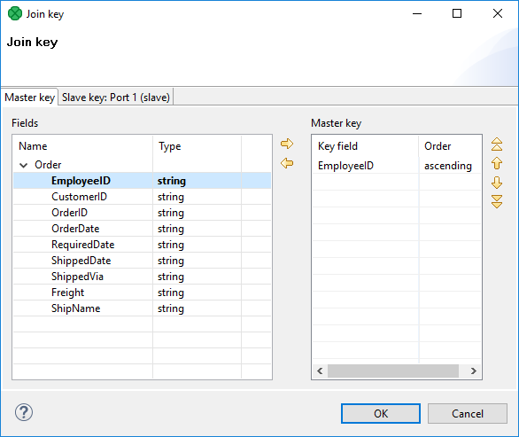
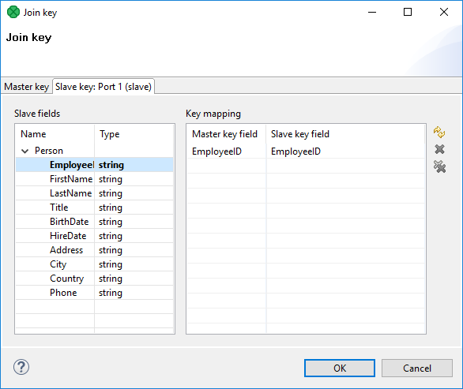

<!-- Development > Component reference > Joiners > ExtMergeJoin -->

### ExtMergeJoin


| [Short description](extmergejoin.md#short-description) |
| --- |
| [Ports](extmergejoin.md#ports) |
| [Metadata](extmergejoin.md#metadata) |
| [ExtMergeJoin attributes](extmergejoin.md#extmergejoin-attributes) |
| [Details](extmergejoin.md#details) |
| [Best practices](extmergejoin.md#best-practices) |
| [Compatibility](extmergejoin.md#compatibility) |
| [See also](extmergejoin.md#see-also) |

#### Short description

General purpose joiner that merges sorted data from two or more data sources on a common key.

| Same input metadata | Sorted inputs | Slave inputs | Outputs | Output for drivers without slave | Output for slaves without driver | Joining based on equality | Auto-propagated metadata |
| --- | --- | --- | --- | --- | --- | --- | --- |
| **⨯** | **✓** | 1-n | 1-2 | **⨯** | **⨯** | **✓** | **✓** |
> [!TIP]
> If you want to join different slaves with the master on a key with various key fields, use **ExtHashJoin** instead. But remember that slave data sources have to be sufficiently small.

#### Ports

**ExtMergeJoin** receives data through two or more input ports, each of which may have a distinct metadata structure.

The joined data is then sent to the single output port.

| Port type | Number | Required | Description | Metadata |
| --- | --- | --- | --- | --- |
| Input | 0 | **✓** | A master input port | Any |
| 1 | **✓** | A slave input port | Any |  |
| 2-n | **⨯** | Optional slave input ports | Any |  |
| Output | 0 | **✓** | An output port for the joined data | Any |
| 1 | **⨯** | An output port for the unjoined data | Input port 0 |  |

#### Metadata

**ExtMergeJoin** propagates metadata from the first input port to the second output port and from the second output port to the first input port.

**ExtMergeJoin** has no metadata templates.

Metadata on the first input and the second output must be the same. (Metadata fields must have the same types, metadata field names may differ.)

#### ExtMergeJoin attributes

| Attribute | Req | Description | Possible values |
| --- | --- | --- | --- |
| Basic |  |  |  |
| Join key | yes | A key according to which incoming data flows are joined. See [Join key](extmergejoin.md#join-key). |  |
| Join type |  | A type of the join. See [Join types](join-types.md). | Inner (default) \| Left outer \| Full outer |
| Transform | [[1]](extmergejoin.md#extmergejoin-attributes-fn01) | A transformation in CTL or Java defined in a graph. |  |
| Transform URL | [[1]](extmergejoin.md#extmergejoin-attributes-fn01) | An external file defining the transformation in CTL or Java. |  |
| Transform class | [[1]](extmergejoin.md#extmergejoin-attributes-fn01) | External transformation class. |  |
| Transform source charset |  | Encoding of an external file defining the transformation.  The default encoding depends on DEFAULT_SOURCE_CODE_CHARSET in defaultProperties. | E.g. UTF-8 |
| Advanced |  |  |  |
| Allow slave duplicates |  | If set to `true`, records with duplicate key values are allowed. If it is `false`, only the **last** record is used for join. | true (default) \| false |
| Deprecated |  |  |  |
| Locale |  | Locale to be used when internationalization is used. |  |
| Case sensitive |  | If set to `true`, upper and lower cases of characters are considered different. By default, they are processed as if they were equal to each other. | false (default) \| true |
| Error actions |  | A definition of the action that should be performed when the specified transformation returns an **Error code**. See [Return values of transformations](transformations.md#return-values-of-transformations). |  |
| Error log |  | An URL of the file to which error messages for specified **Error actions** should be written. If not set, they are written to **Console**. |  |
| Ascending ordering of inputs |  | If set to `true`, incoming records are supposed to be sorted in ascending order. If it is set to `false`, they are descending. | true (default) \| false |
| Left outer |  | If set to `true`, `left outer` join is performed. By default, the attribute is set to `false`. However, this attribute has a lower priority than **Join type**. If you set both, only **Join type** will be applied. | false (default) \| true |
| Full outer |  | If set to `true`, `full outer` join is performed. By default, the attribute is set to `false`. However, this attribute has a lower priority than **Join type**. If you set both, only **Join type** will be applied. | false (default) \| true |

| 1 | One of these must be set. These transformation attributes must be specified. Any of these transformation attributes must use a common CTL template for **Joiners** or implement the `RecordTransform` interface. |
| --- | --- |

For more information, see [CTL scripting specifics](extmergejoin.md#ctl-scripting-specifics) or [Java interfaces](extmergejoin.md#java-interfaces).

For detailed information about transformations, see [Defining transformations](transformations.md#defining-transformations).

#### Details

| [Join key](extmergejoin.md#join-key) |
| --- |
| [Data merging](extmergejoin.md#data-merging) |
| [Transformation](extmergejoin.md#transformation) |

**ExtMergeJoin** is a general purpose joiner used in most common situations. It requires the input be sorted and is very fast as there is no caching (unlike **ExtHashJoin**).

The data attached to the first input port is called the **master** (as usual in other **Joiners**). All remaining connected input ports are called **slaves**. Each master record is matched to all slave records on one or more fields known as the **join key**. For a closer look on how data is merged, see [Data merging](extmergejoin.md#data-merging).

##### Join key

**Join Key** defines a key that is used to join the records. The **Join key** attribute is a sequence of individual key expressions for the master and all of the slaves. The parts corresponding to particular input ports are separated from each other by hash. The order of these expressions must correspond to the order of the input ports starting with the master and continuing with the slaves. Driver (master) key is a sequence of driver (master) field names (each of them should be preceded by a dollar sign) separated by a colon, semicolon or pipe. Each slave key is a sequence of slave field names (each of them should be preceded by a dollar sign) separated by a colon, semicolon or pipe; e.g.:

`$field1(a);$field2(d)#$hello(a);$olleh(d)`

The Join key string in the example above contains sorting characters `(a)` (ascending) and `(d)` (descending). For more details on sorting, see [Sort key](components.md#sort-key).

You must define the **Join key**. Records on the input ports must be sorted according to the corresponding parts of the **Join key** attribute. You can define **Join key** in the **Join key** dialog.

In it, you can see the tab for the driver (the **Master key** tab) and the tabs for all of the slave input ports (the **Slave key** tabs).

###### Master Key Tab


*Figure 434. Join Key Wizard (Master Key Tab)*

In the driver tab, there are two panes. The **Fields** pane on the left and the **Master key** pane on the right.

You need to select the driver expression by selecting the fields in the **Fields** pane on the left and moving them to the **Master key** pane on the right with the help of the **Right arrow** button.

To the selected **Master key** fields, the same number of fields should be mapped within each slave. Thus, the number of key fields is the same for all input ports (both the master and each slave). In addition, the driver (Master) key must be common for all slaves.

###### Slave Key Tab


*Figure 435. Join Key Wizard (Slave Key Tab)*

In each of the slave tab(s), there are two panes: **Fields** and **Key mapping**. The **Fields** pane is on the left. There you can see the list of the slave field names and their data types. The **Key mapping** pane is on the right. In the right pane you can see two columns: **Master key field** and **Slave key field**. The left column contains the selected field names of the driver input port.

If you want to map some driver field to some slave field, select the slave field in the left pane by clicking its item. Then push the left mouse button, drag the field to the **Slave key field** column in the right pane and release the button. The same must be done for each slave. Note that you can also use the **Auto mapping** button or other buttons in each tab.
Example 400. Join Key for ExtMergeJoin

```ctl
$first_name;$last_name#$fname;$lname#$f_name;$l_name
```

Following is the part of **Join key** for the master data source (input port 0):

`$first_name;$last_name`

- Thus, these fields are joined with the two fields from the first slave data source (input port 1):
  `$fname` and `$lname`, respectively.
- And, these fields are also joined with the two fields from the second slave data source (input port 2):
  `$f_name` and `$l_name`, respectively.

##### Data merging

Joining data in **ExtMergeJoin** works the following way. First of all, let us stress again that data on both the master and the slave have to be sorted.

The component takes the first record from the master and compares it to the first one from the slave (with respect to **Join key**). There are three possible comparison results:

- master equals slave - records are joined
- "slave.key < master.key" - the component looks onto the next slave record, i.e. a one-step shift is performed trying to get a matching slave to the current master
- **slave.key** ****master.key** - the component looks onto the next master record, i.e. a regular one-step shift is performed on the master

Some input data contain sequences of same values. Then they are treated as one unit on the slave (a slave record knows the value of the following record), This happens only if **Allow slave duplicates** has been set to `true`. Moreover, the same-values unit gets stored in the memory. On the master, merging goes all the same by comparing one master record after another to the slave.
> [!NOTE]
> In case there is a large number of duplicate values on the slave, they are stored on your disk.

##### Transformation

A transformation in **ExtMergeJoin** is required.

Use one of the **Transform**, **Transform URL** and **Transform class** attributes to specify the transformation.

A transformation in **ExtMergeJoin** lets you define the transformation that sends records to the first output port. The unjoined master records sent to the second output cannot be modified within the **ExtMergeJoin** transformation.

#### CTL scripting specifics

All **Joiners** share the same transformation template which can be found in [CTL templates for Joiners](ctl-templates-for-joiners.md).

For detailed information about **CloverDX** Transformation Language see [CTL2 - CloverDX Transformation Language](part5.md).

#### Java interfaces

If you define your transformation in Java, it must implement the following interface that is common for all **Joiners**: [Java interfaces for Joiners](java-interfaces-for-joiners.md)

See [Public CloverDX API](genericcomponent.md#public-cloverdx-api).

#### Best practices

If the transformation is specified in an external file (with **Transform URL**), we recommend users to explicitly specify **Transform source charset**.

#### Compatibility

| Version | Compatibility Notice |
| --- | --- |
| 4.2.0-M1 | **ExtMergeJoin** now has a second output port. Metadata propagation has been affected as well. |

#### See also

| [Common properties of components](components.md#common-properties-of-components) |
| --- |
| [Specific attribute types](components.md#specific-attribute-types) |
| [Common properties of Joiners](common-of-joiners.md) |
| [Joiners comparison](common-of-joiners.md#joiners-comparison) |
