<!-- Development > Component reference > Writers > XMLWriter -->

### XMLWriter


| [Short description](extxmlwriter.md#short-description) |
| --- |
| [Ports](extxmlwriter.md#ports) |
| [Metadata](extxmlwriter.md#metadata) |
| [XMLWriter attributes](extxmlwriter.md#xmlwriter-attributes) |
| [Details](extxmlwriter.md#details) |
| [Examples](extxmlwriter.md#examples) |
| [Best practices](extxmlwriter.md#best-practices) |
| [Compatibility](extxmlwriter.md#compatibility) |
| [See also](extxmlwriter.md#see-also) |
> [!TIP]
> If you’re interested in learning more about this subject, we offer the [Work with JSON/XML course](https://academy.cloverdx.com/courses/json-xml) in our CloverDX Academy.

#### Short description

**XMLWriter** joins received input records and formats them into a user-defined XML structure. Even complex mapping is possible and thus the component can create arbitrary nested XML structures.

Standard output options are available: files, compressed files, an output port or a dictionary.

| Data output | Input ports | Output ports | Transformation | Transf. required | Java | CTL | Auto-propagated metadata |
| --- | --- | --- | --- | --- | --- | --- | --- |
| XML file | 1-n | 0-1 | **⨯** | **⨯** | **⨯** | **⨯** | **⨯** |

#### Ports

| Port type | Port number | Required | Description | Metadata |
| --- | --- | --- | --- | --- |
| Input | 0-n | At least one | Input records to be joined and mapped into an XML file. | Any (each port can have different metadata). |
| Output | 0 | **⨯** | For port writing, see [Writing to output port](examples-of-file-url-in-writers.md#writing-to-output-port). | One field (`byte`, `cbyte`, `string`). |

#### Metadata

**XMLWriter** does not propagate metadata.

**XMLWriter** has no metadata template.

The **XMLWriter** output port must have one field of `string`, `byte` or `cbyte` type.

**XMLWriter** can write lists and maps. Lists are written as particular items; maps are converted to a string before writing.

#### XMLWriter attributes

| Attribute | Req | Description | Possible values |
| --- | --- | --- | --- |
| Basic |  |  |  |
| File URL | yes | The target file for the output XML. See [Supported file URL formats for Writers](examples-of-file-url-in-writers.md). |  |
| Charset |  | The encoding of an output file generated by XMLWriter.  The default encoding depends on DEFAULT_CHARSET_DECODER in defaultProperties. | UTF-8 (default)\| <other encodings> |
| Mapping | [[1]](extxmlwriter.md#xmlwriter-attributes-fn01) | Defines how input data is mapped onto an output XML. For more information, see [Details](extxmlwriter.md#details). |  |
| Mapping URL | [[1]](extxmlwriter.md#xmlwriter-attributes-fn01) | An external text file containing the mapping definition. For the mapping file format, see [Creating the mapping - mapping ports and fields](extxmlwriter.md#creating-the-mapping-mapping-ports-and-fields) and [Creating the mapping - Source tab](extxmlwriter.md#creating-the-mapping-source-tab). If you want to share a single mapping among multiple graphs, put your mapping to an external file. |  |
| XML Schema |  | The path to an XSD schema. If **XML Schema** is set, the whole mapping can be automatically pre-generated from the schema. To learn how to do it, see [Creating the Mapping - Using Existing XSD Schema](extxmlwriter.md#creating-the-mapping-using-existing-xsd-schema). The schema has to be placed in the `meta` folder. | none (default) \| any valid XSD schema |
| Advanced |  |  |  |
| Create directories |  | If `true`, non existing directories included in the **File URL** path will be automatically created. | false (default) \| true |
| Omit new lines wherever possible |  | By default, each element is written to a separate line. If set to `true`, new lines are omitted when writing data to the output XML structure. Thus, all XML tags are on one line only. | false (default) \| true |
| Omit XML declaration |  | If set to true, XML declaration (<?xml version="1.0"?>) is not inserted to the beginning of the file. Available since **4.4.0-M1**. | false (default) \| true |
| Cache size |  | The size of the database used when caching data from ports to elements (the data is first processed then written). The larger your data is, the larger the cache is needed to maintain fast processing. | auto (default) \| e.g. 300MB, 1GB etc. |
| Cache in Memory | no | Cache data records in memory instead of JDBM’s disk cache (default). Note that while it is possible to set the maximal size of the cache for the disk cache, this setting is ignored in case in-memory-cache is used. As a result, an `OutOfMemoryError` may occur when caching too many data records. | false (default) \| true |
| Sorted input |  | Tells XMLWriter whether the input data is sorted. Setting the attribute to true declares you want to use the sort order defined in **Sort keys**, see below. | false (default) \| true |
| Sort keys |  | Tells XMLWriter how the input data is sorted, thus enabling streaming (see [Creating the mapping - mapping ports and fields](extxmlwriter.md#creating-the-mapping-mapping-ports-and-fields) ). The sort order of fields can be given for each port in a separate tab. Working with **Sort keys** is described in [Sort key](components.md#sort-key). |  |
| Max number of records |  | The maximum number of records written to all output files. See [Selecting output records](selecting-output-records.md). | 0-N |
| Partitioning |  |  |  |
| Records per file |  | The maximum number of records that are written to a single file. See [Partitioning output into different output files](partitioning-output-into-different-output-files.md). | 1-N |
| Partition key |  | A key whose values control the distribution of records among multiple output files. For more information, see [Partitioning output into different output files](partitioning-output-into-different-output-files.md). |  |
| Partition lookup table |  | The ID of a lookup table. The table serves for selecting records which should be written to the output file(s). For more information, see [Partitioning output into different output files](partitioning-output-into-different-output-files.md). |  |
| Partition file tag |  | By default, output files are numbered. If this attribute is set to `Key file tag`, output files are named according to the values of **Partition key** or **Partition output fields**. For more information, see [Partitioning output into different output files](partitioning-output-into-different-output-files.md). | Number file tag (default) \| Key file tag |
| Partition output fields |  | Fields of **Partition lookup table** whose values serve for naming output file(s). For more information, see [Partitioning output into different output files](partitioning-output-into-different-output-files.md). |  |
| Partition unassigned file name |  | The name of a file that the unassigned records should be written into (if there are any). If it is not given, the data records whose key values are not contained in **Partition lookup table** are discarded. For more information, see [Partitioning output into different output files](partitioning-output-into-different-output-files.md). |  |
| Partition key sorted |  | In case partitioning into multiple output files is turned on, all output files are open at once. This could lead to an undesirable memory footprint for many output files (thousands). Moreover, for example unix-based OS usually have a very strict limitation of number of simultaneously open files (1,024) per process.  In case you run into one of these limitations, consider sorting the data by a partition key using one of our standard sorting components and setting this attribute to true. The partitioning algorithm does not need to keep open all output files, just the last one is open at one time. For more information, see [Partitioning output into different output files](partitioning-output-into-different-output-files.md). | false (default) \| true |
| Create empty files |  | If set to `false`, prevents the component from creating an empty output file when there are no input records. | true (default) \| false |

| 1 |  One of these attributes has to be specified. If both are defined, **Mapping URL** has a higher priority. |
| --- | --- |

#### Details

| [Mapping Editor](extxmlwriter.md#mapping-editor) |
| --- |
| [Creating the mapping - designing new XML structure](extxmlwriter.md#creating-the-mapping-designing-new-xml-structure) |
| [Creating the mapping - mapping ports and fields](extxmlwriter.md#creating-the-mapping-mapping-ports-and-fields) |
| [Creating the mapping - using existing XSD schema](extxmlwriter.md#creating-the-mapping-using-existing-xsd-schema) |
| [Creating the mapping - Source tab](extxmlwriter.md#creating-the-mapping-source-tab) |

**XMLWriter** combines streamed and cached data processing depending on the complexity of the XML structure. This allows to produce XML files of arbitrary size in most cases. However, the output can be partitioned into multiple chunks, i.e. large, difficult-to-process XML files can be easily split into multiple smaller chunks.

##### Mapping Editor

**Mapping editor** is a core part of XMLWriter (and JSONWriter). It lets you visually map input data records onto an XML tree structure (see [Mapping Editor](extxmlwriter.md#mapping-editor)). The XML tree structure can be effectively populated by dragging the input ports or fields onto XML elements and attributes.

The editor gives you a direct access to the mapping source where you can virtually edit the output XML file as text. You use special directives to populate the XML with CloverDX data there (see [Source tab in Mapping Editor](extxmlwriter.md#fig-source-tab)).

The XML structure can be provided as an XSD Schema (see the **XML Schema** attribute) or you can define the structure manually from scratch.

You can access the visual mapping editor with the "**…​**" button of the **Mapping** attribute.

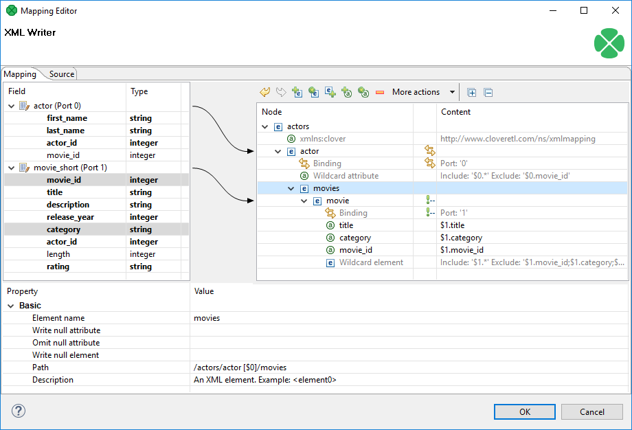
*Figure 395. Mapping Editor*

There are two main tabs in the upper left corner of the editor’s window:

- **Mapping** - serves to design the output XML in a visual environment;
- **Source** - allows you to directly edit the XML mapping source code.

Changes made in the Mapping tab take immediate effect in the Source tab and vice versa. In other words, both editor tabs allow making equal changes.

###### Mapping Editor interface

When you switch to the **Mapping** tab, you will notice there are three basic parts of the window:

1. Left hand part with **Field** and **Type** columns - represents ports of the input data. Ports are represented by their symbolic names in the **Field** column. Besides the symbolic name, ports are numbered starting from $0 for the first port in the list. Underneath each port, there is a list of all its fields and their data types. Please note that neither port names, field names nor their data types can be edited in this section. They all depend merely on the metadata on the XMLWriter’s input edge.
2. Right hand part with **Node** and **Content** columns - the place where you define the structure of output elements, attributes, wildcard elements or wildcard attributes and namespaces. In this section, data can be modified either by double-clicking a cell in the **Node** or the **Content** column. The other option is to click a line and observe its **Property** in the bottom part section of the window.
3. Bottom part with the **Property** and **Value** columns - for each selected Node, this is where its properties are displayed and modified.

#### Creating the mapping - designing new XML structure

| [Namespace](extxmlwriter.md#namespace) |
| --- |
| [Wildcard attribute](extxmlwriter.md#wildcard-attribute) |
| [Attribute](extxmlwriter.md#attribute) |
| [Element](extxmlwriter.md#element) |
| [Wildcard element](extxmlwriter.md#wildcard-element) |
| [Text node](extxmlwriter.md#text-node) |
| [CDATA Section](extxmlwriter.md#cdata-section) |
| [Comment](extxmlwriter.md#comment) |
| [Working with nodes](extxmlwriter.md#working-with-nodes) |

The mapping editor allows you to start from a completely blank mapping - first designing the output XML structure and then mapping your input data to it. The other option is to use your own XSD schema, see [Creating the mapping - using existing XSD schema](extxmlwriter.md#creating-the-mapping-using-existing-xsd-schema).

As you enter a blank mapping editor, you can see input ports on the left hand side and a root element on the right hand side. The point of mapping is first to design the output XML structure on the right hand side (data destination). Second, you need to connect port fields on the left hand side (data source) to those pre-prepared XML nodes (see [Creating the mapping - mapping ports and fields](extxmlwriter.md#creating-the-mapping-mapping-ports-and-fields)).

Let us now look on how to build a tree of nodes the input data will flow to. To add a node, right-click an element, click **Add Child** or **Add Property** and select one of the available options: [Attribute](extxmlwriter.md#attribute), [Namespace](extxmlwriter.md#namespace), [Wildcard attribute](extxmlwriter.md#wildcard-attribute), [Element](extxmlwriter.md#element), [Wildcard element](extxmlwriter.md#wildcard-element), [Text node](extxmlwriter.md#text-node), [CDATA Section](extxmlwriter.md#cdata-section) or [Comment](extxmlwriter.md#comment).

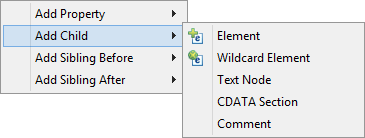
*Figure 396. Adding Child to Root Element*
> [!IMPORTANT]
> For a closer look on adding nodes, manipulating them and using smart drag and drop mouse techniques, see [Working with nodes](extxmlwriter.md#working-with-nodes).

##### Namespace

Adds a **Namespace** as a new `xmlns:prefix` attribute of the selected element. Declaring a Namespace allows you to use your own XML tags. Each Namespace consists of a prefix and an URI. In the case of XMLWriter mapping, the root element has to declare the `clover` namespace, whose URI is `http://www.cloveretl.com/ns/xmlmapping`. This grants you access to all special XML mapping tags. If you switch to the **Source** tab, you will easily recognize those tags as they are distinct by starting with `clover:`, e.g. `clover:inport="2"`. Keep in mind that no XML tag beginning with the `clover:` prefix is actually written into the output XML.

##### Wildcard attribute

Adds a special directive to populate the element with attributes based on **Include** / **Exclude** wildcard patterns instead of mapping these attributes explicitly. This feature is useful when you need to retain metadata independence.

Attribute names are generated from field names of the respective metadata. Syntax: use `$portNumber.field` or `$portName.field` to specify a field, use * in the field name for "any string". Use ; to specify multiple patterns.
Example 381. Using Expressions in ports and fields
`$0.*`- all fields on port 0

`$0.*;$1.*`- all fields on ports 0 and 1 combined

`$0.address*` - all fields beginning with the "address" prefix, e.g. $0.addressState, $0.addressCity, etc.

`$child.*` - all fields on port `child` (the port is denoted by its name instead of an explicit number).

There are two main properties in a Wildcard attribute. At least one of them has to be always set:

- **Include** - defines the inclusion pattern, i.e. which fields should be included in the automatically generated list. This is defined by an expression whose syntax is `$port.field`. A good use of expressions explained above can be made here. **Include** can be left blank provided **Exclude** is set (and vice versa). If **Include** is blank, XMLWriter lets you use all ports that are connected to nodes up above the current element (i.e. all its parents) or to the element itself.
- **Exclude** - lets you specify the fields that you explicitly do not want in the automatically generated list. Expressions can be used here the same way as when working with **Include**.
Example 382. Include and Exclude property examples
1. **Include** = `$0.i*`

**Exclude** = `$0.index`

Include takes all fields from port $0 starting with the 'i' character. Exclude then removes the `index` field of the same port.

2. **Include** = (blank)

**Exclude** = `$1.*;$0.id`

Include is not given so all ports connected to the node or up above are taken into consideration. Exclude then removes all fields of port $1 and the `id` field of port $0. Condition: ports $0 and $1 are connected to the element or its parents.

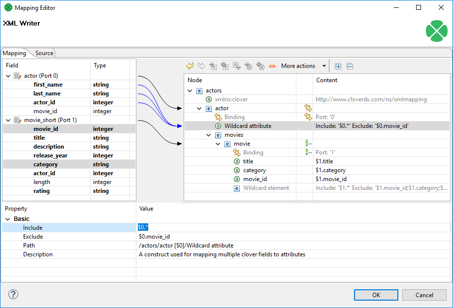
*Figure 397. Wildcard attribute and its properties*

##### Attribute

Adds a single attribute to the selected element. Once done, the Attribute name can be changed either by double-clicking it or editing **Attribute name** at the bottom. The attribute **Value** can either be a fixed string or a field value that you map to it. You can even combine static text and multiple field mappings. See example below.
Example 383. Attribute value examples
`Film` the attribute’s value is set to the literal string "Film".

`$1.category` - the `category` field of port $1 becomes the attribute value

`ID: '{$1.movie_id}'` - produces "ID: '535'", "ID: '536'" for `movie_id` field values 535 and 536 on port $1. Please note the curly brackets can optionally delimit the field identifier.

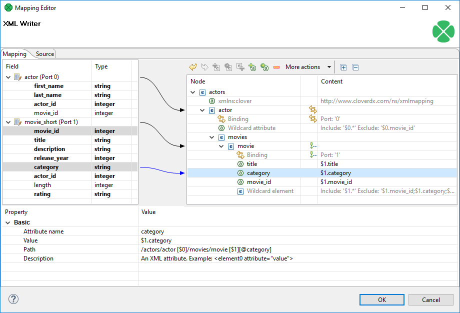
*Figure 398. Attribute and its properties*

**Path** and **Description** are common properties for most nodes. They both provide a better overview for the node. In **Path**, you can observe how deep in the XML tree a node is located.

##### Element

Adds an element as a basic part of the output XML tree.

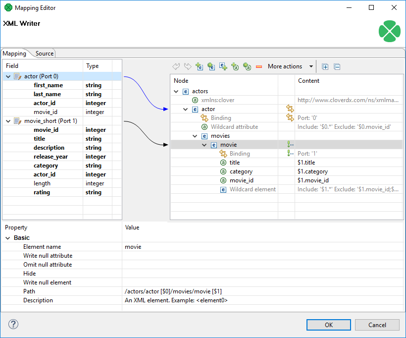
*Figure 399. Element and its properties*

Depending on an element’s location in the tree and ports connected to it, the element can have these properties:

- **Element name** - name of the element as it will appear in the output XML.
- **Value** - element value. You can map a field to an element and it will populate its value. On the other hand, if you map a port to an element, you will create a **Binding** (see [Creating the mapping - mapping ports and fields](extxmlwriter.md#creating-the-mapping-mapping-ports-and-fields)). If **Value** is not present, right-click the element and choose **Add Child - Text node**. The element then gets a new field representing its text value. The newly created Text node cannot be left blank.
- **Write null attribute** - by default, attributes with values mapping to NULL will not be put to the output. However, here you can explicitly list names of attributes that will always appear in the output.
  Example 384. Writing null attribute
  Let us say you have an element <date> and its attribute "time" that maps to input port 0, field `time` (i.e. <date time="$0.time"/>). For records where the `time` field is empty (null), the default output would be:
  ```xml
  <date/>
  ```
  Setting **Write null attribute** to `time` produces:
  ```xml
  <date time="" />
  ```
- **Omit null attribute** - in contrast to **Write null attribute**, this one specifies which of the current element’s attributes will NOT be written if their values are null. Obviously, such behavior is default. The true purpose of **Omit null attribute** lies in wildcard expressions in combination with **Write null attribute**.
Example 385. Omitting Null attribute
You have an element with a **Wildcard attribute**. he element is connected to port 2 and its fields are mapped to the wildcard attribute, i.e. **Include**=$2.*. You know that some of the fields contain no data. You would like to write SOME of the empty ones, e.g. `height` and `width`. To achieve that, click the element and set:

**Write null attribute**=$2.* - forces writing of all attributes although they are null.

**Omit null attribute**=$2.height;$2.width - only these attributes will not be written.

- **Hide** - in elements having a port connected, set **Hide** to `true` to force the following behavior: the selected element is not written to the output XML while all its children are. By default, the property is set to `false`. Hidden elements are displayed with a grayish font in the Mapping editor.
  Example 386. Hide element
  Imagine an example XML:
  ```xml
  <address>
      <city>Atlanta</city>
      <state>Georgia</state>
  </address>
  <address>
      <city>Los Angeles</city>
      <state>California</state>
  </address>
  ```
  Then hiding the `address` element produces:
  ```xml
  <city>Atlanta</city>
  <state>Georgia</state>
  <city>Los Angeles</city>
  <state>California</state>
  ```
- **Write null element** - decides, whether to write an element which has no value (but it may have some attributes).
  `true` - writes null elements
  ```xml
  <emptyElement/>
  ```
  `false` - does not write null element; an element having an attribute with a value assigned is not considered as empty
  ```xml
  <emptyEmement attr="value"/>
  ```
  `false - exclude if inner content is null` - does not write a null element; only content of the element is taken into account. (Even if it has attributes with value assigned is considered as empty).
- **Write raw value** - this property allows to insert pre-prepared XML string into a document
  `false` - default, always escapes the value; for example, for a value `<user id="1">John</user>` and element `elem` the output would be
  ```xml
  <elem>&lt;user id="1"&gt;John&lt;/user&gt;</elem>
  ```
  `true` - the value is inserted unescaped, so the example above would look like
  ```xml
  <elem><user id="1">John</user></elem>
  ```
- **Partition** - by default, partitioning is done according to the first and topmost element that has a port connected to it. If you have more such elements, set **Partition** to `true` in one of them to distinguish which element governs the partitioning.
  Please note that partitioning can be set only once. That is if you set an element’s **Partition** to `true`, you should not set it in either of its subelements (otherwise the graph fails). For a closer look on partitioning, see [Partitioning output into different output files](partitioning-output-into-different-output-files.md).
  Example 387. Partitioning according to any element
  In the mapping snippet below, setting **Partition** to `true` on the <invoice> element produces the following behavior:
  <person> will be repeated in every file
  <invoice> will be divided (partitioned) into several files
  ```xml
  <person clover:inPort="0">
      <firstname> </firstname>
      <surname> </surname>
  </person>
  <invoice clover:inPort="1" clover:partition="true""">
      <customer> </customer>
      <total> </total>
  </invoice>
  ```

##### Wildcard element

Adds a set of elements. The **Include** and **Exclude** properties influence which elements are added and which are not. To learn how to make use of the `$port.field` syntax, see to [Wildcard attribute](extxmlwriter.md#wildcard-attribute). Rules and examples described there apply to **Wildcard element** as well. Moreover, **Wildcard element** comes with two additional properties whose meaning is closely related to the one of **Write null attribute** and **Omit null attribute**:

- **Write null element** - use the `$port.field` syntax to determine which elements are written to the output despite having no content. By default, if an element has no value, it is not written. **Write null element** does not have to be entered on condition that the **Omit null element** is given. Same as in **Include** and **Exclude**, all ports connected to the element or up above are then available. See example below.
- **Omit null element** - use the `$port.field` syntax to skip blank elements. Even though they are not written by default, you might want to use **Omit null element** to skip the blank elements you have previously forced to be written in **Write null element**. Alternatively, using **Omit null element** only is also possible. That means you exclude blank elements coming from all ports connected to the element or above.
  Example 388. Writing and omitting blank elements
  Say you aim to create an XML file like this:
  ```xml
  <person>
      <firstname>William</firstname>
      <middlename>Makepeace</middlename>
      <surname>Thackeray</surname>
  </person>
  ```
  but you do not need to write the element representing the middle name for people without it. Instead, create a **Wildcard element**, connect it to a port containing data about people (e.g. port $0 with a `middle` field), enter the **Include** property and finally set:
  **Write null element** = `$0.*`
  **Omit null element** = `$0.middle`
  As a result, first names and surnames will always be written (even if blank). Middle name elements will not be written if the `middle` field contains no data.
- **Write raw value** - this property allows to insert pre-prepared XML string into a document
  `false` - default, always escapes the value, e.g. for the value `<user id="1">John</user>` and the field name `field1` the output would be
  ```xml
  <field1>&lt;user id="1"&gt;John&lt;/user&gt;</field1>
  ```
  `true` - the value is inserted unescaped, so the example above would look like
  ```xml
  <field1><user id="1">John</user></field1>
  ```

##### Text node

Adds content of the element. It is displayed at the very end of an uncollapsed element, i.e. always behind its potential Binding, Wildcard attributes or Attributes. Its value can either be a fixed string, a port’s field or their combination.

##### CDATA section

Adds CDATA section.

**CDATA Section** may contain data that is not allowed as value of the ordinary element or attribute. **CDATA Section** can contain for example a whole XML file. **CDATA Sections** can not be nested: **CDATA Section** can not be included into another **CDATA Section**.

##### Comment

Adds a comment. This way you can comment on every node in the XML tree to make your mapping clear and easy-to-read. Every comment you add is displayed in the Mapping editor only. Additionally, you can have it written to the output XML file by setting the comment’s **Write to the output** attribute to true. Examine the **Source** tab to see your comment there, for instance:

```xml
<!-- clover:write This is a comment in the Source tab.
It will be written to the output XML,
because its 'Write to output' value is set to true.
There is no need to worry about the "clover:write" directive
at the beginning as no attribute/element starting with
the "clover" prefix is put to the output.
-->
```

##### Working with nodes

Having added the first element, you will notice that every element, except for the root, provides other options than just **Add Child** (and **Add Property**). Right-click an element to additionally choose from **Add Sibling Before** or **Add Sibling After**. Using these, you can have siblings added either before or after the currently selected element.

Besides the right-click context menu, you can use toolbar icons located above the XML tree view.

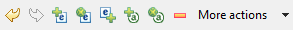
*Figure 400. Mapping Editor toolbar*

The toolbar icons are active depending on the selected node in the tree. Actions you can do comprise:

- **Undo** and **Redo** the last action performed.
- **Add Child Element** under the selected element.
- **Add (child) Wildcard Element** under the selected element.
- **Add Sibling Element After** the selected element.
- **Add Child Attribute** to the selected element.
- **Add Wildcard Attribute** to the selected element.
- **Remove** the selected node.
- **More actions** - besides other actions described above, you can especially **Add Sibling Before** or **Add Sibling After**.

Use the following tips when building the XML tree from scratch (see [Creating the mapping - designing new XML structure](extxmlwriter.md#creating-the-mapping-designing-new-xml-structure) ):

- drag a port and drop it onto an element - you will create a **Binding**, see [Creating the mapping - mapping ports and fields](extxmlwriter.md#creating-the-mapping-mapping-ports-and-fields);
- drag a field and drop it onto an element - you will add a child element of the same name as the field;
- drag an available field (or even more fields) onto an element - you will create a subelement whose name is the field’s name. Simultaneously, the element’s content is set to `$portNumber.fieldName`;
- drag one or more available ports and drop it onto an element with a **Binding** - you will create a **Wildcard element** whose **Include** will be set to `$portNumber.*`;
- combination of the two above - drag a port and a field (even from another port) onto an element with a **Binding** - the port will be turned to **Wildcard element** (**Include** = `$portNumber.*`), while the field becomes a subelement whose content is `$portNumber.fieldName`;
- drag an available port/field and drop it onto a Wildcard element/attribute - the port or field will be added to the **Include** directive of the Wildcard element/attribute. If it is a port, it will be added as $0.* (example for port 0). If it is a field, it will be added as $0.priceTotal (example for port 0, field priceTotal);
- drag a port/field and drop it onto a property such as **Include** or **Exclude** (or any other excluding **Input** in **Binding**). That can be done either in the **Content** or **Property** panes - as a result, the property receives the value of the port/field. You can select and drag multiple fields, as well.
  Moreover, if you hold down **Ctrl** while dragging, the port/field value will be added at the end of the property (not replacing it). For example, if the **Include** property currently contains `$0.*`, dragging `field1` of `port $1` and dropping it onto **Include** while holding **Ctrl** will produce this content: `$0.*;$1.field1`.

Every node you add can later be moved in the tree by a simple drag and drop using the left mouse button. That way you can re-arrange your XML tree any way you want. Actions you can do comprise:

- drag an (wildcard) element and drop it on another element - the (wildcard) element becomes a subelement
- drag an (wildcard) attribute and drop it on an element - the element now has the (wildcard) attribute
- drag a text node and drop it on an element - the element’s value is now the text node
- drag a namespace and drop it on an element - the element now has the namespace

Removing nodes (such as elements or attributes) in the Mapping editor is also carried out by pressing Delete or right-clicking the node and choosing **Remove**. To select more nodes at once, use Ctrl+click or Shift+click.

Any time during your work with the mapping editor, press Ctrl+Z to Undo the last action performed or Ctrl+Y to Redo it.

#### Creating the mapping - mapping ports and fields

In [Creating the mapping - designing new XML structure](extxmlwriter.md#creating-the-mapping-designing-new-xml-structure), you have learned how to design the output XML structure your data will flow to. Step two in working with the Mapping editor is connecting the data source to your elements and attributes. The data source is represented by ports and fields on the left hand side of the Mapping editor window. Remember the **Field** and **Type** columns cannot be modified as they are dependent on the metadata of the XMLWriter’s input ports.

To connect a field to an XML node, click a field in the **Field** column, drag it to the right hand part of the window and drop it on an XML node. The result of that action differs according to the node type:

- element - the field will supply data for the element value;
- attribute - the field will supply data for the attribute value;
- text node - the field will supply data for the text node;
- advanced drag and drop mouse techniques will be discussed below.

A newly created connection is displayed as an arrow pointing from a port/field to a node.

To map a port, click a port in the left hand side of the Mapping editor and drag it to the right hand part of the window. Unlike working with fields, a port can only be dropped on an element. Please note that dragging a port on an element DOES NOT map its data but rather instructs the element to repeat itself with each incoming record in that port. As a consequence, a new **Binding** pseudo-element is created, see picture below.
> [!NOTE]
> Binding an input port to the root element has some limitations. The root can only be bound in this way:
>
> - You have to make sure there will only be one record coming to the input port. Then there is no need to specify partitioning (a warning message will be displayed, though).
> - If more than one record is coming to the input port, partitioning has to be specified. Otherwise XMLWriter will generate an invalid XML file (with multiple root elements).

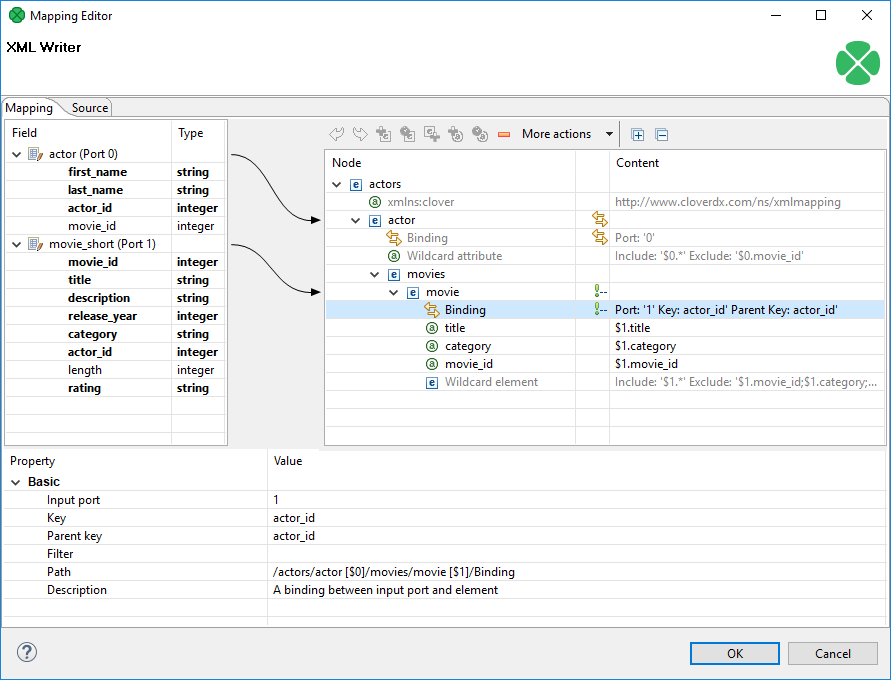
*Figure 401. Binding of port and element*

**Binding** specifies mapping of an input port to an element. This binding drives the element to repeat itself with every incoming record.

Mouse over **Binding** to have a tooltip displayed. The tooltip informs you whether the port data is being cached or streamed (affecting overall performance) and from which port. Moreover, in the case of caching, you learn how your data would have to be sorted to enable streaming.

Every **Binding** comes with a set of properties:

- **Input port** - the number of the port the data flows flows from. Alternatively, you can check which port a node is connected to by looking at the arrow next to it.
- **Key** and **Parent key** - the pair of keys determines how the incoming data are joined. In **Key**, enter names of the current element’s available fields. In **Parent key**, enter names of fields available to the element’s direct parent. Consequently, the data is joined when the incoming key values equal.
  Keep in mind that if you specify one of the pair of keys, you have to enter the other one too. To learn which fields are at disposal, click the "**…​**" button located on the right hand side of the key value area. The **Edit key** window will open, enabling you to neatly choose parts of the key by adding them to the **Key parts** list. Note that there must be exactly as many keys as parentKeys, otherwise errors occur.
  If fields of **key** and **parentKey** have numerical values, they are compared regardless of their data type. Thus e.g. 1.00 (double) is considered equal to 1 (integer) and these two fields would be joined.
  > [!NOTE]
  > Keys are not mandatory properties. If you do not set them, the element will be repeated for every record incoming from the port it is bound to. Use keys to actually select only some of those records.
- **Filter** - a CTL expression selecting which records are written to the output and which not. See [Details](extfilter.md#details) for reference.

To remove **Binding**, click it and press Delete (alternatively, right-click and select **Remove** or find this option in the toolbar).

Finally, **Binding** can specify JOIN between an input port and its parent node in the XML structure (meaning the closest parent node that is bound to an input port). Note that you can join the input with itself, i.e. the element and its parent being driven by the same port. That, however, implies caching and thus slower operation. See the following example:
Example 389. Binding that serves as JOIN
Let us have two input ports:

0 - customers (id, name, address)

1 - orders (order_id, customer_id, product, total)

We need some sort of this output:

```xml
<customer id="1">
        <name>John Smith</name>
        <address>35 Bowens Rd, Edenton, NC (North Carolina)</address>
        <order>
                <product>Towel</product>
                <total>3.99</total>
        </order>
        <order>
                <product>Pillow</product>
                <total>7.99</total>
        </order>
</customer>

<customer id="2">
        <name>Peter Jones</name>
        <address>332 Brixton Rd, Louisville, KY (Kentucky)</address>
        <order>
                <product>Rug</product>
                <total>10.99</total>
        </order>
</customer>
```

You need to join "orders" with "customer" on (orders.customer_id = customers.id). Port 0 (customers) is bound to the <customer> element, port 1 (orders) is bound to <order> element. Now, this can be set up in the **Binding** pseudoattribute of the nested "order" element. Simply, set the **Key** to "customer_id" and **Parent key** to "id".

##### Multivalue Fields

As of **CloverETL 3.3**, XMLWriter supports multivalue fields in metadata. That includes mapping lists and maps to the output XML. For more information, see [Multivalue fields](multivalue-fields.md) and [Data types in CTL2](language-reference-ctl2.md#data-types-in-ctl2).

The only thing to mind in **XMLWriter** is how lists vs. maps look in the output file. A map is written to a single tag (in between curly { } brackets) while a list is separated to *n* tags where *n* is the list’s element count. Example:

```xml
<canadianMap>{ot=Ontario, bc=British_Columbia, at=Alberta, nt=Northern_Territory}</canadianMap> <!--  map with four key-value pairs -->

<valueList>-65.25</valueList> <!-- a three-element list -->
<valueList>71.49</valueList>
<valueList>-35.02</valueList>
```

#### Creating the mapping - using existing XSD schema

There is no need to create an XML structure from scratch if you already hold an XSD schema. In that case, you can use the schema to pre-generate the XML tree. The only thing that may remain is mapping ports to XML nodes, see [Creating the mapping - mapping ports and fields](extxmlwriter.md#creating-the-mapping-mapping-ports-and-fields).

First of all, start by stating where your schema is. A full path to the XSD has to be set in the **XML Schema** attribute. Then open the Mapping editor by clicking **Mapping**. In the editor, choose a root element from the XSD and finally click **Change root element** (see picture below). The XML tree is then automatically generated. Remember that you still have to use the `clover` namespace for the process to work properly.

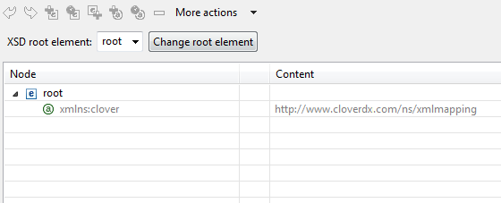
*Figure 402. Generating XML from XSD root element*

#### Creating the mapping - Source tab

In the **Source** tab of the Mapping editor, you can directly edit the XML structure and data mapping. The concept is very simple:

1. write down or paste the desired XML data;
2. put data field placeholders (e.g. `$0.field`) into the source wherever you want to populate an element or attribute with input data;
3. create a port binding and (join) relations - **Input port**, **Key**, **Parent key**.

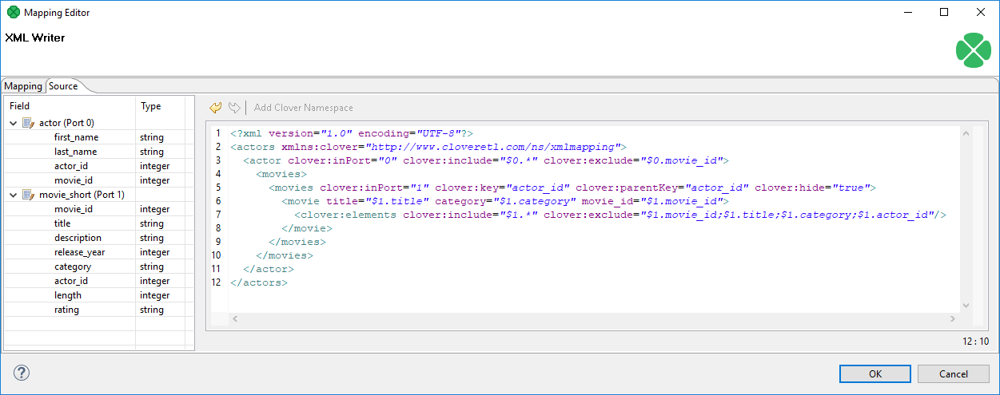
*Figure 403. Source tab in Mapping editor*

Here is the same code as in the figure above for your own experiments:

```xml
<?xml version="1.0" encoding="UTF-8"?>
<actors xmlns:clover="http://www.cloveretl.com/ns/xmlmapping">
  <actor clover:inPort="0" clover:include="$0.*" clover:exclude="$0.movie_id">
    <movies>
      <movies clover:inPort="1" clover:key="actor_id" clover:parentKey="actor_id"
                clover:hide="true">
        <movie title="$1.title" category="$1.category" movie_id="$1.movie_id">
          <clover:elements clover:include="$1.*"
                clover:exclude="$1.movie_id;$1.title;$1.category;$1.actor_id"/>
        </movie>
      </movies>
    </movies>
  </actor>
</actors>
```

Changes made in either of the tabs take immediate effect in the other one. For instance, if you connect port $1 to an element called `invoice` in **Mapping** and then switch to **Source**, you will see the element has changed to: `<invoice clover:inPort="1">`.

The **Source** tab supports drag and drop for both ports and fields located on the left hand side of the tab. Dragging a port, e.g. $0 anywhere into the source code inserts the following: `$0.*`, meaning all its fields are used. Dragging a field works the same way, e.g. if you drag the `id` field of port $2, you will get this code: `$2.id`.

There are some useful keyboard shortcuts in the **Source** tab. Ctrl+F brings the **Find/Replace** dialog. Ctrl+L jumps quickly to a line you type in. Furthermore, by pressing Ctrl+Space, you can open a highly interactive Content Assist. The range of available options depends on the cursor position in the XML:

1. Inside an element tag - the Content Assist lets you automatically insert the code for **Write attributes when null**, **Omit attributes when null**, **Select input data**, **Exclude attributes**, **Filter input data**, **Hide this element**, **Include attributes**, **Define key**, **Omit when null**, **Define parent key** or **Partition**. On the picture below, notice you have to insert an extra space after the element name, so that the Content Assist could work.
   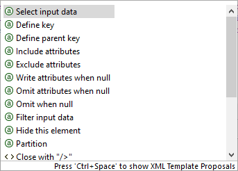
   *Figure 404. Content Assist inside element*
   The inserted code corresponds to nodes and their properties as described in [Creating the mapping - designing new XML structure](extxmlwriter.md#creating-the-mapping-designing-new-xml-structure).
2. Inside the "" quotes - Content Assist lets you smoothly choose values of node properties (e.g. particular ports and fields in **Include** and **Exclude**) and even add Delimiters. Use Delimiters to separate multiple expressions from each other.
3. In a free space in between two elements - apart from inserting a port or field of your choice, you can add **Wildcard element** (as described in [Creating the mapping - designing new XML structure](extxmlwriter.md#creating-the-mapping-designing-new-xml-structure)), **Insert template** or **Declare template** - see below.
Example 390. Insert Wildcard attributes in Source tab
First, create an element. Next, click inside the element tag, press Space, then press Ctrl+Space and choose **Include attributes**. The following code is inserted: `clover:include=""`. Afterwards, you have to determine which port and fields the attributes will be received from (i.e. identical activity to setting the **Include** property in the Mapping tab). Instead of manually typing e.g. `$1.id`, use the Content Assist again. Click inside the "" brackets, press Ctrl+Space and you will get a list of all available ports. Choose one and press Ctrl+Space again.

Now that you are done with `include`, press Space and then Ctrl+Space again. You will see the Content Assist adapts to what you are doing and where you are. A new option has turned up: **Exclude attributes**. Choose it to insert `clover:exclude=""`. Specifying its value corresponds to entering the **Exclude** property in Mapping.

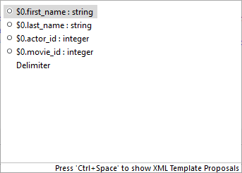
*Figure 405. Content Assist for ports and fields*

One last thing about the **Source** tab. Sometimes, you might need to work with the `$port.field` syntax a little more. Imagine you have port $0 and its `price` field. Your aim is to send those prices to an element called e.g. `subsidy`. First, you establish a connection between the port and the element. Then you realize you would like to add the US dollar currency right after the `price` figure. To do so, you just edit the source code like this (same changes can be done in Mapping):

```xml
<subsidy>$0.price USD</subsidy>
```

However, if you needed to have the "USD" string attached to the price for a reason, use the { } brackets to separate the `$port.field` syntax from additional strings:

```xml
<subsidy>{$0.price}USD</subsidy>
```

If you need to suppress the dollar placeholder, type it twice. For instance, if you want to print "$0.field" as a string to the output, which would normally map field data coming from port 0, type "$$0.field". That way you will get the output:

```xml
<element attribute="$0.field">
```

##### Templates and recursion

A template is a piece of code that is used to insert another (larger) block of code. Templates can be inserted into other templates, thus creating recursive templates.

As mentioned above, the **Source** tab’s Content Assist allows you to smoothly declare and use your own templates. The option is available when pressing Ctrl+Space in a free space in between two elements. Afterwards, choose either **Declare template**or **Insert template**.

**Declare template** inserts the template header. First, you need to enter the template name. Then fill it with your own code. Example template could look like this:

```xml
<clover:template clover:name="templCustomer">
<customer>
    <name>$0.name</name>
    <city>$0.city</city>
    <state>$0.state</state>
</customer>
</clover:template>
```

To insert this template under one of the elements, press Ctrl+Space and select **Insert template**. Finally, fill in your template name:

```xml
<clover:insertTemplate clover:name="templCustomer"/>
```

In recursive templates, the `insertTemplate` tag appears inside the template after its potential data. When creating recursive structures, it is crucial to define keys and parent keys. The recursion then continues as long as there are matching `key` and `parentKey` pairs. In other words, the recursion depth is dependent on your input data. Using `filter` can help to get rid of the records you do not need to be written.

#### Examples

##### Writing non-standard XML

This example shows writing an XML file that needs modification, e.g. to add a DTD.

Write records to an XML file. Insert a DTD into the file on line 2.

###### Solution

Write records with XMLWriter to an output port. Use streaming mode.

Read records with [FlatFileReader](flatfilereader.md): one line per record. The metadata between **XMLWriter** and [FlatFileWriter](flatfilewriter.md) should have no delimiters and should use EOF as delimiter.

Partition the records into the streams: first record to the first edge, another records to the second edge.

Use [DataGenerator](datagenerator.md) to create a record to be inserted.

Use [Concatenate](concatenate.md) to bundle together the records in correct order.

Write records to a file with **FlatfileWriter**.

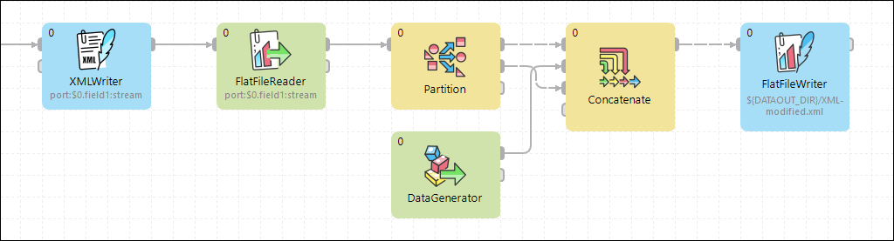
*Figure 406. Writing non-standard xml*

#### Best practices

We recommend users to explicitly specify **Charset**.

#### Compatibility

| Version | Compatibility Notice |
| --- | --- |
| 4.4.0-M1 | You can now use the **Omit XML declaration** attribute to insert or omit the XML declaration. |

#### See also

| [XMLExtract](xmlextract.md) |
| --- |
| [XMLReader](xmlreader.md) |
| [XMLXPathReader](xmlxpathreader.md) |
| [Common properties of Components](components.md#common-properties-of-components) |
| [Specific attribute types](components.md#specific-attribute-types) |
| [Common properties of Writers](common-of-writers.md) |
| [Writers comparison](common-of-writers.md#writers-comparison) |
