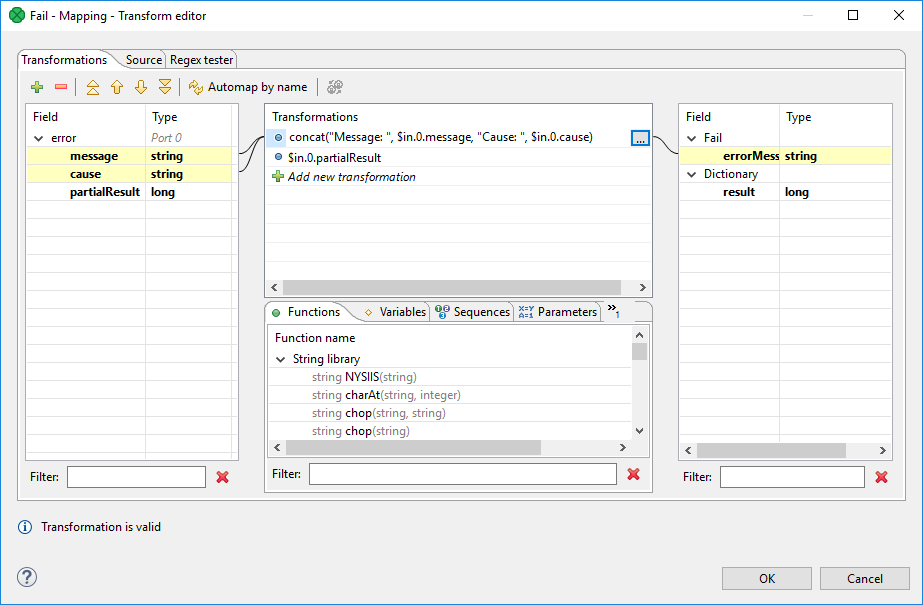

<!-- Development > Component reference > Job Control > Fail -->

### Fail

| [Short description](fail.md#short-description) |
| --- |
| [Ports](fail.md#ports) |
| [Metadata](fail.md#metadata) |
| [Fail attributes](fail.md#fail-attributes) |
| [Details](fail.md#details) |
| [See also](fail.md#see-also) |

The component is located in **Palette** ****Job Control**.

#### Short description

The **Fail** component aborts the parent job (jobflow or graph) with a user-specified error message.

| Same input metadata | Sorted inputs | Inputs | Outputs | Each to all outputs | Java | CTL | Auto-propagated metadata |
| --- | --- | --- | --- | --- | --- | --- | --- |
| **⨯** | **⨯** | 0-1 | 0 | **⨯** | **⨯** | **✓** | **⨯** |

#### Ports

| Port type | Number | Required | Description | Metadata |
| --- | --- | --- | --- | --- |
| Input | 0 | **⨯** | Any input token from this port interrupts the jobflow (or graph). | Any |

#### Metadata

The input field **errorMessage** is automatically used for a user-specific error message, which interrupts the job, if it is not otherwise specified in mapping.

#### Fail attributes

| Attribute | Req | Description | Possible values |
| --- | --- | --- | --- |
| Basic |  |  |  |
| Error message | no | In case the job is interrupted, an exception is thrown with this error message. The error message can be dynamically changed in mapping. | "user abort" (default) \| text |
| Mapping | no | Mapping is used for dynamic assembling of an error message, which is thrown in case the job is going to be interrupted. Moreover, dictionary content of interrupted job can be changed as well. See [Details](fail.md#details). |  |

#### Details

**Fail** interrupts a parent job (jobflow or graph). The first incoming token to the component throws an exception (org.jetel.exception.UserAbortException) with a user defined error message. The job finishes immediately with a final status ERROR. Moreover, the dictionary content can be changed before the job is interrupted. In general, the component allows to interrupt the job and return some results through the dictionary, at the same time.

The **Fail** component works even without an input port attached. In this case, the job is interrupted immediately when the phase with the **Fail** component is started up.

##### Mapping details

Mapping in the **Fail** component is generally used for two purposes:

- Assembling of an error message from an incoming record.
- Populating dictionary content from an incoming record.
> [!NOTE]
> Only output dictionary entries can be changed.

*Figure 443. Example of mapping for the Fail component*

The error message compiled by the mapping has the highest priority. If the mapping does not set **errorMessage**, the error message from the component attribute is used instead. If even this attribute is not set, predefined text user abort is used instead.

#### See also

| [Common properties of components](components.md#common-properties-of-components) |
| --- |
| [Specific attribute types](components.md#specific-attribute-types) |
| [Common properties of Job Control](common-of-job-control.md) |
| [Job Control comparison](common-of-job-control.md#job-control-comparison) |
