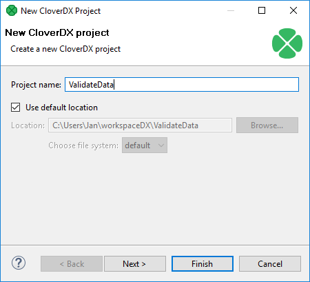
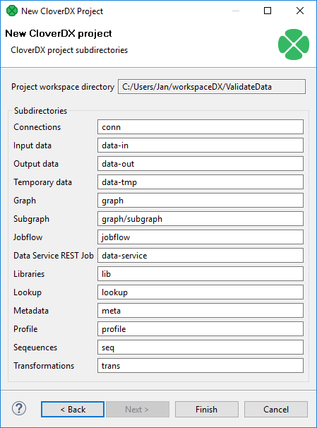
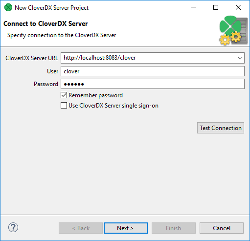
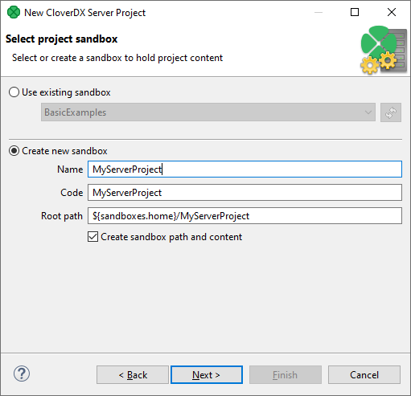
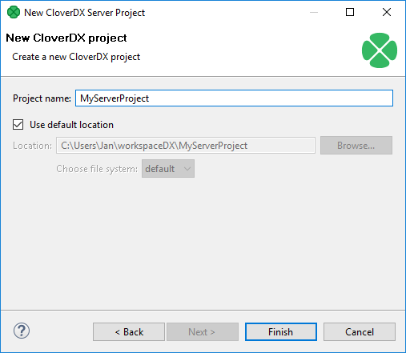
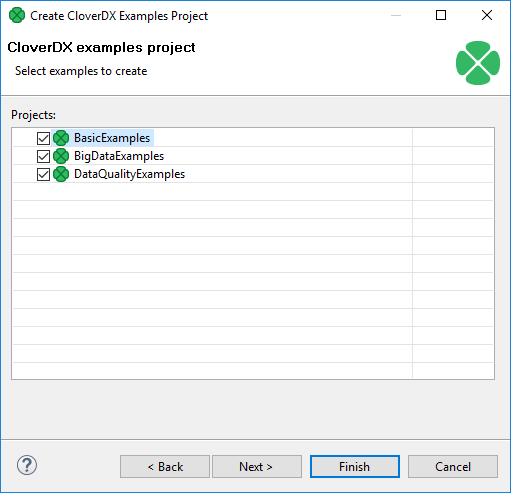

<!-- Development > Projects > Creating CloverDX projects -->

## 11. Creating CloverDX projects

This chapter describes how to create **CloverDX** projects.

**CloverDX Designer** allows you to create three types of **CloverDX** projects:

- [CloverDX project](first-cloverdx-project.md#cloverdx-project)
  It is a local **CloverDX** project. The whole project structure is only on your local computer.
- [CloverDX Server project](first-cloverdx-project.md#cloverdx-server-project)
  It is a **CloverDX** project corresponding to a **CloverDX Server** sandbox. The whole project structure is on **CloverDX Server**. By default, the files are on the Server and on your local computer.
  In the project wizard, you can choose not to have files saved locally.
- [CloverDX Examples project](first-cloverdx-project.md#cloverdx-examples-project)
  It is a pre-prepared local **CloverDX** project containing examples. These examples demonstrate the functionality of **CloverDX**.

### CloverDX project

From the **CloverDX** perspective, select **File** ****New** ****CloverDX project**.

The following wizard will open and you will be asked to name your project:

*Figure 121. Naming a CloverDX project*

In the next step, you can set up names of particular project subdirectories. We suggest to use the default values.

*Figure 122. CloverDX project subdirectories*

Click **Finish** to create the selected local **CloverDX** project with the specified name.

### CloverDX Server project

From the **CloverDX** perspective, select **File** ****New** ****CloverDX Server project**.

**CloverDX Server project** wizard will open and guide you through the creation of the Server project.

#### Connection to CloverDX Server

The first step is to create a working connection to the **CloverDX Server**. Fill in **CloverDX Server URL**, **User** and **Password**.

*Figure 123. CloverDX Server project Wizard - Server Connection*
> [!NOTE]
> Single Sign-on login
> Since 5.2.0, **CloverDX** supports single sign-on (SSO) by the Security Assertion Markup Language (SAML) 2.0 protocol. To use SSO, check the **Use CloverDX Server single sign-on** option. Once selected, a new option appears which allows you to log in as different user if checked; if unchecked, **CloverDX Designer** attempts to log in using credentials of the last signed-in user.
>
> Note that if you use the SSO login option, you will be redirected to the identity provider’s sign-in page.
>
> For more information, see the [SAML authentication](../admin/saml-authentication.md) section.

You can verify the validity of the connection using the **Test Connection** button.

Once a connection to the **CloverDX Server** is established, continue with the next step.

#### Selecting or creating a sandbox

The second step of the wizard is to select an existing or create a new **CloverDX Server** sandbox. The sandbox will correspond to the project.

*Figure 124. CloverDX Server project Wizard - Sandbox selection*

Use an existing sandbox or create a new one. In case you decide to create a new sandbox, the form is similar to the one present in the **CloverDX Server** web interface, however only a **Shared** sandbox can be used in Designer. For further description of sandbox properties, see [Sandboxes](../operations/sandboxes.md).

One sandbox can be connected to a single workspace project only.

Press the **Next** button to create a new sandbox.

#### Specify project name

The last step is to specify the name of the new **CloverDX Server** project. Keep the other values (**Location** and **File system**) unchanged.

*Figure 125. Naming a new CloverDX server project*

Click the **Finish** button to create a **CloverDX Server** project.

### CloverDX Examples project

If you want to create some of the prepared example projects, select **File** ****New** ****Example…​**, choose **CloverDX Examples project** and click **Next**.

You will be presented with the following wizard:

*Figure 126. CloverDX Examples project wizard*

You can select any of the **CloverDX** example projects by checking its checkbox.

After clicking **Finish**, the selected local **CloverDX Examples** projects will be created.
> [!TIP]
> If you already have these projects installed, you can click **Next** and rename them before installing. After that, you can click **Finish**.
