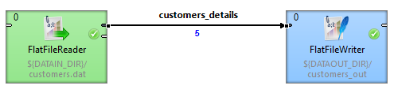
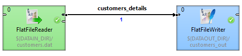

<!-- Development > Component reference > Readers > FlatFileReader -->

### FlatFileReader

| [Short description](flatfilereader.md#short-description) |
| --- |
| [Ports](flatfilereader.md#ports) |
| [Metadata](flatfilereader.md#metadata) |
| [FlatFileReader attributes](flatfilereader.md#flatfilereader-attributes) |
| [Details](flatfilereader.md#details) |
| [Examples](flatfilereader.md#examples) |
| [Best practices](flatfilereader.md#best-practices) |
| [Compatibility](flatfilereader.md#compatibility) |
| [Troubleshooting](flatfilereader.md#troubleshooting) |
| [See also](flatfilereader.md#see-also) |

#### Short description

**FlatFileReader** reads data from flat files, such as CSV (comma-separated values) file and delimited, fixed-length, or mixed text files.

The component can read a single file as well as a collection of files placed on a local disk or remotely. Remote files are accessible via HTTP, HTTPS, FTP, or SFTP protocols. Using this component, ZIP and TAR archives of flat files can be read. Also reading data from an input port, or dictionary is supported.

**FlatFileReader** has an alias - [UniversalDataReader](datareader.md).

| Data source | Input ports | Output ports | Each to all outputs | Different to different outputs | Transformation | Transf. req. | Java | CTL | Auto-propagated metadata |
| --- | --- | --- | --- | --- | --- | --- | --- | --- | --- |
| Flat file | 0-1 | 1-2 | **⨯** | **✓** | **⨯** | **⨯** | **⨯** | **⨯** | **✓** |

#### Ports

| Port type | Number | Required | Description | Metadata |
| --- | --- | --- | --- | --- |
| Input | 0 | **⨯** | for [Input port reading](input-port-reading.md) | include specific `byte`/ `cbyte`/ `string` field |
| Output | 0 | **✓** | for correct data records | any |
| 1 | **⨯** | for incorrect data records | specific structure, see table below |  |

#### Metadata

**FlatFileReader** does not propagate metadata.

This component has [metadata templates](components.md#metadata-templates) available.

The optional logging port for incorrect records has to define the following metadata structure - the record contains exactly five fields (named arbitrarily) of given types in the following order:

| Field number | Field name | Data type | Description |
| --- | --- | --- | --- |
| 0 | recordNo | long | The position of an erroneous record in the dataset (record numbering starts at 1). |
| 1 | fieldNo | integer | The position of an erroneous field in the record (1 stands for the first field, i.e. that of index 0). |
| 2 | originalData | string \| byte \| cbyte | An erroneous record in raw form (including all field and record delimiters). |
| 3 | errorMessage | string \| byte \| cbyte | An error message - detailed information about this error. |
| 4 | fileURL | string | A source file in which the error occurred. |

Metadata on output port 0 can use [Autofilling functions](metadata-records-and-fields.md#autofilling-functions).

The `source_timestamp` and `source_size` functions work only when reading from a file directly (if the file is an archive or it is stored at a remote location, timestamp will be empty and size will be 0).

#### FlatFileReader attributes

| Attribute | Req | Description | Possible values |
| --- | --- | --- | --- |
| Basic |  |  |  |
| File URL | **✓** | A path to a data source (flat file, input port, dictionary) to be read, see [Supported file URL formats for Readers](examples-of-file-url-in-readers.md). |  |
| Charset |  | Character encoding of input records (character encoding does not apply to byte fields, if the record type is `fixed`).  The default encoding depends on DEFAULT_CHARSET_DECODER in defaultProperties. | UTF-8 \| <other encodings> |
| Data policy |  | Specifies handling of misformatted or incorrect data, see [Data policy](data-policy.md). | strict (default) \| controlled \| lenient |
| Trim strings |  | Specifies whether a leading and trailing whitespace should be removed from strings before setting them to data fields, see [Trimming data](flatfilereader.md#trimming-data) below. | default \| true \| false |
| Quoted strings |  | Fields containing a special character (comma, newline or double quote) have to be enclosed in quotes. Only a single/double quote is accepted as the quote character. If `true`, special characters are removed when read by the component (they are not treated as delimiters).  **Example:** To read input data `"25"\|"John"`, switch **Quoted strings** to `true` and set **Quote character** to ". This will produce two fields: `25\|John`.  By default, the value of this attribute is inherited from metadata on output port 0. See also [Record details](metadata-editor.md#record-details). | false \| true |
| Quote character |  | Specifies which kind of quotes will be permitted in **Quoted strings**. By default, the value of this attribute is inherited from metadata on output port 0. See also [Record details](metadata-editor.md#record-details). | both \| " \| ' |
| Advanced |  |  |  |
| Skip leading blanks |  | Specifies whether to skip a leading whitespace (e.g. blanks) before setting input strings to data fields. If not explicitly set (i.e. having the default value), the value of the **Trim strings** attribute is used. See [Trimming data](flatfilereader.md#trimming-data). | default \| true \| false |
| Skip trailing blanks |  | Specifies whether to skip a trailing whitespace (e.g. blanks) before setting input strings to data fields. If not explicitly set (i.e. having the default value), the value of the **Trim strings** attribute is used. See [Trimming data](flatfilereader.md#trimming-data). | default \| true \| false |
| Number of skipped records |  | The number of records/rows to be skipped from the source file(s). See [Selecting input records](selecting-input-records.md). | 0 (default) - N |
| Max number of records |  | The number of records to be read from the source file(s) in turn; all records are read by default. See [Selecting input records](selecting-input-records.md). | 1 - N |
| Number of skipped records per source |  | The number of records/rows to be skipped from each source file. By default, the value of the **Skip source rows** record property in output port 0 metadata is used. In case the value in metadata differs from the value of this attribute, the **Number of skipped records per source** value is applied, having a higher priority. See [Selecting input records](selecting-input-records.md). | 0 (default)- N |
| Max number of records per source |  | The number of records/rows to be read from each source file; all records from each file are read by default. See [Selecting input records](selecting-input-records.md). | 1 - N |
| Missing column handling |  | Specifies handling of records with fewer fields (columns) than required by metadata. If set to `Treat as error`, record is considered to be invalid, and the **Data policy** setting is applied. If set to `Fill with null`, record is accepted, and missing fields are set to `null`, or to the default value if specified. | Treat as error (default) \| Fill with null |
| Max error count |  | The maximum number of tolerated error records in input file(s); applicable only if `Controlled`**Data policy** is set. | 0 (default) - N |
| Treat multiple delimiters as one |  | If a field is delimited by a multiplied delimiter character, it will be interpreted as a single delimiter when setting to `true`. | false (default) \| true |
| Incremental file | [[1]](flatfilereader.md#flatfilereader-increment) | The name of a file storing the incremental key, including path. See [Incremental reading](incremental-reading.md). |  |
| Incremental key | [[1]](flatfilereader.md#flatfilereader-increment) | The variable storing a position of the last read record. See [Incremental reading](incremental-reading.md). |  |
| Verbose |  | By default, a less comprehensive error notification is provided and the performance is slightly higher; however, if switched to `true`, more detailed information with less performance is provided. | false (default) \| true |
| Parser |  | By default, the most appropriate parser is applied. Besides, the parser for processing data may be set explicitly. If an improper one is set, an exception is thrown and the graph fails. See [Data parsers](flatfilereader.md#data-parsers) | auto (default) \| `<other>` |

| 1 | Either both or neither of these attributes must be specified. |
| --- | --- |

#### Details

Parsed data records are sent to the first output port. The component has an optional output logging port for getting detailed information about incorrect records. Only if [Data policy](data-policy.md) is set to `controlled` and a proper **Writer** (**Trash** or **FlatFileWriter**) is connected to port 1, all incorrect records together with the information about the incorrect value, its location and the error message are sent out through this error port.

##### Trimming data

1. Input strings are implicitly (i.e. the **Trim strings** attribute kept at the `default` value) processed before converting to a value according to the field data type as follows:
   - Whitespace is removed from both the start and the end in the case of `boolean`, `date`, `decimal`, `integer`, `long`, or `number`.
   - Input string is set to a field including a leading and trailing whitespace in the case of `byte`, `cbyte`, or `string`.
2. If the **Trim strings** attribute is set to `true`, all leading and trailing whitespace characters are removed. A field composed of only whitespaces is transformed to null (zero length string). The `false` value implies preserving all leading and trailing whitespace characters. Remember that input string representing a numerical data type or boolean can not be parsed including whitespace. Thus, use the `false` value carefully.
3. Both the **Skip leading blanks** and **Skip trailing blanks** attributes have a higher priority than **Trim strings**. So, the input strings trimming will be determined by the `true` or `false` values of these attributes, regardless the **Trim strings** value.

##### Data parsers

1. `org.jetel.data.parser.SimpleDataParser` - is a very simple but fast parser with limited validation, error handling and functionality. The following attributes are not supported:
   - **Trim strings**
   - **Skip leading blanks**
   - **Skip trailing blanks**
   - **Incremental reading**
   - **Number of skipped records**
   - **Max number of records**
   - **Quoted strings**
   - **Missing column handling**
   - **Treat multiple delimiters as one**
   - **Skip rows**
   - **Verbose**
   On top of that, you cannot use metadata containing at least one field with one of these attributes:
   - the field is fixed-length
   - the field has no delimiter or, on the other hand, more of them
   - **Shift** is not null (see [Details pane](metadata-editor.md#details-pane))
   - **Autofilling** set to `true`
   - the field is byte-based
2. `org.jetel.data.parser.DataParser` - an all-round parser working with any reader settings
3. `org.jetel.data.parser.CharByteDataParser` - can be used whenever metadata contain byte-based fields mixed with char-based ones. A byte-based field is a field of one of these types: `byte, cbyte` or any other field whose `format` property starts with the "`BINARY:`" prefix. See [Binary formats](metadata-records-and-fields.md#binary-formats).
4. `org.jetel.data.parser.FixLenByteDataParser` - used for metadata with byte-based fields only. It parses sequences of records consisting of a fixed number of bytes.
> [!NOTE]
> Choosing `org.jetel.data.parser.SimpleDataParser` while using **Quoted strings** will cause the **Quoted strings** attribute to be ignored.

##### Tips & Tricks

- *Handling records with large data fields:*
  **FlatFileReader** can process input strings of even hundreds or thousands of characters when you adjust the field and record buffer sizes. Just increase the following properties according to your needs: `Record.MAX_RECORD_SIZE` for record serialization, `DataParser.FIELD_BUFFER_LENGTH` for parsing and `DataFormatter.FIELD_BUFFER_LENGTH` for formatting. Finally, don’t forget to increase the `DEFAULT_INTERNAL_IO_BUFFER_SIZE` variable to be at least 2*`MAX_RECORD_SIZE`. For information on how to change these property variables, see [Engine configuration](../admin/designer-configuration.md#engine-configuration).

##### Examples

###### Processing files with headers

If the first rows of your input file do not represent real data but field labels instead, set the **Number of skipped records** attribute. If a collection of input files with headers is read, set the **Number of skipped records per source**

###### Handling typist’s error when creating the input file manually

If you wish to ignore accidental errors in delimiters (such as two semicolons instead of a single one as defined in metadata when the input file is typed manually), set the **Treat multiple delimiters as one** attribute to `true`. All redundant delimiter characters will be replaced by the proper one.

###### Incremental reading

[Incremental reading](incremental-reading.md) allows you to read only new records from a file. This can be done by setting the **Incremental key** and **Incremental file** attributes.

Let us have a list of customers in a file `customers.dat`. Each record in the file consists of a **date**, **first name** and **last name**:
2018-02-01 23:58:02|Rocky|Whitson 2018-02-01 23:59:56|Marisa|Callaghan 2018-03-01 00:03:12|Yaeko|Gonzale 2018-03-01 00:15:41|Jeana|Rabine 2018-03-01 00:32:22|Daniele|Hagey
Read the file, then add a new record and run the graph again reading only the new record.
Solution
In the output metadata, create the **date**, **firstName** and **lastName** fields. Set their data types to date, string and string, respectively.

Use the **Incremental key** and **Incremental file** attributes.
> [!NOTE]
> If the first row of the input file is not a header, remember to set the **Number of skipped records** attribute to `0`.

| Attribute | Value |
| --- | --- |
| Incremental key | date |
| Incremental file | ${DATATMP_DIR}/customers_inc_key |

After the first read, the output file contains five records.

*Figure 353. Incremental reading - first read*

Now, add a new record to the file, for example:
2018-03-01 00:51:31|Nathalie|Mangram and run the graph again.
This time, only the new record is written to the output file, ignoring the previously processed records.

*Figure 354. Incremental reading - second read*

#### Best practices

We recommend users to explicitly specify encoding of the input file (with the **Charset** attribute). It ensures better portability of the graph across systems with different default encoding.

The recommended encoding is UTF-8.

#### Compatibility

| Version | Compatibility Notice |
| --- | --- |
| 4.2.0-M1 | **FlatFileReader** is available since **4.2.0-M1**. The **UniversalDataReader** was renamed to **FlatFileReader**. |
| 4.4.0-M2 | The default encoding was changed from ISO-8859-1 to UTF-8. |
| 6.0.0 | Initial bytes representing UTF BOM are removed from the data read by **FlatFileReader** when any UTF charset is used. This includes the case when the input data are being read into a clover **byte** field. |

#### Troubleshooting

With default charset (UTF-8), **FlatFileReader** cannot parse csv files with binary data. To parse csv files with binary data, change **Charset** attribute.

#### See also

| [FlatFileWriter](flatfilewriter.md) |
| --- |
| [UniversalDataReader](datareader.md) |
| [ParallelReader](parallelreader.md) |
| [Common properties of components](components.md#common-properties-of-components) |
| [Specific attribute types](components.md#specific-attribute-types) |
| [Common properties of Readers](common-of-readers.md) |
| [Readers comparison](common-of-readers.md#readers-comparison) |
