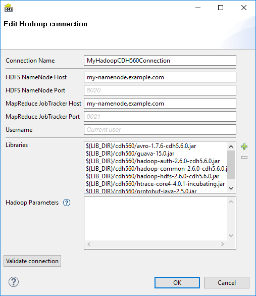

<!-- Development > Job elements > Connections > Hadoop connections -->

### Hadoop connections

Hadoop connection enables **CloverDX** to interact with the Hadoop distributed file system (HDFS), and to run MapReduce jobs on a Hadoop cluster. Hadoop connections can be created as both internal and external. See sections [Creating internal database connections](database-connections.md#creating-internal-database-connections) and [Creating external (shared) database connections](database-connections.md#creating-external-shared-database-connections) to learn how to create them. The definition process for Hadoop connections is very similar to other connections in **CloverDX**, just select **Create Hadoop connection** instead of **Create DB connection**.


*Figure 276. Hadoop connection dialog*

From the Hadoop connection properties, **Connection Name** and **HDFS NameNode Host** are mandatory. Also **Libraries** are almost always required.
**Connection Name**
In this field, type in a name you want for this Hadoop connection. Note that if you are creating a new connection, the connection name you enter here will be used to generate an ID of the connection. Whereas the connection name is just an informational label, the connection ID is used to reference this connection from various graph components (e.g. in a file URL, as noted in [Reading of Remote Files](examples-of-file-url-in-readers.md#reading-of-remote-files)). Once the connection is created, the ID cannot be changed using this dialog to avoid accidental breaking of references (if you want to change the ID of already created connection, you can do so in the Properties view).
**HDFS NameNode Host & Port**
Specify a hostname or IP address of your HDFS NameNode into the **HDFS NameNode Host** field.

If you leave the **HDFS NameNode Port** field empty, the default port number 8020 will be used.
**MapReduce JobTracker Host & Port**
Specify a hostname or IP address of your JobTracker into the **MapReduce JobTracker Host** field. This field is optional. If you leave it empty, **CloverDX** will not be able to [execute MapReduce](executemapreduce.md) jobs using this connection (access to HDFS will still work though).

If you don’t fill in the **MapReduce JobTracker Port** field, the default port number 8021 will be used.
**Username**
The name of the user under which you want to perform file operations on the HDFS and execute MapReduce jobs.

- HDFS works in a similar way as usual Unix file systems (file ownership, access permissions). But unless your Hadoop cluster has Kerberos security enabled, these names serve rather as labels and avoidance for accidental data loss.
- However, MapReduce jobs cannot be easily executed as a user other than the one which runs a **CloverDX** graph. If you need to execute MapReduce jobs, leave this field empty.

The default **Username** is an OS account name under which a **CloverDX** transformation graph runs. So it can be, for instance, your Windows login. Linux running the HDFS NameNode doesn’t need to have a user with the same name defined at all.
**Libraries**
Here you have to specify paths to Hadoop libraries needed to communicate with your Hadoop NameNode server and (optionally) the JobTracker server. Since there are some incompatible versions of Hadoop, you have to pick one that matches the version of your Hadoop cluster. For detailed overview of required Hadoop libraries, see [Libraries Needed for Hadoop](hadoop-connections.md#libraries-needed-for-hadoop).

For example, the screenshot above depicts libraries needed to use Cloudera 5.6 of Hadoop distribution. The libraries are available for download from Cloudera’s web site.

The paths to the libraries can be absolute or project relative. Graph parameters can be used as well.
> [!TIP]
> TROUBLESHOOTING
> If you omit some required library, you will typically end up with `java.lang.NoClassDefFoundError`.
>
> If an attempt is made to connect to a Hadoop server of one version using libraries of different version, an error usually appear, e.g.: `org.apache.hadoop.ipc.RemoteException: Server IPC version 7 cannot communicate with client version 4`.
> [!TIP]
> Usage on CloverDX Server
> **Libraries** do not need to be specified if they are present on the classpath of the application server where the **CloverDX Server** is deployed. For example, in case you use Tomcat app server and the Hadoop libraries are present in the `$CATALINA_HOME/lib` directory.
>
> If you do define the libraries paths, note that absolute paths are absolute paths on the application server. Relative paths are sandbox (project) relative and will work only if the libraries are located in a *shared* sandbox.
**Hadoop Parameters**
In this simple text field, specify various parameters to fine-tune HDFS operations. Usually, leaving this field empty is just fine. See the list of available properties with default values in the [documentation](http://hadoop.apache.org/) of `core-default.xml` and `hdfs-default.xml` files for your version of Hadoop. Only some of the properties listed there have an effect on Hadoop clients, most are exclusively server-side configuration.

Text entered here has to take the format of standard Java properties file. Hover mouse pointer above the question mark icon for a hint.

Once the Hadoop connection is set up, click the **Validate connection** button to quickly see that the parameters you entered can be used to successfully establish a connection to your Hadoop HDFS NameNode. Note that connection validation is not available if the libraries are located in a (remote) **CloverDX Server** sandbox.
> [!NOTE]
> HDFS fully supports the *append* file operation since Hadoop version 0.21.0

#### Connecting to YARN

If you run YARN (aka MapReduce 2.0, or MRv2) instead of the first generation of MapReduce framework on your Hadoop cluster, the following steps are required to configure the **CloverDX** Hadoop connection:

1. Write an arbitrary value into the **MapReduce JobTracker Host** field. This value will not be used, but will ensure that MapReduce job execution is enabled for this Hadoop connection.
2. Add this key-value pair to **Hadoop Parameters**: `mapreduce.framework.name=yarn`
3. In the **Hadoop Parameters**, add the key `yarn.resourcemanager.address` with a value in form of a colon separated hostname and port of your YARN ResourceManager, e.g. `yarn.resourcemanager.address=my-resourcemanager.example.com:8032`.

You will probably have to specify the `yarn.application.classpath` parameter too, if the default value from `yarn-default.xml` isn’t working. In this case, you would probably find some `java.lang.NoClassDefFoundError` in the log of the failed YARN application container.

##### See also:

| [HadoopReader](hadoopreader.md) |
| --- |
| [HadoopWriter](hadoopwriter.md) |

#### Libraries needed for Hadoop

Hadoop components need to have *Hadoop libraries* accessible from **CloverDX**. The libraries are needed by HadoopReader, HadoopWriter, ExecuteMapReduce, HDFS and Hive.

The Hadoop libraries are necessary to establish a Hadoop connection, see [Hadoop connections](hadoop-connections.md).

The officially supported version of Hadoop is `Cloudera 5` version 5.6.0. Other versions close to this one might work, but the compatibility is not guaranteed.

##### Cloudera 5

The below mentioned libraries are needed for the connection to Cloudera 5.
**Common libraries**
- `hadoop-common-2.6.0-cdh5.6.0.jar`
- `hadoop-auth-2.6.0-cdh5.6.0.jar`
- `guava-15.0.jar`
- `avro-1.7.6-cdh5.6.0.jar`
- `htrace-core4-4.0.1-incubating.jar`
- `servlet-api-3.0.jar`
**HDFS**
- `hadoop-hdfs-2.6.0-cdh5.6.0.jar`
- `protobuf-java-2.5.0.jar`
**MapReduce**
- `hadoop-annotations-2.6.0-cdh5.6.0.jar`
- `hadoop-mapreduce-client-app-2.6.0-cdh5.6.0.jar`
- `hadoop-mapreduce-client-common-2.6.0-cdh5.6.0.jar`
- `hadoop-mapreduce-client-core-2.6.0-cdh5.6.0.jar`
- `hadoop-mapreduce-client-hs-2.6.0-cdh5.6.0.jar`
- `hadoop-mapreduce-client-jobclient-2.6.0-cdh5.6.0.jar`
- `hadoop-mapreduce-client-shuffle-2.6.0-cdh5.6.0.jar`
- `jackson-core-asl-1.9.2.jar`
- `jackson-mapper-asl-1.9.12.jar`
- `hadoop-yarn-api-2.6.0-cdh5.6.0.jar`
- `hadoop-yarn-client-2.6.0-cdh5.6.0.jar`
- `hadoop-yarn-common-2.6.0-cdh5.6.0.jar`
**Hive**
- `hive-jdbc-1.1.0-cdh5.6.0.jar`
- `hive-exec-1.1.0-cdh5.6.0.jar`
- `hive-metastore-1.1.0-cdh5.6.0.jar`
- `hive-service-1.1.0-cdh5.6.0.jar`
- `libfb303-0.9.2.jar`
- `slf4j-api-1.7.5.jar`
- `slf4j-log4j12-1.7.5.jar`

The libraries can be found in your CDH installation or in a package downloaded from Cloudera.
**CDH installation**
Required libraries from CDH reside in the directories from the following list.

- `/usr/lib/hadoop`
- `/usr/lib/hadoop-hdfs`
- `/usr/lib/hadoop-mapreduce`
- `/usr/lib/hadoop-yarn`
- + 3rd party libraries are located in lib subdirectories
**Package downloaded from Cloudera**
The files can be found also in a package downloaded from Cloudera on the following locations.

- `share/hadoop/common`
- `share/hadoop/hdfs`
- `share/hadoop/mapreduce2`
- `share/hadoop/yarn`
- + lib subdirectories

#### Kerberos authentication for Hadoop

For user authentication in Hadoop, **CloverDX** can use the Kerberos authentication protocol.

To use Kerberos, you have to set up your Java, project and HDFS connection. For more information, see *[Kerberos requirements and setting](https://docs.oracle.com/en/java/javase/11/security/kerberos-requirements.html#GUID-EAA2758B-3071-4CDA-AEF1-D76F5271E998)*.

Note that the following instructions are applicable for Tomcat application server and Unix-like systems.
Java setting
There are several ways of setting Java for Kerberos. In the case of the first two options (configuration via system properties and via configuration file), you must modify both `setenv.sh` in **CloverDX Server** and `CloverDXDesigner.ini` in **CloverDX Designer**.

Additionally, add the parameters in **CloverDX Designer** to **Window** ****Preferences** ****CloverDX Runtime** ****VM parameters** pane.

- **Configuration via system properties** Set the Java system property `java.security.krb5.realm` to the name of your Kerberos realm, for example:
  ```bash
  -Djava.security.krb5.realm=EXAMPLE.COM
  ```
  Set the Java system property `java.security.krb5.kdc` to the hostname of your Kerberos key distribution center, for example:
  ```bash
  -Djava.security.krb5.kdc=kerberos.example.com
  ```
- **Configuration via config file** Set the Java system property `java.security.krb5.conf` to point to the location of your Kerberos configuration file, for example:
  ```bash
  -Djava.security.krb5.conf="/path/to/krb5.conf"
  ```
- **Configuration via config file in Java installation directory** Put the `krb5.conf` file into the `%JAVA_HOME%/lib/security` directory, e.g. `/opt/jdk-17.0.14+9/lib/security/krb5.conf`.
  Project setting
- Copy the `.keytab` file into the project, e.g. `conn/clover.keytab`.
Connection setting> [!NOTE]
> Kerberos authentication requires the `hadoop-auth-*.jar` library on both HDFS + MapReduce and Hive connection classpath.

- **HDFS and MapReduce connection**
  1. Set **Username** to the principal name, e.g. `clover/clover@EXAMPLE.COM`.
  2. Set the following parameters in the **Hadoop Parameters** pane:
     ```properties
     cloveretl.hadoop.kerberos.keytab=${CONN_DIR}/clover.keytab
     hadoop.security.authentication=Kerberos
     yarn.resourcemanager.principal=yarn/_HOST@EXAMPLE.COM
     ```
     Example 12. Properties needed to connect to a Hadoop High Availability (HA) cluster in Hadoop connection
     ```properties
     mapreduce.app-submission.cross-platform\=true
     yarn.application.classpath\=\:$HADOOP_CONF_DIR, $HADOOP_COMMON_HOME/*, $HADOOP_COMMON_HOME/lib/*, $HADOOP_HDFS_HOME/*, $HADOOP_HDFS_HOME/lib/*, $HADOOP_MAPRED_HOME/*, $HADOOP_MAPRED_HOME/lib/*, $HADOOP_YARN_HOME/*, $HADOOP_YARN_HOME/lib/*\:
     yarn.app.mapreduce.am.resource.mb\=512
     mapreduce.map.memory.mb\=512
     mapreduce.reduce.memory.mb\=512
     mapreduce.framework.name\=yarn
     yarn.log.aggregation-enable\=true
     mapreduce.jobhistory.address\=example.com\:port
     yarn.resourcemanager.ha.enabled\=true
     yarn.resourcemanager.ha.rm-ids\=rm1,rm2
     yarn.resourcemanager.hostname.rm1\=example.com
     yarn.resourcemanager.hostname.rm2\=example.com
     yarn.resourcemanager.scheduler.address.rm1\=example.com\:port
     yarn.resourcemanager.scheduler.address.rm2\=example.com\:port
     fs.permissions.umask-mode\=000
     fs.defaultFS\=hdfs\://nameservice1
     fs.default.name\=hdfs\://nameservice1
     fs.nameservices\=nameservice1
     fs.ha.namenodes.nameservice1\=namenode1,namenode2
     fs.namenode.rpc-address.nameservice1.namenode1\=example.com\:port
     fs.namenode.rpc-address.nameservice1.namenode2\=example.com\:port
     fs.client.failover.proxy.provider.nameservice1\=org.apache.hadoop.hdfs.server.namenode.ha.ConfiguredFailoverProxyProvider
     type=HADOOP
     host=nameservice1
     username=clover/clover@EXAMPLE.COM
     hostMapred=Not needed for YARN
     ```
     > [!TIP]
     > The `_HOST` string in `yarn/_HOST@EXAMPLE.COM` and `hive/_HOST@EXAMPLE.COM` is a placeholder that will be automatically replaced with an actual hostname. This is the recommended way that will work even with high-availability Hadoop cluster setup.
  3. If you encounter an error: `No common protection layer between client and server` set the `hadoop.rpc.protection` parameter to match your Hadoop cluster configuration.
- **Hive connection**
  1. Add `;principal=hive/_HOST@EXAMPLE.COM` to the URL, e.g. `jdbc:hive2://hive.example.com:10000/default;principal=hive/_HOST@EXAMPLE.COM`
  2. Set **User** to the principal name, e.g. `clover/clover@EXAMPLE.COM`
  3. Set `cloveretl.hadoop.kerberos.keytab=${CONN_DIR}/clover.keytab` in **Advanced JDBC** properties.
