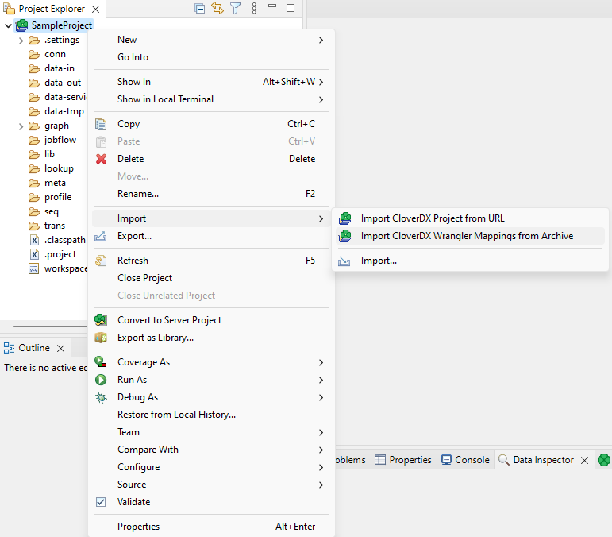
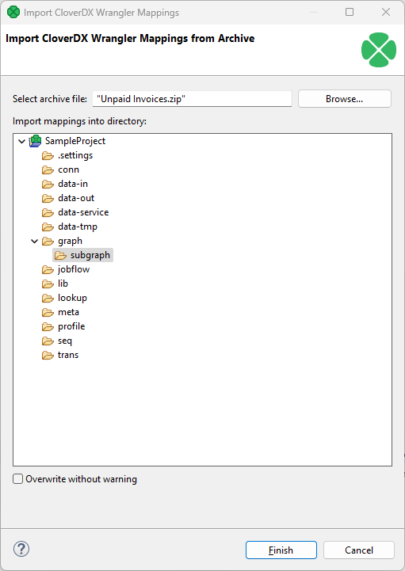
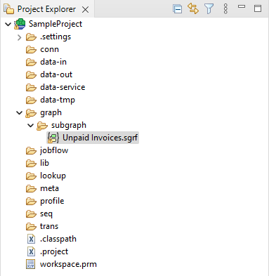
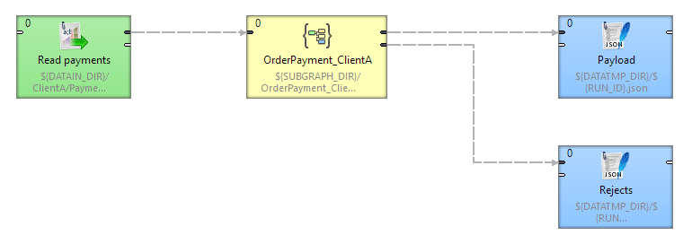
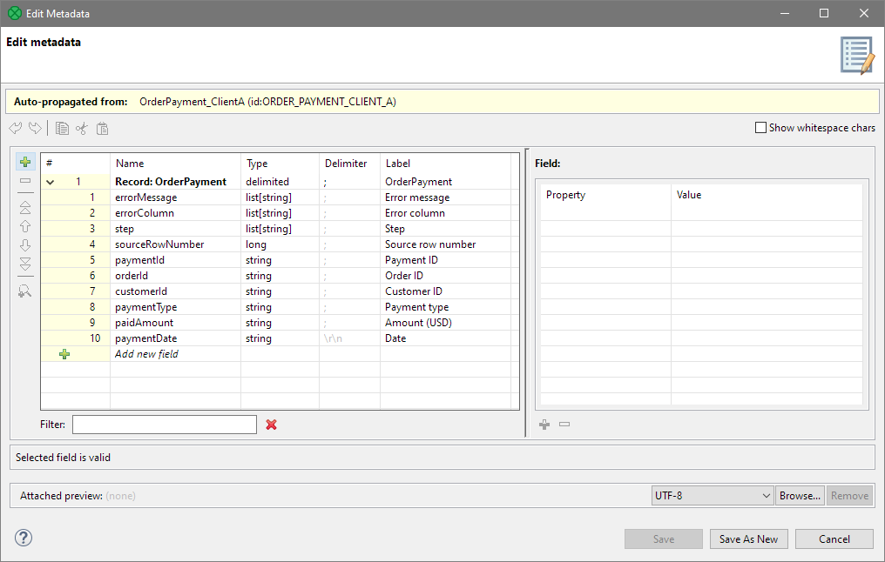

<!-- Development > Projects > Import Wrangler mapping -->

## 16. Import Wrangler mapping

In some cases it is very useful to allow Wrangler users to define data transformations that are then used in more complex projects created in the Designer. A common use case for this is data ingestion where you need to read many different data types (often provided by customers in inconsistent formats) and transform incoming data to a common format (e.g., a data warehouse table). In such cases, it is advantageous for the business analysts to be able to easily create their transformations without having to understand CloverDX Designer and the complexities of building a subgraph that reads and transforms data into the specific format.

To facilitate this use case, it is possible to export any job from CloverDX Wrangler and then import that job as a subgraph that can be used in CloverDX Designer when building more complex data processes. To see how to export your jobs from Wrangler, read more in [Wrangler documentation](../user/transforming-data.md#job-export-and-import).
> [!NOTE]
> Before exporting a job, make sure that there are no transformation issues (e.g., required target mapping is missing or there is an invalid step in the job). Jobs with errors can be exported from Wrangler (so that they can be copied to a different Wrangler instance) but such jobs cannot be imported in the Designer.

Once you have exported your Wrangler job(s), you can import them into CloverDX project via *Import CloverDX Wrangler Mappings from Archive* wizard available in the *Import* context menu for your CloverDX project.

To import a job, follow these steps:

1. Open the *Import CloverDX Wrangler Mappings from Archive* wizard from the project’s context menu:
   
2. Use the *Browse* button to select the exported job zip file(s). You can select multiple files at once for bulk import of multiple mappings. By default, the jobs will be imported into the `subgraphs` folder, but you can select any other folder in the project if desired.
   
3. The subgraph(s) will be imported into the directory you selected.
   

The subgraphs imported in this way will always define one input port and two output ports like this:

- The **input port** serves as data input for the transformation. This port is required (i.e., it has to be connected). It propagates metadata that matches the structure of the data coming from the data source in its originating Wrangler job.
- **The first output port** is "valid data output" - it auto-propagates metadata that corresponds to the output of the Wrangler job. This port is required (i.e., it has to be connected).
- **The second output port** is "rejected records output". It auto-propagates metadata corresponding to the reject file structure in the original Wrangler job. This port is optional and it will discard records if not connected. The metadata on this port will always contain 4 fields that provide information about the rejected record followed by the "data" fields that correspond to the first output port.

*Figure 143. Example usage of a subgraph imported from a Wrangle job export.*

### Reject metadata

The metadata on the reject port will always contain the following four fields:

- `list[string] errorMessage` is a list of error messages (one message in each list element) for the given rejected row.
- `list[string] errorColumn` is a list of technical column names that correspond to error messages from the `errorMessages` list (i.e., the first error message corresponds to the first error column).
- `list[string] step` is a list of step names for each error message. Each element corresponds to the step that raised the error for the rejected row. The format is always "Step <N>: <type>" where N is the index of the step (1, 2, etc.) and "<type>" is the type of the step (e.g., "Calculate formula", "Validate empty value", etc.).
- `long sourceRowNumber` is the row number of the rejected row as read from the source. Row numbers do not have to be sorted but will be unique - each row number can only appear once since each rejected record carries all errors for the given row.

*Figure 144. An example of reject port metadata. Notice the four pre-defined fields followed by several "data" fields.*
