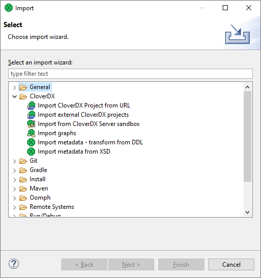
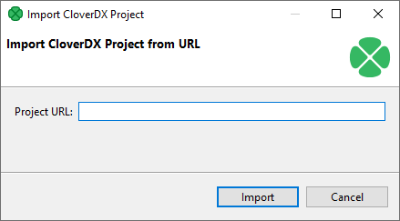
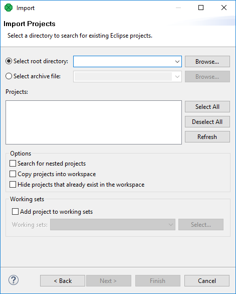
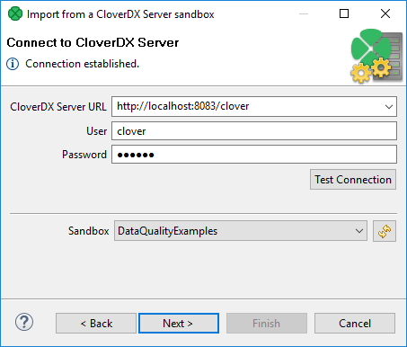
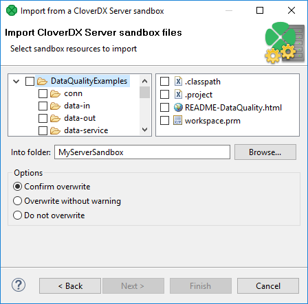
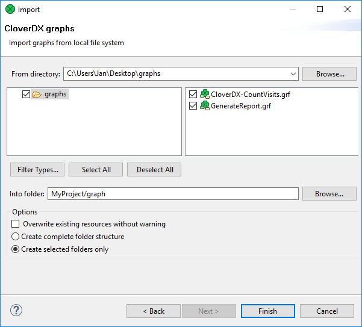
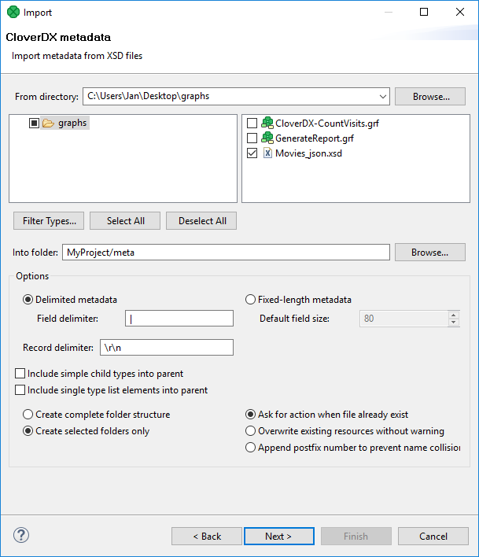
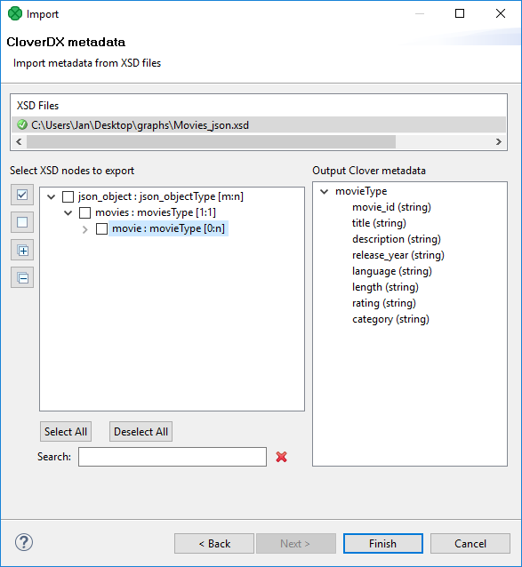
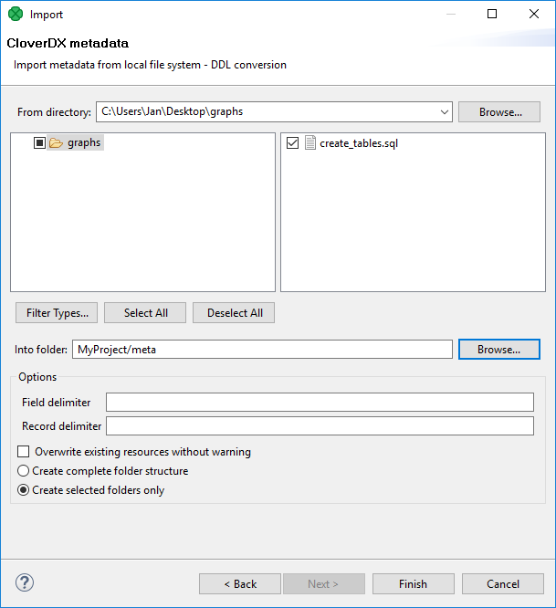

<!-- Development > Designer user interface > Import -->

## 8. Import

**CloverDX Designer** allows you to import already prepared **CloverDX** projects, graphs and/or metadata. If you want to import something, select **File** ****Import…​** from the main menu, or right-click in the **Project Explorer** pane and select **Import** ****Import…​** from the context menu.

After that, the following window opens. When you expand the **CloverDX** category, the window will look like this:

*Figure 101. Import Options*

### Import CloverDX projects

#### Import CloverDX Project from URL

If you have a link from which you can download a **CloverDX** project, you can use the **Import CloverDX Project from URL** action. This action downloads the **CloverDX** project and automatically imports it to the **CloverDX** workspace.

You can find the action in the main menu ( **File** ****Import CloverDX Project from URL** ) or you can right-click in the **Project Explorer** pane and select **Import** ****Import CloverDX Project from URL** from the context menu.

After that, the following window opens. You can paste the URL to this dialog:

*Figure 102. Import CloverDX Project from URL dialog*

Alternatively, you can drag and drop a link from a browser to the **Project Explorer** pane of **CloverDX Designer**.

Action **Import CloverDX Project from URL** is available since **CloverETL 5.5.0**.

#### Import CloverDX projects

If you select the **Import CloverDX Project from Archive, Directory, or Library** item, you can click the **Next** button and you will see the following window:

*Figure 103. Import Projects*

You can find some directory or compressed archive file (the right option must be selected by switching the radio buttons).

If you locate the directory, you can also decide whether you want to copy or link the project to your workspace. If you want the project be linked only, you can leave the **Copy projects into workspace** checkbox unchecked. Otherwise, it will be copied. Linked projects are contained in more workspaces.

If you select some archive file or library, the list of projects contained in the archive will appear in the **Projects** area. You can select some or all of them by checking the checkboxes that appear along with them.

### Import from CloverDX Server sandbox

**CloverDX Designer** now allows you to import any part of **CloverDX Server** sandboxes. To import, select the **Import from CloverDX Server Sandbox** option. After that, the following wizard will open:

*Figure 104. Import from CloverDX Server sandbox wizard (Connect to CloverDX Server)*

Specify the following three items: **CloverDX Server URL**, your **username** and **password**. Then click **Reload**. After that, a list of sandboxes will be available in the **Sandbox** menu. Select any of them and click **Next**. A new wizard will open:

*Figure 105. Import from CloverDX Server sandbox wizard (List of files)*

Select the files and/or directories that should be imported, select the folder into which they should be imported and decide whether the files and/or directories with identical names should be overwritten without warning or whether overwriting should be confirmed or whether the files and/or directories with identical names should not be overwritten at all. Then click **Finish**. Selected files and/or directories will be imported from **CloverDX Server** sandbox.

### Import graphs

If you select the **Import graphs** item, you can click the **Next** button and you will see the following window:

*Figure 106. Import graphs*

You must select the right graph(s) and specify the source and target folder for copying the selected graph(s). By switching the radio buttons, you decide whether a complete folder structure or only selected folders should be created. You can also order to overwrite the existing sources without warning.
> [!NOTE]
> You can also convert older graphs from 1.x.x to 2.x.x version of **CloverETL Designer** and from 2.x.x to 2.6.x version of **CloverETL Engine**.

### Import metadata

Metadata can be imported from:

- [*XSD*](import.md#metadata-from-xsd)
- [*DDL*](import.md#metadata-from-ddl)

For detailed information about metadata, see [Metadata](metadata.md).

#### Metadata from XSD

If you select the **Import metadata from XSD** item, you can click the **Next** button and you will see the following window:

*Figure 107. Import metadata from XSD*

Select the right metadata and specify the source and target folder for copying the selected metadata. By switching the radio buttons, you decide whether a complete folder structure or only selected folders should be created. You can also order to overwrite existing sources without warning. You can specify the delimiters or default field size.

*Figure 108. Import metadata from XSD - Review*

You can review the metadata to be imported. Import the metadata using the **Finish** button.

#### Metadata from DDL

If you select the **Import metadata - transform from DDL** item, you can click the **Next** button and you will see the following window:

*Figure 109. Import Metadata from DDL*

Select the right metadata and specify the source and target folder for copying the selected metadata. By switching the radio buttons, you decide whether complete folder structure or only selected folders should be created. You can also order to overwrite existing sources without warning. You need to specify the delimiters.
