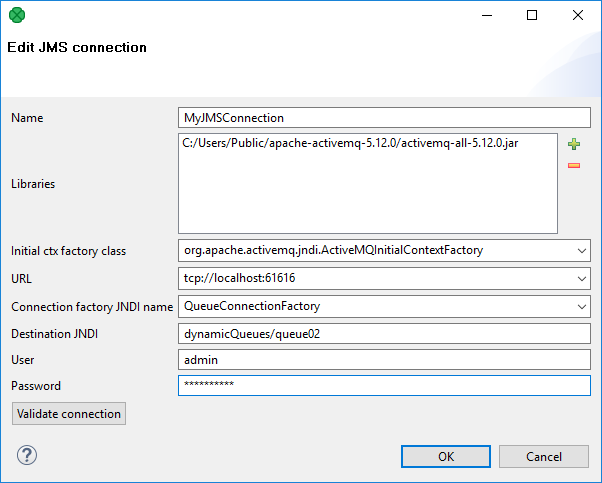

<!-- Development > Job elements > Connections > JMS connections -->

### JMS connections

JMS connection serves for receiving and sending JMS messages.

Connections can be:

- **Internal** (saved in the graph): See [Internal JMS connections](jms-connections.md#internal-jms-connections).
  Internal JMS connection can be created from outline. See [Creating Internal JMS connections](jms-connections.md#creating-internal-jms-connections).
  The *internal connection* can be made usable by other graphs by:
  - **Externalization**: See [externalizing Internal JMS connections](jms-connections.md#externalizing-internal-jms-connections).
  - **Export**: See [Exporting Internal JMS connections](jms-connections.md#exporting-internal-jms-connections).
- **External (shared)**: See [external (shared) JMS connections](jms-connections.md#external-shared-jms-connections).
  external JMS connection can be created using **Edit JMS connection wizard**. See [Creating external (shared) JMS connections](jms-connections.md#creating-external-shared-jms-connections).
  To use an external (shared) JMS connection in the current graph you can:
  - **Link** the connection to the graph: See [Linking external (shared) JMS connection](jms-connections.md#linking-external-shared-jms-connection).
  - **Internalize** the connection: See [Internalizing external (shared) JMS connections](jms-connections.md#internalizing-external-shared-jms-connections).
> [!NOTE]
> JMS connections, metadata, parameters or database connections can be internal or external (shared).

Authentication password can be encrypted using **Secure parameters**. See [Encrypting the Authentication Password](jms-connections.md#encrypting-the-authentication-password) or [Secure Graph Parameters](parameters.md#secure-graph-parameters).

**See also**[JMSReader](jmsreader.md), [JMSWriter](jmswriter.md)

#### Internal JMS connections

An *Internal JMS connection* is a JMS connection being a part of a graph. The Internal JMS connection is contained in the graph and can be seen in its source tab.

##### Creating internal JMS connections

The Internal JMS connection is created in the **Outline** pane.

1. Right click the **Connections** group or any connection item.
2. Select **Connections** ****Create JMS connection**.
3. The **Edit JMS connection** wizard opens. Here, you can define the JMS connection. Both the wizard and the instructions on setting up the connection are described in [Edit JMS connection wizard](jms-connections.md#edit-jms-connection-wizard).

##### Externalizing internal JMS connections

Any existing *Internal JMS connection* can be converted (externalized) to the *external JMS connection*. This gives you the ability to use the same JMS connection across multiple graphs.

###### How to externalize JMS connection

1. Right-click an internal connection item in the **Outline** pane and select **externalize connection** from the context menu.
2. A new wizard will be opened. The wizard offers location for the new external (shared) connection configuration file in `conn` directory of your project and file name for external JMS connection. If a file with the connection file name already exists, you can change the suggested name of the connection configuration file.
3. Finish the wizard by clicking the **OK** button.
4. A new configuration file appears in the `conn` subfolder of the project (visible in the **Project Explorer** pane). Internal connection item in the **Outline** pane is converted to link to the newly created external (shared) connection.

###### Externalizing multiple JMS connections at once

You can even externalize multiple internal connection items at once.

1. Choose JMS connections to be externalized in the **Outline** pane.
2. Right-click and select **externalize connection** from the context menu.
3. A new wizard will be opened. The wizard offers the `conn` folder of your project as the location for the first of the selected internal connection items.
4. Click the **OK** button to continue.
5. The same wizard will be opened for each of the selected connection items until all selected connections are externalized. The wizard works in the same way as when externalizing a single connection.
> [!TIP]
> To choose adjacent connection items press Shift and move the **Down Cursor** or the **Up Cursor** key.
>
> To choose non-adjacent items, use Ctrl+Click at each of the desired connection items instead.

The same approach is valid for both database and JMS connections.

##### Exporting internal JMS connections

This case is somewhat similar to that of externalizing an internal JMS connection. But, while you create a connection configuration file that is outside the graph in the same way as externalizing, the file is not linked to the original graph. Only the connection configuration file is being created.

You can use such a file for more graphs as an external (shared) connection configuration file as mentioned in the previous sections.

###### How to export JMS connection

1. Choose JMS connection in **Outline**.
2. Right-click and choose **Export connection**.
3. Use the wizard in the same way as in the case of [*externalization of JMS connection*](jms-connections.md#how-to-externalize-jms-connection).
4. After the export of JMS connection the **Outline** pane connection folder remains the same. The newly created connection configuration file appears in the `conn` directory in the **Project Explorer** pane.

Exporting multiple selected internal JMS connections is analogous to externalizing multiple JMS connections described in the previous section.

#### External (shared) JMS connections

external (shared) JMS connections are connections usable across multiple graphs. The external connections are stored outside the graph and that is why they can be shared.

##### Creating external (shared) JMS connections

1. To create an external (shared) JMS connection select **File** ****New** ****Other**.
2. Select **CloverDX** ****Connection** ****JMS connection** item.
3. The **Edit JMS connection** wizard opens. See [Edit JMS connection wizard](jms-connections.md#edit-jms-connection-wizard).
4. When all properties of the connection has been set, you can validate your connection using the **Validate connection** button.
5. Choose the project, its `conn` subfolder, choose the name for your external JMS connection file.
6. Click the **OK** button to finish the wizard.

##### Linking external (shared) JMS connection

Existing external (shared) connections can be linked to any graph you would like to use them in.

1. Right-click either the **Connections** group or any of its items.
2. Select **Connections** ****Link JMS connection** from the context menu.
3. **URL Dialog** has been opened. Expand the `conn` folder in the dialog and choose the desired connection configuration file.
   You can link multiple external (shared) connection configuration files at once: select multiple connection files in the dialog.

The same approach is valid for linking of both the database and JMS connections.

##### Internalizing external (shared) JMS connections

Any shared (external) JMS connection can be internalized (converted to the internal connection). To internalize Exported JMS connections link the JMS connection to the graph first.

###### How to Internalize exported JMS connection

1. Right-click a linked external (shared) connection item in the **Outline** pane.
2. Select **Internalize connection** from the context menu.
3. The selected JMS connection in the outline have been converted from external to internal. The file with external JMS connection stays unaffected.

You can even internalize multiple linked external (shared) connection configuration files at once. To do this, select the desired linked external (shared) connection items in the **Outline** pane.

You can select adjacent items when you press Shift and then the **Down Cursor** or the **Up Cursor** key. If you want to select non-adjacent items, use Ctrl+Click at each of the desired items instead.

However, the original external (shared) connection configuration files still remain to exist in the `conn` subfolder (visible in the **Project Explorer** pane).

The same approach is valid for linking of both the database and JMS connections.

#### Edit JMS connection wizard

**Edit JMS connection** dialog enables to set up JMS connection.

The dialog can be opened from [Outline pane](designer-layout.md#outline-pane) (See [Creating internal JMS connections](jms-connections.md#creating-internal-jms-connections)) or from **Project Explorer** (See [Creating external (shared) JMS connections](jms-connections.md#creating-external-shared-jms-connections)).

The **Edit JMS connection** wizard contains eight text areas that must be filled:

- **Name** - name of the connection
- **Initial ctx [context] factory class** - fully qualified name of the factory class creating the initial context
- **Libraries** - use the **plus** button to add libraries
- **URL**
- **Connection factory JNDI name** - implements `javax.jms.ConnectionFactory` interface
- **Destination JNDI** - implements `javax.jms.Destination` interface
- **User** - your authentication username
- **Password** - password to receive and/or produce the messages
- **Validate connection** Validates the connection. The connection is validated locally even if the project is remote.

*Figure 273. Edit JMS connection wizard*

If you are creating the external (shared) JMS connection, you must select a filename for this external (shared) JMS connection and its location.

#### Encrypting the authentication password

It is recommended to encrypt your authentication passwords. Otherwise, it remains stored and visible in the configuration file (shared connection) or in the graph itself (internal connection). Thus, the authentication password could be seen in one of these two locations.

The authentication password can be encrypted using **Secure parameters**. Encrypt the password and store the encrypted value in the graph parameter. The parameter has to be marked as secure. See [Secure graph parameters](parameters.md#secure-graph-parameters).
