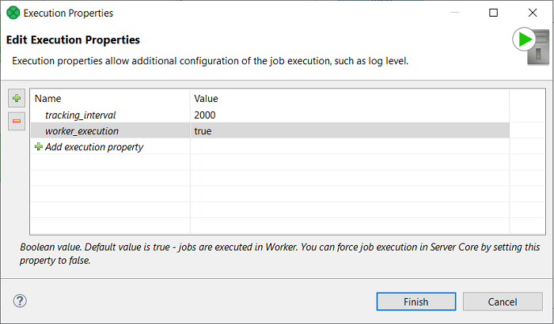

<!-- Development > Job elements > Execution properties -->

## 31. Execution properties

Each graph or jobflow can have a set of execution properties which are applied during its execution, for example to change the log level, number of parallel executions etc. The execution properties can be set both in the **Designer** and **Server**. When set in the **Designer** they are stored in the graph XML file, and so they are moved, versioned etc. with the job file itself. The execution properties stored in the graph XML are used as default values of the properties for the job. When the properties are set in the **Server Console** (on job or sandbox level - see [Sandboxes](../operations/sandboxes.md) for more information), they have higher priority than then those in the job XML. Typically you would set the property in the job XML file as a default value, and only override it in the **Server Console** when needed (e.g. to fix an incident).

### Execution properties hierarchy

Priorities (from highest to lowest):

1. **Job-level setting** - execution properties set on a job in the [**Sandboxes**](../operations/sandboxes.md) section of Server Console have the highest priority. The properties are set in the [**Execution Properties**](../operations/sandboxes.md#execution-properties) tab of a selected job file.
2. **Sandbox-level setting** - execution properties set on a sandbox in the [**Sandboxes**](../operations/sandboxes.md) section of Server Console set the property for all jobs in the sandbox. This can be overridden by the above job-level setting. The properties are set in the [**Execution Properties**](../operations/sandboxes.md#execution-properties) tab of a selected sandbox.
3. **Job XML file setting** - execution properties set in a job XML file (via the **Designer**) have lower priority than the above job and sandbox level settings. However, their benefit is that they are versioned and moved with the job file, which simplifies their management. The execution properties set in the job’s XML file can be considered as default for the job, and can be overridden on the sandbox or job level in the Server Console.
   The execution property values set in the graph XML can use graph parameters, for a more centralized configuration. The graph parameters are resolved during loading and parsing of the XML file, thus such a job cannot be pooled.
4. **Global defaults** - global Server configuration defines default values for all of the execution properties. Global execution properties related to job execution properties have the `executor.` prefix. For example, the Server property `executor.classpath` is default for the execution property `classpath`. (Refer [here](../admin/configuration-sources.md#priorities-of-configuration-sources) for details.)

Propagation of property values to a child job

1. **property values** - values of execution properties are propagated from parent job to a child job regardless of whether the child job has already a value set by user.
2. **log_level** - Log4j 2 log level is an exception and its value is not propagated to a child job if the value was not set for its parent job by user. That is if parent job has the value set as a **global default** and child job has the value set by user regardless of whether user set the value in the job’s XML file (via **Designer**) or in the **Server Console** the child job keeps the value set by user.

If you use a relative path, the path is relative to `${SANDBOX_ROOT}`.

In a path definition, you can use system properties - e.g. `${java.io.tmpdir}` - and some of server configuration properties: `${sandboxes.home}`, `${sandboxes.home.partitioned}` and `${sandboxes.home.local}`.

### List of execution properties

| Property name | Default value | Description |
| --- | --- | --- |
| classloader_caching | `false` | **CloverDX** creates new classloaders when necessary to load a class in runtime. For example, a **Reformat** component with a Java transformation has to create a new classloader to load the class. It is worth noting that classloaders for JDBC drivers are not re-created. Classloader cache is used to avoid Metaspace out of memory errors (some JDBC drivers automatically register themselves to DriverManager, which can cause that the classloader cannot be released by the garbage collector). This behavior can be inconvenient, for example if you want to share POJO between components. For example, a **Reformat** component creates an object (from a `jar` file on runtime classpath) and stores it into a dictionary. Another **Reformat** component recovers the object from the dictionary and attempts to cast the object to the expected class. `ClassCastException` is thrown due different classloaders used in the **Reformat** components. Using this flag you can force Clover Server to re-use classloader when possible. |
| classpath |  | List of paths or `jar` files which contain external classes used in the job file (transformations, generators, JMS processors). All specified resources will be added to the runtime classpath of the transformation job. All **CloverDX** Engine libraries and libraries on application-server’s classpath are automatically on the classpath. Separator is specified by the Engine property `DEFAULT_PATH_SEPARATOR_REGEX`. The directory path must always end with a slash character "/"; otherwise, ClassLoader doesn’t recognize it is a directory. Server always automatically adds `trans` subdirectory of job’s sandbox, so it doesn’t have to be added explicitly. |
| compile_classpath |  | List of paths or `jar` files which contain external classes used in the job file (transformations, generators, JMS processors) and related libraries for their compilation. Please note, that libraries on application-server’s classpath are not included automatically. Separator is specified by the Engine property `DEFAULT_PATH_SEPARATOR_REGEX`. The directory path must always end with a slash character "/"; otherwise, ClassLoader doesn’t recognize it is a directory. Server always automatically adds a `SANDBOX_ROOT/trans/` directory and all JARs in the `SANDBOX_ROOT/lib/` directory, so they don’t have to be added explicitly. |
| encrypt_temp_files | `false` | If `true`, the system will encrypt all internal temporary files saved on disk creating during job executions.  This property is useful in environment where all persisted data must be encrypted. |
| data_service_base_path |  | Sandbox level only property for data services url prefix. It allows data services to have the same (user defined) url paths if they are in different sandboxes. It is useful e.g. in environments with multiple versions of the same sandbox. The result data services url will have the form `http(s)://[host]:[port]/clover/data-service/[data_service_base_path]/[user defined path]`. If the property is not defined or empty, the form will be `http(s)://[host]:[port]/clover/data-service/[user defined path]`. |
| debug_mode | `false` | If `true`, edges will save sample data for viewing in [Data Inspector](../operations/execution-history-main.md#data-inspector-panel). Internally, the data is stored in temporary files in the debug directory.  Without explicit setting, running a job [manually](../operations/execution-history-main.md#running-jobs-manually) sets `debug_mode` to `true`. On the other hand, automatically triggered jobs have `debug_mode` set to `false`. |
| enqueue_executions | `false` | Boolean value.  If `true`, executions above `max_running_concurrently` are blocked and wait until the number of executions decreases,  if `false`, executions above `max_running_concurrently` fail.  This property is evaluated after the job queue, see [Job queue impact](../operations/job-queue.md#impact). |
| jobflow_token_tracking | `true` | If `false`, token tracking in jobflow executions will be disabled. |
| locale | `DEFAULT_LOCALE` engine property | Can be used to override the `DEFAULT_LOCALE` engine property. |
| log_level | `INFO` | Log4j 2 log level for this graph executions. (`ALL` \| `TRACE` \| `DEBUG` \| `INFO` \| `WARN` \| `ERROR` \| `FATAL`). For lower levels (`ALL`, `TRACE` or `DEBUG`), root logger level must be set to lower level, as well. Root logger log level is `INFO` by default, thus a transformation run log does not contain more detail messages then `INFO` event if the execution property `log_level` is set properly. For details about Log4j 2 configuration, see [Logging](../operations/logging.md). |
| max_running_concurrently | `unlimited` | The maximum number of concurrently running instances of this transformation. In cluster environment, the limit is per node.  This property is evaluated after the job queue, see [Job queue impact](../operations/job-queue.md#impact). |
| queueable |  | Can be used to override default behavior of the job queue (see [Job queue](../operations/job-queue.md)) for this job. The job queue by default processes most types of jobs (e.g. graphs, jobflows, subgraphs etc.) and ignores some types of jobs (Data Services). This execution property can be used to override the default behavior on this job, if it’s set. If set to `true`, it forces the job queue to process the job. If set to `false`, it prohibits the job queue from processing the job. If it’s not set, the default behavior is applied.  If the execution property is set on a job, its value is propagated to child jobs. For example, if job queue is disabled for a job, then it’s disabled for all its child jobs such as subgraphs etc.  By default Data Services are not processed by the job queue. This execution property can be used to enable job queue on specific Data Services, e.g. such that are used for orchestration of job executions. |
| skip_check_config | default value is taken from engine property | Specifies whether check config must be performed before a transformation execution. |
| time_zone | `DEFAULT_TIME_ZONE` engine property | Can be used to override the `DEFAULT_TIME_ZONE` engine property. |
| tracking_interval | `2000` | Interval in milliseconds for sampling nodes status in a running transformation. |
| use_jmx | `true` | If `true`, job executor registers jmx mBean of a running transformation. |
| use_local_context_url | `false` | If `true`, the context URL of a running job will be a local `file:` URL. Otherwise, a `sandbox:` URL will be used. |
| verbose_mode | `true` | If `true`, more descriptive logs of job runs are generated. |
| worker_execution | `true` | Set to `false` to enforce execution in Server Core. Can be set per file or per sandbox. |

### Setting execution properties in Designer

To set an execution property, right-click the **Execution Properties** item in the **Outline** pane and choose **Edit** from the context menu, or just double-click the **Execution Properties** item.

Click on the line with label **Add configuration property** and select property name from the list. Specify property value in the second column. Some properties may have a value only of a specific type. In that case you may select the value from a list.

### Setting execution properties in Server console

To set an execution property in Server, add the desired property in the [**Execution Properties**](../operations/sandboxes.md#execution-properties) tab in the [**Sandboxes**](../operations/sandboxes.md) module. Properties can be added at the job level or sandbox level. See [Execution properties hierarchy](jobconfig.md#execution-properties-hierarchy) for more information on execution properties hierarchy.
