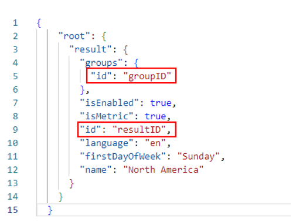
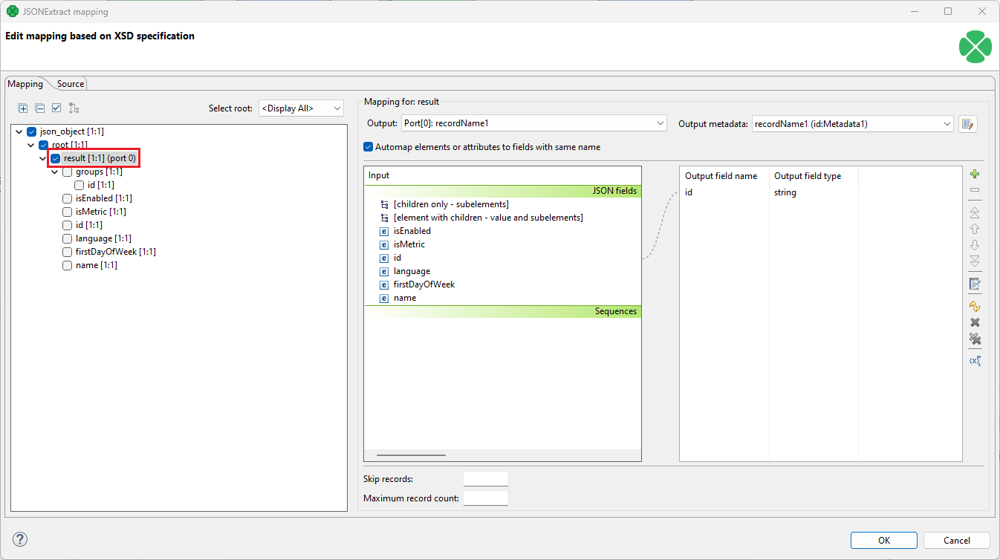
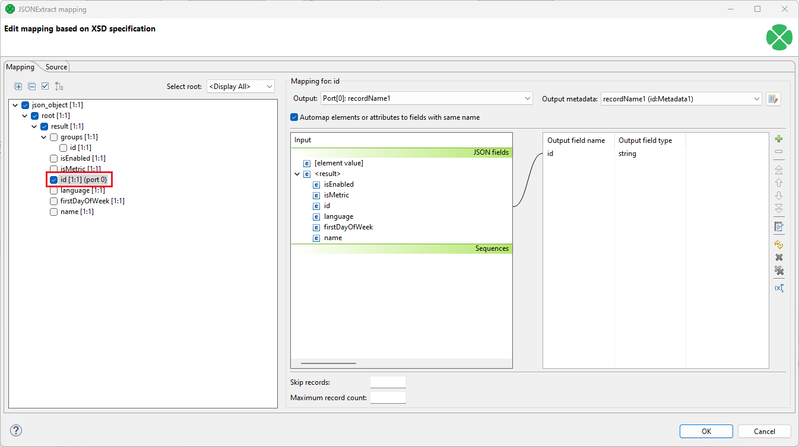
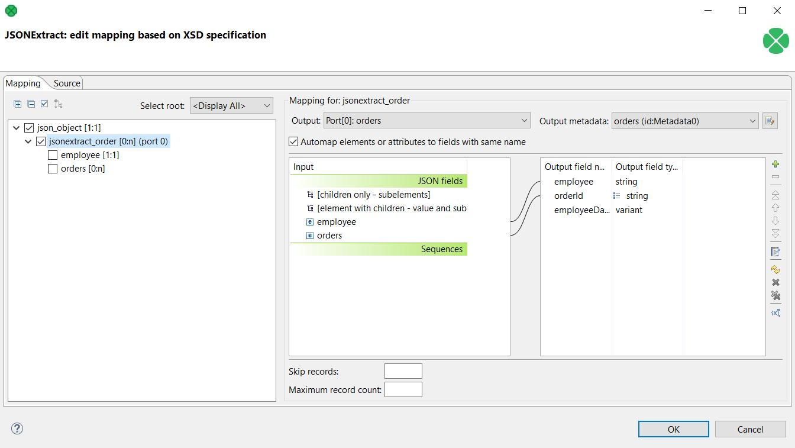
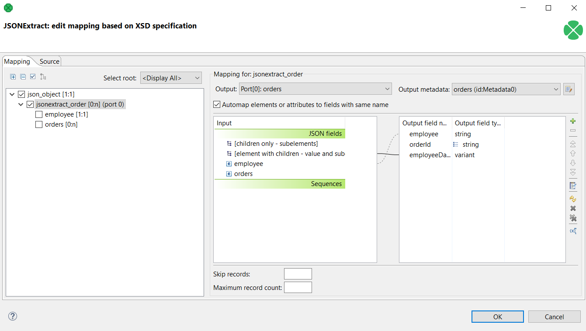

<!-- Development > Component reference > Readers > JSONExtract -->

### JSONExtract


| [Short description](jsonextract.md#short-description) |
| --- |
| [Ports](jsonextract.md#ports) |
| [Metadata](jsonextract.md#metadata) |
| [JSONExtract attributes](jsonextract.md#jsonextract-attributes) |
| [Details](jsonextract.md#details) |
| [Examples](jsonextract.md#examples) |
| [Best practices](jsonextract.md#best-practices) |
| [Compatibility](jsonextract.md#compatibility) |
| [See also](jsonextract.md#see-also) |
> [!TIP]
> If you’re interested in learning more about this subject, we offer the [Work with JSON/XML course](https://academy.cloverdx.com/courses/json-xml) in our CloverDX Academy.

#### Short description

**JSONExtract** reads data from JSON files using SAX technology. It can also read data from compressed files, input port, and dictionary.

| Data source | Input ports | Output ports | Each to all outputs | Different to different outputs | Transformation | Transf. req. | Java | CTL | Auto-propagated metadata |
| --- | --- | --- | --- | --- | --- | --- | --- | --- | --- |
| JSON file | 0-1 | 1-n | **⨯** | **✓** | **⨯** | **⨯** | **⨯** | **⨯** | **⨯** |

#### Ports

| Port type | Number | Required | Description | Metadata |
| --- | --- | --- | --- | --- |
| Input | 0 | **⨯** | For port reading. See [Reading from input port](examples-of-file-url-in-readers.md#reading-from-input-port). | One field (`byte`, `cbyte`, `string`). |
| Output | 0 | **✓** | For correct data records | Any |
| 1-n | [[1]](jsonextract.md#jsonextract-ports-note-2) | For correct data records | Any |  |

| 1 | Other output ports are required if mapping requires that. |
| --- | --- |

#### Metadata

JSONExtract does not propagate metadata.

JSONExtract has no metadata template.

Metadata on optional input port must contain `string` or `byte` or `cbyte` field.

Metadata on each output port does not need to be the same.

Each metadata can use [Autofilling functions](metadata-records-and-fields.md#autofilling-functions).

#### JSONExtract attributes

| Attribute | Req | Description | Possible values |
| --- | --- | --- | --- |
| Basic |  |  |  |
| File URL | yes | Attribute specifying what data source(s) will be read (JSON file, input port, dictionary). See [Supported file URL formats for Readers](examples-of-file-url-in-readers.md). |  |
| Charset |  | Encoding of records which are read. | any encoding, default system one by default |
| Mapping | [[1]](jsonextract.md#jsonextract-reference-1) | Mapping of the input JSON structure to output ports. For more information, see [XMLExtract mapping definition](xmlextract.md#xmlextract-mapping-definition). |  |
| Mapping URL | [[1]](jsonextract.md#jsonextract-reference-1) | Name of an external file, including its path which defines mapping of the input JSON structure to output ports. For more information, see [XMLExtract mapping definition](xmlextract.md#xmlextract-mapping-definition). |  |
| Equivalent XML Schema |  | URL of a file that should be used for creating the **Mapping** definition. For more information, see [JSONExtract Mapping Editor and XSD schema](jsonextract.md#jsonextract-mapping-editor-and-xsd-schema). |  |
| Use nested nodes |  | By default, nested elements are also mapped to output ports automatically. If set to `false`, an explicit `<Mapping>` tag must be created for each such nested element. See [Use nested nodes examples](jsonextract.md#use-nested-nodes-examples). | true (default) \| false |
| Trim strings |  | By default, white spaces from the beginning and the end of the elements values are removed. If set to `false`, they are not removed. | true (default) \| false |
| Advanced |  |  |  |
| Number of skipped mappings |  | Number of mappings to be skipped continuously throughout all source files. See [Selecting input records](selecting-input-records.md). | 0-N |
| Max number of rows to output |  | Maximum number of records to be read continuously throughout all source files. See [Selecting input records](selecting-input-records.md). | 0-N |
| Max length of string field (MB) |  | Maximum length of a string field in JSON file in MB. Default is 20 MB. | 1-N |

| 1 | One of these must be specified. If both are specified, **Mapping URL** has higher priority. |
| --- | --- |

#### Details

**JSONExtract** reads data from JSON files using SAX technology. This component is faster than [JSONReader](jsonreader.md) which can read JSON files too. **JSONExtract** does not use DOM, so it uses less memory than **JSONReader**.

**JSONExtract** can read lists.

**JSONExtract** can convert JSON to variant. Result variant can contain field/array values of following data types - **null**, **string**, **boolean**, **long** and **number**.
> [!NOTE]
> **JSONExtract** is very similar to **XMLExtract**. **JSONExtract** internally transforms JSON to XML and uses **XMLExtract** to parsing the data. Therefore, you can generate `xsd` file for corresponding `xml` file.

Mapping in **JSONExtract** is almost same as in [XMLExtract](xmlextract.md). The main difference is, that JSON does not have attributes. For more information, see **XMLExtract’s**[Details](xmlextract.md#details).

##### JSONExtract Mapping Editor and XSD schema

**JSONExtract Mapping Editor** serves to set up mapping from JSON tree structure to one ore more output ports without the necessity of being aware how to create mapping of field using an XML editor.

To be able to use the editor, the editor needs to have created **equivalent xsd schema**. The equivalent xsd schema is created automatically. Only the directory for the schema needs to be specified.

Any other operations to set up mapping are described in above mentioned **XMLExtract**.

##### Mapping input fields to the output fields

In **JSONExtract**, you can map input fields to the output in the same way as you map JSON fields. The input field mapping works in all three processing modes.

#### Examples

##### Use nested nodes examples

It is important to bear in mind that when the **Use nested nodes** attribute is set to `True`, one should be careful if there are elements with the same name because the **JSONExtract** component might return a different value than expected. See the following examples for further explanation:

In this sample JSON file there are two elements called `id`: the first one is a nested element within the `groups` element, and the other one is nested within the main `result` element. The value of the first `id` is `groupID`, and the value of the other `id` is `resultID`.

```json
{
    "root": {
      "result": {
        "groups": {
          "id": "groupID"
        },
        "isEnabled": true,
        "isMetric": true,
        "id": "resultID",
        "language": "en",
        "firstDayOfWeek": "Sunday",
        "name": "North America"
      }
    }
  }
```


*Figure 337. JSON structure and values*

**Example 1:** The mapping is at the level of the main `result` element, and the **Automap elements or attributes to fields with same name** option is turned on, or the `id` (resultID) is specifically mapped.


*Figure 338. Mapping 1*

The value of the `id` element will differ based on if the *Use nested nodes* value is set to `True` or `False`:

- When the *Use nested nodes* value is set to `True`, the returned record is `groupID`. This is because it is the first `id` element that is found when parsing the data.
- When the *Use nested nodes* value is set to `False`, the returned record is `resultID`. In this case, the groups `id` element is ignored, and the first found `id` element is the one within the `result` element.

**Example 2:** The mapping is at the `id` element nested within the `result` element.


*Figure 339. Mapping 2*

The returned values of the `id` element will again differ based on if the *Use nested nodes* value is set to `True` or `False`:

- When the *Use nested nodes* value is set to `True`, there are two returned records: `groupID` and `resultID`.
- When the *Use nested nodes* value is set to `False`, only the `resultID` record is returned.

##### Reading lists

JSON file contains information about employees and orders. Each item contains employee ID and list of order IDs.

```json
{
  "jsonextract_order" : {
    "employee" : "Henri",
    "orders" : [ "order01", "order08", "order15" ]
  },
  "jsonextract_order" : {
    "employee" : "Jane",
    "orders" : [ "order02", "order05", "order09" ]
  }
}
```

Read data for further processing.

###### Solution

Use the **File URL** attribute to point to the source file and the **Mapping** attribute to define mapping.


*Figure 340. JSONExtract - mapping the list*

##### Reading variants

JSON file contains information about employees and orders. Each item contains employee ID and list of order IDs.

```json
{
  "jsonextract_order" : {
    "employee" : "Henri",
    "orders" : [ "order01", "order08", "order15" ]
  },
  "jsonextract_order" : {
    "employee" : "Jane",
    "orders" : [ "order02", "order05", "order09" ]
  }
}
```

Read data for further processing.

###### Solution

Use the **File URL** attribute to point to the source file and the **Mapping** attribute to define mapping.


*Figure 341. JSONExtract - mapping the variant*

Content of mapped output variant field depends on structure of input JSON.

```ctl
// for the first input element
$out.0.employeeData["jsonextract_order"]["employee"]; // contains 'Henri'
$out.0.employeeData["jsonextract_order"]["orders"][0]; // contains 'order01'
```

#### Best practices

We recommend users to explicitly specify **Charset**.

#### Compatibility

| Version | Compatibility Notice |
| --- | --- |
| 3.5.0-M2 | **JSONExtract** is available since 3.5.0-M2. |
| 4.1.0-M1 | You can now map input fields to the output fields in this component. |
| 4.1.0 | You can now read lists. |
| 5.11.0 | You can now extract JSON to variant. |
| 5.11.0 | Null values are no longer converted to an empty string on output. |

#### See also

| [JSONReader](jsonreader.md) |
| --- |
| [JSONWriter](jsonwriter.md) |
| [Common properties of components](components.md#common-properties-of-components) |
| [Specific attribute types](components.md#specific-attribute-types) |
| [Common properties of Readers](common-of-readers.md) |
| [Readers comparison](common-of-readers.md#readers-comparison) |
