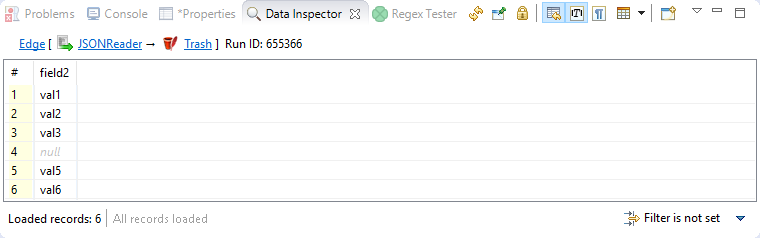

<!-- Development > Component reference > Readers > JSONReader -->

### JSONReader


| [Short description](jsonreader.md#short-description) |
| --- |
| [Ports](jsonreader.md#ports) |
| [Metadata](jsonreader.md#metadata) |
| [JSONReader attributes](jsonreader.md#jsonreader-attributes) |
| [Details](jsonreader.md#details) |
| [Examples](jsonreader.md#examples) |
| [Best practices](jsonreader.md#best-practices) |
| [Compatibility](jsonreader.md#compatibility) |
| [See also](jsonreader.md#see-also) |

#### Short description

**JSONReader** reads data in the Java Script Object Notation - [JSON format](http://www.json.org/), typically stored in a `json` file. JSON is a hierarchical text format where values you want to read are stored either in name-value pairs or arrays. Arrays are just the caveat in mapping - see [Handling arrays](jsonreader.md#handling-arrays). JSON objects are often repeated - that is why you usually map to more than one output port.

| Data source | Input ports | Output ports | Each to all outputs | Different to different outputs | Transformation | Transf. req. | Java | CTL | Auto-propagated metadata |
| --- | --- | --- | --- | --- | --- | --- | --- | --- | --- |
| JSON file | 0-1 | 1-n | **⨯** | **✓** | **⨯** | **⨯** | **⨯** | **⨯** | **✓** |

#### Ports

| Port type | Number | Required | Description | Metadata |
| --- | --- | --- | --- | --- |
| Input | 0 | **⨯** | Optional. For port reading. | Only one field (`byte` or `cbyte` or `string`) is used. The field name is used in **File URL** to govern how the input records are processed - one of these modes: `discrete`, `source` or `stream`. See [Reading from input port](examples-of-file-url-in-readers.md#reading-from-input-port). |
| Output | 0 | **✓** | Successfully read records. | Any. |
| 1-n | **⨯** | Successfully read records.  Connect additional output ports if your mapping requires that. | Any. Each output port can have different metadata. |  |

#### Metadata

##### Metadata Propagation

JSONReader does not propagate metadata.

##### Metadata Templates

JSONReader has 2 templates on its output port: JSONReader_TreeReader_ErrPortWithoutFile and JSONReader_TreeReader_ErrPortWithFile.

| Field number | Field name | Data type | Description |
| --- | --- | --- | --- |
| 1 | port | integer | Output port to which data would be sent if data is correct. |
| 2 | recordNumber | integer | The number of the output record in which the error occurred. The number begins from 1 and is counted for each output record separately. |
| 3 | fieldNumber | integer | An index of the record field in which the error occurred. Starts from 1. |
| 4 | fieldName | string | The name of the field which would contain the value if the value was correct. |
| 5 | value | string | Value causing the error. |
| 6 | message | string | Error message |
| 7 | file | string | Input file on which the error occurred. |

The metadata template JSONReader_TreeReader_ErrPortWithoutFile does not have the last field - file.

##### Requirements on metadata

If the input port is used for reading data (`discrete` or `stream`), the input has to contain a `byte`, `cbyte` or `string` data type field.

If the input port is used for reading URLs (`source`), the input metadata has to contain a `string` data type field.

Each output port can have different metadata.

##### Autofilling functions

Metadata on output port can use [Autofilling functions](metadata-records-and-fields.md#autofilling-functions).

#### JSONReader attributes

| Attribute | Req | Description | Possible values |
| --- | --- | --- | --- |
| Basic |  |  |  |
| File URL | yes | Specifies which data source(s) will be read (a JSON file, dictionary or port). See [Supported file URL formats for Readers](examples-of-file-url-in-readers.md) and [Notes and limitations](jsonreader.md#notes-and-limitations). |  |
| Charset |  | Encoding of records that are read. JSON automatically recognizes the family of UTF-* encodings (`Auto`). If your input uses another charset, explicitly specify it in this attribute yourself. | Auto (default) \| <other encodings> |
| Data policy |  | Determines what should be done when an error occurs. For more information, see [Data policy](data-policy.md). | Strict (default) \| Controlled[[1]](jsonreader.md#jsonreader-footnote1) \| Lenient |
| Mapping URL | [[2]](jsonreader.md#jsonreader-attributes-2) | External text file containing the mapping definition. |  |
| Mapping | [[2]](jsonreader.md#jsonreader-attributes-2) | Mapping the input JSON structure to output ports. See [Details](jsonreader.md#details). |  |
| Implicit mapping |  | By default, you have to manually map JSON elements even to Clover fields of the same name. If you switch to `true`, JSON-to-CloverDX mapping on matching names will be performed automatically. That can save you a lot of effort in long and well-structured JSON files. See [JSON mapping - specifics](jsonreader.md#json-mapping-specifics). | false (default) \| true |

| 1 | Controlled data policy in **JSONReader** sends error field values to error port if an edge with correct metadata is attached; records are written to the log otherwise. |
| --- | --- |

| 2 |  One of these has to be specified. If both are specified, **Mapping URL** has a higher priority. |
| --- | --- |

#### Details

| [JSON mapping - specifics](jsonreader.md#json-mapping-specifics) |
| --- |
| [Handling arrays](jsonreader.md#handling-arrays) |
| [Notes and limitations](jsonreader.md#notes-and-limitations) |
| [Mapping fields from input ports](jsonreader.md#mapping-fields-from-input-ports) |

**JSONReader** takes the input JSON and internally converts it to DOM. Afterwards, you use XPath expressions to traverse the DOM tree and select which JSON data structures will be mapped to **CloverDX** records.

DOM contains elements only, not attributes. As a consequence, remember that the XPath expressions will **never** contain @.

Note that the whole input is stored in memory and therefore the component can be memory-greedy.

There is a component [JSONExtract](jsonextract.md) reading JSON files using SAX. **JSONExtract** needs less memory than **JSONReader**.

##### Mapping

JSON is a representation for tree data as every JSON object can contain other nested JSON objects. Thus, the way you create **JSONReader** mapping is similar to reading XML and other tree formats. **JSONReader** configuration resembles [XMLReader](xmlreader.md) configuration. The basics of mapping are:

- `<Context>` element chooses elements in the JSON structure you want to map.
- `<Mapping>` element maps those JSON elements (selected by `<Context>`) to Clover fields.
- Both use [XPath expressions](jsonreader.md#xpath-expressions).

You will see mapping instructions and examples when you edit the **Mapping** attribute for the first time.

##### JSON Mapping - Specifics
> [!IMPORTANT]
> The first `<Context>` element of your mapping has a fixed format. There are only two ways how to set its `xpath` for the component to work properly:
>
> `xpath="/root/object"` (if root in JSON structure is an object)
>
> `xpath="/root/array"` (if root in JSON structure is an array)

Example JSON:

```json
[
 { "value" : 1},
 { "value" : 2}
]
```

**JSONReader** mapping:

```xml
<?xml version="1.0" encoding="UTF-8" standalone="no"?>
<Context outPort="0" xpath="/root/array">
   <Mapping cloverField="cloverValue" xpath="value"/>
</Context>
```

(considering `cloverValue` is a field in metadata assigned to the output edge)

###### Name-value pairs

To read data from regular name-value pairs, first remember to set your position in the JSON structure to a correct depth - e.g. `<Context xpath="zoo/animals/tiger">`.

Optionally, you can map the subtree of `<Context>` to the output port - e.g. `<Context xpath="childObjects" outPort="2">`.

Do the `<Mapping>`: select a name-value pair in `xpath`. Next, send the value to **CloverDX** using `cloverField`; e.g.: `<Mapping cloverField="id" xpath="nestedObject">`.

Example JSON:

```json
{
  "property" : 1,
  "innerObject" : {
      "property" : 2
  }
}
```

**JSONReader** mapping:

```xml
<?xml version="1.0" encoding="UTF-8" standalone="no"?>
<Context outPort="0" xpath="/root/object">
   <Mapping cloverField="property" xpath="property"/>
   <Context xpath="innerObject">
      <Mapping cloverField="propertyOfInnerObject" xpath="property"/>
   </Context>
</Context>
```

###### XPath expressions

Remember that you do not use the @ symbol to access 'attributes' as there are none. In order to select objects with specific values you will write mapping similar to the following example:

```xml
<Context xpath="//website[uri='http://www.w3.org/']" outPort="1">
   <Mapping cloverField="dateUpdated" xpath="dateUpdated" />
   <Mapping cloverField="title" xpath="title"/>
</Context>
```

The XPath in the example selects all elements `website` (no matter how deep in the JSON they are) whose `URI` matches the given string. Next, it sends its two elements (`dateUpdated` and `title`) to respective metadata fields on port 1.
Decode and Encode functions
As has already been mentioned, JSON is internally converted into an XML DOM. Since not all JSON names are valid XML element names, the names are encoded. Invalid characters are replaced with escape sequences of the form `_xHHHH` where HHHH is a hexadecimal Unicode code point. These sequences must therefore also be used in **JSONReader’s** XPath expressions.

The XPath `name()` function can be used to read the names of properties of JSON objects (for a description of XPath functions on nodes, see [https://www.w3schools.com/xml/xsl_functions.asp#node](https://www.w3schools.com/xml/xsl_functions.asp#node)). However, the names may contain escape sequences, as described above. JSONReader offers two functions for this purpose, the functions are available from `http://www.cloveretl.com/ns/TagNameEncoder` namespace which has to be declared using the `namespacePaths` attribute, as will be shown below. These functions are:

- `decode(string)` function, which can be used to decode `_xHHHH` escape sequences
- `encode(string)` function, which escapes invalid characters

For example, let’s try to process the following structure:

```json
{"map" : { "0" : 2 , "7" : 1 , "16" : 1 , "26" : 3 , "38" : 1 }}
```

A suitable mapping could look like this:

```xml
<Context xpath="/root/object/map/*" outPort="0" namespacePaths='json-functions="http://www.cloveretl.com/ns/TagNameEncoder"'>
   <Mapping cloverField="key" xpath="json-functions:decode(name())" />
  <Mapping cloverField="value" xpath="." />
</Context>
```

The mapping maps the names of properties of "map" ("0", "7", "16", "26" and "38") to the field "key" and their values (2, 1, 1, 3 and 1, respectively) to the field "value".
ToJSON function
The `toJSON()` function allows you to target specific elements within a JSON document and extract their data as separate JSON strings. This is particularly beneficial for processing large JSON files in smaller chunks, which can significantly improve memory consumption.

The `toJSON()` function requires a namespace declaration to be available. You can achieve this by setting the `namespacePaths` attribute in your XPath expression, pointing to the namespace at `http://www.cloveretl.com/ns/TagNameEncoder`.

For example, if you wanted to extract all the *addresses* information from a JSON file with the following structure:

```json
{
   "orders":[
      {
         "id": 12345,
         "customerId": 98765,
         "orderDatetime": "2024-06-10T12:26:00Z",
         "items":[
            {
               "productCode": "ABC123",
               "productName": "Awesome Product",
               "unitPrice": 19.99,
               "qty": 2
            }
         ],
         "addresses":[
            {
               "type": "shipping",
               "name": "John Doe",
               "street": "123 Main St",
               "city": "Anytown",
               "zip": "12345",
               "state": "CA",
               "country": "USA"
            },
            {
               "type": "billing",
               "name": "Jane Smith",
               "street": "456 Elm St",
               "city": "Big City",
               "zip": "54321",
               "state": "NY",
               "country": "USA"
            }
         ]
      }
   ]
}
```

A sample mapping would look like this:

```xml
<?xml version="1.0" encoding="UTF-8" standalone="no"?>
<Context xpath="/root/object">
	<Context xpath="orders/addresses" outPort="0" namespacePaths='json-functions="http://www.cloveretl.com/ns/TagNameEncoder"'>
		<Mapping cloverField="addresses" xpath="json-functions:toJSON(*)"/>
	</Context>
</Context>
```

This mapping will result in two output records with JSON strings, one for each address object in the "addresses" array:

```json
{"ROOT_GROUP":{"type":"shipping","name":"John Doe","street":"123 Main St","city":"Anytown","zip":"12345","state":"CA","country":"USA"}}

{"ROOT_GROUP":{"type":"billing","name":"Jane Smith","street":"456 Elm St","city":"Big City","zip":"54321","state":"NY","country":"USA"}}
```

###### Implicit mapping

If you switch the component’s attribute **Implicit mapping** to `true`, you can save a lot of space because mapping of JSON structures to fields of the same name:

```xml
<Mapping cloverField="salary" xpath="salary"/>
```

will be performed automatically (i.e. you do not write the mapping code above).

##### Handling arrays

- Once again, remember that JSON structures are wrapped either by objects or arrays. Thus, your mapping has to start in one of the two ways (see [JSON mapping - specifics](jsonreader.md#json-mapping-specifics)):
  ```xml
  <Context xpath="/root/object">
  ```
  ```xml
  <Context xpath="/root/array">
  ```
- Nested arrays - if you have two or more arrays inside each other, you can reach values of the inner ones by repeatedly using a single name (of the array on the very top). Therefore in XPath, you will write constructs like: `arrayName/arrayName/…/arrayName` depending on how many arrays are nested, for example:
  JSON:
  ```json
  {
    "commonArray" : [ "hello" , "hi" , "howdy" ],
    "arrayOfArrays" : [ [ "val1", "val2", "val3"] , [""], [ "val5", "val6" ] ]
  }
  ```
  **JSONReader** mapping:
  ```xml
  <?xml version="1.0" encoding="UTF-8" standalone="no"?>
  <Context xpath="root/object">
     <Context xpath="commonArray" outPort="0">
        <Mapping xpath="." cloverField="field1"/>
     </Context>
     <Context xpath="arrayOfArrays/arrayOfArrays" outPort="1">
        <Mapping xpath="." cloverField="field2"/>
     </Context>
  </Context>
  ```
  Notice the usage of [dot in mapping](xmlextract.md#usage-of-dot-in-mapping). This is the only mapping which produces results you expect, i.e. on port 1:
  
  *Figure 360. Example mapping of nested arrays - the result.*
- Null and empty elements in arrays - in [Example mapping of nested arrays - the result.](jsonreader.md#fig-jsonreader-arrays), you could notice that an empty string inside an array (i.e. `[""]`) populates a field with an empty string (record 4 in the figure).
  Null values (i.e. `[]`), on the other hand, are completely skipped. **JSONReader** treats them as if they were not in the source.

##### Mapping fields from input ports

In mapping in **JSONReader**, you can use data from input edge too.

```xml
<Context xpath="/root/object" outPort="0">
    <Mapping cloverField="my_field" inputField="field1"/>
<Context>
```

The content of field `inputField` is mapped to `my_field`. The input field mapping works in all three processing modes.

##### Notes and limitations

- **JSONReader** reads data from JSON contained in a file, dictionary or port. If you are **reading from a port or dictionary**, always set **Charset** explicitly (otherwise you will get errors). There is no autodetection.
- If your metadata contains the underscore '_', you will be warned. Underscore is an illegal character in JSONReader **mapping**. You should either:
  a) Remove the character.
  b) Replace it, e.g. with the dash '-'.
  c) Replace the underscore by its Unicode representation: `_x005f`.

#### Examples

##### Reading List of JSON Files

You have a list of files with purchase orders.

```
fileName |orderDate
file1    |2014-12-17
file2    |2014-12-19
```

Each file has the following structure:

```json
{
    "orderID": 141,
    "firstname": "Ellen",
    "surname": "Doe",
    "products" :
    [
        { "product": "soap" },
        { "product": "petrol" }
    ]
}
```

Create a list having **orderID**, **name**, **surname**, **orderDate** and **orderedProducts**.

###### Solution

You have to connect input port to **JSONReader** to read file names and dates of order. The last field of output metadata (**orderedProducts**) is a list. Set up the following attributes of **JSONReader**:

| Attribute | Value |
| --- | --- |
| File URL | port:$0.fileName:source |
| Charset | UTF-8 |
| Mapping | See the code below. |
| Implicit mapping | true |

If you read **fileName** from input port, you have to set up the **Charset** attribute. Using **Implicit mapping** is not mandatory but it can save space in **Mapping**.

```xml
<?xml version="1.0" encoding="UTF-8" standalone="no"?>
<Context xpath="/root/object" outPort="0">
 	<Mapping cloverField="name" xpath="firstname"/>
 	<Mapping cloverField="orderDate" inputField="orderDate"/>
 	<Mapping cloverField="orderedProducts" xpath="products"/>
</Context>
```

#### Best practices

We recommend users to explicitly specify **Charset**.

#### Compatibility

| Version | Compatibility Notice |
| --- | --- |
| 3.3.x | **JSONReader** is available since 3.3.x. |
| 4.1.0-M1 | Input field in **JSONReader** can be mapped to output fields. |

#### See also

| [JSONExtract](jsonextract.md) |
| --- |
| [JSONWriter](jsonwriter.md) |
| [XMLReader](xmlreader.md) |
| [Common properties of components](components.md#common-properties-of-components) |
| [Specific attribute types](components.md#specific-attribute-types) |
| [Common properties of Readers](common-of-readers.md) |
| [Readers comparison](common-of-readers.md#readers-comparison) |
