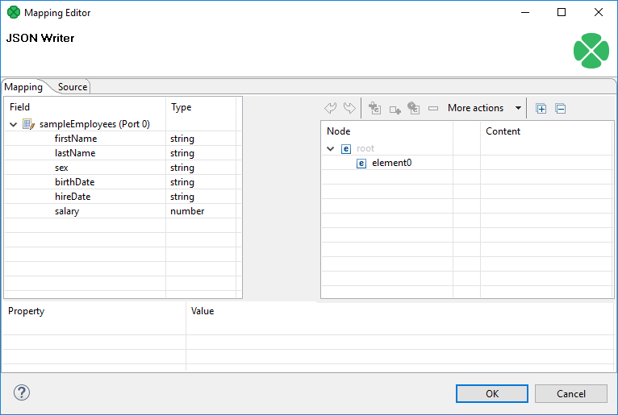
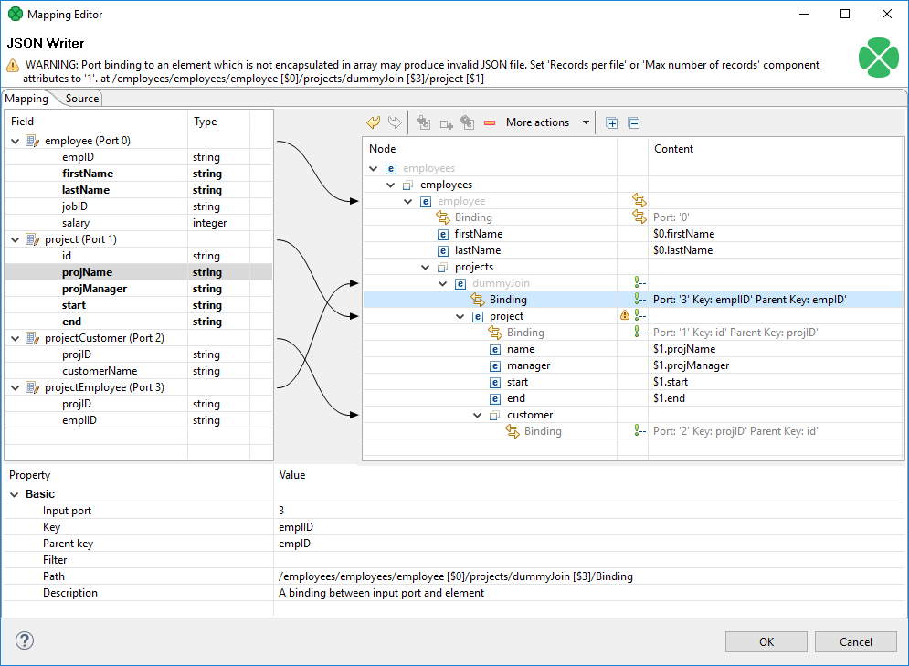
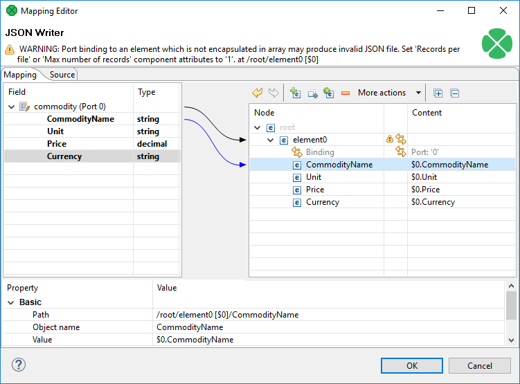

<!-- Development > Component reference > Writers > JSONWriter -->

### JSONWriter


| [Short description](jsonwriter.md#short-description) |
| --- |
| [Ports](jsonwriter.md#ports) |
| [Metadata](jsonwriter.md#metadata) |
| [JSONWriter attributes](jsonwriter.md#jsonwriter-attributes) |
| [Details](jsonwriter.md#details) |
| [Examples](jsonwriter.md#examples) |
| [Best practices](jsonwriter.md#best-practices) |
| [See also](jsonwriter.md#see-also) |
> [!TIP]
> If you’re interested in learning more about this subject, we offer the [Work with JSON/XML course](https://academy.cloverdx.com/courses/json-xml) in our CloverDX Academy.

#### Short description

**JSONWriter** writes data in the [JSON format](http://www.json.org/).

| Data output | Input ports | Output ports | Each to all outputs | Different to different outputs | Transformation | Transf. req. | Java | Auto-propagated metadata |
| --- | --- | --- | --- | --- | --- | --- | --- | --- |
| JSON file | 1-n | 0-1 | **✓** | **⨯** | **⨯** | **⨯** | **⨯** | **⨯** |

#### Ports

| Port type | Number | Required | Description | Metadata |
| --- | --- | --- | --- | --- |
| Input | 0-n | At least one | Input records to be joined and mapped into the JSON structure. | Any (each port can have different metadata) |
| Output | 0 | **⨯** | Optional. For port writing. | Only one field (`byte`, `cbyte` or `string`) is used. The field name is used in **File URL** to govern how the output records are processed - see [Writing to output port](examples-of-file-url-in-writers.md#writing-to-output-port) |

#### Metadata

**JSONWriter** does not propagate metadata.

**JSONWriter** has no metadata template.

#### JSONWriter attributes

| Attribute | Req | Description | Possible values |
| --- | --- | --- | --- |
| Basic |  |  |  |
| File URL | yes | The target file for the output JSON. See [Supported file URL formats for Writers](examples-of-file-url-in-writers.md). |  |
| Charset |  | The encoding of an output file generated by **JSONWriter**.  The default encoding depends on `DEFAULT_SOURCE_CODE_CHARSET` in defaultProperties. | UTF-8 \| <other encodings> |
| Mapping | [[1]](jsonwriter.md#jsonwriter-attributes-fn01) | Defines how input data is mapped onto an output JSON. See [Details](jsonwriter.md#details). |  |
| Mapping URL | [[1]](jsonwriter.md#jsonwriter-attributes-fn01) | External text file containing the mapping definition. |  |
| Advanced |  |  |  |
| Create directories |  | By default, non-existing directories are not created. If set to `true`, they are created. | false (default) \| true |
| Omit new lines wherever possible |  | By default, each element is written to a separate line. If set to `true`, new lines are omitted when writing data to the output JSON structure. Thus, all JSON elements are on one line only. | false (default) \| true |
| Cache size |  | The size of the database used when caching data from ports to elements (the data is first processed then written). The larger your data is, the larger cache is needed to maintain fast processing. | auto (default) \| e.g. 300MB, 1GB etc. |
| Cache in Memory |  | Cache data records in memory instead of the JDBM’s disk cache (default). Note that while it is possible to set the maximal size of the disk cache, this setting is ignored in case the in-memory cache is used. As a result, an `OutOfMemoryError` may occur when caching too many data records. | false (default) \| true |
| Sorted input |  | Tells **JSONWriter** whether the input data is sorted. Setting the attribute to true declares you want to use the sort order defined in **Sort keys**, see below. | false (default) \| true |
| Sort keys |  | Tells **JSONWriter** how the input data is sorted, thus enabling streaming. The sort order of fields can be given for each port in a separate tab. Working with **Sort keys** has been described in [Sort key](components.md#sort-key). |  |
| Max number of records |  | The maximum number of records written to all output files. See [Selecting output records](selecting-output-records.md). | 0-N |
| Partitioning |  |  |  |
| Records per file |  | The maximum number of records that are written to a single file. See [Partitioning output into different output files](partitioning-output-into-different-output-files.md) | 1-N |
| Partition key |  | The key whose values control the distribution of records among multiple output files. For more information, see [Partitioning output into different output files](partitioning-output-into-different-output-files.md). |  |
| Partition lookup table |  | The ID of a lookup table. The table serves for selecting records which should be written to the output file(s). For more information, see [Partitioning output into different output files](partitioning-output-into-different-output-files.md). |  |
| Partition file tag |  | By default, output files are numbered. If this attribute is set to `Key file tag`, output files are named according to the values of **Partition key** or **Partition output fields**. For more information, see [Partitioning output into different output files](partitioning-output-into-different-output-files.md). | Number file tag (default) \| Key file tag |
| Partition output fields |  | The fields of **Partition lookup table** whose values serve for naming output file(s). For more information, see [Partitioning output into different output files](partitioning-output-into-different-output-files.md). |  |
| Partition unassigned file name |  | The name of a file that the unassigned records should be written into (if there are any). If it is not given, the data records whose key values are not contained in **Partition lookup table** are discarded. For more information, see [Partitioning output into different output files](partitioning-output-into-different-output-files.md). |  |
| Partition key sorted |  | In case partitioning into multiple output files is turned on, all output files are open at once. This could lead to an undesirable memory footprint for many output files (thousands). Moreover, for example unix-based OS usually have a very strict limitation of number of simultaneously open files (1,024) per process.  In case you run into one of these limitations, consider sorting the data by a partition key using one of our standard sorting components and setting this attribute to true. The partitioning algorithm does not need to keep open all output files, just the last one is open at one time. For more information, see [Partitioning output into different output files](partitioning-output-into-different-output-files.md). | false (default) \| true |
| Create empty files |  | If set to `false`, prevents the component from creating an empty output file when there are no input records. | true (default) \| false |

| 1 |  One of these has to be specified. If both are specified, **Mapping URL** has a higher priority. |
| --- | --- |

#### Details

**JSONWriter** receives data from all connected input ports and converts records to JSON objects based on the mapping you define. Finally, the component writes the resulting tree structure of elements to the output: a JSON file, port or dictionary. **JSONWriter** can write lists and variants.

Every JSON object can contain other nested JSON objects. Thus, the JSON format resembles XML and similar tree formats.

As a consequence, you map the input records to the output file in a manner similar to [XMLWriter](extxmlwriter.md#details). Mapping editors in both components have similar logic. The very basics of mapping are:

- Connect input edges to **JSONWriter** and edit the component’s **Mapping** attribute. This will open the visual mapping editor:
  
  *Figure 377. Mapping editor in JSONWriter after first open. Metadata on the input edge(s)are displayed on the left hand side. The right hand paneis where you design the desired JSON tree.Mapping is then performed by dragging metadata from left to right(and performing additional tasks described below).*
- In the right hand pane, design your JSON tree consisting of
  - [Elements](extxmlwriter.md#element)
    > [!IMPORTANT]
    > Unlike **XMLWriter** , you do not map metadata to any attributes.
  - **Arrays** - arrays are ordered sets of values in JSON enclosed between the `[` and `]` brackets. To learn how to map them in **JSONWriter**, see [Writing arrays II](jsonwriter.md#writing-arrays-ii).
  - [Wildcard elements](extxmlwriter.md#wildcard-element)- another option to mapping elements explicitly. You use the **Include** and **Exclude** patterns to generate element names from respective metadata.
- Connect input records to output (wildcard) elements to create [Binding](extxmlwriter.md#creating-the-mapping-mapping-ports-and-fields).
  Example 377. Creating Binding
  
  *Figure 378. Example mapping in JSONWriter - employees are joined with projectsthey work on.Fields in bold (their content) will be printed to the output file - see below.*
  Excerpt from the output file related to [the figure above](jsonwriter.md#jsonwriter-fig-mapping) (example of one employee written as JSON):
  ```json
  "employee" : {
      "firstName" : "Jane",
      "lastName" : "Simson",
      "projects" : {
        "project" : {
          "name" : "JSP",
          "manager" : "John Smith",
          "start" : "06062006",
          "end" : "in progress",
          "customers" : {
            "customer" : {
              "name" : "Sunny"
            },
            "customer" : {
              "name" : "Weblea"
            }
          }
        },
        "project" : {
          "name" : "OLAP",
          "manager" : "Raymond Brown",
          "start" : "11052004",
          "end" : "31012006",
          "customers" : {
            "customer" : {
              "name" : "Sunny"
            }
          }
        }
      }
    },
  ```
- At any time, you can switch to the [Source tab](extxmlwriter.md#creating-the-mapping-source-tab) and write/check the mapping yourself in code.
- If the basic instructions found here are not satisfying, please consult XMLWriter’s [Details](extxmlwriter.md#details) where the whole mapping process is described in detail.
- When writing variant fields, **JSONWriter** translates the tree structure of variant directly to JSON. A variant map is formatted as JSON object, variant list is formatted as JSON array. Dates in variant are formatted as datetime strings in UTC. Byte arrays in variant are formatted as Base64 strings.

#### Examples

| [Writing flat records as JSON](jsonwriter.md#writing-flat-records-as-json) |
| --- |
| [Writing arrays I](jsonwriter.md#writing-arrays-i) |
| [Writing arrays II](jsonwriter.md#writing-arrays-ii) |
| [Using wild cards](jsonwriter.md#using-wild-cards) |
| [Using templates](jsonwriter.md#using-templates) |

##### Writing flat records as JSON

This example shows a way to write flat records (no arrays, no subtrees) to a JSON file.

The input edge connected to **JSONWriter** has metadata fields **CommodityName**, **Unit**, **Price** and **Currency** and receives the data:

```
Brent Crude Oil | Barrel | 75.36   | USD
Gold            | Ounce  | 1298.54 | USD
Silver          | Ounce  | 16.83   | USD
```

Write the data to a JSON file.

###### Solution

Set up the **File URL** and **Mapping** attributes.

| Attribute | Value |
| --- | --- |
| File URL | ${DATAOUT_DIR}/comodities.json |
| Mapping | ```xml <?xml version="1.0" encoding="UTF-8"?> <root xmlns:clover="http://www.cloveretl.com/ns/xmlmapping">   <Commodity  clover:inPort="0">     <CommodityName>$0.CommodityName</CommodityName>     <Unit>$0.Unit</Unit>     <Price>$0.Price</Price>     <Currency>$0.Currency</Currency>   </Commodity> </root> ``` |


*Figure 379. JSONWriter mapping*

###### Produced JSON File

```json
{
  "Commodity" : {
    "CommodityName" : "Brent Crude Oil",
    "Unit" : "Barrel",
    "Price" : 75.36,
    "Currency" : "USD"
  },
  "Commodity" : {
    "CommodityName" : "Gold",
    "Unit" : "Ounce",
    "Price" : 1298.54,
    "Currency" : "USD"
  },
  "Commodity" : {
    "CommodityName" : "Silver",
    "Unit" : "Ounce",
    "Price" : 16.83,
    "Currency" : "USD"
  }
}
```

##### Writing arrays I

This examples shows a way to write arrays.

The input edge connected to the **JSONWriter** has metadata fields **CommodityName**, **Unit**, **Price** and **Currency**. It is similar to the previous example, but the price is not a single value but a list of values.

###### Solution

Set up the **File URL** and **Mapping** attributes.

| Attribute | Value |
| --- | --- |
| File URL | ${DATAOUT_DIR}/comodities2.json |
| Mapping | ```xml <?xml version="1.0" encoding="UTF-8"?> <root xmlns:clover="http://www.cloveretl.com/ns/xmlmapping">   <Commodity clover:inPort="0">     <CommodityName>$0.CommodityName</CommodityName>     <Unit>$0.Unit</Unit>     <clover:collection clover:name="Price">       <item>$0.Price</item>     </clover:collection>     <Currency>$0.Currency</Currency>   </Commodity> </root> ``` |

###### Produced JSON File

```json
{
  "Commodity" : {
    "CommodityName" : "Brent Crude Oil",
    "Unit" : "Barrel",
    "Price" : [ 75.36, 75.87 ],
    "Currency" : "USD"
  },
  "Commodity" : {
    "CommodityName" : "Gold",
    "Unit" : "Ounce",
    "Price" : [ 1298.54, 1298.18 ],
    "Currency" : "USD"
  },
  "Commodity" : {
    "CommodityName" : "Silver",
    "Unit" : "Ounce",
    "Price" : [ 16.83, 16.80 ],
    "Currency" : "USD"
  },
}
```

##### Writing arrays II

This example shows a way to write *summary array* using values of all input records.

Set up the **File URL** and **Mapping** attributes.

###### Solution

| Attribute | Value |
| --- | --- |
| File URL | ${DATAOUT_DIR}/comodities3.json |
| Mapping | ```xml <?xml version="1.0" encoding="UTF-8"?> <root xmlns:clover="http://www.cloveretl.com/ns/xmlmapping">   <Commodity clover:inPort="0">     <CommodityName>$0.CommodityName</CommodityName>     <Unit>$0.Unit</Unit>     <Price>$0.Price</Price>     <Currency>$0.Currency</Currency>   </Commodity>   <clover:collection clover:name="CommodityNames" clover:inPort="0">     <CommodityName>$0.CommodityName</CommodityName>   </clover:collection> </root> ``` |

###### Produced JSON File

```json
{
  "Commodity" : {
    "CommodityName" : "Brent Crude Oil",
    "Unit" : "Barrel",
    "Price" : 75.36,
    "Currency" : "USD"
  },
  "Commodity" : {
    "CommodityName" : "Gold",
    "Unit" : "Ounce",
    "Price" : 1298.54,
    "Currency" : "USD"
  },
  "Commodity" : {
    "CommodityName" : "Silver",
    "Unit" : "Ounce",
    "Price" : 16.83,
    "Currency" : "USD"
  },
  "CommodityNames" : [ "Brent Crude Oil", "Gold", "Silver" ]
}
```

##### Using wild cards

This example shows a way to use wild cards to map input metadata fields.

Write the data from the first example to a JSON file. The solution must be flexible - it must propagate the changes in input metadata to the output without changing the configuration of **JSONWriter**.

###### Solution

| Attribute | Value |
| --- | --- |
| File URL | ${DATAOUT_DIR}/comodities4.json |
| Mapping | ```xml <?xml version="1.0" encoding="UTF-8"?> <root xmlns:clover="http://www.cloveretl.com/ns/xmlmapping">   <Commodity clover:inPort="0">     <clover:elements clover:include="$0.*"/>   </Commodity> </root> ``` |

###### Produced JSON File

```json
{
  "Commodity" : {
    "CommodityName" : "Brent Crude Oil",
    "Unit" : "Barrel",
    "Price" : 75.36,
    "Currency" : "USD"
  },
  "Commodity" : {
    "CommodityName" : "Gold",
    "Unit" : "Ounce",
    "Price" : 1298.54,
    "Currency" : "USD"
  },
  "Commodity" : {
    "CommodityName" : "Silver",
    "Unit" : "Ounce",
    "Price" : 16.83,
    "Currency" : "USD"
  }
}
```

##### Using templates

This example shows a way to write output elements names based on input data.

Write the data from the first example to a JSON file. The name of the element containing the price of commodity should be the unit of measurement.

###### Solution

| Attribute | Value |
| --- | --- |
| File URL | ${DATAOUT_DIR}/comodities5.json |
| Mapping | ```xml <?xml version="1.0" encoding="UTF-8"?> <root xmlns:clover="http://www.cloveretl.com/ns/xmlmapping">   <Commodity clover:inPort="0">     <CommodityName>$0.CommodityName</CommodityName>     <clover:element clover:name="$0.Unit">$0.Price</clover:element>     <Currency>$0.Currency</Currency>   </Commodity> </root> ``` |

Notice the dummy element `CommodityName` which you bind the input field to.

###### Produced JSON File

```json
{
  "Commodity" : {
    "CommodityName" : "Brent Crude Oil",
    "Barrel" : 75.36,
    "Currency" : "USD"
  },
  "Commodity" : {
    "CommodityName" : "Gold",
    "Ounce" : 1298.54,
    "Currency" : "USD"
  },
  "Commodity" : {
    "CommodityName" : "Silver",
    "Ounce" : 16.83,
    "Currency" : "USD"
  }
}
```

##### More input streams

This example shows a way to merge data from multiple input edges to a JSON file.

There are two input edges. The records on the first one contain a commodity name and unit of measurement. The records on the second one contain a commodity name, price per unit and currency. Multiple records from the second input port can correspond to a single record from the first input port. Create a JSON file which contains record from the first input port and corresponding records from the second output port as a subtree.

###### Solution

| Attribute | Value |
| --- | --- |
| File URL | ${DATAOUT_DIR}/comodities6.json |
| Mapping | ```xml <?xml version="1.0" encoding="UTF-8"?> <root xmlns:clover="http://www.cloveretl.com/ns/xmlmapping">   <Commodity clover:inPort="0">     <clover:elements clover:include="$0.*"/>       <clover:collection clover:name="Price">         <Price clover:inPort="1"                clover:key="CommodityName"                clover:parentKey="CommodityName">           <clover:elements clover:include="$1.*"                            clover:exclude="$1.CommodityName"/>         </Price>     </clover:collection>   </Commodity> </root> ``` |

###### Produced JSON File

```json
{
  "Commodity" : {
    "CommodityName" : "Silver",
    "Unit" : "Ounce",
    "Price" : [ {
      "PricePerUnit" : 17.81,
      "Currency" : "USD"
    } ]
  },
  "Commodity" : {
    "CommodityName" : "Gold",
    "Unit" : "Ounce",
    "Price" : [ {
      "PricePerUnit" : 1302.50,
      "Currency" : "USD"
    }, {
      "PricePerUnit" : 1300.00,
      "Currency" : "USD"
    } ]
  }
}
```

#### Best practices

We recommend users to explicitly specify **Charset**.

#### See also

| [JSONReader](jsonreader.md) |
| --- |
| [JSONExtract](jsonextract.md) |
| [XMLWriter](extxmlwriter.md) |
| [Common properties of components](components.md#common-properties-of-components) |
| [Specific attribute types](components.md#specific-attribute-types) |
| [Common properties of Writers](common-of-writers.md) |
| [Writers comparison](common-of-writers.md#writers-comparison) |
