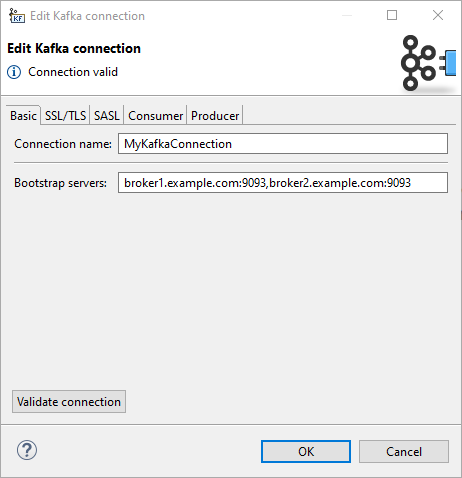
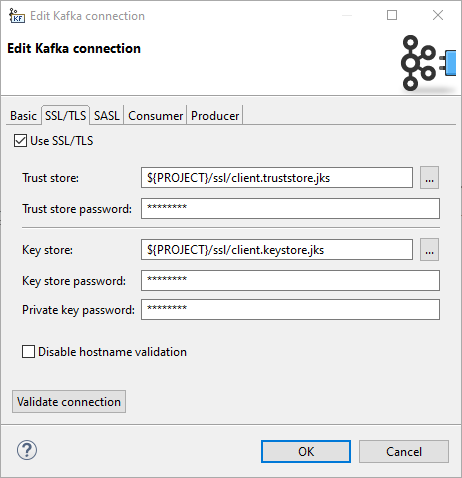
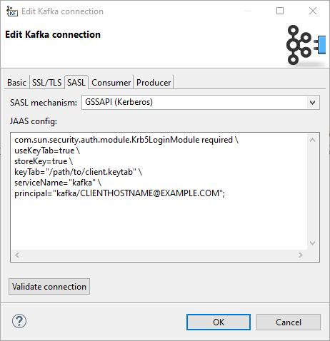
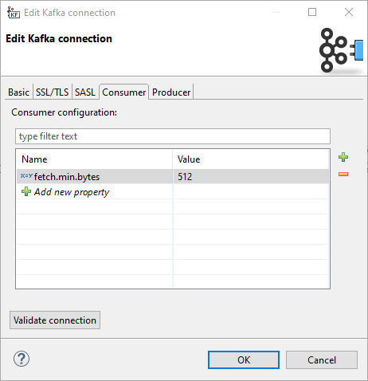
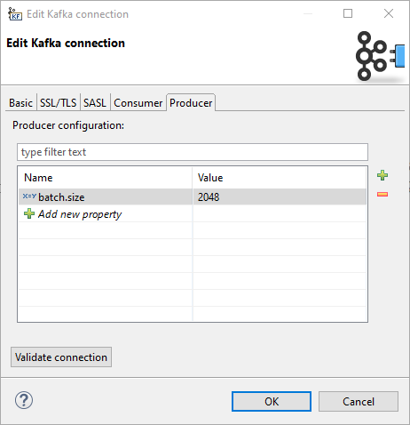

<!-- Development > Job elements > Connections > Kafka connections -->

### Kafka connections

| [Creating Kafka connection](kafka-connections.md#creating-kafka-connection) |
| --- |
| [Details](kafka-connections.md#details) |

#### Short description

**Kafka connection** allows you to connect to a Kafka cluster. The connection is required by components which consume or produce records to Kafka (**KafkaReader**, **KafkaWriter** and **KafkaCommit**).

#### Creating Kafka connection

To create a Kafka connection, right click **Connections** in **Outline** and choose **Connections** ****Create Kafka connection**.

In **Edit Kafka connection** dialog, fill in **Connection name** and **Bootstrap servers**. These two properties are sufficient for a plain unauthenticated connection.

To set up connection authentication and/or encryption, you need to use configuration on the following **SSL/TLS** and/or **SASL** tabs.

Save the connection and it can be used in the graph components.

##### Basic

Connection properties on the **Basic** tab are mandatory.

*Figure 260. Kafka connection dialog - Basic tab*
**Connection name**
A name for this connection.

Note that when creating a new connection, the entered name will be used to generate an ID of the connection. Whereas the connection name is just an informational label, the connection ID is used to reference this connection from graph components. Once the connection is created, the ID cannot be changing the connection name (to avoid accidental breaking of references). To change the ID of and existing connection, use the Properties view.
**Bootstrap servers**
A list of host/port pairs to use for establishing the initial connection to the Kafka cluster, e.g. `broker1.example.com:9093,broker2.example.com:9093`.

Corresponds to Kafka `bootstrap.servers` property.

##### Validate connection

The connection can be validated using the **Validate connection** button. When working with a server project, the validation is performed on server side, i.e. additional configuration (like key store paths) should be set up on the Server and the connection properties set accordingly.

##### SSL/TLS

Properties on the **SSL/TLS** tab allow you to use SSL for traffic enpcyption as well as for authentication.

*Figure 261. Kafka connection dialog - SSL/TLS tab*
**Use SSL/TLS**
Enables the use of SSL/TLS for encryption and optionally also for client authentication.

Internally, it sets the Kafka `security.protocol` property to `PLAINTEXT`/`SSL`, or `SASL_PLAINTEXT`/`SASL_SSL` when **SASL mechanism** is not empty.
**Trust store**
The location of the trust store file.

Sets the Kafka `ssl.truststore.location` property.
**Trust store password**
The password for the trust store file. If a password is not set access to the truststore is still available, but integrity checking is disabled.

Sets the Kafka `ssl.truststore.password` property.
**Key store**
The location of the key store file. This is optional and can be used for two-way authentication for client.

Sets the Kafka `ssl.keystore.location` property.
**Key store password**
The store password for the key store file. Optional.

Sets the Kafka `ssl.keystore.password` property.
**Private key password**
The password of the private key in the key store file. Optional.

Sets the Kafka `ssl.key.password` property.
**Disable hostname validation**
Disables server host name validation.

Corresponds to setting `ssl.endpoint.identification.algorithm` to an empty string.

##### SASL

Properties on the **SASL** tab allow you to use SASL authentication mechanisms. Kafka uses the Java Authentication and Authorization Service (JAAS) for SASL configuration.

*Figure 262. Kafka connection dialog - SASL tab*
**SASL mechanism**
SASL mechanism used for the connection. Can be used by itself or in combination with SSL/TLS.

An empty value means no SASL authentication. There are pre-filled values for GSSAPI (Kerberos) and PLAIN authentication, but you can enter a custom value.

Corresponds to Kafka `sasl.mechanism` property.
**JAAS config**
JAAS login context parameters for SASL connection in the format used by JAAS configuration files. The format is described in [https://docs.oracle.com/en/java/javase/11/security/appendix-b-jaas-login-configuration-file.html](https://docs.oracle.com/en/java/javase/11/security/appendix-b-jaas-login-configuration-file.html).

Corresponds to Kafka `sasl.jaas.config` property.

##### Consumer

On the **Consumer** tab, you can specify consumer properties which will be shared by all **KafkaReader** components using this connection.

Any property set by configuration on previous tabs can be also overridden here.

Consumer properties defined on **KafkaReader** components (attribute **Consumer configuration**) have a higher priority over properties defined in the connection.

*Figure 263. Kafka connection dialog - Consumer tab*

##### Producer

On the **Producer** tab, you can specify producer properties which will be shared by all **KafkaWriter** components using this connection.

Any property set by configuration on previous tabs can be also overridden here.

Producer properties defined on **KafkaWriter** components (attribute **Producer configuration**) have a higher priority over properties defined in the connection.

*Figure 264. Kafka connection dialog - Producer tab*

#### Details

Note that some authentication settings are very environment-dependent. When setting up a connection to be used on Server, the absolute paths (e.g. paths to key stores or trust stores outside of a sandbox, paths to keytab files) are absolute paths on the Server.

Also, the Kerberos authentication depends on some system client configuration, which has to be present on the Server as well.

This configuration can be checked using the **Validate connection** button.

#### See also:

| [KafkaReader](kafkareader.md) |
| --- |
| [KafkaWriter](kafkawriter.md) |
| [KafkaCommit](kafkacommit.md) |
