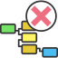

<!-- Development > Component reference > Job Control > KillGraph -->

### KillGraph

Jobflow Component

| [Short description](killgraph.md#short-description) |
| --- |
| [Ports](killgraph.md#ports) |
| [Metadata](killgraph.md#metadata) |
| [KillGraph attributes](killgraph.md#killgraph-attributes) |
| [Details](killgraph.md#details) |
| [See also](killgraph.md#see-also) |

#### Short description

**KillGraph** aborts specified graphs and passes their final status to the output port.

| Same input metadata | Sorted inputs | Inputs | Outputs | Each to all outputs | Java | CTL | Auto-propagated metadata |
| --- | --- | --- | --- | --- | --- | --- | --- |
| **⨯** | **⨯** | 0-1 | 0-1 | **✓** | **⨯** | **✓** | **✓** |

#### Ports

| Port type | Number | Required | Description | Metadata |
| --- | --- | --- | --- | --- |
| Input | 0 | **⨯** | Input tokens with identifications of interrupted graphs. | Any |
| Output | 0 | **⨯** | Final graph execution status. | Any |

#### Metadata

**KillGraph** does not propagate metadata from left to right or from right to left.

This component has metadata templates. The templates are described in [Details](killgraph.md#details). General details on metadata templates are available in [metadata templates](components.md#metadata-templates).

#### KillGraph attributes

| Attribute | Req | Description | Possible values |
| --- | --- | --- | --- |
| Basic |  |  |  |
| Run ID | no | Specifies the run ID of an interrupted graph. Has higher priority than the **Execution group** attribute. This attribute can be overridden in input mapping. | long |
| Execution group | no | All graphs belonging to the specified execution group are interrupted. The **Run ID** attribute has higher priority. This attribute can be overridden in input mapping. | string |
| Kill daemon children | no | Specifies whether even daemon children are interrupted. Non-daemon children are aborted in any case. This attribute can be overridden in input mapping. | false (default) \| true |
| Input mapping | no | Input mapping defines how to extract **Run ID** or **Execution group** to be interrupted from incoming token. See [Input mapping](killgraph.md#input-mapping). | CTL transformation |
| Output mapping | no | Output mapping defines how to populate the output token by final graph status of interrupted graph. See [Output mapping](killgraph.md#output-mapping). | CTL transformation |

#### Details

The **KillGraph** component aborts graphs specified by **Run ID** or by **Execution group** (all graphs belonging to the Execution group are aborted). Final execution status of interrupted graphs is passed to the output port or just printed out to a log. Moreover, you can choose if even daemon children of interrupted graphs are aborted (non-daemon children are interrupted in any case) - see the **Execute graph as daemon** attribute of [ExecuteGraph](executegraph.md).

The component reads an input token, extracts **Run ID** or **Execution group** from incoming data (see the **Input mapping** attribute), interrupts the requested graphs and writes final status of the interrupted graph to the output port (see the **Output mapping** attribute).

In case the input port is not attached, just the graphs specified in the **Run ID** attribute or in **Execution group** attribute are interrupted.

##### Input mapping

Input mapping is regular CTL transformation which is executed for each input token to extract **Run ID** or **Execution group** to be interrupted. Output record has following structure:

| Field Name | Type | Description |
| --- | --- | --- |
| runId | long | Overrides component attribute **Run ID** |
| executionGroup | string | Overrides component attribute **Execution group** |
| killDaemonChildren | boolean | Overrides component attribute **Kill daemon children** |

##### Output mapping

Output mapping is regular CTL transformation which is executed for interrupted graph to populate the output token. Available input data has following structure:

| Field Name | Type | Description |
| --- | --- | --- |
| runId | long | run ID of interrupted graph |
| originalJobURL | string | path to interrupted graph |
| version | string | version of interrupted graph |
| submitTime | long | time when the graph execution was requested. The graph can be enqueued and started later, see `startTime` below. See [Job queue](../operations/job-queue.md) for more details about job queue. |
| startTime | date | time of graph startup. If the graph was enqueued, this is the time when the graph was taken from the queue and started. See [Job queue](../operations/job-queue.md) for more details about job queue. |
| endTime | date | time of graph finish |
| duration | long | graph run execution time in milliseconds (endTime - startTime) |
| status | string | final graph execution status (FINISHED_OK \| ERROR \| ABORTED \| TIMEOUT) |
| errException | string | cause exception for failed graphs |
| errMessage | string | error message for failed graphs |
| errComponent | string | component ID which caused the graph to fail |
| errComponentType | string | type of component which caused the graph to fail |

#### See also

| [Common properties of components](components.md#common-properties-of-components) |
| --- |
| [Specific attribute types](components.md#specific-attribute-types) |
| [Common properties of Job Control](common-of-job-control.md) |
| [Job Control comparison](common-of-job-control.md#job-control-comparison) |
