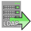

<!-- Development > Component reference > Readers > LDAPReader -->

### LDAPReader



| [Short description](ldapreader.md#short-description) |
| --- |
| [Ports](ldapreader.md#ports) |
| [Metadata](ldapreader.md#metadata) |
| [LDAPReader attributes](ldapreader.md#ldapreader-attributes) |
| [Details](ldapreader.md#details) |
| [Examples](ldapreader.md#examples) |
| [See also](ldapreader.md#see-also) |

#### Short description

**LDAPReader** reads information from an LDAP directory converting it to **CloverDX** Data Records.

| Data source | Input ports | Output ports | Each to all outputs | Different to different outputs | Transformation | Transf. req. | Java | CTL | Auto-propagated metadata |
| --- | --- | --- | --- | --- | --- | --- | --- | --- | --- |
| LDAP directory tree | 1 | 1-n | **⨯** | **⨯** | **⨯** | **⨯** | **⨯** | **⨯** | **⨯** |

#### Ports

| Port type | Number | Required | Description | Metadata |
| --- | --- | --- | --- | --- |
| Input | 0 | **⨯** | Input records used for defining base and filter.  If the input port is connected then for each input record one query is assembled and sent to the LDAP server. If such query returns no result then one empty record is sent out (with autofilling fields populated); This behavior requires the input port to be connected. | Any |
| Output | 0 | **✓** | For correct data records. Results of the search must have the same `objectClass`. | Any[[1]](ldapreader.md#ldapreader-footnote1) |
| 1-n | **⨯** | For correct data records | Output 0 |  |

| 1 |  Metadata on the output must precisely describe the structure of the read object. |
| --- | --- |

#### Metadata

LDAPReader does not propagate metadata.

LDAPReader has no metadata template.

Metadata on the output must precisely describe the structure of the read object. Only Clover fields of types `string` and `byte`/`compressedByte` are supported.

**Note** that [metadata field names](metadata-editor.md#metadata-field-name) have strict naming conventions; therefore, to map an LDAP attribute containing special characters (e.g. a dash) in its name, use a [metadata field label](metadata-editor.md#metadata-field-name). Metadata field labels can contain special characters and have a higher priority than field names. For example, to read from the `msDS-PrincipalName` LDAP attribute, use a field with label `msDS-PrincipalName` and any name that follows the naming convention (e.g. `msDS_PrincipalName`).

Metadata can use [Autofilling functions](metadata-records-and-fields.md#autofilling-functions). The autofilling attribute **filename** is set to complete the URL (includes base, filter).

#### LDAPReader attributes

| Attribute | Req | Description | Possible values |
| --- | --- | --- | --- |
| Basic |  |  |  |
| LDAP URL | yes | LDAP URL of the directory. | `ldap://host:port/` |
| Base DN | yes | Base *Distinguished Name* (the root of your LDAP tree) used for LDAP search. It is a comma separated list of `attribute=value` pairs referring to any location with the directory, e.g. if `ou=Humans,dc=example,dc=com` is the root of the subtree to be searched, entries representing people from *example.com* domain are to be found.  Optional references to input record’s fields in the form `$field_name` are resolved. |  |
| Filter | yes | Filter used for the LDAP connection. `attribute=value` pairs as a filtering condition for the search. All entries matching the filter will be returned, e.g. `mail=*` returns every entry which has an email address, while `objectclass=*` is the standard method for returning all entries matching a given *base* and *scope* because all entries have values for `objectclass`.  Optional references to input record’s fields in the form `$field_name` are resolved. |  |
| Scope |  | Scope of the search request.  By default, only one `object` is searched.  If `onelevel`, the level immediately below the distinguished name is searched.  If `subtree`, the whole subtree below the distinguished name is searched. | object (default) \| onelevel \| subtree |
| User | no | The user DN to be used when connecting to the LDAP directory. Similar to the following: `cn=john.smith,dc=example,dc=com`. |  |
| Password | no | The password to be used when connecting to the LDAP directory. |  |
| Advanced |  |  |  |
| Multi-value separator | no | The character/string to be used when mapping multi-value attribute on simple Clover field as concatenation of string values.  **LDAPReader** can handle keys with multiple values. These are delimited by this string or character. <none> is special escape value which turns off this functionality, then only the first value is read. This attribute can only be used for `string` data type. When `byte` type is used, the first value is the only one that is read. | "\|" (default) \| other character or string |
| Alias handling |  | To control how aliases (leaf entries pointing to another object in the namespace) are dereferenced. | always \| never \| finding (default)\| searching |
| Referral handling |  | By default, links to other servers are ignored. If `follow`, the referrals are processed. | ignore (default) \| follow |
| Page size | no | The size of the page used in paging. If >0 then LDAP server is queried in paging mode and this attribute defines how many records are returned on one page. | e.g. 256 |
| All attributes | no | The query LDAP for all available attributes or only those directly mappable on output fields. When using `defaultField` then this should be set to True. | True \| False |
| Default field | no | The name of the output field of type MAP(string) where attributes without explicit mapping (corresponding field names on the output port) will be stored. | e.g. field15 |
| Binary attributes | no | The list of field names containing binary attributes  By default, the `objectGUID` is added to the list of binary attributes. | e.g. objectGUID |
| LDAP Connection Properties | no | Java Property-like style of key-value definitions which will be added to LDAP connection environment. |  |

#### Details

**LDAPReader** provides the logic to extract the search results and transform them into **CloverDX** Data Records. The results of the search must have the same `objectClass`.

The metadata provided on the output port/edge (field names) are used when mapping from LDAP attributes to fields.

Only `string` and `byte` (`cbyte`) **CloverDX** data fields are supported. String is compatible with most of LDAP usual types, byte is necessary; for example, for `userPassword` LDAP type reading.

Multi-value attributes are mapped onto target fields in two ways:

- if target field is of type List then individual values are stored as individual items.
- If target field is simple type (and `multiValueSeparator` is set) then values are concatenated with the defined separator and stored as a single value.

When the `defaultMapping` field is set (must be of type Map) then all unmapped attributes returned from LDAP server are stored in the map in a key→value manner. Multi-values are stored concatenated.

##### Alias handling

Searching the entry to which an alias entry points is known as *dereferencing* an alias. Setting the **Alias handling** attribute, you can control the extent to which entries are searched:

- `always`: Always dereference aliases.
- `never`: Never dereference aliases.
- `finding`: Dereference aliases in locating the base of the search but not in searching subordinates of the base.
- `searching`: Dereference aliases in searching subordinates of the base but not in locating the base

#### Examples

| [Reading data from LDAP](ldapreader.md#reading-data-from-ldap) |
| --- |
| [Looking up a record from LDAP](ldapreader.md#looking-up-a-record-from-ldap) |
| [Reading binary attributes](ldapreader.md#reading-binary-attributes) |

##### Reading data from LDAP

Read records with `uid=*` from `ou=people,dc=foo,dc=?` subtree on `foobar.com` (port 389). Use credentials: user `uid=Manager,dc=foo,dc=bar` and password `manager_password`. The values for `dc=?` will be received from the input edge in the **dc** field.

###### Solution

| Attribute | Value |
| --- | --- |
| LDAP URL | ldap://example.com:389 |
| Base DN | ou=people,dc=foo,dc=$dc |
| Filter | uid=* |
| Scope | subtree |

##### Looking up a record from LDAP

Retrieve information about particular person identified by UID. The UID is received from the input edge. The information about persons is in `cn=people,dc=uninett,dc=no` subtree on LDAP server example.com (port 389).

The metadata on output port has following fields: `cn` (string), `displayName` (string), `mail` (list of strings), `uid` (string), `objectClass` (list of strings), `default` (map of strings).

###### Solution

| Attribute | Value |
| --- | --- |
| LDAP URL | ldap://example.com:389 |
| Base DN | ou=people,dc=example,dc=com |
| Filter | uid=$userId |
| Scope | subtree |

The filter parameter contains a reference to the input field name **userId**. This reference will be resolved for all input records and LDAP query executed (and result parsed) for each input record.

##### Reading binary attributes

This example shows a way to read binary attributes from LDAP.

Read the records from the [Reading data from LDAP](ldapreader.md#reading-data-from-ldap) example. In addition to the example, the records contain binary field **objectGUID**.

###### Solution

The output metadata of **LDAPReader** should contain a byte field for **objectGUID**.

Use the [Map](reformat.md) and [byte2hex](conversion-functions-ctl2.md#byte2hex) function to convert the byte field to string.

```ctl
//#CTL2

function integer transform() {
    $out.0.* = $in.0.*;
    $out.0.logonHours = byte2hex($in.0.logonHours);

    return ALL;
}
```

Similarly, you can use the [byte2hex](conversion-functions-ctl2.md#byte2hex) function with a prefix argument to get a hexadecimal string representation of the **objectGUID** attribute.

```ctl
String strObjectGUID = byte2hex($in.0.objectGUID,"\\");
```

#### Best practices

- *Improving search performance:* If there are no alias entries in the LDAP directory that require dereferencing, choose **Alias handling**`never` option.

#### Compatibility

| Version | Compatibility Notice |
| --- | --- |
| 4.1.0-M1 | **LDAPReader** now supports paging. |
| 4.4.1 | **LDAPReader** now allows users to read binary data from binary fields. New attributes **Binary attributes** and **LDAP Connection properties** are available. |

#### See also

| [LDAPWriter](ldapwriter.md) |
| --- |
| [Common properties of components](components.md#common-properties-of-components) |
| [Specific attribute types](components.md#specific-attribute-types) |
| [Common properties of Readers](common-of-readers.md) |
| [Readers comparison](common-of-readers.md#readers-comparison) |
