<!-- Development > Advanced > Library development best practices -->

## 48. Library development best practices
> [!TIP]
> If you’re interested in learning more about this subject, we offer the [Libraries, Reusable Functionality & Packaging](https://academy.cloverdx.com/courses/subgraph-libraries) and [Publishing Data to Data Catalog and Underlying Theory](https://academy.cloverdx.com/courses/publishing-data) courses in our CloverDX Academy.

### Introduction

A **CloverDX** library is a redistributable package, which can contain reusable [graphs](part-graph-elements-structures-tools.md), [subgraphs](subgraphs.md#subgraphs-introduction), [jobflows](part-jobflow.md#jobflow-overview), [data services](data-service.md), or [metadata](metadata.md). Libraries offer significant improvements to code reusability and sharing in **CloverDX products**. Because libraries can be installed [multiple times](../operations/libraries.md#multiple-library-instances), they provide an easy option to quickly clone your solutions and set them up with different parameters and permissions to control users' visibility and allowed operations for individual libraries.

Libraries are developed in **CloverDX Designer** as regular projects, which are then exported to a library `.clib` file. During the [library export](export-library.md), the author selects which elements will be public, i.e., available to all users in **CloverDX Server**, **CloverDX Designer**, or **CloverDX Wrangler** after the library is [deployed](../operations/libraries.md#installation), [configured](../operations/libraries.md#configuration-tab), and enabled in **CloverDX Server**. We call these elements of the library **public interface**.

Public elements can be:

- **Subgraphs**
- **Metadata**
- **Graphs, jobflows, and data services**
- **Machine learning models**

Other elements in the exported project will be internal and will be used as sub-routines in the public ones.
> [!TIP]
> You can design your libraries or take advantage of our ready-to-use libraries in the [CloverDX Marketplace](https://marketplace.cloverdx.com/) repository, which includes solutions to quickly integrate with interfaces like *Hubspot* or *Google Drive*, or solutions that can help you easily encrypt and decrypt your data or implement Python scripts.

### Usage
> [!NOTE]
> The visibility of public elements depends on the permission setup in CloverDX Server. Server administrators can refer [here](../operations/libraries.md#permissions-tab) for more information on how to restrict or grant access to specific user groups.

#### Subgraphs

Public subgraphs from installed libraries are displayed in the [*Component Palette*](../developer/designer-layout.md#graph-editor-with-palette-of-components) in [server projects](../developer/cloverdx-projects-type.md#cloverdx-server-project) in **CloverDX Designer**, allowing you to easily use public subgraphs during the development process.

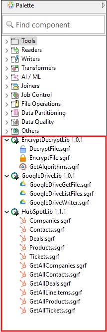
*Figure 473. Libraries in Component Palette*

##### Data Source and Data Target Connectors

Subgraphs that were marked as **Data Source Connectors** or **Data Target Connectors** during [library export](export-library.md) become available as [data sources](../user/data-sources-data-targets.md#data-sources) or [data targets](../user/data-sources-data-targets.md#data-targets) in the [Data Catalog](../user/data-catalog.md) in **CloverDX Wrangler**.

For connector development best practices and requirements, see [Data Source Connector Development](libraries-dev.md#data-source-connector-development) and [Data Target Connector Development.](libraries-dev.md#data-target-connector-development)

Administrators can refer [here](../operations/libraries.md#permissions-tab) for more information on setting up permissions for individual connectors for specific user groups.

For more information on Data Source and Data Target Connectors from the Wrangler perspective, refer to our [Data Source Connectors](../user/data-sources-data-targets.md#data-source-connectors) and [Data Target Connectors](../user/data-sources-data-targets.md#data-target-connectors) sections in the Wrangler documentation.

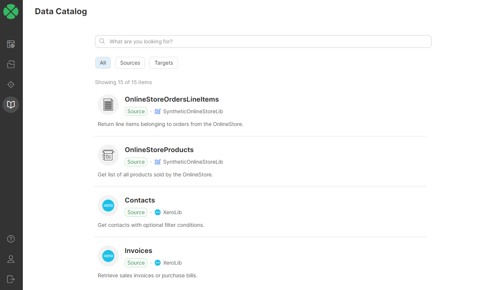

#### Metadata

When developing new graphs in **CloverDX Designer**, public metadata from installed libraries can be [linked](../developer/metadata-types.md#linking-external-shared-metadata-from-library) as shared metadata by opening the context menu of the Metadata group in the [Outline](../developer/designer-layout.md#outline-pane) pane and selecting **New metadata > Link shared definition from library**.

*Figure 474. Libraries metadata*

#### Graphs, Jobflows

Public graphs or jobflows become available in **CloverDX Server** to be scheduled or used in Event listeners. Server administrators can refer [here](../operations/libraries.md#graphs-jobflows) for more information.

##### Initialization Job

A graph or jobflow that is selected as an **Initialization job** during [library export](export-library.md) can be used to set up a configuration that cannot be set ahead of time during the development, e.g., generating data based on the provided connection to the source system. See [Initialization Jobs (pre-generating metadata)](libraries-dev.md#initialization-jobs-pre-generating-metadata) for best practices for initialization job development. Server administrators can refer to our [Server Library documentation](../operations/libraries.md#initialization-job) for more information on how to tell if a library includes an initialization job and how to run it.

##### Health Check

A graph or a jobflow that is marked as a **Health Check job** during [library export](export-library.md) can be scheduled in **CloverDX Server** to periodically check if a library is working properly. A Health Check job can be used to, e.g., ensure that an OAuth2 connection is still valid or that a connection to a 3rd party interface or database is working.

Server administrators can refer to our [Server Library documentation](../operations/libraries.md#health-check-job) for more information on the Health Check job logic and scheduling.

#### Data Services

Data services from installed libraries can be deployed in **CloverDX Server**. Server administrators can refer [here](../operations/libraries.md#data-services) for more information.

#### Machine Learning Models

Models from installed libraries can be used by AI components (via **Server model** property).

Each model is represented by a separate directory, typically located in `${PROJECT}/ml-model`. It can contain two configuration files: `config.json` (for *HuggingFace* models) and `config-cloverdx.json`.

### Library file structure

The library `.clib` file is, in essence, an archive of a CloverDX project. It can be imported to Designer via *File / Import…​ / CloverDX / Import CloverDX Project from Archive, Directory, or Library*.
> [!TIP]
> You can download a library from our [CloverDX Marketplace](https://marketplace.cloverdx.com/) and import it to explore the library design.

By default, a library project includes the following library-specific files:

- **library.json**
  - Library descriptor file, which is automatically created when exporting your project to a library.
  - It contains information about available public entities.
- **dependencies.prm** (present if linking elements from other projects/libraries). See [Library Dependencies](libraries-dev.md#library-dependencies) for more information.

Optional library-specific files or directories that can be used to enhance the look and feel of the library’s public elements or that can be used to specify customizable parameters or add custom documentation to make working with the libraries more user-friendly.

- **library.prm**
  - A global parameter file that allows CloverDX Server administrators to view and modify values of parameters in the [Libraries module](../operations/libraries.md) in CloverDX Server. See [Global library parameters](libraries-dev.md#global-library-parameters) for more information.
- **README file**
  - A documentation file; its contents are displayed in the Libraries module in CloverDX Server. See [Job documentation tips](libraries-dev.md#job-documentation-tips) for documentation best practices.
- **favicon.png**
  - Main library icon for Data Source or Data Target connectors that comes up in the **Data Catalog** in **CloverDX Wrangler**. See [Enhancing library look and feel](libraries-dev.md#enhancing-library-look-and-feel) for more information.
- **icons directory**
  - Directory dedicated to storing icons for Data Souce or Data Target Connector subgraphs that are displayed in the **Data Catalog** in **CloverDX Wrangler**. See [Enhancing library look and feel](libraries-dev.md#enhancing-library-look-and-feel) for more information.

The rest of the project structure is the same as in any other CloverDX project.

### Enhancing library look and feel

Library public elements can be enhanced to make working with them more understandable and user-friendly. This involves adding clear and concise descriptions, labels, icons, and other information that will be displayed in the **CloverDX Server** UI or in the [Data Catalog](../user/data-catalog.md) in **CloverDX Wrangler**.

Properties coming from **file names**:

- **Library name**
  - The library name specified during [library export](export-library.md) comes up in the [Libraries module](../operations/libraries.md) in **CloverDX Server** and in the [Data Catalog](../user/data-catalog.md) in **CloverDX Wrangler**.
- **Subgraph name**
  - The subgraph name of **Data Source** or **Data Target Connector** comes up in the [Libraries module](../operations/libraries.md) in **CloverDX Server** and in the [Data Catalog](../user/data-catalog.md) in **CloverDX Wrangler**.

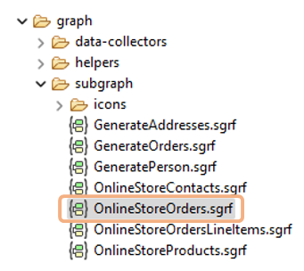
*Figure 475. Subgraph name*

Properties in the **Properties tab**:

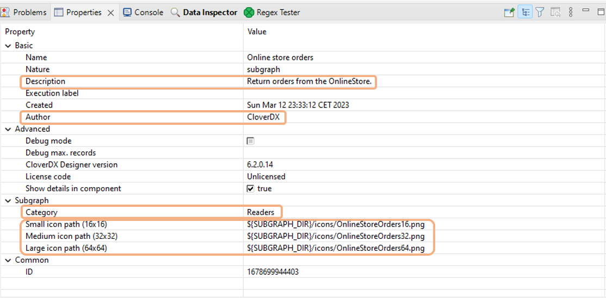
*Figure 476. Properties tab of a subgraph with Description, Author, Category, and Connector icons definitions.*

- **Description**
  - This description is visible under the **Data Source** or **Data Target connector** name in the **Data Catalog** and in the [Libraries module](../operations/libraries.md) in **CloverDX Server**.
- **Author**
  - All job files (.sgrf, grf., .jbf, .rjob) automatically store the author’s name in the source code. This name is visible to all users who have access to the job files in CloverDX Designer. The author’s name is not updateable in the **Properties tab**, but you can change it in the source code if needed.
- **Category**
  - Subgraph Category sets the connector subgraph component color. You can use Category to adhere to built-in component conventions, e.g., green for readers and blue for writers.
- **Subgraph icons**
  - Icons assigned to individual subgraphs can be used to change the subgraph component icon.
  - Icons assigned to **Data Source** or **Data Target connectors** subgraphs come up in the **Data Catalog**.
  - To add icons, create a separate directory `${PROJECT}/icons` to store icons used in subgraphs.
  - Use properly sized PNG icons (64 x 64, 32 x 32, or 16 x 16 pixels).
  - Link each icon to its respective field.

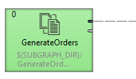
*Figure 477. Component icon*

- **Library icons**
  - The library icon is visible in the **Data Catalog** in **CloverDX Wrangler**.
  - Add `favicon.png` to the root of your project.
  - Use a PNG file with a transparent background, the maximum recommended width is 150px.

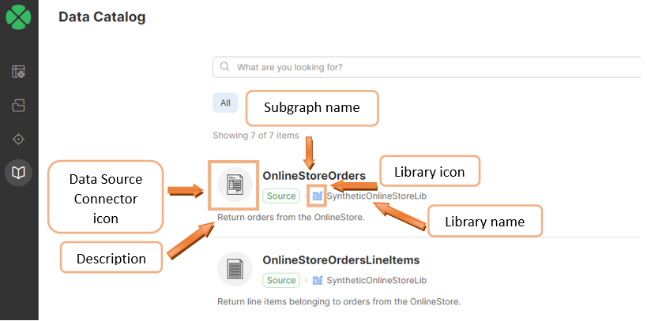
*Figure 478. A Source Connector in the Data Catalog in CloverDX Wrangler*

### Parameters

#### Global library parameters

All parameters that are to be configurable in the **CloverDX Server UI**, need to be placed in a parameter file called `library.prm` in the root of the library project. Server administrator can refer to our [Server Library documentation](../operations/libraries.md#configurable-parameters) for more information on where the parameters can be configured after library installation.

- This file needs to be created manually or you can use our [Data Catalog Connectors Template](https://marketplace.cloverdx.com/library/TemplateConnectorLib/1.1), which includes all the components recommended for connector development.
- The labels and descriptions for graph parameters appear in the **CloverDX Server UI**.
- Use clear and easy-to-understand parameter labels and descriptions to help administrators with the library setup.
- Use the appropriate Editor types for your parameters, such as enums, numeric, or boolean, to simplify the library setup process for administrators.
- It is not necessary to set all parameters as public, as all parameters in the file will be included in the **CloverDX Server** UI by default.
- If you need to access these parameters, you can link the parameter file to your job file.

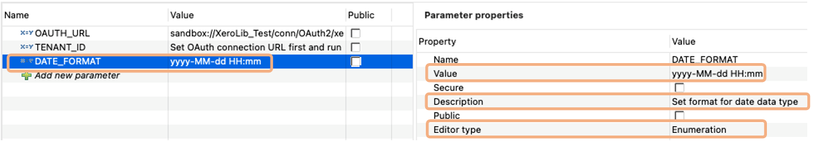
*Figure 479. Edit parameters dialog with Description and Label*

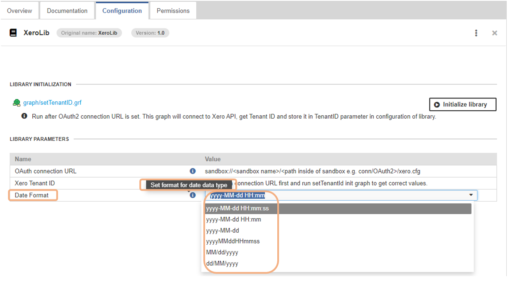
*Figure 480. Parameters in Server UI*

- If values are set in this parameter file, they will be used in the job execution. However, the parameters can be overridden when the graph is executed. In that case, values specified in `library.prm` are considered default values.
- Some of the parameter values, such as connection details, might be necessary for the library initialization. See [Initialization jobs (pre-generating metadata)](libraries-dev.md#initialization-jobs-pre-generating-metadata).

#### Connector parameters

- If a **Data Source** or **Data Target Connector** includes public parameters, they will be visible and configurable in the connector Configuration in **CloverDX Wrangler**. To help Wrangler users understand how to configure the parameters, provide clear labels, and descriptions, and select the appropriate editor types. If possible, use enums to prevent incorrect user input.

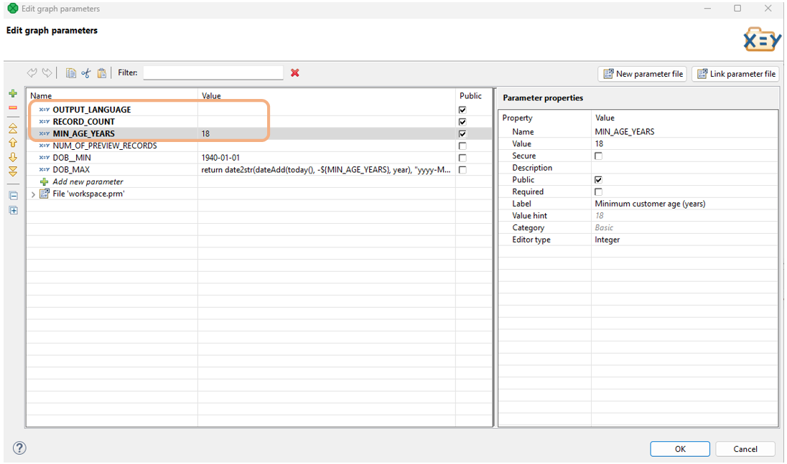
*Figure 481. Parameters in a Data Source Connector*

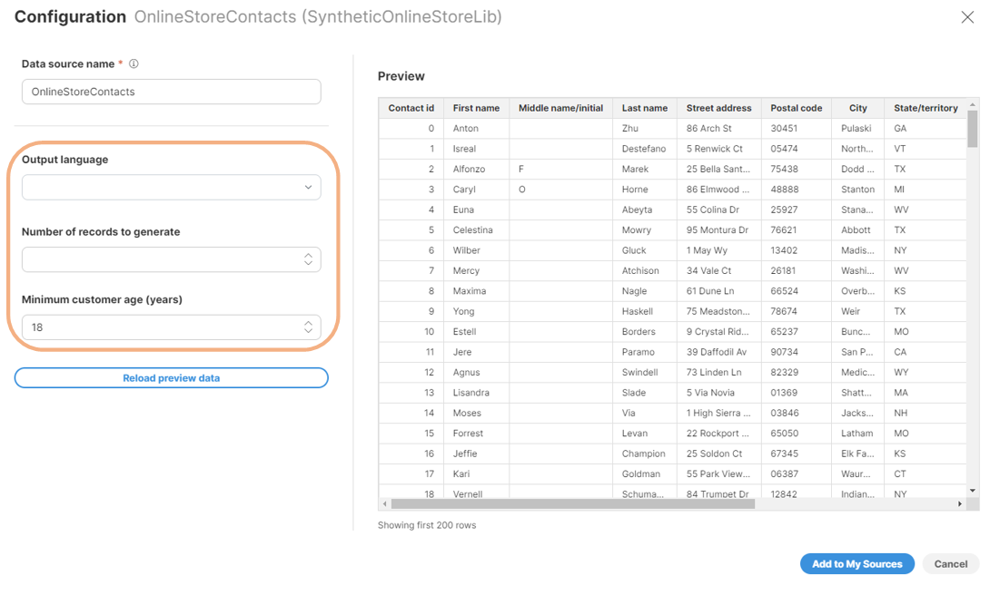
*Figure 482. Parameters in Data Source Connector Configuration in CloverDX Wrangler*

### Initialization jobs (pre-generating metadata)

A library can contain a so-called **initialization job**, which can be used to perform an initial setup that cannot be done during library development. An **Initialization job** can be **any graph or jobflow** that has been designated as an **initialization job** during [library export](export-library.md). For example, in our CloverDX Marketplace [OneDriveLib](https://marketplace.cloverdx.com/library/OneDriveLib/1.1.1) library, an initialization graph is used to generate values for SharePoint *Site ID* and *Drive ID parameters*, which are dependent on the configured OAuth2 connection.

**Initialization jobs** are usually executed by a CloverDX Server administrator during Library installation & initialization as one of the last steps or on demand anytime later (when a refresh is needed due to configuration changes). For more information on how to execute an initialization job, see [Initialization Jobs](../operations/libraries.md#initialization-job).
> [!NOTE]
> Initialization jobs must be designed to be run repeatedly. This may be necessary, for example, when changing library configuration.

Initialization job examples:

- Our [HubSpotLib library](https://marketplace.cloverdx.com/library/HubSpotLib/1.2) uses initialization job to determine metadata for its connectors. Every HubSpot instance is different and can have different custom fields for various objects (like deals, contacts or companies). The library needs initialization to be able to query the structure of each such entity so that each connector can provide accurate metadata on its output. The job needs to be called once after the library has been installed and must be called when HubSpot entities have been updated (e.g., a custom field is added).
- Our [OneDriveLib library](https://marketplace.cloverdx.com/library/OneDriveLib/1.1.1) uses initialization job to generate *SharePoint Site ID* and *Drive ID* parameters that can only be determined once the library OAuth2 connection is configured.

### User credentials and secrets

If your library requires user credentials or secrets, such as private tokens, it’s important to store these parameters securely. There are two options:

- When you use secrets as graph parameters (e.g., in the `library.prm` file), you can mark them as 'secure' to protect them from unauthorized access and comply with security best practices. Note that to use secure parameters, a [Master password](../admin/secure-parameters.md) needs to be set in **CloverDX Server**. This password is used to encrypt and decrypt the secure parameters.
- Another option is to use secret managers to retrieve the parameter values from a secure storage. This can be useful if you don’t want to store sensitive data in the `library.prm` file. For more information about using secret managers, see [Secret Managers](../admin/secret-managers.md).

### Database/JDBC connections

- To use a database connection in your library, provide all the connection details as parameters. This will make your library more flexible and reusable.
- Specify the connection parameters in the connection details. This will ensure that your library can connect to the database without errors.

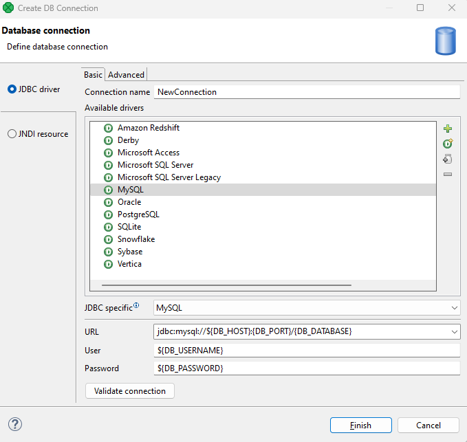
*Figure 483. Edit DB Connection dialog - parameters used for connection details.*

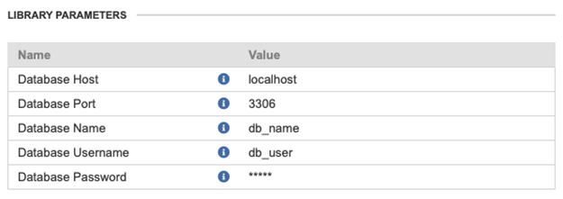
*Figure 484. Connection parameters from Server UI, the values will be propagated into the connection.*

- Store the connection parameters in a `library.prm` parameter file. This will allow you to set the database connection in the **CloverDX Server UI** and manage it centrally.
- Use secure parameters for any sensitive information, such as passwords. This will protect your data from unauthorized access and comply with security best practices.
- If possible, let users choose the JDBC connection name. This will give them more control over the database connection and avoid conflicts with other connections.

### OAuth2 connections

OAuth2 connections may be required in some libraries that implement data sources or data targets. In such cases, you can easily expose any number of OAuth2 connections from your library and the connections will appear in CloverDX Server UI in Libraries module.

To expose an OAuth2 connection from a library:

- Create the connection in the library project in Designer. This will create a connection `.cfg` file in the `conn` directory in the project (since OAuth2 connections must always be externalized).
- Use the connection in a public job (subgraph, graph, jobflow, data service).

If the above is kept, the connection will be automatically displayed on the **Configuration** tab in **Libraries module** for your library.

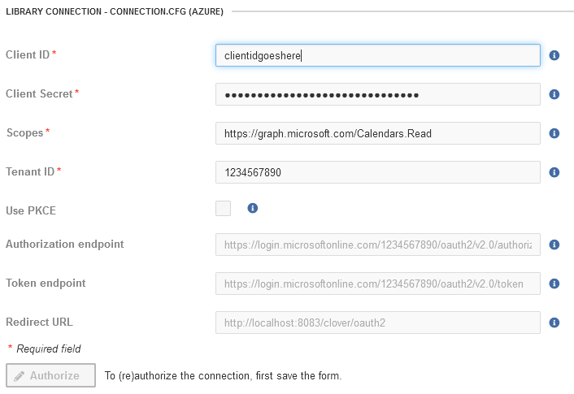
*Figure 485. OAuth2 connection configuration shown in Libraries module.*
> [!NOTE]
> OAuth2 connections are always exported as unauthorized, even when they were authorized during the development process. Server administrators will need to [authorize](../operations/libraries.md#oauth2-connections) them in the Server UI after library installation.

### Library dependencies

When another library is utilized as a dependency in a library, a parameter file named `dependencies.prm` is automatically created in the root directory. This file contains references to the dependent libraries and their respective versions. If you need, you can edit it and add labels and descriptions to the parameters. This information will be visible in the CloverDX Server UI and could help administrators during the library installation.

### Using Java code

Sometimes projects require Java code to work. This code may include `JAR files` or custom classes (or both). To ensure proper functionality, please follow these rules:

- If you need to include a `JAR file` in your library, put it in the `lib` directory and add a reference to the classpath (in CloverDX Designer, go to: Project properties → Java Build Path → Libraries, click ok Add JARs… and select JAR file from your `${PROJECT}/lib` directory. This applies especially to libraries and connectors that users cannot inspect. However, do not bundle `JAR` files that are already on the classpath, such as Bouncy Castle or certain database/JDBC drivers to avoid conflicts.
- If you need your own custom Java code to be used in the CloverDX library, put it into a proper package. The naming pattern should look like this: `com.<your company name>.libraries.<libraryName>.<className>`. The source code of the Java class should be stored in `${PROJECT}/trans` directory. Java classes from this directory are compiled automatically using CloverDX Designer during development (for every Java class in each `.java` file, a `.class` file will be created).

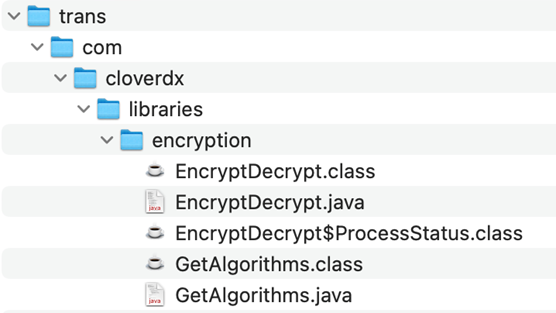
*Figure 486. Example of a structure of Java libraries in a project.*

- Make sure you include all the `.class` files (compiled Java classes) in your (when exporting the library in Designer). Otherwise, the library will not be able to use the Java classes. If you use a versioning system, you may want to store the compiled classes in the repository (for example, if you use Git, do not exclude `.class` files in your `.gitignore`).

### Live debugging and testing

When using a subgraph from a library during job development in **CloverDX Designer**, it behaves as a black box, and users cannot view or modify the library’s internal design. However, in certain situations, it can be helpful to examine the execution directly within the library, especially when debugging a subgraph.

To facilitate this process, it is possible to add any installed library from **CloverDX Server** to **CloverDX Designer** in the same way as connecting to any other server project.

- In CloverDX Designer, navigate to **File → New → CloverDX Server Project**, and provide the connection details to the Server environment. In the following step, select the desired library. It is important to note that to import the library to CloverDX Designer, the user must have the necessary permission to manage libraries. Access to libraries is managed by CloverDX Server administrators; for more information refer [here](../operations/libraries.md#permissions-tab).
- Once the library has been added, developers can interact with it just like any other sandbox, including making direct changes to the codebase.
> [!WARNING]
> When a library project is modified this way, all the performed changes are removed when the library is reinstalled in **CloverDX Server**. If you want to make sure that your changes are not be removed, export the modified library project to a new library `.clib` file and (re)install it in **CloverDX Server**.

### Job documentation tips

Job documentation is optional but highly recommended for any public jobs in your library project. Adding notes to jobs in **CloverDX Designer** before exporting them to a library can help other developers understand your job designs and their purpose to quickly implement or modify them. Additionally, adding a documentation page for Server administrators will ensure that the library installation and configuration will go smoothly.

#### Documentation for developers

- Every public job in a library should include a **Note** component with a short explanation of what the job does. This note should be separate (not encapsulate any components) and be visible when the job is opened (i.e., not too far down or to the right - usually top-left corner of the job is the best location).
- Difficult and non-obvious parts of each job should be explained in notes as well. Keep in mind that even for libraries users can look inside in Job Inspector or via Designer when debugging.
- Each public subgraph in a library project must have a description in the **Properties tab**. Do not include too much detail here and place the most important info at the beginning of the description. See [Enhancing library look and feel](libraries-dev.md#enhancing-library-look-and-feel) for more information.

#### Documentation for administrators

If you want to add a documentation page, which will be visible when browsing through libraries in a [library repository](../operations/libraries.md#library-repository), or when reviewing installed libraries in the [**Libraries**](../operations/libraries.md#documentation-tab) section in the **CloverDX Server** UI, the documentation must be in a separate file placed in the root of the source project before exporting the library. We support three file names (case-insensitive, in the preferred order):

- **readme.md** - rendered markdown - (a layout used in the [**CloverDX Marketplace** libraries](https://marketplace.cloverdx.com)​). You can use our [Data Catalog Connectors template](https://marketplace.cloverdx.com/library/TemplateConnectorLib/1.1) library, which includes a sample .md file for convenience.
- **readme.txt** - plain text
- **readme** - plain text

### Data Source Connector development

**Data Source Connectors** are subgraphs designed to be used in **CloverDX Wrangler** as [data sources](../user/data-sources-data-targets.md#data-sources). You can find them in the [**Data Catalog**](../user/data-catalog.md) once the library is installed, configured, and enabled.
> [!TIP]
> You can take advantage of our [Data Catalog Connectors template](https://marketplace.cloverdx.com/library/TemplateConnectorLib/1.1) library, which includes a template for Data Source Connectors with notes to help you with the development process.

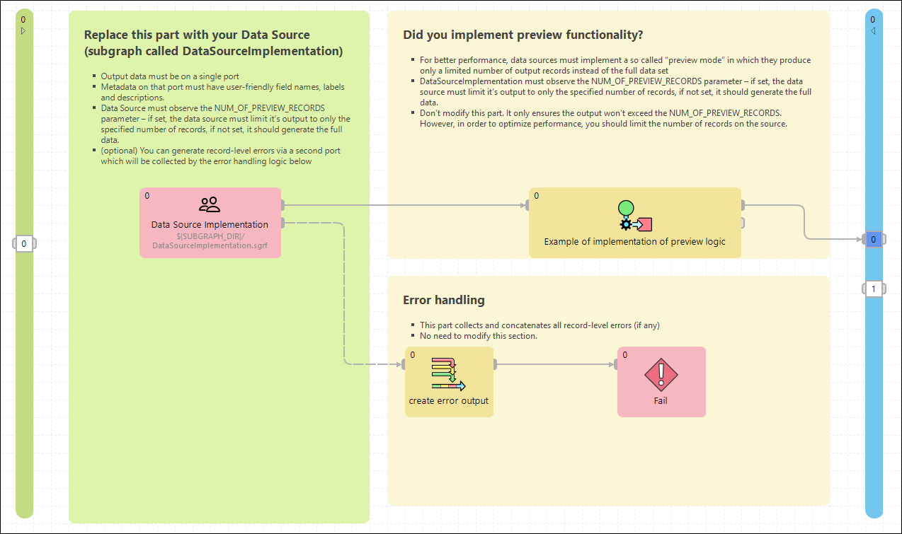
*Figure 487. Template source connector*

#### Data Source Connector requirements

To [export](export-library.md) a subgraph as a **Data Source Connector**, the following conditions need to be met:

- Subgraph name must be unique within the library; i.e., its name in the subgraph Properties must not exist in a different subgraph.

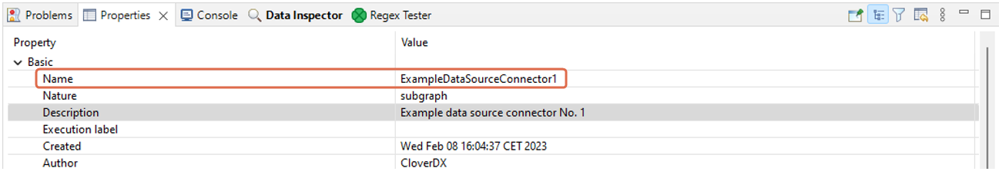
*Figure 488. Subgraph name property*

- Subgraph cannot have any input port.
- Subgraph must have exactly 1 output port.
- Output metadata must be declared: either auto-propagated or statically assigned.
- Output metadata can only contain fields of types: *string, long, integer, date, decimal, number, and boolean* to adhere to Wrangler’s requirements.
  - If the metadata structure cannot be universally defined; e.g., it depends on a particular configuration of a source system, then you can design a specific graph or jobflow that would be used as an **initialization job** to generate the metadata structure after library installation. See [Initialization Jobs (pre-generating metadata)](libraries-dev.md#initialization-jobs-pre-generating-metadata) for more information.
- Subgraph must expose a parameter called *NUM_OF_PREVIEW_RECORDS*. This parameter is used to limit the number of returned records in the **Data Preview** when viewing connector details in the **Data Catalog** or on **Sources** page, which considerably enhances preview performance.

#### Data Source Connector best practices

- Error handling with reasonable error messages propagated by the **Fail** component.
- Alternatively, you can call the `raiseError(string message)` function directly from the CTL2 code. Make sure to use a descriptive error message.

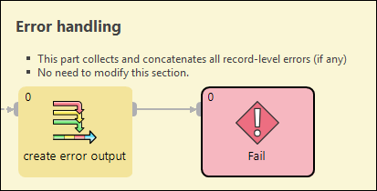
*Figure 489. Part of graph with error handling functionality*

- Use *secure graph parameters* for sensitive input parameters such as passwords or tokens. Be aware that secure parameters are encrypted with your CloverDX Server master password and won’t work on another instance with a different master password.

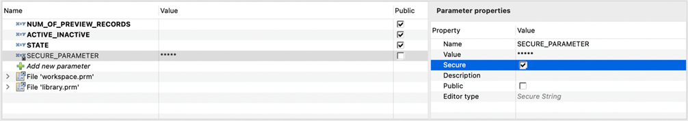
*Figure 490. Parameters dialog - usage of secure property settings*

- Keep subgraphs small and focused on accomplishing a single task. Use several layers of subgraphs if needed (e.g. lower level subgraphs for core API calls, higher level subgraphs already specialized with business logic to simplify usage and eliminate complex or excessive configuration options). Don’t try to create connectors that would be too universal - create several simple ones instead. The CloverDX Data Catalog helps end users navigate among options to find the one most suited to their needs.
- Consult with business users about their requirements and offer custom solutions for their business cases.
- Prefer enums for parameters when possible. This helps users avoid input errors.
- Design the Data Source Connector with Wrangler’s join limitations in mind. Prepare data that meets the needs of Business users.
- For entities such as Customers, Contacts, Invoices, etc., include relevant references in the Data Source Connector.
  - For example, for an Invoice entity, join Customer and Contact information to provide more context in your Data Source Connector.
- Use parameters for the Data Source Connector if there are filters (e.g., valid/invalid records). This allows business users to easily adjust the data set returned by the connector.
- Test thoroughly before publishing for users.

### Data Target Connector development

**Data Target Connectors** are subgraphs designed to be used in **CloverDX Wrangler** as [data targets](../user/data-sources-data-targets.md#data-targets). You can find them in the [**Data Catalog**](../user/data-catalog.md) once the library is installed, configured, and enabled.
> [!TIP]
> You can take advantage of our [Data Catalog Connectors template](https://marketplace.cloverdx.com/library/TemplateConnectorLib/1.1) library, which includes a template for Data Target Connectors with notes to help you with the development process.

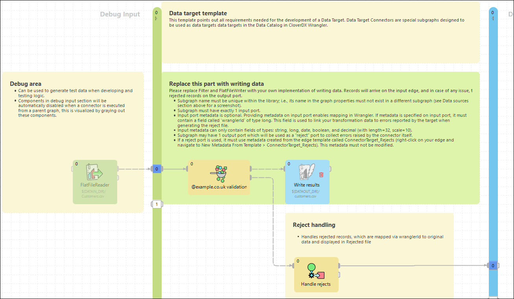
*Figure 491. Template target connector*

#### Data Target Connector requirements

To [export](export-library.md) a subgraph as a **Data Target Connector**, the following conditions need to be met:

- Subgraph name must be unique within the library; i.e., its name in the graph Properties must not exist in a different subgraph.

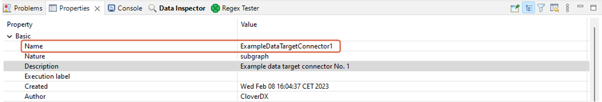
*Figure 492. Subgraph name property*

- Subgraph must have exactly 1 input port.
- Input port metadata is optional. Providing metadata on input port enables mapping in Wrangler. If metadata is specified on input port, it must contain a field called **wranglerId** of type `long`. This field is used to link your transformation data to errors reported by the target when generating the [reject file](../user/data-sources-data-targets.md#reject-file-format).

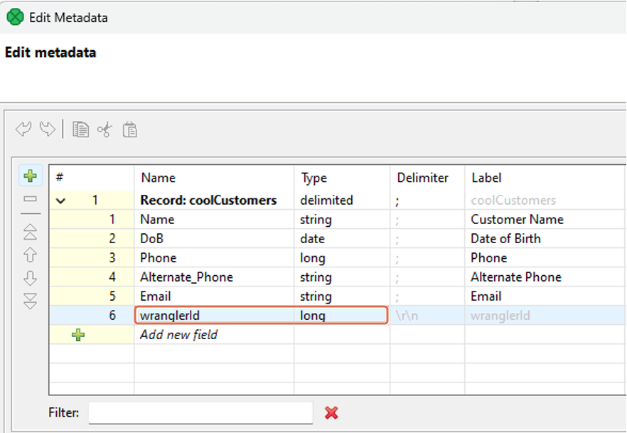
*Figure 493. WranglerId metadata field*

- Input metadata can only contain fields of types: `string, long, date, boolean,` and `decimal` (**length=32, scale=10** only).

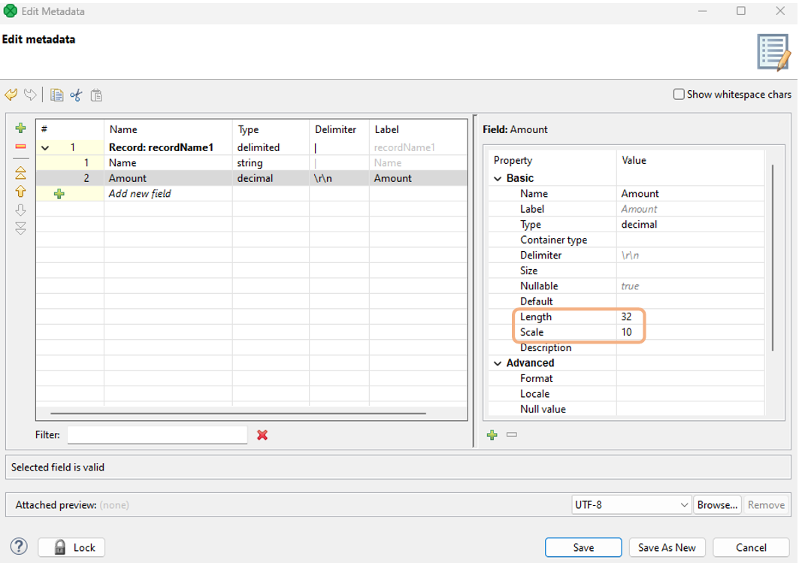

- Subgraph may have 1 output port which will be used as a “reject” port to collect errors raised by the connector itself.
- If a reject port is used, it must use metadata created from the edge template called *ConnectorTarget_Rejects* (right-click on your edge and navigate to *New Metadata From Template > ConnectorTarget_Rejects*). This metadata must not be modified.

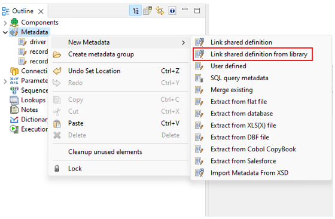
*Figure 494. ConnectorTarget_Rejects metadata template*

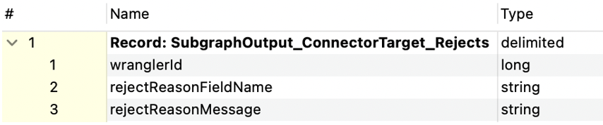
*Figure 495. ConnectorTarget_Rejects metadata*

#### Data Target Connector best practices

- If your target supports rejects, we recommend that you return rejected records using the optional reject port.
- Propagate the same value as the **wranglerId** input field to the output field. It serves as an identifier of records for the reject file generated by running the Wrangler job.
- Try to describe the actual error message as descriptively as possible to help users resolve the error.
- Consider how the data target reacts to existing data (*append* or *re-write* functionality) and failures (*continue on error* or *stop processing*).
- If you do not define the input metadata, your data target should be able to process any input data. However, if you need to ensure that the data structure and data types are set correctly, assign the input metadata. Wrangler users will then set the data in the correct format. In any case, if your target needs any additional validations, implement them before writing to the target to help users with error handling.
