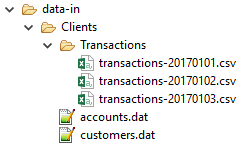
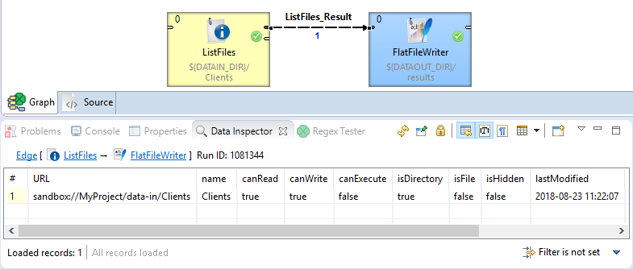
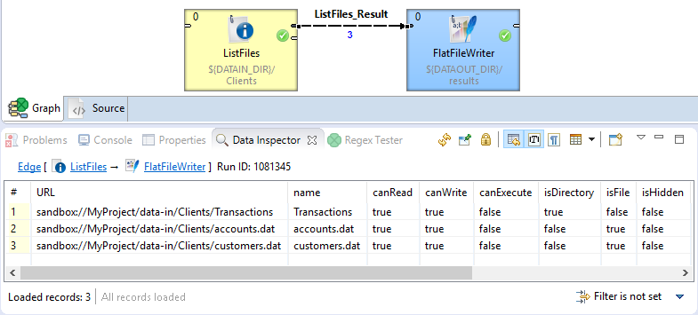
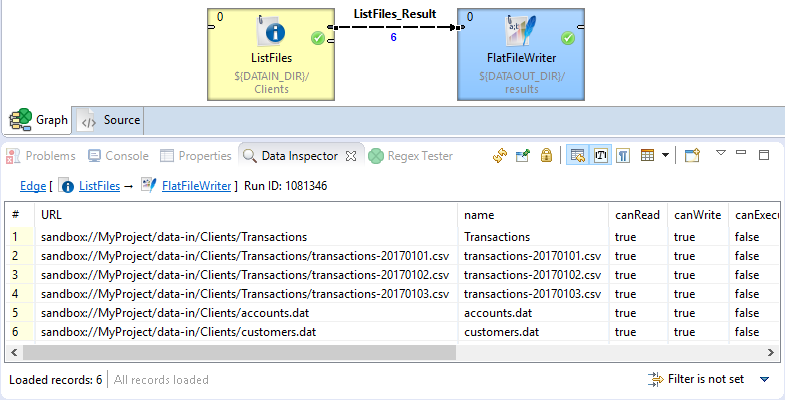

<!-- Development > Component reference > File Operations > ListFiles -->

### ListFiles


| [Short description](listfiles.md#short-description) |
| --- |
| [Ports](listfiles.md#ports) |
| [Metadata](listfiles.md#metadata) |
| [ListFiles attributes](listfiles.md#listfiles-attributes) |
| [Details](listfiles.md#details) |
| [Examples](listfiles.md#examples) |
| [Compatibility](listfiles.md#compatibility) |
| [See also](listfiles.md#see-also) |

#### Short description

**ListFiles** lists directory contents including detailed information about individual files, e.g. size or modification date. Subdirectories may be listed recursively.

| Inputs | Outputs | Auto-propagated metadata |
| --- | --- | --- |
| 0-1 | 1-2 | **✓** |

#### Ports

| Port type | Number | Required | Description | Metadata |
| --- | --- | --- | --- | --- |
| Input | 0 | **⨯** | Input data records to be mapped to component attributes. | Any |
| Output | 0 | **✓** | One record per each entry in the target directory | Any |
| 1 | **⨯** | Errors | Any |  |

#### Metadata

**ListFiles** does not propagate metadata from left to right or from right to left.

The component has metadata templates available. See [Details](listfiles.md#details) or general info on [metadata templates](components.md#metadata-templates).

#### ListFiles attributes

| Attribute | Req | Description | Possible values |
| --- | --- | --- | --- |
| Basic |  |  |  |
| File URL | yes[[1]](listfiles.md#listfiles-footnote1) | The path to the file or directory to be listed (see [Supported URL formats for file operations](fileoperations-url-formats.md)). |  |
| Recursive | no | List subdirectories recursively. (Has no effect if **List directory contents** is set to `false`.) | false (default) \| true |
| Input mapping | [[2]](listfiles.md#listfiles-attributes-fn02) | Defines mapping of input records to component attributes. |  |
| Output mapping | [[2]](listfiles.md#listfiles-attributes-fn02) | Defines mapping of results to the standard output port. |  |
| Error mapping | [[2]](listfiles.md#listfiles-attributes-fn02) | Defines mapping of errors to the error output port. |  |
| Redirect error output | no | If enabled, errors will be sent to the standard outputport instead of the error port. | false (default) \| true |
| Advanced |  |  |  |
| List directory contents | no | If set to `false`, returns information about the directory, not its contents. | true (default) \| false |
| Stop processing on fail | no | By default, a failure causes the component to skip all subsequent input records and send the information about skipped input records to the error output port. This behavior can be turned off by this attribute. **Note:** this function works only if an edge is connected to the component’s error port. | true (default) \| false |

| 1 |  The attribute is required, unless specified in the **Input mapping**. |
| --- | --- |

| 2 |  Required if the corresponding edge is connected. |
| --- | --- |

#### Details

Editing any of the **Input**, **Output** or **Error mapping** opens the [Transform Editor](transformations.md#transform-editor).

##### Input mapping

The editor allows you to override selected attributes of the component with the values of the input fields.

| Field Name | Attribute | Type | Possible values |
| --- | --- | --- | --- |
| fileURL | File URL | string |  |
| recursive | Recursive | boolean | true \| false |

##### Output mapping

The editor allows you to map the results and the input data to the output port.

If output mapping is empty, fields of input record and result record are mapped to output by name.

| Field Name | Type | Description |
| --- | --- | --- |
| URL | string | URL of the file or directory. |
| name | string | File name. |
| canRead | boolean | True if the file can be read. |
| canWrite | boolean | True if the file can be modified. |
| canExecute | boolean | True if the file can be executed. |
| isDirectory | boolean | True if the file exists and is a directory. |
| isFile | boolean | True if the file exists and is a regular file. |
| isHidden | boolean | True if the file is hidden. |
| lastModified | date | The time that the file was last modified. |
| size | long | True size of the file in bytes. |
| result | boolean | True if the operation has succeeded (can be false when **Redirect error output** is enabled). |
| errorMessage | string | If the operation has failed, the field contains the error message (used when **Redirect error output** is enabled). |
| stackTrace | string | If the operation has failed, the field contains the stack trace of the error (used when **Redirect error output** is enabled). |

##### Error mapping

The editor allows you to map the errors and the input data to the error port.

If Error mapping is empty, fields of input record and result record are mapped to output by name.

| Field Name | Type | Description |
| --- | --- | --- |
| result | boolean | Will always be set to false. |
| errorMessage | string | The error message. |
| stackTrace | string | The stack trace of the error. |

##### Listing Archive Files

When listing archive files with the archive URL (see [Supported URL formats for file operations](fileoperations-url-formats.md#list-files-in-archives)), the **Recursive** and **List directory contents** attributes apply to the archive content. Without archive URL, the **Recursive** and **List directory contents** attributes do not descend into archive files.

Archive URL of the zip archive file `zip:(sandbox://data/archive.zip)` will list zip file content according to the **Recursive** and **List directory contents** attribute settings. Non-archive URLs like `sandbox://data/archive.zip` or `file://folder/*` (when it encounters an archive file) will always list only the archive file itself.

That applies to the nested archives too. Archive URL of the inner tar archive file `tar:(zip:(sandbox://data/archive.zip)!innerarchive.tar)` will list tar file content according to the **Recursive** and **List directory contents** attribute settings. Non-archive URLs of the inner file like `zip:(sandbox://data/archive.zip)!innerarchive.tar` or `zip:(sandbox://data/archive.zip)!folder/*` (when it encounters an inner archive file) will always list only the inner archive file itself.

The archive URLs support multiple levels of nested archives: `tar:(zip:(tgz:(outerfile.tar.gz)!innerfile.zip)!innerfile.tar)!innermostfile.txt`
> [!NOTE]
> Some archives may not have directory entries - they have only file entries with full paths. In these archives the listing of directory itself will not work.
> [!NOTE]
> Since **CloverDX version 6.4** the returned URLs use `!` as separators of all inner and outer archive paths, instead of `#` which was used previously.

#### Examples

| [Listing files](listfiles.md#listing-files) |
| --- |
| [Working with directories](listfiles.md#working-with-directories) |

##### Listing Files

List files in `${DATATMP_DIR}` directory. Do not list content of subdirectories.

###### Solution

Use **File URL** and **Input mapping attributes**.

| Attribute | Value |
| --- | --- |
| File URL | ${DATATMP_DIR} |
| Input mapping | See the code below. |

```ctl
function integer transform() {
    $out.0.* = $in.1.*;

    return ALL;
}
```

You need an edge connected to the first output port.

##### Working with directories

We have the following directory tree structure:



1. Check if the `Clients` directory exists.
2. List the contents of the `Clients` directory.
3. List the contents of any existing subdirectories in the `Clients` directory.

###### Solution

Use the **File URL**, **Recursive** and **List directory contents** attributes.

| Attribute | Value |
| --- | --- |
| File URL | ${DATAIN_DIR}/Clients/ |
| List directory contents | `false` |
| Recursive | `false` (default) |

Enable debugging on edges and run the graph. The graph has confirmed the directory exists:



Next, set the **List directory contents** to `true` (default) and run the graph again. The graph has now listed the contents of the `Clients` directory:



Now, set the **Recursive** attribute to `true` and run the graph.

The graph has now listed the contents of the `Clients` directory and all subdirectories:



#### Compatibility

| Version | Compatibility Notice |
| --- | --- |
| 4.6.0-M1 | The **List directory contents** attribute has been implemented. |
| 6.3.0 | The support for listing archive content has been implemented. |

#### See also

| [Common properties of components](components.md#common-properties-of-components) |
| --- |
| [Specific attribute types](components.md#specific-attribute-types) |
| [Common properties of File Operations](common-of-file-operations.md) |
| [File Operations comparison](common-of-file-operations.md#file-operations-comparison) |
