<!-- Development > Job elements > Lookup tables -->

## 29. Lookup tables

Lookup tables are data structures that allow fast access to data stored using a known key or SQL query. This way you can reduce the need to browse a database or data files.
> [!WARNING]
> Remember that you should not use lookup tables in the `init()`, `preExecute()` or `postExecute()` functions of the CTL template and the same methods of Java interfaces.

Lookup tables can be accessed using CTL functions, see [Lookup table functions](lookup-table-functions-ctl2.md).

All data records stored in any lookup table are kept in files, in databases or cached in memory.

Lookup tables can be internal or external (shared).

- **Internal**: See [Internal lookup tables](lookup-tables.md#internal-lookup-tables).
  Internal lookup tables can be:
  - **Externalized**: See [Externalizing internal lookup tables](lookup-tables.md#externalizing-internal-lookup-tables).
  - **Exported**: See [Exporting internal lookup tables](lookup-tables.md#exporting-internal-lookup-tables).
- **External (shared)**: See [External (shared) lookup tables](lookup-tables.md#external-shared-lookup-tables).
  External (shared) lookup tables can be:
  - **Linked to the graph**: See [Linking external (shared) lookup tables](lookup-tables.md#linking-external-shared-lookup-tables).
  - **Internalized**: See [Internalizing external (shared) lookup tables](lookup-tables.md#internalizing-external-shared-lookup-tables).

### Types of lookup tables

After opening the **New lookup table** wizard, you need to select the desired lookup table type. Reference lookup table can be added from context menu in the **Outline**.

| Lookup Table | Whole Table in Memory | Allows Duplicated Key Values |
| --- | --- | --- |
| [Simple lookup table](lookup-tables.md#simple-lookup-table) | Yes | Yes |
| [Database lookup table](lookup-tables.md#database-lookup-table) | No | Yes |
| [Range lookup table](lookup-tables.md#range-lookup-table) | Yes | No, but intervals may overlap |
| [Persistent lookup table](lookup-tables.md#persistent-lookup-table) | No | Yes |
| [Aspell lookup table](lookup-tables.md#aspell-lookup-table) | Yes | Yes |
| [Reference lookup table](lookup-tables.md#reference-lookup-table) | Yes | No |

#### Simple lookup table

All data records stored in **simple lookup table** are kept in memory. For this reason, to store all data records from the lookup table, sufficient memory must be available. If data records are loaded to a simple lookup table from a data file, the size of the available memory should be approximately at least 6 times bigger than that of the data file. However, this multiplier is different for different types of data records stored in the data file.

**Simple lookup table** allows storing multiple data records with the same key value. If you do not allow storing duplicated values, the last value will be stored.
> [!CAUTION]
> Simple lookup does not support concurrent writes from multiple jobs or components within the same phase.

##### Creating simple lookup table

In the first step of the wizard, choose **Simple lookup**.

In the next step, set up the required properties: in the **Table definition** tab, give a **Name** to the lookup table, select the corresponding **Metadata** and the **Key** that should be used to look up data records from the table.

Optionally, you can select a **Charset** and the **Initial size** of the lookup table (512 by default). You can change the default value by changing the `Lookup.LOOKUP_INITIAL_CAPACITY` value in `defaultProperties`.

You can also enable the **Ignore case** checkbox (applies to string key fields only) to make key comparisons case-insensitive (i.e. "Smith" = "smith").

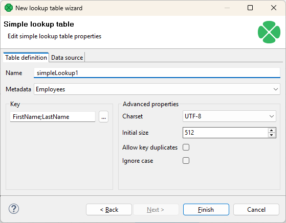
*Figure 320. Simple lookup table wizard*

##### Key

After clicking the button on the right side from the **Key** area, you will be presented with the **Edit key** dialog which helps you select the **Key**. The list on the left side contains metadata fields and their data types. The list on the right side contains metadata fields that form the key.

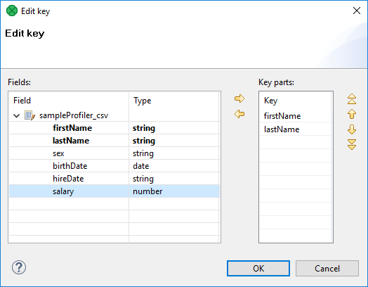
*Figure 321. Edit key wizard*

To add a metadata field to the key, drag the field from the list on the left and drop it to the list on the right. Any highlighted metadata field can be added to the list with an arrow too.

You can move the field name(s) into the **Key parts** pane by highlighting the field name(s) in the **Field** pane and clicking the **Right arrow** button. You can keep moving more fields into the **Key parts** pane.

You can also change the position of any of them in the list of the Key parts by clicking the **Up** or **Down** buttons. The key parts that are higher in the list have higher priority. When you have finished, you only need to click **OK**.

You can also remove any key part by highlighting it and clicking the **Left arrow** button.

##### Data source tab

In the **Data source** tab, you can either locate the file **URL** or fill in the grid after clicking the **Edit data** button. After clicking **OK**, the data will appear in the **Data** text area. If you use [LookupTableReaderWriter](lookuptablereaderwriter.md) to fill in the table, you do not need to specify data on the **Data source** tab.

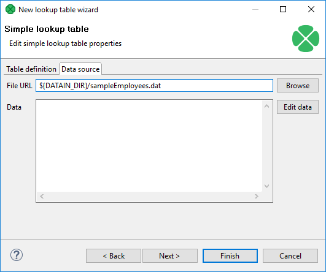
*Figure 322. Simple lookup table wizard with file URL*

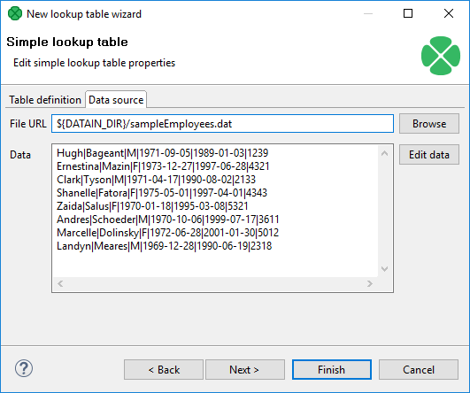
*Figure 323. Simple lookup table Wizard with data*

You can set or edit the data after clicking the **Edit data** button.

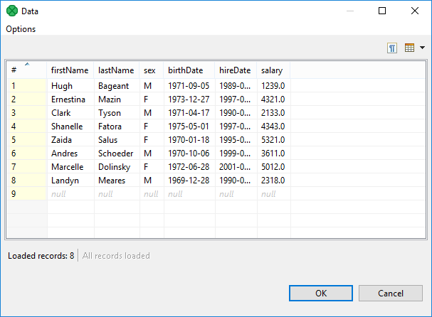
*Figure 324. Changing data*

After that, click **OK** and then **Finish**.

**Simple lookup table** is allowed to contain data specified directly in the grid, data in the file or data that can be read using **LookupTableReaderWriter**.
> [!IMPORTANT]
> Remember that you can also check the **Allow key duplicates** checkbox. This way, you are allowing multiple data records with the same key value (duplicate records).
>
> If you want to have only one record per each key value in **Simple lookup table**, leave the checkbox unchecked (the default setting). If only one record is selected, new records overwrite the older ones. In such a case, the last record is the only one that is included in **Simple lookup table**.

#### Database lookup table

This type of lookup table works with databases and unloads data from them by using a SQL query. Database lookup table reads data from the specified database table. The key used to search records from this lookup table is the `where fieldName = ? [and …]` part of the query.

Data records unloaded from the database can be cached in memory keeping the LRU order (the least recently used items are discarded first). To cache them, you must specify the number of such records (**Max cached records**).

You can cache only the record found in the database, or you can cache both records found as well as records not found in the database. To save both, use **Store negative key response** checkbox. Then, the lookup table will not search through the database table when the same key value is given again.

**Database lookup table** allows to work with duplicate records (multiple records with the same key value).
> [!CAUTION]
> Database lookup does not support concurrent writes from multiple jobs or components within the same phase.

##### Creating database lookup table

In the first step of the wizard, choose the **Database lookup** radio button and click **Next**.

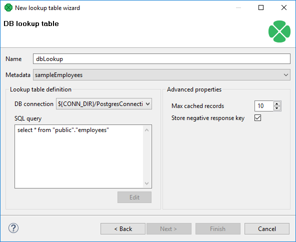
*Figure 325. Database lookup table wizard*

Then, in the **Database lookup table** wizard, give a **Name** to the selected lookup table, and specify **Metadata** and **DB connection**.
> [!NOTE]
> Remember that **Metadata** definition is not required for transformations written in Java. In them, you can simply select the **no metadata** option. However, with CTL it is necessary to specify **Metadata**.

Type or edit a SQL query that serves to look up data records from the database. When you want to edit the query, click the **Edit** button and, if your database connection is valid and working, you will be presented with the **Query** wizard, where you can browse the database, generate a query, validate it and view the resulting data.
> [!IMPORTANT]
> To specify a lookup table key, add a "`where fieldName = ? [and …]`" statement at the end of the query, `fieldName` being, for example, "EMPLOYEE_ID". Records matching the given key replace the question mark character in the query.

Then, you can click **OK** and **Finish**. See [Extracting metadata from a database](creating-metadata.md#extracting-metadata-from-a-database) for more details about extracting metadata from a database.

#### Range lookup table

You can create a **Range lookup table** only if some fields of the records create ranges. That means the fields are of the same data type and they can be assigned both start and end. You can see this in the following example:

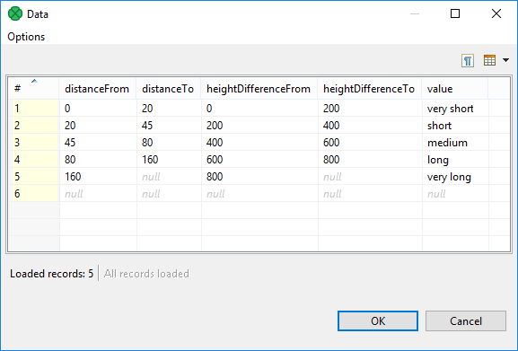
*Figure 326. Appropriate data for range lookup table*

**Range lookup table** does not allow multiple records with the same interval. The intervals may overlap, therefore one value can match more values from the lookup table.

##### Creating range lookup table

When you create a **Range lookup table**, you check the **Range lookup** radio button and click **Next**.

Then, in the **Range lookup table** wizard, give a **Name** to the selected lookup table, and specify **Metadata**.

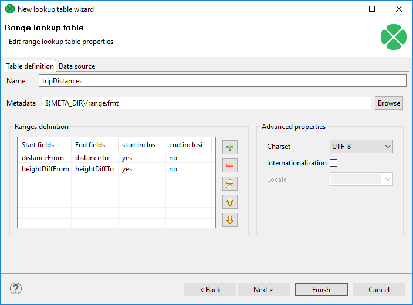
*Figure 327. Range lookup table wizard*

You can select **Charset** and decide whether **Internationalization** and what **Locale** should be used.

By clicking the buttons at the right side, you can add either of the items, or move them up or down.

You must also select whether any start or end field should be included in these ranges or not. You can do it by selecting any of them in the corresponding column of the wizard and clicking.

When you switch to the **Data source** tab, you can specify the file or directly type the data in the grid. You can also write data to lookup table using **LookupTableReaderWriter**.

By clicking the **Edit** button, you can edit the data contained in the lookup table. At the end, you only need to click **OK** and **Finish**.
> [!IMPORTANT]
> Remember that **Range lookup table** includes only the first record with identical key value.

There is an [example](lookupjoin.md#matching-ranges-with-range-lookup-table) on **Range lookup table** in [LookupJoin](lookupjoin.md).

#### Persistent lookup table

This type of lookup table serves a great number of data records. The data records are stored in files; only a few records are cached in main memory. These files are in `JDBM` format (*[http://jdbm.sourceforge.net](http://jdbm.sourceforge.net)*). When you specify the file name, two files will be created: with `db` and `lg` extensions.

**Persistent lookup table** can work in two modes: with key duplicates and without key duplicate. If you switch between the modes, you should delete and refill the lookup table.
> [!CAUTION]
> Persistent lookup doesn’t support parallel execution and cannot be accessed concurrently by multiple jobs or components within the same phase, even for read-only operations.

##### Without key duplicates

With the **Allow key duplicates** property unchecked, the persistent lookup table does not allow storing multiple records with the same key value. You can choose whether to store the first one or the last with the **Replace** checkbox.

This is the default option.

##### With key duplicates

With **Allow key duplicates** property enabled, you can store multiple records with the same key to the table. The **Replace** property is not used. Key duplicates in persistent lookup table are available since 4.3.0.

**Persistent lookup table** internally uses B+Tree to store the records. If node is mentioned here, it is the node of the B+Tree.

##### Creating persistent lookup table

In the first step of the wizard, choose **Persistent lookup**.

Then set up the required properties: give a **Name** to the lookup table, select the corresponding **Metadata**, specify the **File** where the data records of the lookup table will be stored and the **Key** that should be used to look up data records from the table.

###### Advanced properties

To overwrite old records with newer ones, check the **Replace** checkbox. This way, the latest record with the same key is stored. Otherwise the first record with the same key would be stored.

You can disable transactions with **Disable transactions**. Disabling transactions increases graph performance; however, it can cause data loss if manipulation with the table is interrupted.

**Commit interval** defines the number of records that are committed at once. When the limit or end of phase is reached, the records are committed to the lookup table.

By specifying **Page size**, you are defining the number of entries (records) per node of B+Tree (in the implementation).

**Cache size** specifies the maximum number of nodes (of B+Ttree) in cache.

**Allow key duplicates** allows storing multiple records with the same key value.
> [!IMPORTANT]
> **Replace** checkbox is ignored in lookup tables with key duplicates.

Then click **OK** and **Finish**.

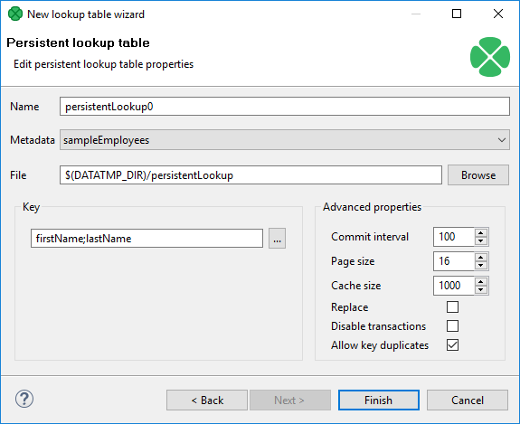
*Figure 328. Persistent lookup table wizard*

###### Using persistent lookup table

You can use [LookupTableReaderWriter](lookuptablereaderwriter.md) to add records to **Persistent Lookup Table**.

###### Persistent lookup table configuration tweaks

Performance of persistent lookup table can be affected by the advanced parameters. These parameters configure the internal B+Tree implementation and size of caches.

To speed up reading, increase **cache size**.

To speed up writing, increase **commit interval**.

##### Compatibility

| Version | Compatibility Notice |
| --- | --- |
| 4.3.0 | You can now use **Allow key duplicates** to allow storing duplicated key values into the table. |

#### Aspell lookup table

All data records stored in this lookup table are kept in memory. For this reason, to store all data records from the lookup table, sufficient memory must be available. If data records are loaded to Aspell lookup table from a data file, the size of available memory should be approximately at least 7 times bigger than that of the data file. However, this multiplier is different for different types of data records stored in the data file.

If you are working with data records that are similar but not fully identical, you should use this type of lookup table. For example, you can use **Aspell lookup table** for addresses.

**Aspell lookup table** allows you to have multiple records with the same key value.
> [!CAUTION]
> Aspell lookup does not support concurrent writes from multiple jobs or components within the same phase.

##### Creating Aspell lookup table

In the **Aspell lookup table** wizard, you set up the required properties. You must give a **Name** to the lookup table, select the corresponding **Metadata**, select the **Lookup key field** that should be used to look up data records from the table (must be of string data type).

You can also specify the **Data file URL** where the data records of the lookup table will be stored and the charset of data file (**Data file charset**). The default charset is `UTF-8`.

You can set the threshold that should be used by the lookup table (**Spelling threshold**). It must be higher than 0. The higher the threshold, the more tolerant is the component to spelling errors. Its default value is `230`. It is the `edit_distance` value from the query to the results. Words with this value higher that the specified limit are not included in the results.

You can also change the default costs of individual operations (**Edit costs**):

- **Case cost**
  Used when the case of one character is changed.
- **Transpose cost**
  Used when one character is transposed with another in the string.
- **Delete cost**
  Used when one character is deleted from the string.
- **Insert cost**
  Used when one character is inserted to the string.
- **Replace cost**
  Used when one character is replaced by another one.

You need to decide whether the letters with diacritic marks are considered identical with those without these marks. To do that, you need to set the value of the **Remove diacritic marks** attribute. If you want diacritic marks to be removed before computing the `edit_distance` value, you need to set this value to `true`. This way, letters with diacritic marks are considered equal to their Latin equivalents. (Default value is `false`. By default, letters with diacritic marks are considered different from those without.)

If you want best guesses to be included in the results, set **Include best guesses** to `true`. The default value is `false`. Best guesses are the words whose `edit_distance` value is higher than the **Spelling threshold**, for which there is no other better counterpart.

Then click **OK** and **Finish**.

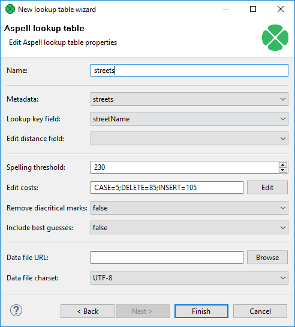
*Figure 329. Aspell lookup table wizard*
> [!IMPORTANT]
> If you want to know the distance between the lookup table and edge values, you must add another field of numeric type to lookup table metadata. Set this field to **Autofilling** (`default_value`).
>
> Select this field in the **Edit distance field** combo.
>
> When you are using **Aspell lookup table** in **LookupJoin**, you can map this lookup table field to corresponding field on the output port 0.
>
> This way, values that will be stored in the specified **Edit distance field** of lookup table will be sent to the output to another specified field.

#### Reference lookup table

This lookup uses data stored in **CloverDX Server** Reference Data Set. It can be used only in server projects.

Every Reference lookup table is connected to and works with one Reference Data Set. The rest of configuration such as metadata and lookup key is defined by the selected Reference Data Set, it cannot be changed in graphs.

When Reference Data Set has **Effective dates** enabled, retrieving values from Reference lookup requires not only the key fields but also additional timestamp field which defines the timestamp at which the retrieved record should be valid.
> [!IMPORTANT]
> - Reference lookup only provides approved (published) records and values. It is possible to modify content of a Reference Data Set during graph execution but all new values have to be approved before they can be accessed by the lookup table.
> - Reference lookup supports concurrent reads and writes. However, for reading purposes, the entire data set is loaded at the start of a phase. As a result, any writes that occur during the phase will not be visible to readers until the next phase.

To add new record to Reference Data Set using Reference lookup, leave `_id` field empty (null).

To update existing record using Reference lookup, specify `_id` of the existing record. If there are any pending (unapproved) changes on the updated row, they will be overwritten by the most recent update operation.

##### Adding Reference lookup table

In the **Outline** pane select **Lookup Tables** ****Add reference data lookup table** and then specify which Reference Data Set should be used and give a **Name** to the lookup table. Then use button **Finish**.

You can also enable the **Ignore case** checkbox (applies to string key fields only) to make key comparisons case-insensitive (i.e. "Smith" = "smith").

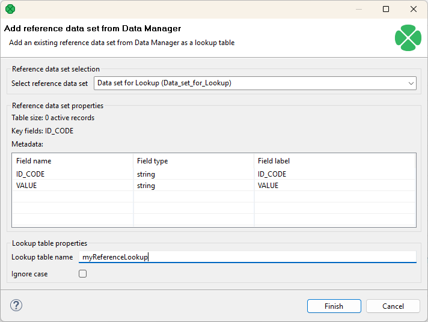
*Figure 330. Reference lookup table wizard*

### Internal lookup tables

Internal lookup tables are part of a graph, they are contained in the graph and can be seen in its source tab.

#### Creating internal lookup tables

To create a new internal lookup table, right click **Lookups** in the [Outline pane](designer-layout.md#outline-pane) and select **Lookup Tables** ****Create internal**.

A **Lookup table** wizard opens. After selecting the lookup table type and clicking **Next**, you can specify the properties of the selected lookup table.

More details about lookup tables and types of lookup tables can be found in [Types of lookup tables](lookup-tables.md#types-of-lookup-tables).

#### Externalizing internal lookup tables

Externalization is a conversion of an internal lookup table to an external one. The newly created external lookup table is linked to the original graph. So that you would be able to use the same lookup table within other graphs.

To externalize an internal lookup table into an external (shared) file, right-click the desired internal lookup table item in the **Outline** pane within **Lookups** group and select **Externalize lookup table** from the context menu. If your lookup table contains internal metadata or internal database connection, the wizard allows you to externalize them as well.

In the first step, choose a name for lookup table configuration and directory to be placed to. The lookup table configuration is usually stored in the `lookup` directory within the project.

If the lookup table uses internal metadata, you will export it in the second step of the wizard. You will be offered file name and `meta` directory to store external (shared) metadata.

If the lookup table uses an internal database connection, the wizard will guide you through export of the database connection. The suggested directory for database connections is `conn`.

After that, the internal metadata (and internal connection) and lookup table items disappear from the **Outline** pane **Metadata** (and **Connections**) and **Lookups** group, respectively, but at the same location, new entries appear, already linked the newly created external (shared) metadata (and the connection configuration file) and lookup table files within the corresponding groups. The same files appear in the `meta`, `conn` and `lookup` subdirectories of the project, respectively, and can be seen in the **Project Explorer** pane.

##### Externalizing multiple lookup tables at once

You can even externalize multiple internal lookup table items at once. To do this, select them in the **Outline** pane and after right-click, select **Externalize lookup table** from the context menu. The process described above is repeated until all the selected lookup tables (along with the metadata and/or connection assigned to them, if needed) are externalized.

You can choose adjacent lookup table items when you press Shift and then press the **Down Cursor** or the **Up Cursor** key. If you want to choose non-adjacent items, use Ctrl+Click at each of the desired connection items instead.

#### Exporting internal lookup tables

Export of an internal lookup table creates an external (shared) lookup table as a copy of internal lookup table. The original lookup table is left untouched within the graph and the newly created lookup table is not linked.

You can export an internal lookup table into external (shared) one by right-clicking any of the internal lookup tables items in the **Outline** pane and selecting **Export lookup table** from the context menu. The `lookup` folder of the corresponding project will be offered for the newly created external file. You can change the file name and click **Finish** to create the file.

After that, the **Outline** pane lookups folder remains the same, but in the `lookup` folder in the **Project Explorer** pane the newly created lookup table file appears.

You can export multiple selected internal lookup tables in a similar way as it is described in the previous section about externalizing.
> [!NOTE]
> Externalizing vs. exporting
> Externalizing converts an internal object to external one. The external object is created and linked to the graph. The internal object is deleted. It is similar to `move` operation.
>
> Export creates a new external object. The new external object is not linked to the graph. The internal object is still available. Is is similar to `copy` operation.

### External (shared) lookup tables

External (shared) lookup tables can be shared across multiple graphs. This allows an easy access, but removes them from a graph’s source.

#### Creating external (shared) lookup tables

In order to create an external (shared) lookup table, select **File** ****New** ****Other…​**

Expand the **CloverDX** ****Other** item and select the **Lookup table** item.

After that, the **New lookup table** wizard opens. In this wizard, you need to select the desired lookup table type, define it and confirm. You also need to select the file name of the lookup table within the `lookup` folder. After clicking **Finish**, your external (shared) lookup table has been created.

See [Types of lookup tables](lookup-tables.md#types-of-lookup-tables) or particular lookup table type.

#### Linking external (shared) lookup tables

Linking of an external lookup table is adding a link to the external table to the graph. In a graph, you can use internal lookup tables or linked external lookup tables only. So you have to create an external (shared) lookup table first and than you can link it to an existing graph. A single external (shared) lookup table can be linked to multiple graphs.

Right-click either the **Lookups** group or any of its items and select **Lookup tables** ****Link shared lookup table** from the context menu.

After that, a **File selection** wizard displaying the project content will open. Expand the `lookup` folder in this wizard and select the desired lookup table file from all the files contained in this wizard.

##### Linking multiple external lookup tables at once

You can even link multiple external (shared) lookup table files at once. Right-click either the **Lookups** group or any of its items and select **Lookup tables** ****Link shared lookup table** from the context menu.

After that, the **File selection** wizard displaying the project content will open. Expand the `lookup` folder in this wizard and select the desired lookup table files from all the files contained here. You can select adjacent file items when you press Shift and press the **Down Cursor** or the **Up Cursor** key. If you want to select non-adjacent items, use Ctrl+Click at each of the desired file items instead.

#### Internalizing external (shared) lookup tables

Internalization of an external lookup table creates an internal copy of the lookup table within the graph.

To internalize any linked external (shared) lookup table file into internal lookup table, right-clicking such external (shared) lookup table items in the **Outline** pane and select **Internalize connection** from the context menu.

After that, the following wizard opens which allows you to internalize metadata assigned to the lookup table and/or its DB connection (in the case of **Database lookup table**). The internalization of metadata or datatabase connection is optional, the internal lookup table can work with external metadata or database connection.

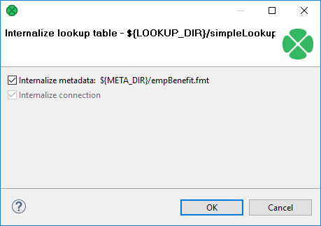
*Figure 331. Lookup table internalization wizard*

Click **OK**.

After that, the selected linked external (shared) lookup table items disappear from the **Outline** pane **Lookups** group, but at the same location, newly created internal lookup table items appear. If you have also decided to internalize the linked external (shared) metadata assigned to the lookup table, their item is converted to internal metadata item which can be seen in the **Metadata** group of the **Outline** pane.

However, the original external (shared) lookup table file still remains to exist in the `lookup` subdirectory. You can see it in this folder in the **Project Explorer** pane.

##### Internalizing multiple lookup tables at once

You can even internalize multiple linked external (shared) lookup table files at once. To do this, select the desired linked external (shared) lookup table items in the **Outline** pane. After that, you only need to repeat the process described above for each selected lookup table. You can select adjacent items when you press Shift and press the **Down Cursor** or the **Up Cursor** key. If you want to select non-adjacent items, use Ctrl+Click at each of the desired items instead.

### Lookup tables in cluster environment

To understand how lookup tables work in cluster environment, it is necessary to understand how clustered graphs are processed - split into several separate graphs and distributed among cluster nodes. Details are available in the [Parallel processing in Server cluster](../developer/parallel-running.md#3-parallel-processing-in-server-cluster) section. In short, clustered graph is executed in several instances according to a transformation plan, i.e. worker graphs. A transformation plan is the result of a transformation analysis, where component allocation, usage of partitioned sandbox and occurrences of clustered components are taken into consideration. A transformation plan says how many instances of the graph, on which cluster nodes will be executed. Moreover, it defines how the worker graphs should be updated for clustered run, which components actually will be running in the particular worker and which will be removed.

**CloverDX Server** cluster environment does not provide any special support for lookup tables. Each clustered graph instance creates its own set of lookup tables. Lookup tables instances do not cooperate with each other. So, for example, in the case of **SimpleLookupTable**, each instance of a clustered graph has its own **SimpleLookupTable** instance which loads data from a specified data file separately. So data file is read by each clustered graph and each instance has a separate set of cached records. **DBLookupTable** works seamlessly in cluster environment - internal cache for databases responses is managed by each worker graph separately.

Be aware of writing data records into a lookup table using the **LookupTableReaderWriter** component. In this case, it is important to consider which worker does the writing, since the lookup table update is performed only locally. So ensure the **LookupTableReaderWriter** component runs on all workers where the update lookup will be necessary.
