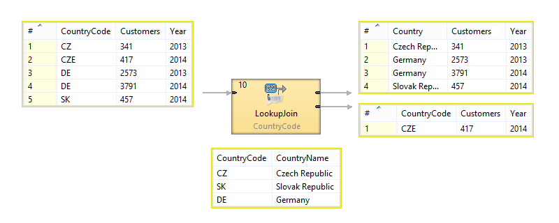
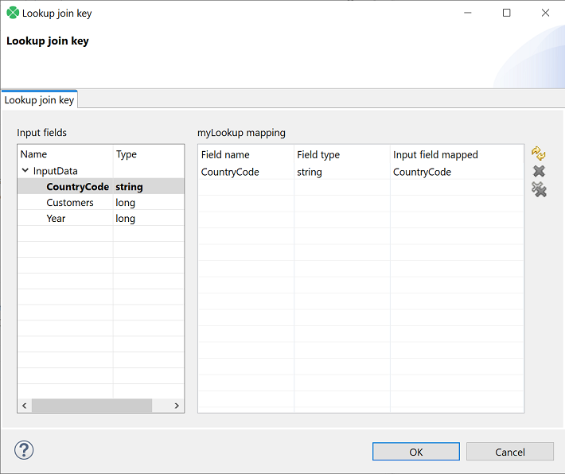
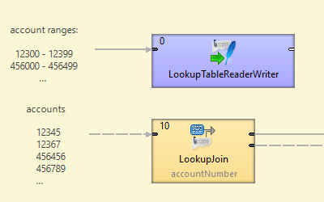

<!-- Development > Component reference > Joiners > LookupJoin -->

### LookupJoin


| [Short description](lookupjoin.md#short-description) |
| --- |
| [Ports](lookupjoin.md#ports) |
| [Metadata](lookupjoin.md#metadata) |
| [LookupJoin attributes](lookupjoin.md#lookupjoin-attributes) |
| [Details](lookupjoin.md#details) |
| [CTL interface](lookupjoin.md#ctl-interface) |
| [Java interfaces](lookupjoin.md#java-interfaces) |
| [Examples](lookupjoin.md#examples) |
| [Best practices](lookupjoin.md#best-practices) |
| [See also](lookupjoin.md#see-also) |

#### Short description

**LookupJoin** is a general purpose joiner. It merges potentially unsorted records from one data source incoming through the single input port with another data source from a lookup table based on a common key.

| Same input metadata | Sorted inputs | Slave inputs | Outputs | Output for drivers without slave | Output for slaves without driver | Joining based on equality | Auto-propagated metadata |
| --- | --- | --- | --- | --- | --- | --- | --- |
| **⨯** | **⨯** | 1 (virtual) | 1-2 | **✓** | **⨯** | **✓** | **✓** |

#### Ports

The joined data is then sent to the first output port.

The second output port can optionally be used to capture unmatched master records.

| Port type | Number | Required | Description | Metadata |
| --- | --- | --- | --- | --- |
| Input | 0 | **✓** | Master input port | Any |
| 1 (virtual) | **✓** | Slave input port | Any |  |
| Output | 0 | **✓** | Output port for the joined data | Any |
| 1 | **⨯** | Optional output port for master data records without slave matches. (Only if the **Join type** attribute is set to `Inner join`.) This applies only to **LookupJoin** and **DBJoin**. | Input 0 |  |

#### Metadata

**LookupJoin** propagates metadata from the first input port to the second output port and from the second output port to the first input port. The propagation does not change the priority of metadata.

**LookupJoin** has no metadata template.

Either data source (input port and lookup table) may potentially have a different metadata structure.

#### LookupJoin attributes

| Attribute | Req | Description | Possible values |
| --- | --- | --- | --- |
| Basic |  |  |  |
| Join key | yes | Key according to which the incoming data flows are joined. See [Join key](lookupjoin.md#lookup-join-key). |  |
| Left outer join |  | If set to `true`, also driver records without corresponding slave are parsed. Otherwise, `inner join` is performed. | false (default) \| true |
| Lookup table | yes | ID of the lookup table to be used as the resource of slave records.  Number of lookup key fields and their data types must be the same as those of **Join key**. These fields values are compared and matched records are joined. |  |
| Transform | [[1]](lookupjoin.md#lookupjoin-attributes-fn01) | Transformation in CTL or Java defined in the graph. |  |
| Transform URL | [[1]](lookupjoin.md#lookupjoin-attributes-fn01) | External file defining the transformation in CTL or Java. |  |
| Transform class | [[1]](lookupjoin.md#lookupjoin-attributes-fn01) | External transformation class. |  |
| Transform source charset |  | Encoding of the external file defining the transformation.  The default encoding depends on DEFAULT_SOURCE_CODE_CHARSET in defaultProperties. | E.g. UTF-8 |
| Advanced |  |  |  |
| Clear lookup table after finishing |  | When set to `true`, memory caches of the lookup table will be emptied at the end of the execution of this component. This has different effects on different lookup table types.  Simple lookup table and Range lookup table will contain 0 entries after this operation.  For the other lookup table types, this will only erase cached data and therefore make more memory available, but the lookup table will still contain the same entries. | false (default) \| true |
| Deprecated |  |  |  |
| Error actions |  | Definition of the action that should be performed when the specified transformation returns an **Error code**. See [Return values of transformations](transformations.md#return-values-of-transformations). |  |
| Error log |  | URL of the file to which error messages for specified **Error actions** should be written. If not set, they are written to **Console**. |  |

| 1 |  One of these must be set. These transformation attributes must be specified. Any of these transformation attributes must use a common CTL template for **Joiners** or implement a `RecordTransform` interface. |
| --- | --- |

#### Details

**LookupJoin** is a general purpose joiner used in most common situations. It does not require the input to be sorted and is very fast as it is processed in memory.

The data attached to the first input port is called the **master**, the second data source is called the **slave**. Its data is considered as if it were coming through the second (virtual) input port. Each master record is matched to the slave record on one or more fields known as the **join key**. The output is produced by applying a transformation which maps joined inputs to the output.

Slave data is pulled out from a lookup table, so depending on the lookup table the data can be stored in the memory. This also depends on the lookup table type, e.g. **Database lookup** stores only the values which have already been queried. Master data is not stored in the memory.


*Figure 436. LookupJoin - how it works*

##### Lookup join key

**Lookup join key** is a sequence of mapping expressions for all lookup key fields separated by a semicolon. Each of these mapping expressions contains lookup key field name and input record field name. You can define the key in the **Edit key** wizard.


*Figure 437. Edit Key Wizard*
Example 402. Join Key for LookupJoin

```ctl
$LookupKeyField1=$InputField1;$LookupKeyField2=$InputField2
```

The first part of each expressions is the **slave** key record field name. The second part of each expressions is the **master** input record field name.

Specified fields will be compared and matching values will serve to join master and slave records.

##### Key Duplicates in Lookup Table

If the lookup table allows key duplicates, more output records can be created from a single input record.

#### CTL interface

All **Joiners** share the same transformation template which can be found in [CTL templates for Joiners](ctl-templates-for-joiners.md).

#### Java interfaces

If you define your transformation in Java, it must implement the following interface that is common for all **Joiners**:

[Java interfaces for Joiners](java-interfaces-for-joiners.md)

See [Public CloverDX API](genericcomponent.md#public-cloverdx-api).

#### Examples

##### Enrichment of Records Using Data from Lookup Table

Given a list of number of customers for particular year per country with metadata fields **CountryCode**, **Customers** and **Year**.

```
CZ |341 |2013
CZE|417 |2014
DE |2573|2013
DE |3791|2014
SK |457 |2014
...
```

Replace the country code by country name. The list of country codes and corresponding country names is available from lookup table `CountryCodeLookup`.

```
CZ |Czech Republic
DE |Germany
SK |Slovak Republic
...
```

###### Solution

Use the attributes **Join Key**, **Lookup Table** and **Transform**.

| Attribute | Value |
| --- | --- |
| Join Key | CountryCode |
| Lookup Table | CountryCodeLookup |
| Transform | See the code below. |

```ctl
function integer transform() {
    $out.0.Customers = $in.0.Customers;
    $out.0.Country = $in.1.CountryName;
    $out.0.Year = $in.0.Year;

    return ALL;
}
```

Values found in the lookup table are mapped in the same way as if they came from the second input port.

The result records are

```
Czech Republic |341 |2013
Germany        |2573|2013
Germany        |3791|2014
Slovak Republic|457 |2014
```

The country code `CZE` has not been found in the lookup table, so it has been sent unchanged to the second output port if an edge is connected.

##### Matching Ranges with Range Lookup Table

This example shows usage of [Range lookup table](lookup-tables.md#range-lookup-table) table in **LookupJoin**.

Records on the first data stream contains groups of accounts. Each group of accounts is defined by the lowest and highest account numbers, e.g. 12300 and 12399.

Data on the second data stream contains account numbers. Match the accounts with groups.

###### Solution

Load the records containing account ranges with [LookupTableReaderWriter](lookuptablereaderwriter.md) into **Range Lookup Table**.

In the next phase, use **LookupJoin** to match the records from the second data stream.


*Figure 438. LookupJoin with Range Lookup Table*

In **LookupJoin** set **Join Key**, **Lookup Table**, and **Transform**.

| Attribute | Value |
| --- | --- |
| Join Key | accountNumber |
| Lookup Table | RangeLookupTable0 |
| Transform | Map the fields that are necessary. |
> [!NOTE]
> Matching account into the ranges depends on the data type. If the account ranges and account number are specified as a whole number (integer/long), the records are compared as numbers. If the account ranges and account number are specified as a string, the records are compared as strings.
>
> If account numbers are integers (or longs) and the range is from 10 to 50, account 200 is out of the range.
>
> If account numbers are strings and the range is from 10 to 50, account 200 is within the range.

#### Best practices

If the transformation is specified in an external file (with **Transform URL**), we recommend users to explicitly specify **Transform source charset**.

#### See also

| [Common properties of components](components.md#common-properties-of-components) |
| --- |
| [Specific attribute types](components.md#specific-attribute-types) |
| [Common properties of Joiners](common-of-joiners.md) |
| [Joiners comparison](common-of-joiners.md#joiners-comparison) |
| [Lookup tables](lookup-tables.md) |
| [Defining transformations](transformations.md#defining-transformations) |
