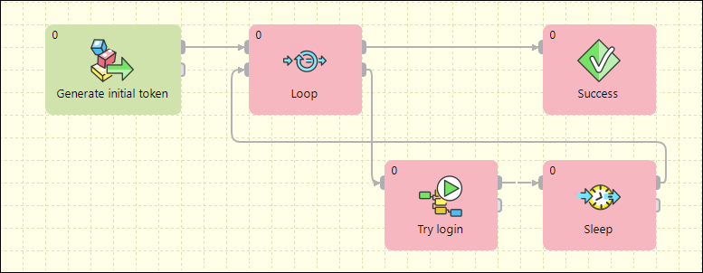

<!-- Development > Component reference > Job Control > Loop -->

### Loop

| [Short description](loop.md#short-description) |
| --- |
| [Ports](loop.md#ports) |
| [Metadata](loop.md#metadata) |
| [Loop attributes](loop.md#loop-attributes) |
| [Details](loop.md#details) |
| [Examples](loop.md#examples) |
| [Compatibility](loop.md#compatibility) |
| [See also](loop.md#see-also) |

#### Short description

The **Loop** component allows repeated execution of a group of components or repeated processing of records.

| Same input metadata | Sorted inputs | Inputs | Outputs | Each to all outputs | Java | CTL | Auto-propagated metadata |
| --- | --- | --- | --- | --- | --- | --- | --- |
| **✓** | **⨯** | 2 | 2 | **⨯** | **⨯** | **✓** | **✓** |
> [!IMPORTANT]
> It is highly important to manage token flow correctly. For example each token sent to the loop body must be navigated back to the **Loop** component. The token cannot be duplicated or cannot disappear. If these rules are not strictly followed, your jobflow processing can easily stuck in a deadlock situation.

#### Ports

| Port type | Number | Required | Description | Metadata |
| --- | --- | --- | --- | --- |
| Input | 0 | **✓** | Entry point for loop processing. | Any |
| 1 | **✓** | Tokens from the loop body must be returned back to the **Loop** component via this port. | Any |  |
| Output | 0 | **✓** | Tokens which do not satisfy **While condition** are sent to this port to end up the looping. | Any |
| 1 | **⨯** | Tokens which satisfy **While condition** are sent to this port to start loop body. | Any |  |

#### Metadata

All input and output ports have arbitrary but identical metadata.

#### Loop attributes

| Attribute | Req | Description | Possible values |
| --- | --- | --- | --- |
| Basic |  |  |  |
| While condition | yes | While this condition is satisfied, the iterating token is repeatedly sent to the loop body (second output port), otherwise the token is sent out of the loop (first output port).  **While condition** is a CTL2 expression which is evaluated against two records.  The first record ($in.0) is the token incoming from one of the input ports (either a loop initializing token or a token incoming from the loop body).  The second record ($in.1) is an artificial input for the condition evaluator with just a single field `$in.1.iterationNumber` which is automatically populated by the number of iterations of the current token. So for example, if the loop should be executed exactly five times, the condition could look like `$in.1.iterationNumber < 5`. | CTL expression |
| Advanced |  |  |  |
| Logging level | no | Decides on which level token processing information should be logged. | INFO (default) \| DEBUG \| TRACE \| OFF |

#### Details

The **Loop** component processes records (or tokens) one by one.

1. The record enters the **Loop** component.
2. The record is checked to fulfill the **loop condition**. If the condition is not fulfilled, the record is sent out to the first output port and the processing continues from step 1 using the next record. If the condition is met, the record is sent out to the second output port.
3. The record is processed by components in the loop body.
4. The record enters the **Loop** component through the second input port.
5. Processing continues from the step 2.

##### Edge Types

All edges in loop are automatically converted to fast-propagate version. See [Types of Edges](edge.md#types-of-edges).

#### Examples

##### Repeating Actions in Jobflow - Login

*Figure 444. Example of Loop component usage*

This jobflow simply generates an initial token by the **DataGenerator** component. The **Loop** component applies **While condition** on this initial token. If the condition is not satisfied, the token is sent out of the loop. On the other hand, if the condition is satisfied, the token is sent to the loop body, where the token is processed by other components. The token must be routed back to the **Loop** component, where **While condition** is evaluated again. The token looping is performed until the condition is not satisfied. Once the token is sent out of loop, another initial token is read from the first input port.

#### Compatibility

| Version | Compatibility Notice |
| --- | --- |
| 4.0.0 | **Loop** is now also available as an ordinary Component. Before, **Loop** was available as a **Jobflow Component** only. |

#### See also

| [Common properties of components](components.md#common-properties-of-components) |
| --- |
| [Specific attribute types](components.md#specific-attribute-types) |
| [Common properties of Job Control](common-of-job-control.md) |
| [Job Control comparison](common-of-job-control.md#job-control-comparison) |
