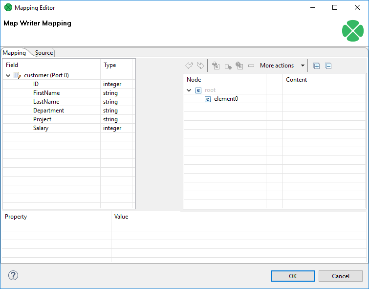
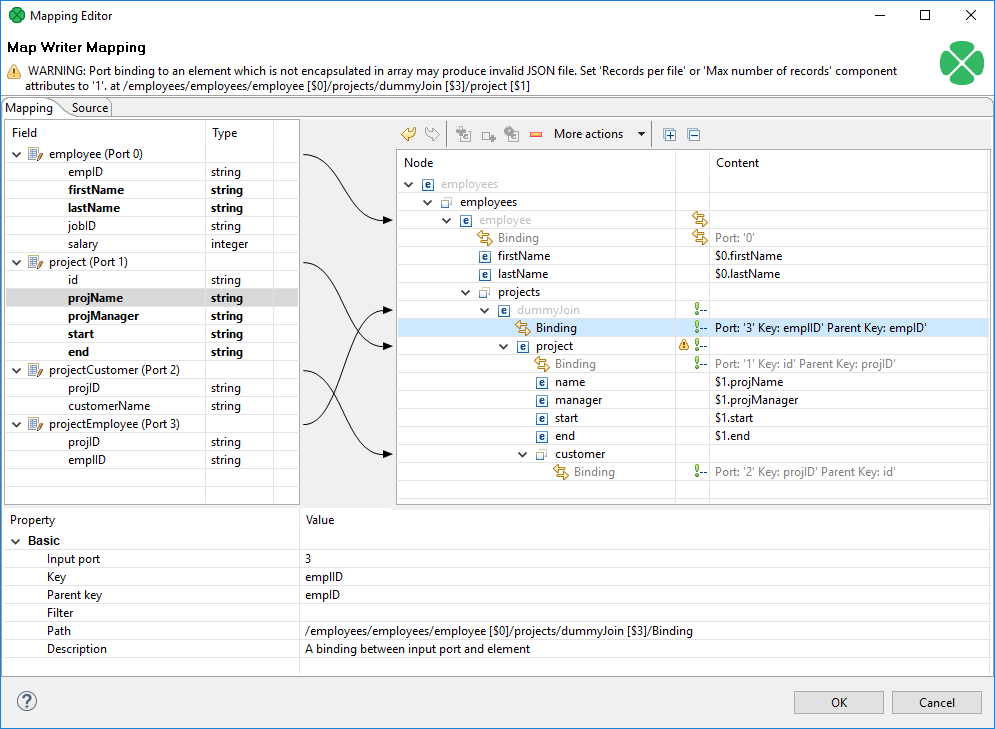
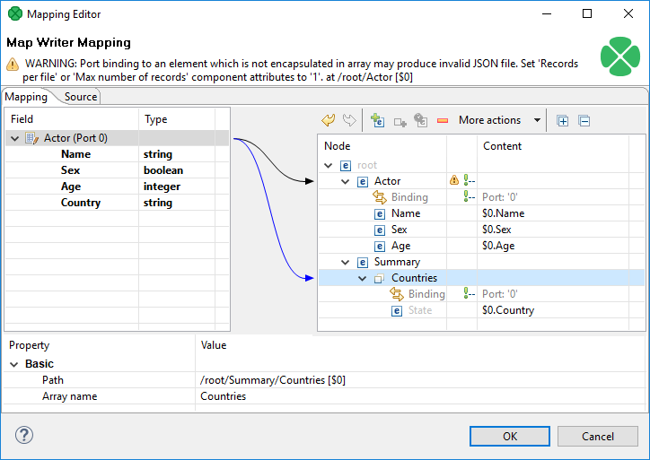

<!-- Development > Component reference > Writers > JavaMapWriter -->

### JavaMapWriter


| [Short description](mapwriter.md#short-description) |
| --- |
| [Ports](mapwriter.md#ports) |
| [JavaMapWriter attributes](mapwriter.md#javamapwriter-attributes) |
| [Details](mapwriter.md#details) |
| [See also](mapwriter.md#see-also) |

#### Short description

**JavaMapWriter** writes [JavaBeans](http://en.wikipedia.org/wiki/Java_Bean) (represented as `HashMaps` ) into a dictionary. This allows *dynamic* data interchange between **CloverDX** graphs and external environment, such as cloud. The component is a specific implementation of **JavaBeanWriter** which allows easier mapping. Maps are less restrictive than Beans: there are no data types and type conversion is missing. This gives **JavaMapWriter** a greater flexibility - it always writes data types into Maps just as they were defined in metadata. However, its lower overheads come at the cost of accidental reading of different data type than desired (e.g. if you write `string` into a Map and then read it back as `integer` with **JavaBeanReader**, the graph fails).

| Data output | Input ports | Output ports | Each to all outputs | Different to different outputs | Transformation | Transf. req. | Java | CTL | Auto-propagated metadata |
| --- | --- | --- | --- | --- | --- | --- | --- | --- | --- |
| dictionary | 1-n | 0 | **✓** | **⨯** | **⨯** | **⨯** | **⨯** | **⨯** | **⨯** |

#### Ports

| Port type | Number | Required | Description | Metadata |
| --- | --- | --- | --- | --- |
| Input | 0-n | At least one | Input records to be joined and mapped to Java Maps. | Any (each port can have different metadata) |

#### JavaMapWriter attributes

| Attribute | Req | Description | Possible values |
| --- | --- | --- | --- |
| Basic |  |  |  |
| Dictionary target | yes | The dictionary you want to write Java Mapsto. |  |
| Mapping | [[1]](mapwriter.md#javamapwriter-attributes-fn01) | Defines how input data is mapped onto output Java Maps. See [Details](mapwriter.md#details). |  |
| Mapping URL | [[1]](mapwriter.md#javamapwriter-attributes-fn01) | The external text file containing the mapping definition. |  |
| Advanced |  |  |  |
| Cache size |  | The size of the database used when caching data from ports to elements (the data is first processed then written). The larger your data is, the larger cache is needed to maintain fast processing. | auto (default) \| e.g. 300MB, 1GB etc. |
| Cache in Memory |  | Cache data records in memory instead of disk cache. Note that while it is possible to set the maximal size of the cache for the disk cache, this setting is ignored in case the in-memory-cache is used. As a result, an `OutOfMemoryError` may occur when caching too many data records. | true \| false (default) |
| Sorted input |  | Tells JavaMapWriter whether the input data is sorted. Setting the attribute to `true` declares you want to use the sort order defined in **Sort keys**, see below. | false (default) \| true |
| Sort keys |  | Tells JavaMapWriter how the input data is sorted, thus enabling streaming. The sort order of fields can be given for each port in a separate tab. Working with **Sort keys** has been described in [Sort key](components.md#sort-key). |  |
| Max number of records |  | The maximum number of records written to all output files. See [Selecting output records](selecting-output-records.md). | 0-N |

| 1 |  One of these has to be specified. If both are specified, **Mapping URL** has a higher priority. |
| --- | --- |

#### Details

The **JavaMapWriter** component receives data through all connected input ports and converts data records to Java `HashMaps` based on the mapping you define. Lastly, the component writes the resulting tree structure of elements to Maps.

The logic of mapping is similar to [XMLWriter](extxmlwriter.md#details) - if you are familiar with its mapping editor, you will have no problems designing the output tree in this component. The differences are:

- **JavaMapWriter** allows you to map **arrays**;
- there are no attributes as in XML.

**Remember** the component cannot write to a file - the only possible output is [dictionary](dictionary.md).

If you are familiar with [XMLWriter](extxmlwriter.md#details), you will find the process of mapping the input records to the output dictionary analogous. Mapping editors in both components have similar logic.

The very basics of mapping are:

- Connect input edges to **JavaMapWriter** and edit the component’s **Mapping** attribute. This will open the visual mapping editor:
  
  *Figure 392. Mapping editor in JavaMapWriter after first open.*
  Metadata on the input edge(s) are displayed on the left hand side. The right hand pane is where you design the desired output tree. Mapping is then performed by dragging metadata from left to right (and performing additional tasks described below).
- In the right hand pane, design your output tree structure consisting of
  - [Elements](extxmlwriter.md#element)
    > [!IMPORTANT]
    > Unlike **XMLWriter**, you do not map metadata to any 'attributes'.
  - **Arrays** - arrays are ordered sets of values. To learn how to map them in, see [Writing arrays](mapwriter.md#javamapwriter-example-arrays).
  - [Wildcard elements](extxmlwriter.md#wildcard-element) - another option to mapping elements explicitly. You use the **Include** and **Exclude** patterns to generate element names from respective metadata.
- Connect input records to output (wildcard) elements to create [Binding](extxmlwriter.md#creating-the-mapping-mapping-ports-and-fields).
  Example 391. Creating Binding
  
  *Figure 393. Example mapping in JavaMapWriter*
  In the example above, you can see the employees are joined with projects they work on. Fields in bold (their content) will be printed to the output dictionary.
  > [!NOTE]
  > If you extended your graph and had the output dictionary written to the console, you would get a structure like this. This excerpt is just to demonstrate how Java Maps, mapped in [the figure above](mapwriter.md#javamapwriter-fig-mapping), are stored internally:
  >
  >
  > ```java
  > [{employees=[{projects=[{manager=John Major, start=01062005,
  >     name=Data warehouse, customers=[Hanuman, Weblea, SomeBank], end=31052006}],
  >     lastName=Fish, firstName=Mark}, {projects=[{manager=John Smith, start=06062006,
  >     name=JSP, customers=[Sunny, Weblea], end=in progress}, {manager=Raymond Brown,
  >     start=11052004, name=OLAP, customers=[Sunny], end=31012006}], lastName=Simson,
  >     firstName=Jane}, {projects=[{manager=John Major, start=01062005,
  >     name=Data warehouse, customers=[Hanuman, Weblea, SomeBank], end=31052006},
  >     {manager=Raymond Brown, start=11052004, name=OLAP, customers=[Sunny], end=31012006},
  >     {manager=Brandon Morrison, start=01032006, name=Javascripting,
  >     customers=[Nestele, Traincorp, AnotherBank, Intershop], end=in progress}],
  >     lastName=Morrison, firstName=Brandon}]}]
  > ```
  Example 392. Writing arrays
  Let us have the following mapping of the input file which contains information about actors. For explanatory reasons, we will part actors' personal data from their countries of origin. The summary of all countries will then be written into an array:
  
  *Figure 394. Mapping arrays in JavaMapWriter - notice the array contains a dummy element’State' which you bind the input field to.*
  The array will be written to Maps as e.g.:
  ```java
  [ ...
      Summary={Countries=[USA, ESP, ENG]}}]
  ```
- At any time, you can switch to the [Source tab](extxmlwriter.md#creating-the-mapping-source-tab) and write/check the mapping yourself in code.
- If the basic instructions found here are not satisfying, consult XMLWriter’s [Details](extxmlwriter.md#details) where the whole mapping process is described in detail.

#### See also

| [Common properties of components](components.md#common-properties-of-components) |
| --- |
| [Specific attribute types](components.md#specific-attribute-types) |
| [Common properties of Writers](common-of-writers.md) |
| [Writers comparison](common-of-writers.md#writers-comparison) |
