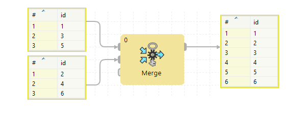

<!-- Development > Component reference > Transformers > Merge -->

### Merge

| [Short description](merge.md#short-description) |
| --- |
| [Ports](merge.md#ports) |
| [Metadata](merge.md#metadata) |
| [Merge attributes](merge.md#merge-attributes) |
| [Details](merge.md#details) |
| [See also](merge.md#see-also) |

#### Short description

**Merge** merges and sorts data records from two or more inputs.

| Same input metadata | Sorted inputs | Inputs | Outputs | Java | CTL | Auto-propagated metadata |
| --- | --- | --- | --- | --- | --- | --- |
| **✓** | **✓** | 1-n | 1 | - | - | **✓** |

#### Ports

| Port type | Number | Required | Description | Metadata |
| --- | --- | --- | --- | --- |
| Input | 0 | **✓** | For input data records | Any |
| 1-n | **⨯** | For input data records | Input 0 |  |
| Output | 0 | **✓** | For merged data records | Input 0 |
| 1-n | **⨯** | For merged data records | Input 0 |  |

You can disable only the last input port(s) of **Merge**, e.g. you can disable the third and fourth input port, but you cannot disable the first one.

#### Metadata

Merge propagates metadata in both directions. Merge does not change priority of propagated metadata.

Merge has no metadata template.

Merge does not require any specific metadata fields.

All input metadata must be the same. Metadata name and field names may differ, but the field datatypes must correspond to each other.

#### Merge attributes

| Attribute | Req | Description | Possible values |
| --- | --- | --- | --- |
| Basic |  |  |  |
| Merge key | yes | The key according to which the sorted records are merged. **Remember** that all key fields must be sorted in ascending order. For more information, see [Group key](components.md#group-key). | E.g. `first_name; last_name` |

#### Details

**Merge** receives sorted data records through two or more input ports. The component merges a serie of input records into one.

*Figure 409. Merge*
> [!IMPORTANT]
> Remember that all key fields must be sorted in ascending order.

#### See also

| [ParallelMerge](clustermerge.md) |
| --- |
| [Concatenate](concatenate.md) |
| [LoadBalancingPartition](loadbalancingpartition.md) |
| [Partition](partition.md) |
| [SimpleGather](simplegather.md) |
| [Common properties of components](components.md#common-properties-of-components) |
| [Specific attribute types](components.md#specific-attribute-types) |
| [Common properties of Transformers](common-of-transformers.md) |
| [Transformers comparison](common-of-transformers.md#transformers-comparison) |
