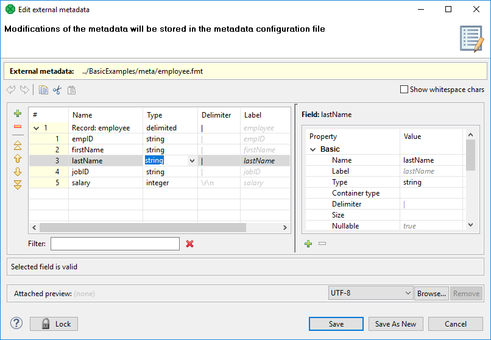
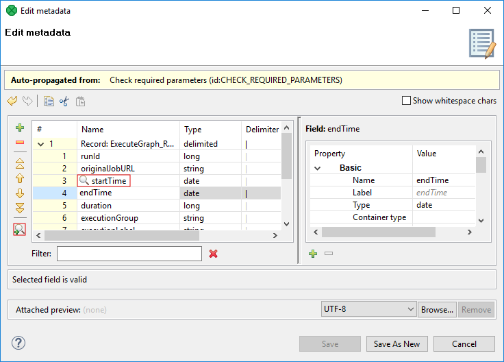

<!-- Development > Job elements > Metadata > Metadata Editor -->

### Metadata Editor

| [Basics of Metadata Editor](metadata-editor.md#basics-of-metadata-editor) |
| --- |
| [Record Pane](metadata-editor.md#record-pane) |
| [Field name vs. label vs. description](metadata-editor.md#field-name-vs-label-vs-description) |
| [Details Pane](metadata-editor.md#details-pane) |

**Metadata Editor** is a visual tool for editing metadata. It can be used to [create new metadata](creating-metadata.md) or to view existing, modified metadata.

#### Opening Metadata Editor

**Metadata Editor** can be opened from **Graph Editor**, **Outline** or from **Project Explorer**.

##### Opening Metadata Editor from Graph editor

If you want to edit any metadata assigned to an edge (both internal and external), you can do it in the **Graph Editor** pane in one of the following ways:

- Double-click the edge.
- Select the edge and press Enter.
- Right-click the edge and select **Edit** from the context menu.

##### Opening Metadata Editor from Outline

If you want to edit any metadata (both internal and external), you can do it after expanding the **Metadata** category in the **Outline** pane:

- Double-click the metadata item.
- Select the metadata item and press Enter.
- Right-click the metadata item and select **Edit** from the context menu.

##### Opening Metadata Editor from Project Explorer

If you want to edit any external (shared) metadata from any project, you can do it after expanding the **meta** subfolder in the **Project Explorer** pane:

- Double-click the metadata file.
- Select the metadata file and press Enter.
- Right-click the metadata file and select **Open With** ****CloverDX Metadata Editor** from the context menu.

#### Basics of Metadata Editor

The **Metadata Editor** consists of:

- **Record** pane showing an overview of information about the record as a whole and also the list of its fields with delimiters, sizes or both. Record pane is on the left side. See [Record Pane](metadata-editor.md#record-pane).
- **Details** pane showing details of an item selected in the Record pane. Details pane is on the right side. See [Details Pane](metadata-editor.md#details-pane).
- Buttons for **undo**, **redo**, **copy**, **cut** and **paste** actions in the top.
- **Show whitespace checkbox** enabling user to easily distinguish particular white space characters.
> [!NOTE]
> Default values of some properties are printed in gray text.

Below you can see an example of delimited metadata and fixed length metadata. Mixed metadata would be a combination of both cases. For some field names, delimiter would be defined and no size would be specified; whereas for others, size would be defined and no delimiter would be specified, or both would be defined. To create such metadata, you must do it manually.

*Figure 214. Metadata Editor for a Delimited File*
> [!NOTE]
> **Save As New** functionality is available only for an internal metadata.

##### Trackable fields selection

In a [Jobflow](part-jobflow.md#jobflow-overview), the values of selected fields can be [tracked](part-jobflow.md#jobflow-trackable-fields). The fields can be selected using the **Print field value into log with token status** button, as show below:

*Figure 215. Trackable fields selection in Metadata Editor*

To deselect the fields, use the button **Do not print field value into log with token status**. The button appears only if the tracking of the field is enabled.

##### Record pane

**Record** pane displays an overview of the record as a whole and all its fields.

##### Record overview

The first row presents an overview of the whole record.

It consists of the following columns:

- The **name** of the record is displayed in the second column and can be changed there.
- The **type** of the record is displayed in the third column and can be selected as delimited, fixed or mixed.
- The **default delimiter** defines character or characters separating each field from the following one (except for the last one). It is available in delimited and mixed records.
- The **size** is a size of the whole record. It is available in fixed-length metadata.
- The last column is always the **label**. It is similar to the field name, but there are no restrictions relating to it. See [Field name vs. label vs. description](metadata-editor.md#field-name-vs-label-vs-description).

##### List of records fields

The other rows, except the last one, present the list of the record fields:

- The first column displays the **number** of the field. Fields are numbered starting from `1`.
- The second column displays the **name** of the field. It can be changed there. We suggest you only use the following characters for the field names: `[a-zA-Z0-9_]`.
- The third column displays the **data type** of the field. One of the data types for metadata can be selected. For more information, see [Data types in metadata](metadata-records-and-fields.md#data-types-in-metadata).
- The other columns display the **delimiter** which follows the field displayed in the row, the size of the field or both the delimiter and size. If the delimiter is displayed grayish, it is the default delimiter, if it is black, it is non-default delimiter.

The last row presenting the last field slightly differs:

- The first three columns are the same as those in other field rows.
- The other columns display record delimiter which follows the last field (if it is displayed grayish) or the non-default delimiter which follows the last field and precedes the record delimiter (if it is displayed black), the size of the field or both the delimiter and size.

For detailed information about delimiters, see [Changing and defining delimiters](changing-and-defining-delimiters.md).

##### Buttons for record modification

Several buttons necessary for modification of the record structure are placed on the left side of **Record pane**.

- **Add field**
- **Remove field**
- **Move to top**
- **Move up**
- **Move down**
- **Move to bottom**
- **Print field value into log with token status** - adds item into **Key fields**. This button is available in jobflow only. See [Trackable fields selection](metadata-editor.md#trackable-fields-selection).
- **Do not print field value into log with token status** - removes item from list in **Key field**. This option is exclusive with the previous one. The button is available in jobflow only.

##### Filter

The filter at the bottom of **Record pane** enables the user to filter displayed fields of the record. The filter expression is case-insensitive.
> [!NOTE]
> Each column of the **Record** pane can be sorted in ascending or descending order by simply clicking its header.

#### Field name vs. label vs. description

The section should help you understand these basic differences.

**Field name** is an internal **CloverDX** denotation used when, for example, metadata are extracted from a file. Field names are not arbitrary - you can use letters, numbers and underscore (_). Field names cannot begin with numbers. Field names serve as an identifier - it must be unique within the record.

**Field label** is automatically copied from the field name and you can change it without any restrictions - accents, diacritics etc. are all allowed. Moreover, labels inside one record can be duplicate. Normally, when extracting metadata from a CSV file, for example, you will get field names in a "machine" format. You can then change them to neat labels using any characters you want. At last, writing to an Excel file, you let those labels become spreadsheet headers. (**Write field names** attribute in some writers, see [Writers](writers.md))

**Description** is a pure comment. Use it to give advice to yourself or other users who are going to work with your metadata. It produces no outputs.

#### Details pane

The contents of the **Details** pane changes in accordance with the row selected in the **Record** pane.

- If you select the first row, details about the whole record are displayed.
  See [Record details](metadata-editor.md#record-details).
- If you select another row, details about the selected field are displayed.
  See [Field details](metadata-editor.md#field-details).
> [!NOTE]
> Default values of some properties are printed in gray text.

##### Record details

When the **Details** pane presents information about the record as a whole, its properties are displayed . The record details are split up into **basic**, **advanced** and **custom**.

###### Basic

- Name
  **Name** is the name of the record. The name can be seen above a selected edge or in the **Outline**. Only limited set of characters is allowed here: letters of English alphabet, numbers and underscore.
- Label
  Contrary to the **Name**, the **Label** can contain diacritic and space characters. See [Field name vs. label vs. description](metadata-editor.md#field-name-vs-label-vs-description).
- Type
  One of the following three can be selected: `delimited`, `fixed`, `mixed`. For more information, see [Record types](metadata-records-and-fields.md#record-types).
- Record delimiter
  **Record delimiter** is a delimiter following the last field meaning the end of the record. If the delimiter in the last row of the **Record** pane in its **Delimiter** column is displayed grayish, it is this record delimiter. If it is black, it is another, non-default delimiter defined for the last field which follows it and precedes the record delimiter.
  For more detailed information, see [Changing and defining delimiters](changing-and-defining-delimiters.md).
- Record size
  **Record size** is the length of the record counted in number of characters. It can be changed there.
  The record size is displayed for `fixed` or `mixed` record type only.
- Default delimiter
  **Default delimiter** is a delimiter which, by default, follows each field of the record except the last one. This delimiter is displayed in each other row (except the last one) of the **Record** pane in its **Delimiter** column if it is grayish. If it is black, it is another, non-default delimiter defined for such a field which overrides the default one and is used instead.
  The Default delimiter is displayed for `delimited` or `mixed` records type only.
  For more detailed information, see [Changing and defining delimiters](changing-and-defining-delimiters.md).
- Skip source rows
  **Skip source rows** defines the number of records that will be skipped for each input file. If an edge with this attribute is connected to a **Reader**, this value overrides the default value of the **Number of skipped records per source** attribute, which is `0`. If the **Number of skipped records per source** attribute is not specified, this number of records are skipped from each input file. If the attribute in the **Reader** is set to any value, it overrides this property value. Remember that these two values are not summed.
- Description
  The description stores user notes concerning the record. The description can contain several paragraphs.
Advanced
- Quoted strings
  Fields containing a special character (comma, newline, or double quote) have to be enclosed in quotes. Only single/double quote is accepted as the quote character. If **Quoted strings** is `true`, special characters are not treated as delimiters and are:
  - removed - when reading the input by a Reader;
  - written out - output fields will be enclosed in Quoted strings (see [FlatFileWriter attributes](flatfilewriter.md#flatfilewriter-attributes)).
  If a component has this attribute (e.g. ParallelReader, ComplexDataReader, FlatFileReader, FlatFileWriter), its value is set according to the settings of **Quoted strings** in metadata on input/output port. However, the true/false value in a component has a higher priority than the one in metadata - you can override it.
   Example (e.g.for **ParallelReader**): To read input data `"25"|"John"`, switch **Quoted strings** to `true` and set **Quote character** to ". This will produce two fields: `25|John`.
- Quote character
  **Quote character** specifies which kind of quotes will be used in **Quoted strings**. If a component has this attribute (e.g. ParallelReader, ComplexDataReader, FlatFileReader, FlatFileWriter), its value is set according to the settings of **Quote character** in metadata on input/output port. However, the value in a component has a higher priority than the one in metadata - you can override it.
- Locale
  This is the locale that is used for the whole record. This property can be useful for date formats or for decimal separator, for example. It can be overridden by the **Locale** specified for individual field.
  For detailed information, see [Locale](metadata-records-and-fields.md#locale).
- Locale sensitivity
  Applied for the whole record. It can be overridden by the **Locale sensitivity** specified for individual field (of `string` data type).
  For detailed information, see [Locale sensitivity](metadata-records-and-fields.md#locale-sensitivity).
- Time zone
  Applied for the whole record. It can be overridden by the **Time zone** specified for individual field (of `date` data type).
  See [Time Zone](metadata-records-and-fields.md#timezone) for detailed information.
- Null value
  This property is set for the whole record. It is used to specify what values of fields should be processed as `null`. By default, empty field or empty string (`""`) are processed as `null`. You can set this property value to any string of characters that should be interpreted as `null`. All of the other string values remain unchanged. If you set this property to any non-empty string, empty string or empty field value will remain to be empty string (`""`).
  Multiple `null` values can be specified using `\\|` delimiter. For example, if you would like to recognize both strings `NULL` and `N/A` as a `null` value, just use `NULL\\|N/A`.
  It can be overridden by the value of **Null value** property of individual field.
- Preview Attachment
  This is the file URL of the file attached to the metadata. It can be changed there or located using the **Browse…​** button.
- Preview Charset
  This is the charset of the file attached to the metadata. It can be changed there or by selecting from the combobox.
- Preview Attachment metadata Row
  This is the number of the row of the attached file where record field names are located.
- Preview Attachment Sample Data Row
  This is the number of the row of the attached file from where field data types are guessed.
- Key Fields
  The **Key fields** field contains all field names of fields marked using **Print field value into log with token status** button (from the record pane).
- EOF as delimiter
  If **EOF as delimiter** is `true`, the end of file is considered as a record delimiter.
  If **EOF as delimiter** is set up on a record level and on a field level, the record level has higher priority.

###### Custom

**Custom** properties can be defined by clicking the **Plus** sign button. For example, these properties can be the following:

- charset
  This is the charset of the record. For example, when metadata are extracted from dBase files, these properties may be displayed.
- dataOffset
  **dataOffset** is displayed for `fixed` or `mixed` record type only.

##### Field details

When the **Details** pane presents information about a field, there are displayed its properties. Field details are **basic** and **advanced**.

###### Basic

- Name
  This is the same field name as in the **Record** pane.
  See [Field Name vs. Label vs. Description](metadata-editor.md#field-name-vs-label-vs-description).
- Label
  Label is similar to the Name, but the arbitrary characters can be used.
- Type
  This is the same data type as in the **Record** pane.
  For more detailed information, see [Data Types in metadata](metadata-records-and-fields.md#data-types-in-metadata).
- Container type
  **Container type** determines whether a field can store multiple values (of the same type). There are two options: **list** and **map**. Switching back to **single** makes it a common single-value field again.
  For more information, see [Multivalue fields](multivalue-fields.md).
- Delimiter
  This is the non-default field delimiter as in the **Record** pane. If it is empty, the default delimiter is used instead.
  The delimiter is on the right side of the corresponding field.
  For more detailed information, see [Changing and defining delimiters](changing-and-defining-delimiters.md).
- Size
  This is the same size as in the **Record** pane.
- Nullable
  This can be `true` or `false`. The default value is `true`. In such a case, the field value can be null. Otherwise, null values are prohibited and graph fails if null is met.
- Default
  This is the default value of the field. It is used if you set the **Autofilling** property to `default_value`.
  For more detailed information, see [Autofilling functions](metadata-records-and-fields.md#autofilling-functions).
- Length
  Displayed for `decimal` data type only. For `decimal` data types you can optionally define its length. It is the maximum number of digits in this number. The default value is `12`.
  For more detailed information, see [Data types in metadata](metadata-records-and-fields.md#data-types-in-metadata).
- Scale
  Displayed for `decimal` data type only. For `decimal` data types you can optionally define scale. It is the maximum number of digits following the decimal dot. The default value is `2`.
  For more detailed information, see [Data types in metadata](metadata-records-and-fields.md#data-types-in-metadata).
- Description
  **Description** is user defined long text concerning the particular field. The field can be several paragraphs long.

##### Advanced

**Advanced** properties are the following:

- Format
  Format defines the parsing and/or the formatting of a `boolean`, `date`, `decimal`, `integer`, `long`, `number`, and `string` data field.
  For more information, see [Data formats](metadata-records-and-fields.md#data-formats).
- Locale
  This property can be useful for date formats or for decimal separator, for example. It overrides the **Locale** specified for the whole record.
  For detailed information, see [Locale](metadata-records-and-fields.md#locale).
- Locale sensitivity
  Displayed for `string` data type only. Is applied only if **Locale** is specified for the field or the whole record. It overrides the **Locale sensitivity** specified for the whole record.
  For detailed information, see [Locale sensitivity](metadata-records-and-fields.md#locale-sensitivity).
- Time zone
  Displayed for `date` data type only. It overrides the **Time zone** specified for the whole record.
  For detailed information, see [Time zone](metadata-records-and-fields.md#timezone).
- Null value
  This property can be set up to specify what values of fields should be processed as `null`. By default, empty field or empty string (`""`) are processed as `null`. You can set this property value to any string of characters that should be interpreted as `null`. All of the other string values remain unchanged. If you set this property to any non-empty string, empty string or empty field value will remain to be empty string (`""`).
  It overrides the value of **Null Value** property of the whole record.
  Multiple values can be used as a `null` value. See [Null value](metadata-editor.md#metadata-record-null-value-bridge) as a record property.
- Trim
  If true, the leading and trailing white space characters are trimmed. It is performed on data in readers.
- Autofilling
  If defined, field marked as `autofilling` is filled with a value by one of the functions listed in the [Autofilling functions](metadata-records-and-fields.md#autofilling-functions) section.
- Shift
  This is the gap between the end of one field and the start of the next one, when the fields are part of fixed or mixed record and their sizes are set to some value.
- EOF as delimiter
  This can be set to true or false according to whether EOF character is used as delimiter. It can be useful when your file does not end with any other delimiter. If you did not set this property to true, run of the graph with such data file would fail (by default it is false). Displayed in delimited or mixed data records only.
  The **EOF as delimiter** can be set up on the record level. If the values differ, the value on the record level has higher priority.
