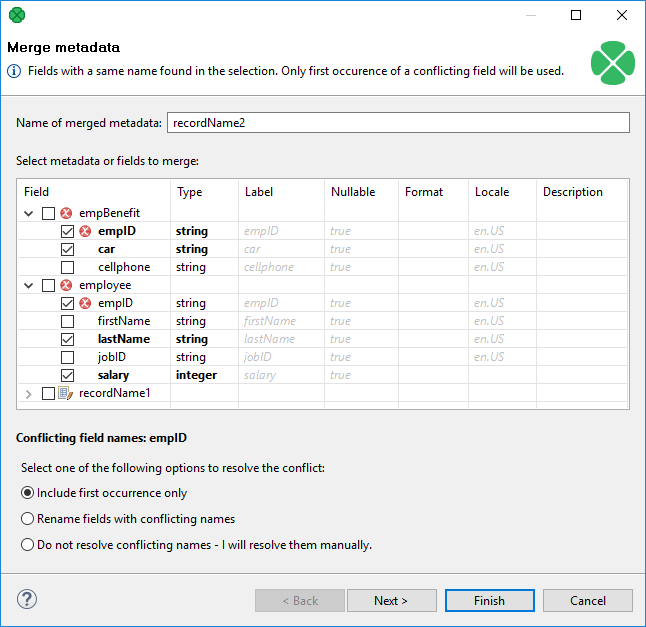
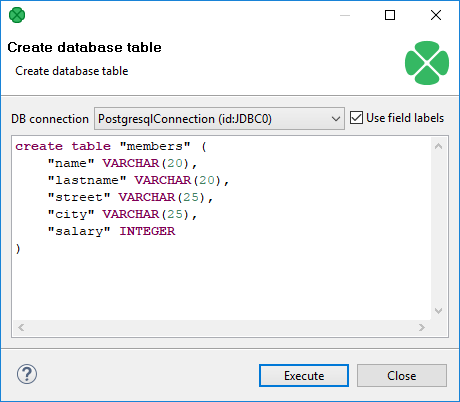

<!-- Development > Job elements > Metadata > Merging existing metadata -->

### Merging existing metadata

You can create new metadata by combining two or more existing metadata into one new metadata object. Fields and their settings are copied from the selected sources into the new metadata.

Conflicting field names are resolved either:

- automatically - two options: only the first field is taken; or duplicates are renamed (e.g. `field_1`, `field_2`, etc.);
- manually, which is the second step of this wizard.

The **Merge metadata** dialog lets you choose which metadata and which fields will go into the result. You can invoke the dialog:

1. In **Outline**, right-click two or more existing metadata.
   or
   **Metadata** ****New metadata** ****Merge existing**
   OR
   Right click an edge and click **New metadata**.
2. Click **Merge metadata…​** (**Merge existing**).
3. You will continue in a two-step wizard. In its first step, you manage all fields of the metadata you have selected. Select only those you want to include in the final merger (they are highlighted in bold):
   
   *Figure 244. Merging two metadata - conflicts can be resolvedin one of the three ways (notice the radio buttons at the bottom).*
4. Click **Next** to review merged metadata or **Finish** to create it instantly.
> [!NOTE]
> Merging SQL query metada
> [SQL query metadata](metadata-types.md#sql-query-metadata) cannot be merged.

#### Creating database table from metadata and database connection

As the last option, you can also create a database table on the basis of metadata (both internal and external).

When you select the **Create database table** item from each of the two context menus (called out from the **Outline** pane and/or **Graph Editor**), a wizard opens with an SQL query that can create database table.

*Figure 245. Creating database table from metadata and database connection*

You can edit the contents of this window if you want.

When you select some connection to a database. For more details, see [Database Connections](database-connections.md). Such database table will be created.
> [!NOTE]
> If multiple SQL types are listed, actual syntax depends on particular metadata (size for fixed-length field, length, scale, etc.).

| DB type | DB2 | Hive | Informix | MSAccess |
| --- | --- | --- | --- | --- |
| CloverDX type |  |  |  |  |
| boolean | SMALLINT | BOOLEAN | BOOLEAN | BIT |
| byte | VARCHAR(80) FOR BIT DATA | BINARY[[1]](metadata-merge.md#from-0-8-0) | BYTE | VARBINARY(80) |
| CHAR(n) FOR BIT DATA |  |  | BINARY(n) |  |
| cbyte | VARCHAR(80) FOR BIT DATA | BINARY[[1]](metadata-merge.md#from-0-8-0) | BYTE | VARBINARY(80) |
| CHAR(n) FOR BIT DATA |  |  | BINARY(n) |  |
| date | TIMESTAMP | TIMESTAMP[[1]](metadata-merge.md#from-0-8-0) | DATETIME YEAR TO SECOND | DATETIME |
| DATE |  | DATE | DATE |  |
| TIME |  | DATETIME HOUR TO SECOND | TIME |  |
|  |  |  |  |  |
| decimal | DECIMAL | DECIMAL[[2]](metadata-merge.md#from-0-11-0) | DECIMAL | DECIMAL |
| DECIMAL(p) |  | DECIMAL(p) | DECIMAL(p) |  |
| DECIMAL(p,s) |  | DECIMAL(p,s) | DECIMAL(p,s) |  |
| integer | INTEGER | INT | INTEGER | INT |
| long | BIGINT | BIGINT | INT8 | BIGINT |
| number | DOUBLE | DOUBLE | FLOAT | FLOAT |
| string | VARCHAR(80) | STRING | VARCHAR(80) | VARCHAR(80) |
| CHAR(n) |  | CHAR(n) | CHAR(n) |  |

| 1 | Available from version 0.8.0 of Hive |
| --- | --- |

| 2 | Available from version 0.11.0 of Hive |
| --- | --- |

| DB type | MSSQL | MSSQL | MySQL | Oracle | Pervasive |
| --- | --- | --- | --- | --- | --- |
| CloverDX type | 2000-2005 | 2008 or newer |  |  |  |
| boolean | BIT | BIT | TINYINT(1) | SMALLINT | BIT |
| byte | VARBINARY(80) | VARBINARY(80) | VARBINARY(80) | RAW(80) | LONGVARBINARY(80) |
| BINARY(n) | BINARY(n) | BINARY(n) | RAW(n) | BINARY(n) |  |
| cbyte | VARBINARY(80) | VARBINARY(80) | VARBINARY(80) | RAW(80) | LONGVARBINARY(80) |
| BINARY(n) | BINARY(n) | BINARY(n) | RAW(n) | BINARY(n) |  |
| date | DATETIME | DATETIME | DATETIME | TIMESTAMP | TIMESTAMP |
|  | DATE | YEAR | DATE | DATE |  |
|  | TIME | DATE |  | TIME |  |
|  |  | TIME |  |  |  |
| decimal | DECIMAL | DECIMAL | DECIMAL | DECIMAL | DECIMAL |
| DECIMAL(p) | DECIMAL(p) | DECIMAL(p) | DECIMAL(p) | DECIMAL(p) |  |
| DECIMAL(p,s) | DECIMAL(p,s) | DECIMAL(p,s) | DECIMAL(p,s) | DECIMAL(p,s) |  |
| integer | INT | INT | INT | INTEGER | INTEGER |
| long | BIGINT | BIGINT | BIGINT | NUMBER(11,0) | BIGINT |
| number | FLOAT | FLOAT | DOUBLE | FLOAT | DOUBLE |
| string | VARCHAR(80) | VARCHAR(80) | VARCHAR(80) | VARCHAR2(80) | VARCHAR2(80) |
| CHAR(n) | CHAR(n) | CHAR(n) | CHAR(n) | CHAR(n) |  |

| DB type | PostgreSQL | Snowflake | SQLite | Sybase | Generic |
| --- | --- | --- | --- | --- | --- |
| CloverDX type |  |  |  |  |  |
| boolean | BOOLEAN | BOOLEAN | BOOLEAN | BIT | BOOLEAN |
| byte | BYTEA | VARBINARY | VARBINARY(80) | VARBINARY(80) | VARBINARY(80) |
|  |  | VARBINARY(80) | BINARY(n) | BINARY(n) |  |
| cbyte | BYTEA | VARBINARY | VARBINARY(80) | VARBINARY(80) | VARBINARY(80) |
|  |  | BINARY(n) | BINARY(n) | BINARY(n) |  |
| date | TIMESTAMP | TIMESTAMP | TIMESTAMP | DATETIME | TIMESTAMP |
| DATE | DATE | DATE | DATE | DATE |  |
| TIME | TIME | TIME | TIME | TIME |  |
|  |  |  |  |  |  |
| decimal | NUMERIC | DECIMAL | DECIMAL | DECIMAL | DECIMAL |
| NUMERIC(p) | DECIMAL(p) | DECIMAL(p) | DECIMAL(p) | DECIMAL(p) |  |
| NUMERIC(p,s) | DECIMAL(p,s) | DECIMAL(p,s) | DECIMAL(p,s) | DECIMAL(p,s) |  |
| integer | INTEGER | DECIMAL(10,0) | INTEGER | INT | INTEGER |
| long | BIGINT | DECIMAL(19,0) | BIGINT | BIGINT | BIGINT |
| number | REAL | FLOAT | NUMERIC | FLOAT | FLOAT |
| string | VARCHAR(80) | VARCHAR | VARCHAR(80) | VARCHAR(80) | VARCHAR(80) |
| CHAR(n) | VARCHAR | CHAR(n) | CHAR(n) | CHAR(n) |  |
