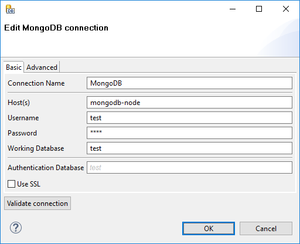
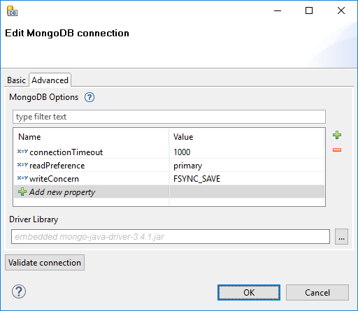

<!-- Development > Job elements > Connections > MongoDB connections -->

### MongoDB connections

MongoDB connection enables **CloverDX** to interact with the [MongoDB](http://www.mongodb.org/)™ NoSQL database [[1]](mongodb-connections.md#mongodb-connection-footnote1)

Analogously to other connections in **CloverDX**, MongoDB connections can be created as both internal and external. See sections [Creating internal database connections](database-connections.md#creating-internal-database-connections) and [Creating external (shared) database connections](database-connections.md#creating-external-shared-database-connections) to learn how to create them. Definition process for MongoDB connections is very similar to other connections, just select **Create MongoDB connection** instead of **Create DB connection**.

*Figure 268. MongoDB connection dialog*

#### Basic

From the connection properties, **Connection Name**, **Host(s)** and **Database Instance** are mandatory.
**Connection Name**
In this field, type a name you want for this connection. Note that if you are creating a new connection, the connection name you enter here will be used to generate an ID of the connection. Whereas the connection name is just an informational label, the connection ID is used to reference this connection from various graph components. Once the connection is created, the ID cannot be changed using this dialog to avoid accidental breaking of references (if you want to change the ID of existing connection, you can do so in the Properties view).
**Host(s)**
Enter the host name (or IP address) and port number in the form `host[:port]`. If the port number is not specified, the default port 27017 will be used.

If you need to connect to a replica set or a Cluster, enter a comma-separated list of hosts.
**Username**
The user name used for authentication.
**Password**
The password used for authentication.
**Working Database**
The name of the MongoDB database to connect to. The database is also used for authentication by default, this can be changed with the **Authentication Database** property (see below).
**Authentication Database**
The database used for authentication. If not filled in, the working database is used as an authentication database.
**Use SSL**
Enables SSL encryption
**Disable certificate validation**
Disables the validations of certificates. Useful with self-signed certificates.

#### Advanced

*Figure 269. MongoDB connection dialog - Advanced tab*
**MongoDB Options**
This table allows you to fine-tune some MongoDB parameters. Usually, leaving it empty is just fine.

The list of available options depends on the version of the driver library used.

See [com.mongodb.MongoClientOptions.Builder](http://mongodb.github.io/mongo-java-driver/3.12/javadoc/com/mongodb/MongoClientOptions.Builder.html#method.summary) if you use driver version 2.10.0 or newer. The options have the same names as the setter methods of the class.

For older driver versions, see [com.mongodb.MongoOptions](http://www.javadoc.io/static/org.mongodb/mongo-java-driver/2.9.3/com/mongodb/MongoOptions.html#field_summary) of the respective version. The options have the same names as the fields of the class.
> [!NOTE]
> Only the following types of options are supported:
>
> - primitive data types, including `String`
> - [ReadPreference](http://mongodb.github.io/mongo-java-driver/3.12/javadoc/com/mongodb/ReadPreference.html) with the values `primary`, `primaryPreferred`, `secondary`, `secondaryPreferred` and `nearest`
> - [ReadConcern](http://mongodb.github.io/mongo-java-driver/3.12/javadoc/com/mongodb/ReadConcern.html) constants, e.g. `readConcern=AVAILABLE`
> - [WriteConcern](http://mongodb.github.io/mongo-java-driver/3.12/javadoc/com/mongodb/WriteConcern.html) constants, e.g. `writeConcern=JOURNAL_SAFE`
**Driver Library**
Optional. By default, an embedded driver will be used for the connection. Usually, you don’t need to provide a custom driver library, because the bundled driver should be backwards compatible.

If you want to use a custom driver, for versions 4.x you need to add four jars: `mongodb-driver-core-*.jar`, `mongodb-driver-sync-*.jar`, `mongodb-driver-legacy-*.jar` and `bson-*.jar`, all in the same version.

For older versions, there is a single jar containing all the required classes: `mongo-java-driver-*.jar`

The paths to the driver library can be absolute or project relative. Graph parameters can be used as well.

Note that even though the connector tries to maximize backward compatibility, using an outdated version of the driver library may lead to `java.lang.NoClassDefFoundError` or `java.lang.NoSuchMethodError` being thrown.

The connection has primarily been tested with the bundled driver version 4.6.0, it should work with newer driver versions as well. It has also been successfully tested with prior driver versions up to 2.3, but the functionality may be limited.
> [!TIP]
> Usage on the CloverDX Server
> If you do define the library paths, note that absolute paths are absolute paths on the application server. Relative paths are sandbox (project) relative and will work only if the library is located in a *shared* sandbox.

Once you’ve finished setting up your MongoDB connection, click the **Validate connection** button to verify that the parameters you entered can be used to successfully establish a connection. Note that connection validation is unfortunately not available if the driver library is located in (remote) **CloverDX Server** sandbox.

#### See also

| [MongoDBReader](mongodbreader.md) |
| --- |
| [MongoDBWriter](mongodbwriter.md) |
| [MongoDBExecute](mongodbexecute.md) |

| 1 | MongoDB is a trademark of MongoDB Inc. |
| --- | --- |
