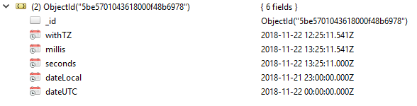

<!-- Development > Component reference > Readers > MongoDBReader -->

### MongoDBReader


| [Short description](mongodbreader.md#short-description) |
| --- |
| [Ports](mongodbreader.md#ports) |
| [Metadata](mongodbreader.md#metadata) |
| [MongoDBReader attributes](mongodbreader.md#mongodbreader-attributes) |
| [Details](mongodbreader.md#details) |
| [Examples](mongodbreader.md#examples) |
| [See also](mongodbreader.md#see-also) |

#### Short description

**MongoDBReader** reads data from the **MongoDB**™ database using the Java driver.[[1]](mongodbreader.md#mongodb-reader-footnote1)

**MongoDBReader** reads data from the MongoDB database using the `find` database command. It can also perform the `aggregate`, `count` and `distinct` commands.

| Data source | Input ports | Output ports | Each to all outputs | Different to different outputs | Transformation | Transf. req. | Java | CTL | Auto-propagated metadata |
| --- | --- | --- | --- | --- | --- | --- | --- | --- | --- |
| Database | 0-1 | 1-2 | **⨯** | **⨯** | **✓** | **✓** | **⨯** | **✓** | **✓** |

#### Ports

| Port type | Number | Required | Description | Metadata |
| --- | --- | --- | --- | --- |
| Input | 0 | **⨯** | Input data records to be mapped to component attributes. | any |
| Output | 0 | **✓** | Results | any |
| 1 | **⨯** | Errors | any |  |

#### Metadata

MongoDBReader does not propagate metadata.

This component has metadata templates available. See details on [metadata templates](components.md#metadata-templates).

##### Input

| Field number | Field name | Data type | Description |
| --- | --- | --- | --- |
| 1 | collection | string |  |
| 2 | query | string |  |
| 3 | projection | string |  |
| 4 | orderBy | string |  |
| 5 | skip | integer |  |
| 6 | limit | integer |  |

##### Output

| Field number | Field name | Data type | Description |
| --- | --- | --- | --- |
| 1 | stringValue | string |  |
| 2 | jsonObject | [string,string] |  |
| 3 | count | long |  |
| 4 | jsonVariant | variant |  |

##### Error

| Field number | Field name | Data type | Description |
| --- | --- | --- | --- |
| 1 | errorMessage | string |  |
| 2 | stackTrace | string |  |

#### MongoDBReader attributes

| Attribute | Req | Description | Possible values |
| --- | --- | --- | --- |
| Basic |  |  |  |
| Connection | **✓** | ID of the [MongoDB connection](mongodb-connections.md) to be used. |  |
| Collection name | **✓**  [[1]](mongodbreader.md#mongodbreader-required-attribute) | The name of the source collection. |  |
| Operation |  | The operation to be performed. | [find](http://docs.mongodb.org/manual/core/read/#find) (default) \| [aggregate](http://docs.mongodb.org/manual/core/aggregation/) \| [count](http://docs.mongodb.org/manual/reference/command/count/#dbcmd.count) \| [distinct](http://docs.mongodb.org/manual/reference/command/distinct/) |
| Query |  | A query that selects only matching documents from a collection. The selection criteria may contain [query operators](http://docs.mongodb.org/manual/reference/operator/#query-selectors). To return all documents in a collection, omit this parameter.  For the `aggregate` operation, the attribute specifies the aggregation pipeline operators as a comma-separated list. | [BSON document](http://docs.mongodb.org/manual/core/document/) \| comma-separated list of BSON documents (`aggregate` only) |
| Projection |  | Specifies the fields to return using [projection operators](http://docs.mongodb.org/manual/reference/operator/projection/):  `{ field1: boolean, field2: boolean … }`  The *boolean* can take the following include or exclude values:  - `1` or `true` to include. The `_id` field is included by default, unless explicitly excluded. - `0` or `false` to exclude.  The **Projection** cannot contain both include and exclude specifications except for the exclusion of the `_id` field.  To return all fields in the matching document, omit this parameter.  For the `distinct` operation, the attribute is required and specifies the name of the field to collect distinct values from. | [BSON document](http://docs.mongodb.org/manual/core/document/) \| field name (`distinct` only) |
| Order by |  | [Sorts](http://docs.mongodb.org/manual/reference/method/cursor.sort/) the result of the `find` operation. For each field in the **Order by** document, if the field’s corresponding value is positive, then the query results will be sorted in ascending order for that attribute; if the field’s corresponding value is negative, then the results will be sorted in descending order.  The attribute affects only the `find` operation. | [BSON document](http://docs.mongodb.org/manual/core/document/) |
| Skip |  | Set the starting point of a result of the `find` operation by [skipping](http://docs.mongodb.org/manual/reference/method/cursor.skip/) the first `N` documents.  The attribute affects only the `find` operation. |  |
| Limit |  | Specifies the maximum number of documents the `find` operation will return.  The attribute affects only the `find` operation. |  |
| Input mapping | [[2]](mongodbreader.md#mongodbreader-mapping-required) | Defines mapping of input records to component attributes. |  |
| Output mapping | **✓** | Defines mapping of results to the standard output port. |  |
| Error mapping | [[2]](mongodbreader.md#mongodbreader-mapping-required) | Defines mapping of errors to the error output port. |  |
| Advanced |  |  |  |
| Field pattern |  | Specifies the format of placeholders that can be used within the **Query**, **Projection** and **Order by** attributes. The value of the attribute must contain "`field`" as a substring, e.g. "`<field>`", "`#{field}`", etc.  During the execution, each placeholder is replaced using simple string substitution with the value of the respective input field, e.g. the string "`@{name}`" will be replaced with the value of the input field called "`name`" (assuming the default format of the placeholders). | @{field} (default) \| any string containing "`field`" as a substring |
| Deprecated |  |  |  |
| Query options |  | Specifies the query options for the `find` operation. See [com.mongodb.Bytes.QUERYOPTION_*](http://mongodb.github.io/mongo-java-driver/3.12/javadoc/com/mongodb/Bytes.html#field.summary) for the list of available options.  The attribute is ignored by all operations other than `find`.  Not supported by MongoDB driver 4.0 or newer. |  |

| 1 | The attribute is required, unless specified in the **Input mapping**. |
| --- | --- |

| 2 | Required if the corresponding edge is connected. |
| --- | --- |

#### Details

| [Format of the date Field Value](mongodbreader.md#format-of-the-date-field-value) |
| --- |

By default, **MongoDBReader** performs the [find()](https://mongodb.github.io/mongo-java-driver/4.6/apidocs/mongodb-driver-legacy/com/mongodb/DBCollection.html#find()) operation.

It can also be used to execute the [aggregate()](https://mongodb.github.io/mongo-java-driver/4.6/apidocs/mongodb-driver-legacy/com/mongodb/DBCollection.html#aggregate(java.util.List,com.mongodb.AggregationOptions)), [count()](https://mongodb.github.io/mongo-java-driver/4.6/apidocs/mongodb-driver-legacy/com/mongodb/DBCollection.html#count(com.mongodb.DBObject)) or [distinct()](https://mongodb.github.io/mongo-java-driver/4.6/apidocs/mongodb-driver-legacy/com/mongodb/DBCollection.html#distinct(java.lang.String,com.mongodb.DBObject)) operations.

The result set elements can be mapped one by one to the first output port using the **Output mapping** attribute.

Editing any of the **Input**, **Output** or **Error mapping** opens the [Transform Editor](transformations.md#transform-editor).

##### Input mapping

The editor allows you to override selected attributes of the component with the values of the input fields.

| Field Name | Attribute | Type | Possible values |
| --- | --- | --- | --- |
| collection | Collection | string |  |
| query | Query | string |  |
| projection | Projection | string |  |
| orderBy | Order by | string |  |
| skip | Skip | integer |  |
| limit | Limit | integer |  |

##### Output mapping

The editor allows you to map the results and the input data to the output port.

If output mapping is empty, fields of input record and result record are mapped to output by name.

| Field Name | Type | Description |
| --- | --- | --- |
| stringValue | string | Contains the current element of the result set converted to a string. |
| jsonObject | map[string, string] | Conditional. Contains the current result set element, if it is a JSON object. The values of the object are serialized to strings. |
| count | long | Only used for the **count** operation, contains the number of matching documents. |
| jsonVariant [[4]](mongodbreader.md#compatibility) | variant | Contains the current result set element value converted to variant. [[2]](mongodbreader.md#mongodb-reader-footnote2) If it is a JSON object it is in **relaxed** extended JSON format. [[3]](mongodbreader.md#mongodb-reader-footnote3) |

| 2 | Using variant output field requires **MongoDB**™ **Driver Library** version 3.5.x or higher. |
| --- | --- |
| 3 | See [http://docs.mongodb.org/manual/reference/mongodb-extended-json/](http://docs.mongodb.org/manual/reference/mongodb-extended-json/) |

##### Error mapping

The editor allows you to map the errors and the input data to the error port.

If error mapping is empty, fields of input record and result record are mapped to output by name.

| Field Name | Type | Description |
| --- | --- | --- |
| errorMessage | string | The error message. |
| stackTrace | string | The stack trace of the error. |

In queries, you can use extended JSON, e.g. `{_id: {$oid: "53b0e84b72a0ec06118b45fd"}}` Similar format is used for passing `long` data type, timestamp, binary data, etc. See [http://docs.mongodb.org/manual/reference/mongodb-extended-json/](http://docs.mongodb.org/manual/reference/mongodb-extended-json/)

##### Format of the date Field Value

A `date` value is in an [ISO-8601](https://en.wikipedia.org/wiki/ISO_8601) date format.

```json
{
    withTZ : { "$date": "2018-11-22T14:25:11.541+02:00" },
    millis: { "$date": "2018-11-22T14:25:11.541" },
    seconds: { "$date": "2018-11-22T14:25:11" },
    dateLocal: { "$date": "2018-11-22" },
    dateUTC: { "$date": "2018-11-22+00:00" }
}
```



#### Examples

Let us assume that the documents in the source collection resemble the following:

```json
{
    customer : "John",
    value : 123
}
```

##### Executing a Query

If executed without any parameter, the `find` operation will list all the documents in the source collection.

- If the **Query** attribute is set to `{ customer: { $in: [ "John", "Jane" ] } }`, the result set will only contain documents whose `customer` field has the value `John` or `Jane`.
- If the **Projection** attribute is set to `{ customer: 1 }`, the result set will only contain the `_id` and `customer` fields.
- If the **Order by** attribute is set to `{ value: 1 }`, the result set will be sorted by the `value` field in ascending order.
- If the **Skip** attribute is set to `5`, the first five documents in the result set will be skipped.
- If the **Limit** attribute is set to `20`, at most 20 documents will be returned.

##### Aggregation

Consider the following aggregation pipeline:

```javascript
{ $group : { _id : "$customer", sum : { $sum : "$value" } } },
{ $match : { sum : { $gt : 1500 } } },
{ $sort : { sum : -1 } },
{ $limit : 10 },
{ $project : { _id : 0, name : { $toUpper : "$_id" }, total : "$sum" } }
```

1. The first line groups documents by the `customer` field and computes the sum of the respective `value` fields.
2. The second line filters the aggregated values and selects only those having the sum greater than 1500.
3. The third line sorts the results by the sum in descending order.
4. The fourth line limits the number of results to 10.
5. The last line renames the fields and converts the names to upper case.

##### Count

The `count` operation can be limited to documents matching the specified **Query**. For example, `{ value : { $gt : 150 } }` will count the number of documents whose `value` field has a value greater than 150.

The result is returned as the **count** output field.

##### Distinct Values

We could use the `distinct` operation to retrieve the list of names of all the customers - set the value of the **Projection** attribute to `customer` (without quotes). Optionally, a **Query** may be specified to limit the input documents for the *distinct* analysis.

##### Reading Object with Specific ID

You can query for an object having the specific object ID.

```json
{ _id: {"$oid" : "54ca707ceac6b571fb4aa285"}}
```

#### Compatibility

| Version | Compatibility Notice |
| --- | --- |
| 5.17.0 | **jsonVariant** field is available since **5.17.0**. |

#### See also

| [MongoDBWriter](mongodbwriter.md) |
| --- |
| [MongoDBExecute](mongodbexecute.md) |
| [Common properties of components](components.md#common-properties-of-components) |
| [Specific attribute types](components.md#specific-attribute-types) |
| [Common properties of Readers](common-of-readers.md) |
| [Readers comparison](common-of-readers.md#readers-comparison) |
| [MongoDB connections](mongodb-connections.md) |

| 1 | MongoDB is a trademark of MongoDB Inc. |
| --- | --- |
