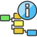

<!-- Development > Component reference > Job Control > MonitorGraph -->

### MonitorGraph

Jobflow Component

| [Short description](monitorgraph.md#short-description) |
| --- |
| [Ports](monitorgraph.md#ports) |
| [Metadata](monitorgraph.md#metadata) |
| [MonitorGraph attributes](monitorgraph.md#monitorgraph-attributes) |
| [Details](monitorgraph.md#details) |
| [See also](monitorgraph.md#see-also) |

#### Short description

**MonitorGraph** allows watching of running graphs. Component can either wait for a final execution status or periodically monitor the current execution status.

| Same input metadata | Sorted inputs | Inputs | Outputs | Each to all outputs | Java | CTL | Auto-propagated metadata |
| --- | --- | --- | --- | --- | --- | --- | --- |
| **⨯** | **⨯** | 0-1 | 0-2 | **✓** | **⨯** | **✓** | **✓** |

#### Ports

| Port type | Number | Required | Description | Metadata |
| --- | --- | --- | --- | --- |
| Input | 0 | **⨯** | Input tokens with identification of monitored graph. | Any |
| Output | 0 | **⨯** | Execution information for successful graphs. | Any |
| 1 | **⨯** | Execution information for unsuccessful graphs. | Any |  |

#### Metadata

**MonitorGraph** does not propagate metadata from left to right or from right to left.

This component has metadata templates. The templates are described in [Details](monitorgraph.md#details). See general details on [metadata templates](components.md#metadata-templates).

#### MonitorGraph attributes

| Attribute | Req | Description | Possible values |
| --- | --- | --- | --- |
| Basic |  |  |  |
| Graph URL | no | The path to a graph which represents a typical monitored graph. The graph referenced by this attribute is also used for all mapping dialogs - they display dictionary entries and tracking information based on this graph. |  |
| Timeout | no | The maximal amount of time dedicated for graph run; by default in milliseconds, but other [time units](components.md#time-intervals) may be used. If the graph is running longer than the time specified in this attribute, the current graph information with TIMEOUT status is send to the error output port.  This is just a default value for all graph monitors. It can be overridden in input mapping individually for each graph monitor.  By default, the value of this attribute is **not specified** meaning the component **waits indefinitely**. If set to **0**, it **aborts** the target job execution **immediately**. | not specified \| 0 \| positive number |
| Monitoring interval | no | Whenever time specified in this attribute elapses, the graph monitor sends an actual graph status information to the first output port. The interval is in milliseconds by default, but other [time units](components.md#time-intervals) may be used.  By default, only final graph results are sent to output ports.  This is just a default value for all graph monitors. It can be overridden in the input mapping individually for each graph monitor. | none (default) \| positive number |
| Input mapping | no | Input mapping defines how to extract run ID and other graph monitor settings from incoming token. See [Input mapping](monitorgraph.md#input-mapping). | CTL transformation |
| Output mapping | no | Output mapping maps results of successful graphs to the first output port. Output mapping is used also for sending of current status in case the monitoring interval is specified. See [Output mapping](monitorgraph.md#output-mapping). | CTL transformation |
| Error mapping | no | The error mapping maps results of unsuccessful graphs to the second output port. See [Error mapping](monitorgraph.md#error-mapping). | CTL transformation |
| Redirect error output | no | By default, results of failed graphs are sent to the second output port (error port). If this switch is true, results of unsuccessful graphs are sent to the first output port in the same way as successful graphs. | false (default) \| true |
| Advanced |  |  |  |
| Run ID | no | Statically defined run ID of monitored graph. This attribute is usually overridden in the input mapping by data from an incoming token. | string |

#### Details

The **MonitorGraph** component allows watching of running graphs. Each incoming token triggers a new monitor of a graph specified by run ID extracted from the token. It is possible to monitor multiple graphs at once.

A single graph monitor watches the graph and waits for it to finish. When the graph is finished running, graph results are sent to the output port in the same manner as in **ExecuteGraph** component; results of successful graphs are sent to the first output port and unsuccessful graphs are sent to the second output port. Moreover, whenever time specified in the monitoring interval attribute elapses, the graph monitors send current graph status information even for still running graphs.

In case no input port is attached, only one graph is monitored with the settings specified in component’s attributes. In case the first output port is not connected, the component just prints out the graph results to the log. In case the second output port (error port) is not attached, the first graph that fails would cause interruption of the parent job.

Input mapping defines how to extract run ID and other settings of the graph monitor from incoming token. Whenever graph results or actual graph status need to be mapped to output ports, output mapping and error mapping attributes are used to populate output tokens. Information available in graph results comprise mainly of general runtime information, dictionary content and tracking information.
> [!NOTE]
> Only graphs executed by the current jobflow (direct children) can be watched by the **MonitorGraph** component.

##### Input mapping

Input mapping is a regular CTL transformation which is executed for each incoming token to specify the run ID of monitored graph and settings of respective graph monitor. Available output fields:

| Field Name | Type | Description |
| --- | --- | --- |
| runId | long | Run ID of monitored graph. Overrides component attribute **Run ID**. |
| timeout | long | Overrides component attribute **Timeout**. |
| monitoringInterval | long | Overrides component attribute **Monitoring interval**. |

##### Output mapping

Output mapping is a regular CTL transformation which is used to populate token passed to the first output port. The mapping is executed for successful graphs or for current status of still running graphs, which is sent in case monitoring interval is specified. More details about input records for this output mapping is available in documentation for the [ExecuteGraph](executegraph.md) component.

The graph monitor finishes watching the graph after the graph is complete or timeout elapses. Another option how to stop graph monitoring is to return STOP constant in output mapping.

##### Error mapping

Error mapping is almost identical to output mapping. This error mapping is used only if the graph finished unsuccessfully or timeout elapsed. The second output port is populated by error mapping.

#### See also

| [Common properties of components](components.md#common-properties-of-components) |
| --- |
| [Specific attribute types](components.md#specific-attribute-types) |
| [Common properties of Job Control](common-of-job-control.md) |
| [Job Control comparison](common-of-job-control.md#job-control-comparison) |
