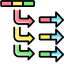
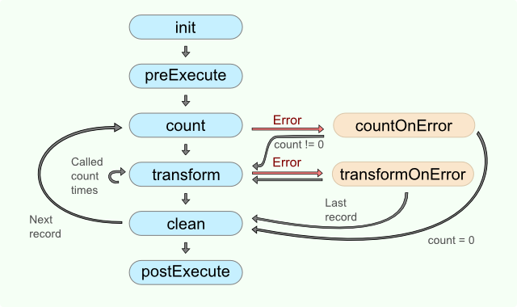

<!-- Development > Component reference > Transformers > Normalizer -->

### Normalizer



| [Short description](normalizer.md#short-description) |
| --- |
| [Ports](normalizer.md#ports) |
| [Metadata](normalizer.md#metadata) |
| [Normalizer attributes](normalizer.md#normalizer-attributes) |
| [Details](normalizer.md#details) |
| [CTL interface](normalizer.md#ctl-interface) |
| [Java interface](normalizer.md#java-interface) |
| [Examples](normalizer.md#examples) |
| [Best practices](normalizer.md#best-practices) |
| [See also](normalizer.md#see-also) |
> [!TIP]
> If you’re interested in learning more about this subject, we offer the [Transforming Groups of Records, Normalization course](https://academy.cloverdx.com/courses/normalize-denormalize) in our CloverDX Academy.

#### Short description

**Normalizer** creates one or more output records from each single input record. Input records do not have to be sorted.

| Same input metadata | Sorted inputs | Inputs | Outputs | Java | CTL | Auto-propagated metadata |
| --- | --- | --- | --- | --- | --- | --- |
| - | **⨯** | 1 | 1 | **✓** | **✓** | **⨯** |

#### Ports

| Port type | Number | Required | Description | Metadata |
| --- | --- | --- | --- | --- |
| Input | 0 | **✓** | For input data records | Any1 |
| Output | 0 | **✓** | For normalized data records | Any2 |

#### Metadata

**Normalizer** does not propagate metadata.

**Normalizer** does not have any metadata template.

**Normalizer** does not require any specific metadata fields.

#### Normalizer attributes

| Attribute | Req | Description | Possible values |
| --- | --- | --- | --- |
| Basic |  |  |  |
| Normalize | [[1]](normalizer.md#normalizer-attributes-fn01) | The definition of the way how records should be normalized, written in the graph in CTL or Java. |  |
| Normalize URL | [[1]](normalizer.md#normalizer-attributes-fn01) | The name of an external file, including the path, containing the definition of the way how records should be normalized written in CTL or Java. |  |
| Normalize class | [[1]](normalizer.md#normalizer-attributes-fn01) | The name of an external class defining the way how records should be normalized. |  |
| Normalize source charset |  | Encoding of an external file defining the transformation.  The default encoding depends on `DEFAULT_SOURCE_CODE_CHARSET` in defaultProperties. | E.g. UTF-8 |
| Deprecated |  |  |  |
| Error actions |  | Definition of the action that should be performed when the specified transformation returns some **Error code**. See [Return values of transformations](transformations.md#return-values-of-transformations). |  |
| Error log |  | The URL of the file to which error messages for specified **Error actions** should be written. If not set, they are written to **Console**. |  |

| 1 |  One of these must specified. |
| --- | --- |

#### Details

**Normalizer** requires transformation. The transformation can be defined in CTL (see [CTL interface](normalizer.md#ctl-interface)) or in Java (see [Java interface](normalizer.md#java-interface)).

The transformation is defined using several functions. Each of them has its own purpose. The order of function calls is depicted in diagram below.


*Figure 410. Normalizer code workflow*

The number of calls of `transform()` function depends on the result of the `count()` (or `countOnError()`) function.

#### CTL interface

| [CTL Templates for Normalizer](normalizer.md#ctl-templates-for-normalizer) |
| --- |
| [Access to input and output fields](normalizer.md#access-to-input-and-output-fields) |

The transformation written in CTL uses a CTL template for **Normalizer**. Only the functions `count()` and `transform()` are mandatory. Other functions are optional.

Once you have written your transformation, you can also convert it to Java language code using the corresponding button in the upper right corner of the tab.

##### CTL Templates for Normalizer

| CTL Template Functions |  |
| --- | --- |
| **boolean init()** |  |
| Required | No |
| Description | Initializes the component, sets up the environment, global variables. |
| Invocation | Called before processing the first record. |
| Returns | `true` \| `false` (in case of `false` graph fails) |
| **integer count()** |  |
| Required | yes |
| Input Parameters | none |
| Returns | The returned number defines the number of new output records that will be created by the `transform()` function.  If the `count()` function returns `0`, the subsequent call of `transform()` is skipped (`transform()` is called zero times). |
| Invocation | Called repeatedly, once for each input record |
| Description | For each input record it generates the number of output records that will be created from this input.  If `count()` fails and user has not defined any `countOnError()`, the whole graph will fail.  If any of the input records causes the `count()` function to fail, and if user has defined another function (`countOnError()`), processing continues in this `countOnError()` at the place where `count()` failed. The `countOnError()` function gets the information gathered by `count()` that was received from previously successfully processed input records. Also the error message and stack trace are passed to `countOnError()`. |
| Example | ```ctl function integer count() {    customers = split($in.0.customers,"-");    return length(customers); } ``` |
| **integer transform(integer idx)** |  |
| Required | yes |
| Input Parameters | `integer idx` integer numbers from `0` to `count-1` (Here `count` is the number returned by the `count()` function.) |
| Returns | Integer number. The number corresponds to the *return value of transformation*. See [Return values of transformations](transformations.md#return-values-of-transformations). |
| Invocation | Called repeatedly, once for each output record. The number of calls is defined by return value of function `count()`. |
| Description | Creates output records.  If `transform()` fails and the user has not defined any `transformOnError()`, the whole graph will fail.  If any part of the `transform()` function for some output record causes fail of the `transform()` function, and if user has defined another function (`transformOnError()`), processing continues in this `transformOnError()` at the place where `transform()` failed. The `transformOnError()` function gets the information gathered by `transform()` that was received from previously successfully processed code. Also the error message and stack trace are passed to `transformOnError()`. |
| Example | ```ctl function integer transform(integer idx) {    myString = customers[idx];    $out.0.OneCustomer = str2integer(myString);    $out.0.RecordNo = $in.0.recordNo;    $out.0.OrderWithinRecord = idx;    return OK; } ``` |
| **void clean()** |  |
| Required | no |
| Input Parameters | none |
| Returns | void |
| Invocation | Called repeatedly, once for each input record.  The function is called after the corresponding call(s) of `transform()` function. |
| Description | Returns the component to the initial settings |
| Example | ```ctl function void clean() {    clear(customers); } ``` |
| **integer countOnError(string errorMessage, string stackTrace)** |  |
| Required | no |
| Input Parameters | `string errorMessage` |
| `string stackTrace` |  |
| Returns | The returned number defines the number of new output records that will be created by the`transform()` function.  If the `count()` function returns `0`, the subsequent call of `transform()` is skipped. |
| Invocation | Called if `count()` throws an exception. |
| Description | For each input record it generates the number of output records that will be created from this input.  If any of the input records causes fail of the `count()` function, and if user has defined another function (`countOnError()`), processing continues in this `countOnError()` at the place where `count()` failed. |
| Example | ```ctl function integer countOnError(                   string errorMessage,                   string stackTrace) {    printErr(errorMessage);    return 1; } ``` |
| **integer transformOnError(string errorMessage, string stackTrace, integer idx)** |  |
| Required | no |
| Input Parameters | `string errorMessage` |
| `string stackTrace` |  |
| `integer idx` |  |
| Returns | Integer numbers. For more information, see [Return values of transformations](transformations.md#return-values-of-transformations). |
| Invocation | Called if `transform()` throws an exception. |
| Description | Creates output records.  If any part of the `transform()` function for some output record causes fail of the `transform()` function, and if the user has defined another function (`transformOnError()`), processing continues in this `transformOnError()` at the place where `transform()` failed.  The `transformOnError()` function gets the information gathered by `transform()` that was received from previously successfully processed code. Also the error message and stack trace are passed to `transformOnError()`. |
| Example | ```ctl function integer transformOnError(                   string errorMessage,                   string stackTrace,                   integer idx) {    printErr(errorMessage);    printErr(stackTrace);    $out.0.OneCustomerOnError = customers[idx];    $out.0.RecordNo = $recordNo;    $out.0.OrderWithinRecord = idx;    return OK; } ``` |
| **string getMessage()** |  |
| Required | No |
| Description | Prints the error message specified and invoked by the user |
| Invocation | Called in any time specified by the user (called only when either `count()`, `transform()`, `countOnError()`, or `transformOnError()` returns value less than or equal to -2). |
| Returns | `string` |
| **void preExecute()** |  |
| Required | No |
| Input parameters | None |
| Returns | `void` |
| Description | May be used to allocate and initialize resources required by the transform. All resources allocated within this function should be released by the `postExecute()` function. |
| Invocation | Called during each graph run before the transform is executed. |
| **void postExecute()** |  |
| Required | No |
| Input parameters | None |
| Returns | `void` |
| Description | Should be used to free up any resources allocated within the `preExecute()` function. |
| Invocation | Called during each graph run after the entire transform was executed. |

##### Access to input and output fields

###### Input records or fields

Input records or fields are accessible within the `count()`, `countOnError()`, `transform()` and `transformOnError()` functions only.

###### Output records or fields

Output records or fields are accessible within the `transform()` and `transformOnError()` functions only.
> [!WARNING]
> All of the other CTL template functions allow to access neither inputs nor outputs.
>
> Remember that if you do not hold these rules, NPE will be thrown!

#### Java interface

The transformation implements methods of the `RecordNormalize` interface and inherits other common methods from the `Transform` interface. See [Common Java interfaces](transformations.md#common-java-interfaces) and [Public CloverDX API](genericcomponent.md#public-cloverdx-api).

Following are the methods of `RecordNormalize` interface:

- `boolean init(Properties parameters, DataRecordMetadata sourceMetadata, DataRecordMetadata targetMetadata)`
  Initializes normalize class/function. This method is called only once at the beginning of normalization process. Any object allocation/initialization should happen here.
- `int count(DataRecord source)`
  Returns the number of output records which will be created from specified input record.
- `int countOnError(Exception exception, DataRecord source)`
  Called only if `count(DataRecord)` throws an exception.
- `int transform(DataRecord source, DataRecord target, int idx)`
  `idx` is a sequential number of output record (starting from 0). For detailed information about return values and their meaning, see [Return values of transformations](transformations.md#return-values-of-transformations). In **Normalizer**, only `ALL`, `0`, `SKIP`, and **Error codes** have some meaning.
- `int transformOnError(Exception exception, DataRecord source, DataRecord target, int idx)`
  Called only if `transform(DataRecord, DataRecord, int)` throws an exception.
- `void clean()`
  Finalizes current round/clean after current round - called after the transform method was called for the input record.

#### Examples

##### Converting multivalue fields to multiple records

Input records contain group name and list of users of the group. Convert records into tuples having group name and one username.

```
accounting  | [johnsmith, elisabethtaylor]
development | [georgegreen, janegreen, peterbrown]
```

###### Solution

Define the transformation using **Normalize** attribute.

```ctl
//#CTL2

function integer count() {
    return length($in.0.users);
}

function integer transform(integer idx) {
    $out.0.group = $in.0.group;
    $out.0.user = $in.0.users[idx];
    return OK;
}
```

Normalizer will return following records:

```
accounting |johnsmith
accounting |elisabethtaylor
development|georgegreen
development|janegreen
development|peterbrown
```

#### Best practices

If the transformation is specified in an external file (with **Normalize URL**), we recommend users to explicitly specify **Normalize source charset**.

#### See also

| [Denormalizer](denormalizer.md) |
| --- |
| [Rollup](rollup.md) |
| [Common properties of components](components.md#common-properties-of-components) |
| [Specific attribute types](components.md#specific-attribute-types) |
| [Common properties of Transformers](common-of-transformers.md) |
| [Transformers comparison](common-of-transformers.md#transformers-comparison) |
| [Defining transformations](transformations.md#defining-transformations) |
