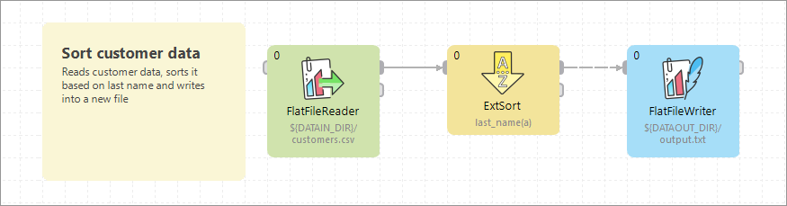
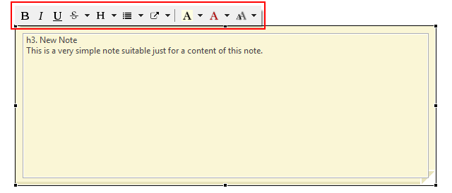
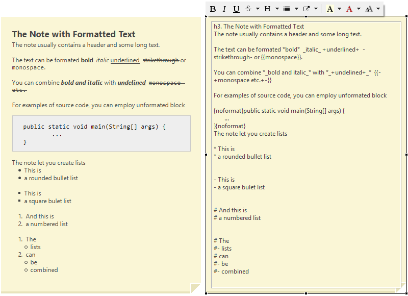
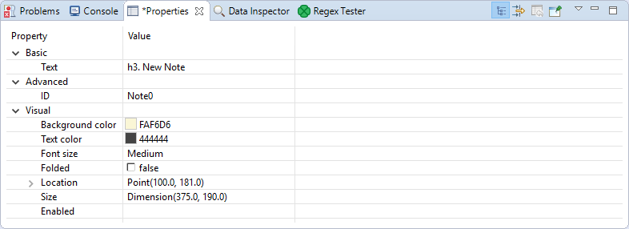

<!-- Development > Job elements > Notes -->

## 28. Notes

Notes let the user type necessary pieces of information directly into a graph. The notes can serve as a documentation to a particular graph.

Notes are rendered in a layer below components: if you place a note over a component, you will see the component rendered over the note.

Notes can serve as containers for components. If you move a note, you also move the components within the note.

Parameters used in text of notes are not resolved. If you type any parameter in a **Note**, the parameter is *not* replaced by its value.



### Placing notes into graphs

You can place a note into a graph from the **Palette of Components**: drag the note from **Palette of Components** and drop it into the **Graph Editor Pane**.

An alternative way to place a note to a graph is to click the **Note** icon in the **Palette**, move cursor to the desired location in the **Graph Editor**, and click again.

After that, a new **Note** will appear there. It has a **New note** label in the top.

This way, you can paste more **Notes** in one graph.

### Resizing notes

To resize a **Note**, highlight it by clicking, and then drag its margins. When you have changed its size, click outside the **Note**. The highlighting disappears.

### Editing notes

To start editing the note content, double-click the note content. If the note is highlighted, a single click suffices.

If you click on the **Note**, the formatted text switches to the text in the editor.

Type the text of your note and click outside the note to see the text with proper formatting.

### Formatted text

When you type text of your note, you will see your text without any additional formatting. Optionally, you can make your text formatted.

You can format the text with tools from toolbar above the text. When you have clicked the note the toolbar appears above the note.

To change format of the text, mark the text to be formatted, and click the tool from the toolbar.


*Figure 314. Toolbar for format editing*

You can:

- Use headers of 6 levels
- Format you text as bold, italics, underlined, strikethrough, preformatted, or monospace
- Use lists: simple lists, bulleted lists, numbered lists, and mixed lists
- Insert links
- Change text color and background color for the whole note
- Change font size

The default font size configuration is taken from the operating system.


*Figure 315. Note with formatted text and markup*

#### Notes markup and escaping backslashes

Text notes use subset of [Confluence wiki syntax](https://confluence.atlassian.com/doc/confluence-wiki-markup-251003035.html) to format the content. You can format the note content using the markup directly without icons from toolbar.

The markup in notes uses backslash character (`\`) as an escape character and `\\` to create a new line.

If you paste an absolute Windows path into a note, the backslash characters are replaced with HTML entities to make the path correctly visible when the note is rendered.

You can convert backslashes to entities manually. From toolbar, choose **S** ****Escape backslashes**.

### Links from notes

Notes can contain links to graph elements, file in **Project Explorer**, file on file system, website, etc. Some types of links are available from the toolbox, the later ones can be inserted manually from the keyboard.

Linkable targets are shown in examples below. Links to the items not mentioned in the list, e.g. graph parameters, are not possible.

#### Link to website

You can insert a link to a particular website from the toolbar. The link can be displayed as an URL of the target

```markdown
[http://www.cloverdx.com]
```

or the link can contain a user-defined text

```markdown
[Our site|http://www.cloverdx.com]
```

#### Link to graph element

You can insert a link to a particular graph element from toolbar, or type `element://` prefix followed by graph element ID:

```markdown
[A link to DataGenerator|element://DATA_GENERATOR]
```

It’s also possible to create a link to a graph element of another graph.

```markdown
[A link to DataGenerator|element://project_name/path_to_graph/my_graph.grf:ELEMENT_ID]
```

#### Link to file in Project Explorer

You can insert a link to a file in Project Explorer from toolbar, or type `file://` prefix followed by the location.

```markdown
[A link to a file in Project Explorer|file://SimpleExamples/data-in]
```

#### Link to open a file

You can insert a link to open a file from toolbar, or type `open://` prefix followed by the path. You can use a relative or absolute path. Usage of a relative path is recommended, especially in server projects.

```markdown
[A link with an absolute path to open a file|open://C:/Users/Public/Data/]
```

```markdown
[A link with a relative path to open a file|open://BasicExamples/workspace.prm]
```

Note that a relative path is relative to workspace root and must start with a sandbox name.

#### Link to send an email

To insert a link to send an email, type `mailto:` prefix followed by the email address.

```markdown
[mailto:docs@cloverdx.com]
[Send mail to doc creators|mailto:docs@cloverdx.com]
```

#### Link to open a view

To open a view, type the `view://` prefix followed by the Eclipse View ID:

```markdown
[view://org.eclipse.ui.navigator.ProjectExplorer]
[Open Project Explorer|view://org.eclipse.ui.navigator.ProjectExplorer]
```

#### Link to CloverDX documentation

You can create a link to a particular built-in documentation page. Type `help://` prefix followed by a link to particular documentation page.

```markdown
[help://com.cloveretl.gui.docs/docs/spreadsheetreader.html]
```

You can point to a particular documentation page or to a particular page element with an identifier.

```markdown
[help://com.cloveretl.gui.docs/docs/spreadsheetreader.html#spreadsheetreader-details]
```

### Folding notes

Content of a note can be folded (hidden). You can fold any **Note** by selecting the **Fold** item from the context menu.

A folded **Note** has a visible label. Its text is hidden.


*Figure 316. A Folded note*

### Notes properties

You can set up many properties of any **Note** in the **Properties** tab. Click the **Note** and switch to the **Properties** tab (in the bottom).

You can see and edit **Text**, set its size, color, or the color of a note’s background. To edit or see the text, you can open it in a new window.

To change the **Text** and background color, select one from the toolbox.

The default font sizes are displayed in this tab and can be changed as well. If you want to fold the **Note**, set the **Folded** attribute to true.

Each **Note** has an **ID** like any other graph component.


*Figure 317. Properties of a note*

### Compatibility

| Version | Compatibility Notice |
| --- | --- |
| 4.1.2 | Notes have been significantly changed. The previous version allowed you to type a title and text without any formatting, links, etc.  Old notes can be easily converted into the new ones - simply edit the old note and save it. |
